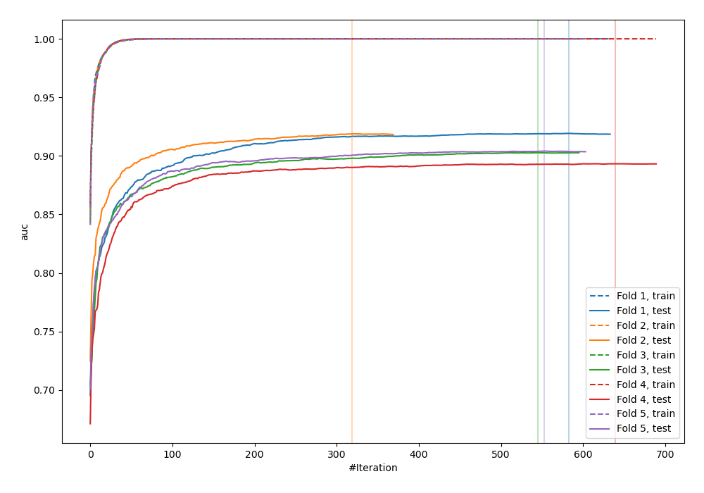
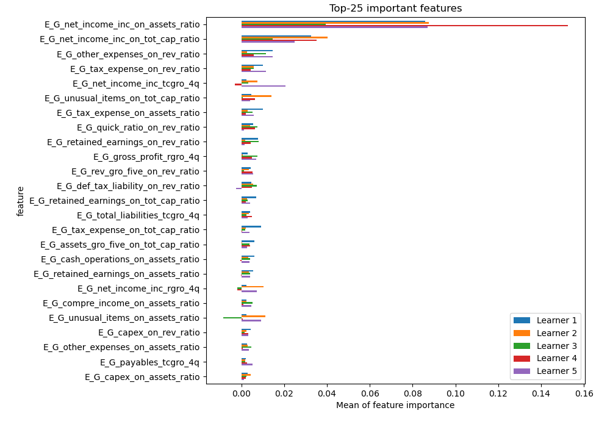
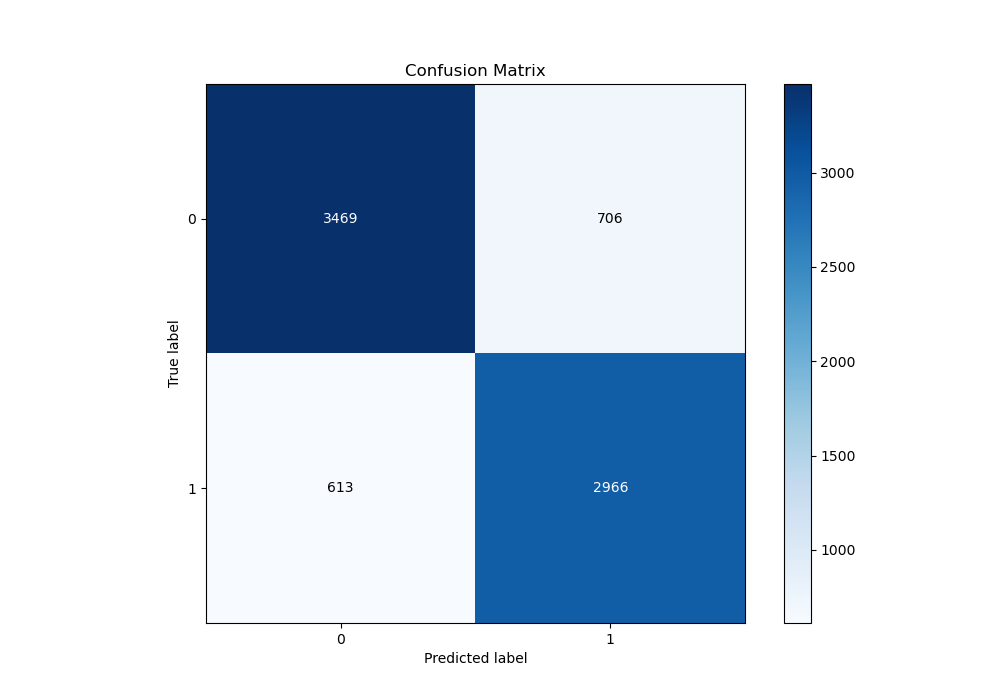
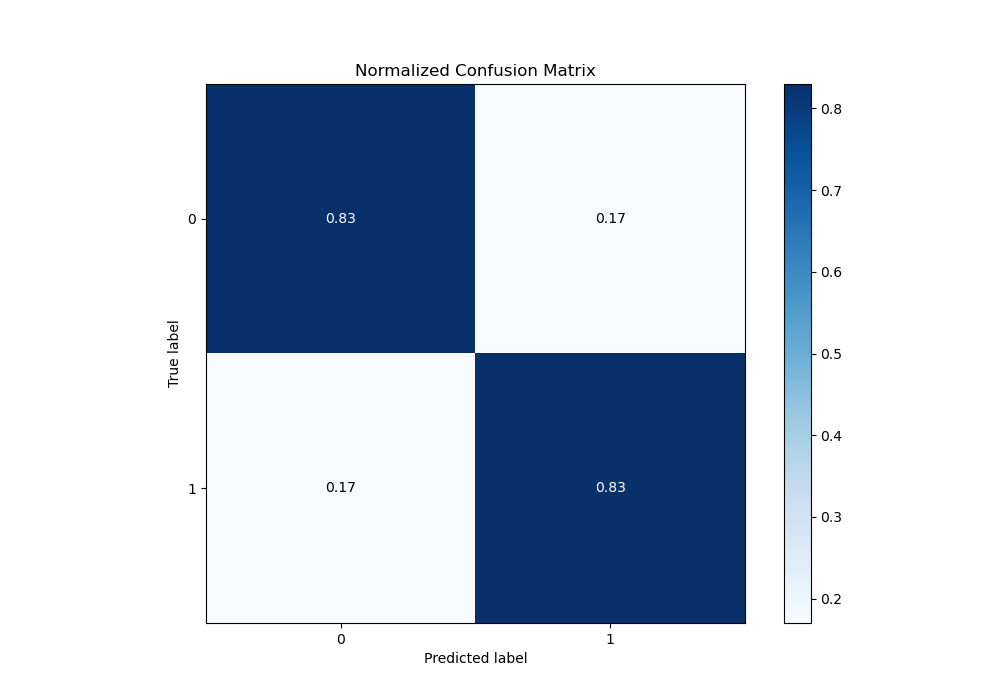
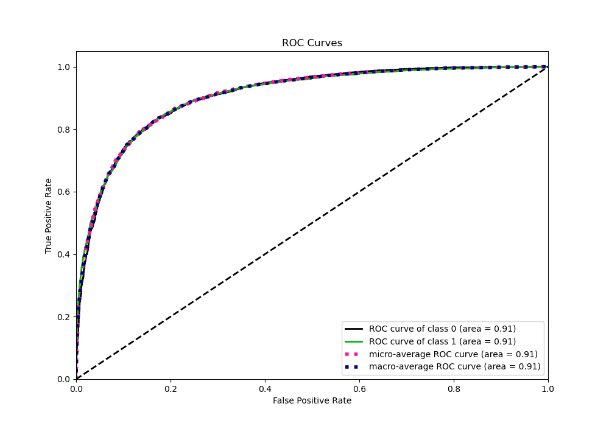
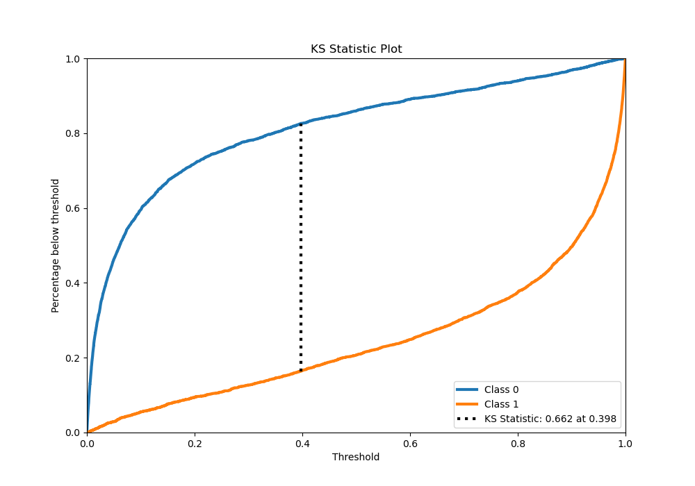
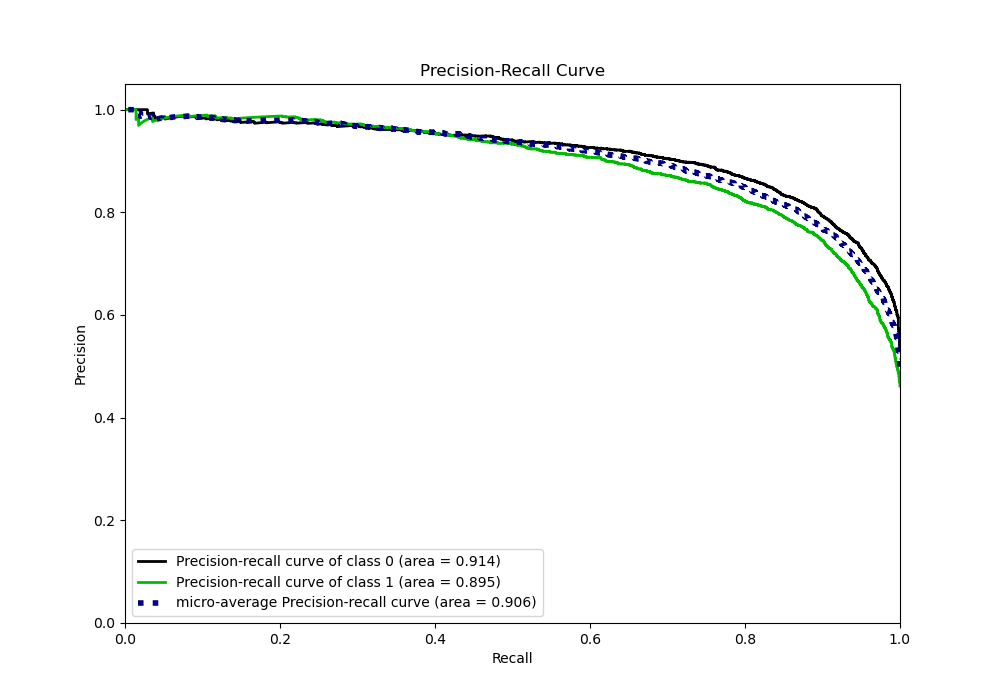
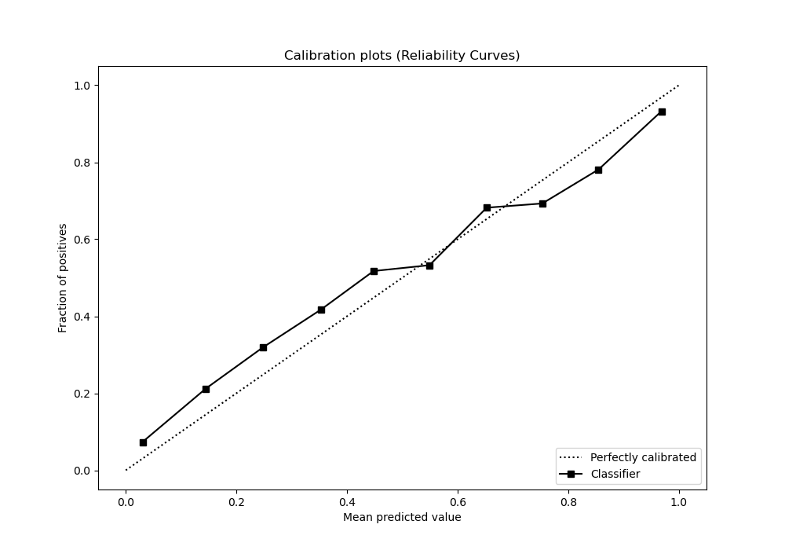
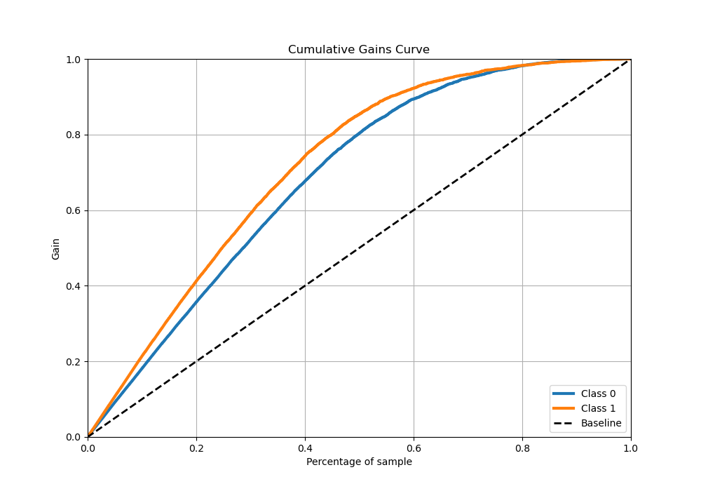
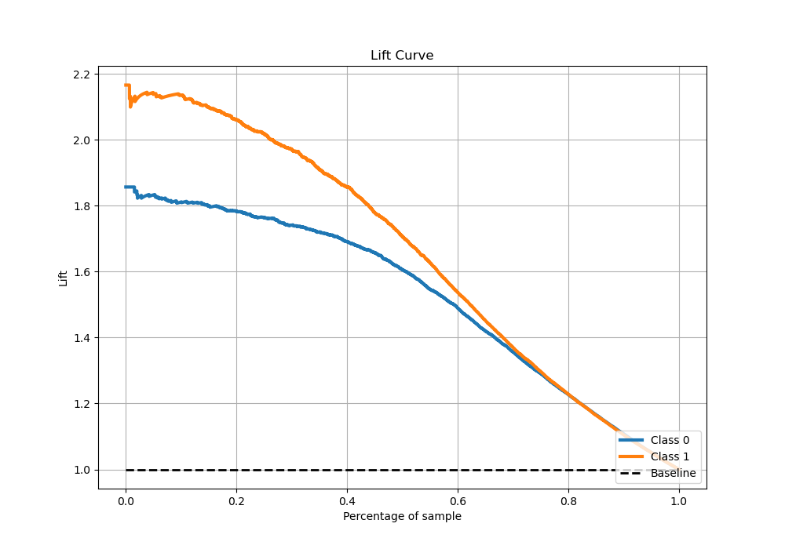

# Summary of 10_Xgboost_SelectedFeatures

[<< Go back](../README.md)

## Extreme Gradient Boosting (Xgboost)
- **n_jobs**: -1
- **objective**: binary:logistic
- **eta**: 0.075
- **max_depth**: 8
- **min_child_weight**: 1
- **subsample**: 1.0
- **colsample_bytree**: 0.9
- **eval_metric**: auc
- **explain_level**: 1

## Validation
 - **validation_type**: kfold
 - **k_folds**: 5
 - **shuffle**: True
 - **stratify**: True

## Optimized metric
auc

## Training time

54.1 seconds

## Metric details
|           |    score |     threshold |
|:----------|---------:|--------------:|
| logloss   | 0.403677 | nan           |
| auc       | 0.906634 | nan           |
| f1        | 0.820257 |   0.367822    |
| accuracy  | 0.829894 |   0.41101     |
| precision | 0.989437 |   0.996493    |
| recall    | 1        |   5.67686e-05 |
| mcc       | 0.659302 |   0.389665    |

## Metric details with threshold from accuracy metric
|           |    score |   threshold |
|:----------|---------:|------------:|
| logloss   | 0.403677 |   nan       |
| auc       | 0.906634 |   nan       |
| f1        | 0.818094 |     0.41101 |
| accuracy  | 0.829894 |     0.41101 |
| precision | 0.807734 |     0.41101 |
| recall    | 0.828723 |     0.41101 |
| mcc       | 0.658591 |     0.41101 |

## Confusion matrix (at threshold=0.41101)
|              |   Predicted as 0 |   Predicted as 1 |
|:-------------|-----------------:|-----------------:|
| Labeled as 0 |             3469 |              706 |
| Labeled as 1 |              613 |             2966 |

## Learning curves

## Permutation-based Importance

## Confusion Matrix

## Normalized Confusion Matrix

## ROC Curve

## Kolmogorov-Smirnov Statistic

## Precision-Recall Curve

## Calibration Curve

## Cumulative Gains Curve

## Lift Curve

[<< Go back](../README.md)
