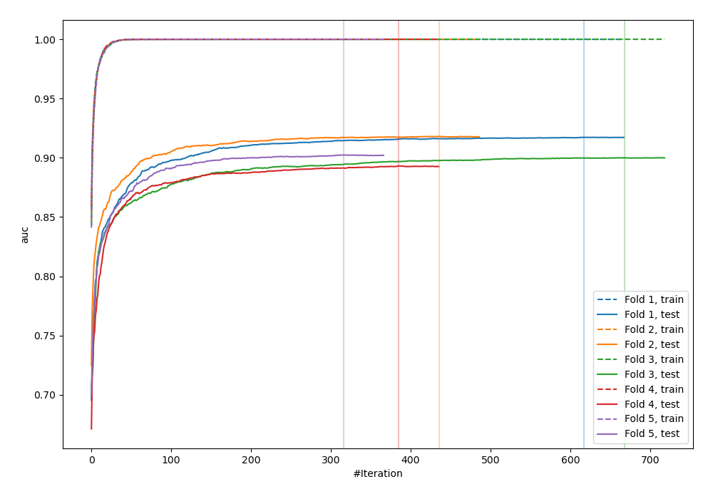
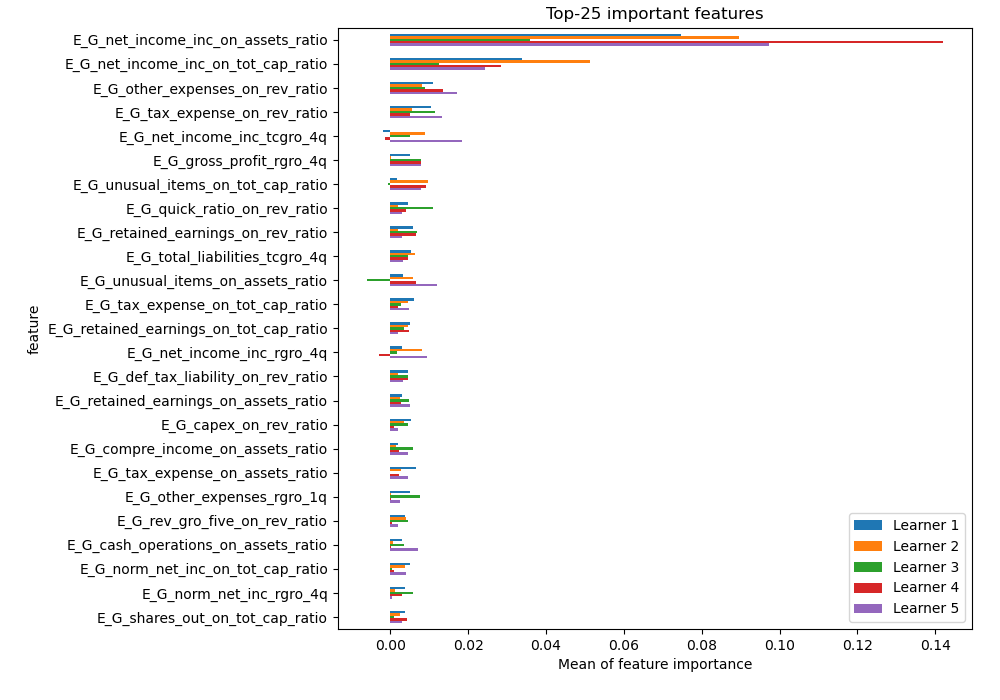
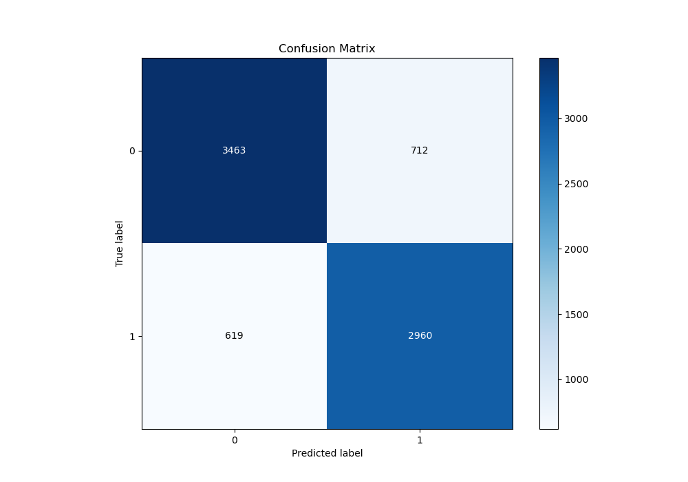
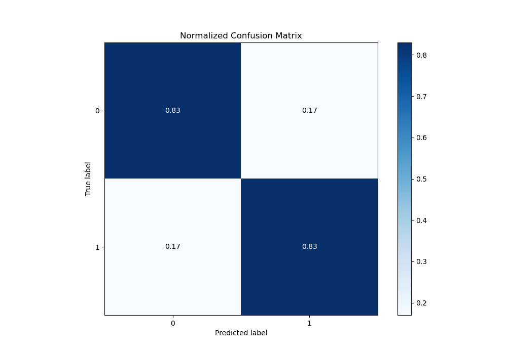
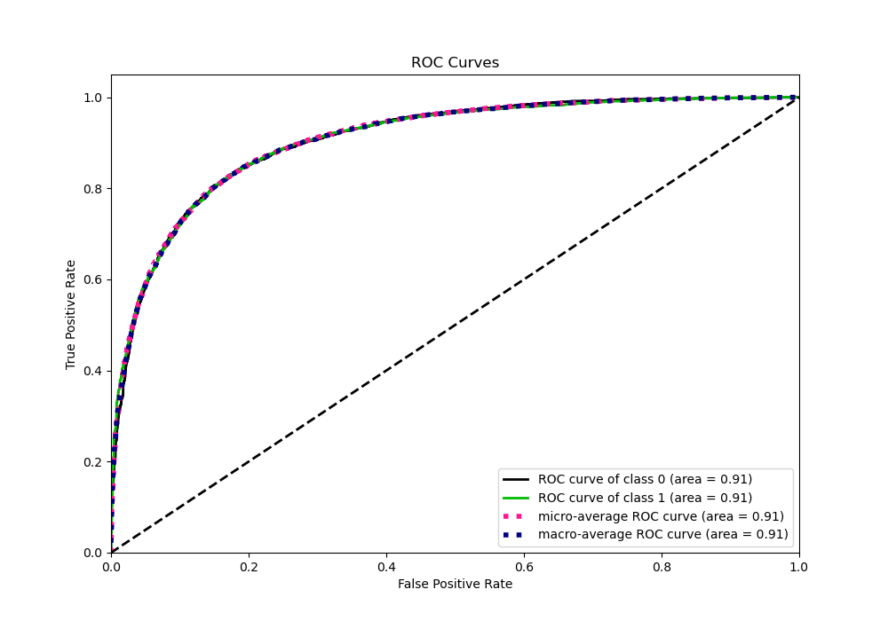
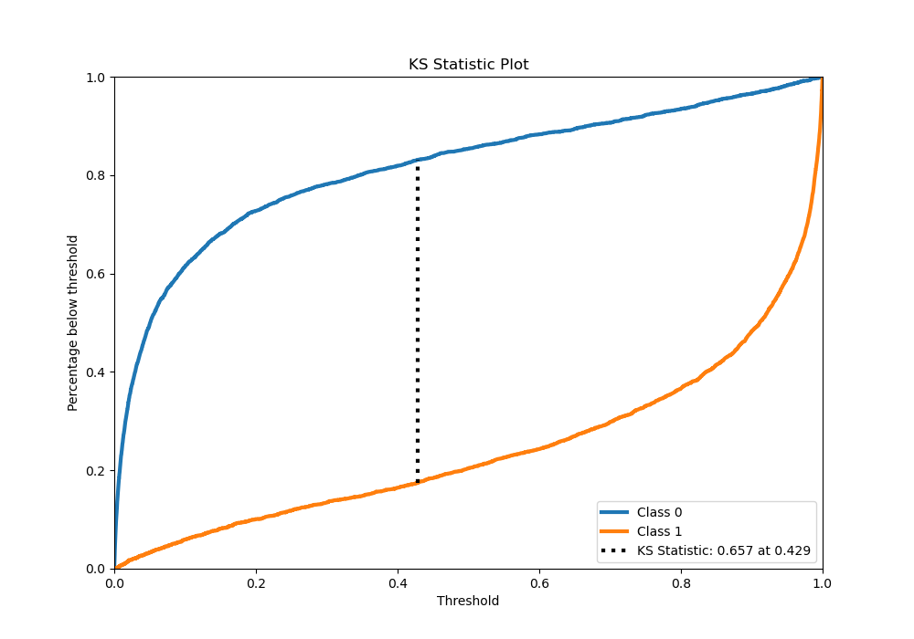
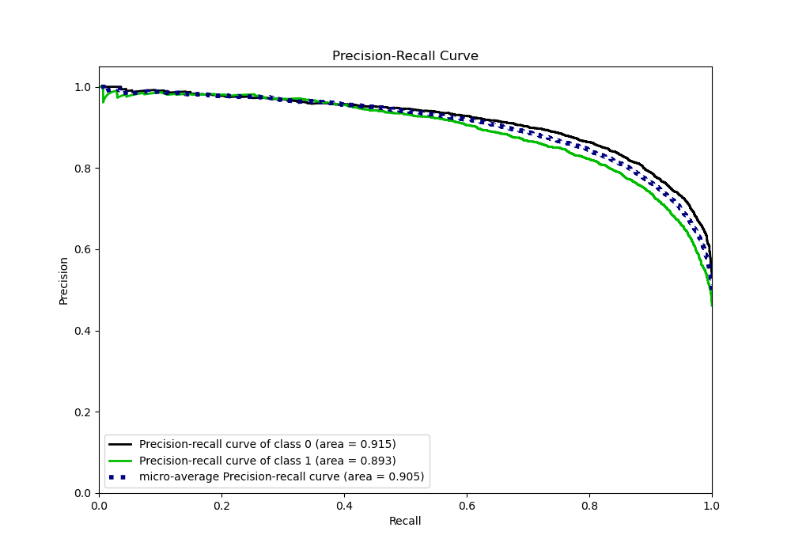
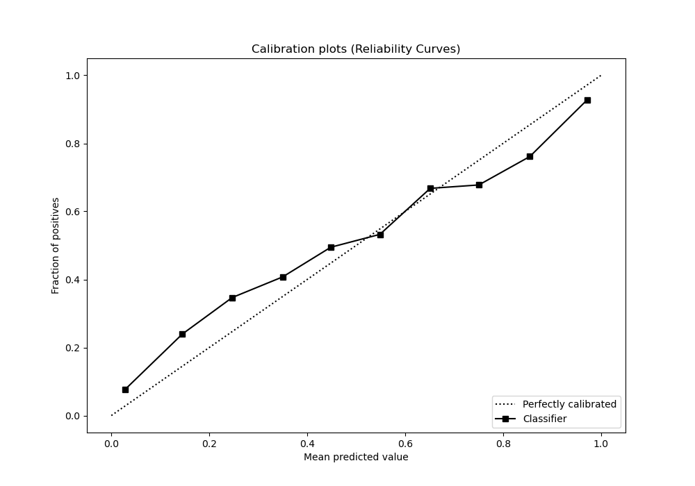
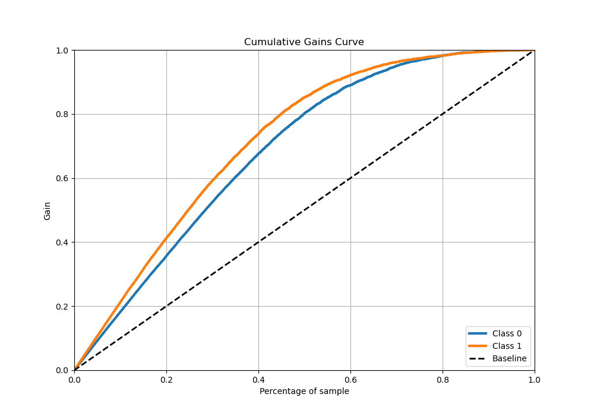
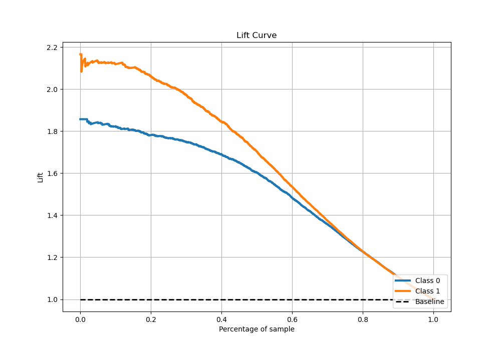

# Summary of 11_Xgboost_SelectedFeatures

[<< Go back](../README.md)

## Extreme Gradient Boosting (Xgboost)
- **n_jobs**: -1
- **objective**: binary:logistic
- **eta**: 0.1
- **max_depth**: 8
- **min_child_weight**: 1
- **subsample**: 1.0
- **colsample_bytree**: 0.9
- **eval_metric**: auc
- **explain_level**: 1

## Validation
 - **validation_type**: kfold
 - **k_folds**: 5
 - **shuffle**: True
 - **stratify**: True

## Optimized metric
auc

## Training time

50.0 seconds

## Metric details
|           |    score |     threshold |
|:----------|---------:|--------------:|
| logloss   | 0.413103 | nan           |
| auc       | 0.905852 | nan           |
| f1        | 0.817556 |   0.367401    |
| accuracy  | 0.828347 |   0.424783    |
| precision | 0.98615  |   0.996651    |
| recall    | 1        |   1.57956e-05 |
| mcc       | 0.655483 |   0.424783    |

## Metric details with threshold from accuracy metric
|           |    score |   threshold |
|:----------|---------:|------------:|
| logloss   | 0.413103 |  nan        |
| auc       | 0.905852 |  nan        |
| f1        | 0.816439 |    0.424783 |
| accuracy  | 0.828347 |    0.424783 |
| precision | 0.8061   |    0.424783 |
| recall    | 0.827047 |    0.424783 |
| mcc       | 0.655483 |    0.424783 |

## Confusion matrix (at threshold=0.424783)
|              |   Predicted as 0 |   Predicted as 1 |
|:-------------|-----------------:|-----------------:|
| Labeled as 0 |             3463 |              712 |
| Labeled as 1 |              619 |             2960 |

## Learning curves

## Permutation-based Importance

## Confusion Matrix

## Normalized Confusion Matrix

## ROC Curve

## Kolmogorov-Smirnov Statistic

## Precision-Recall Curve

## Calibration Curve

## Cumulative Gains Curve

## Lift Curve

[<< Go back](../README.md)
