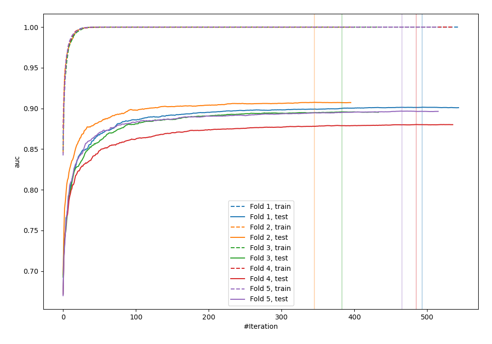
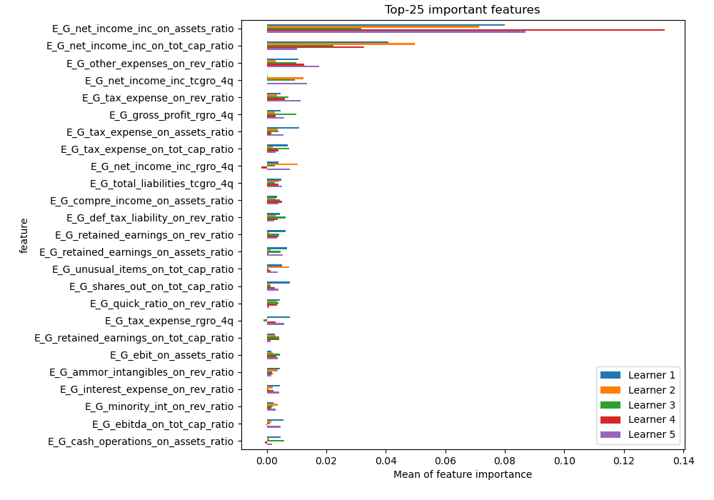
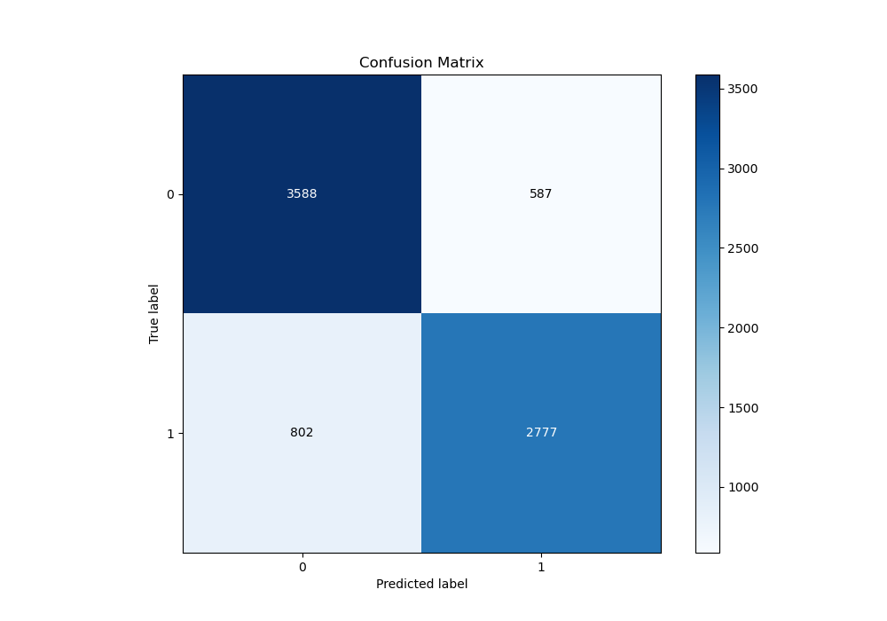
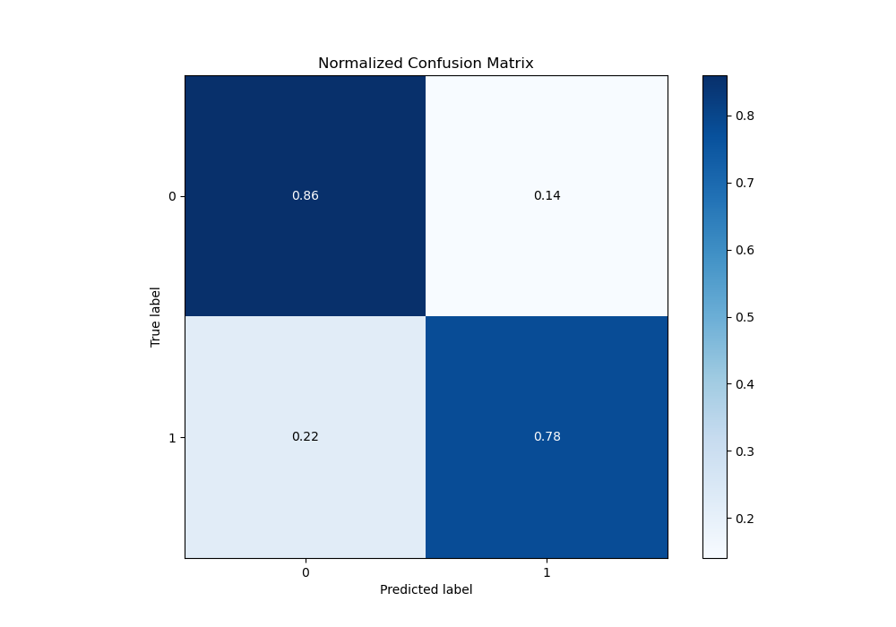
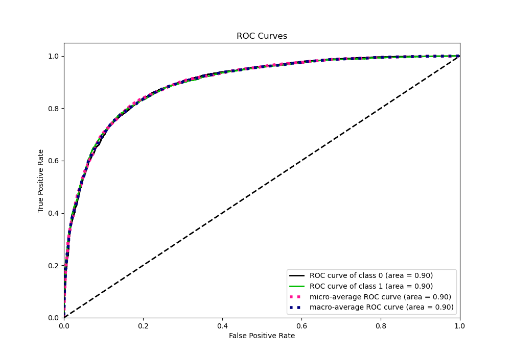
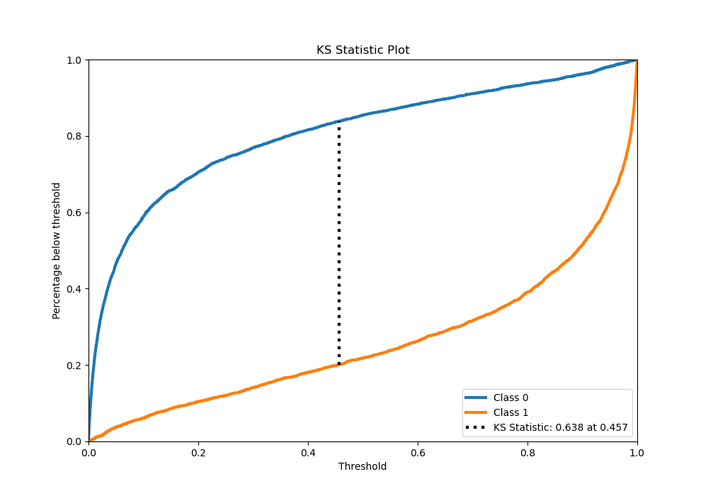
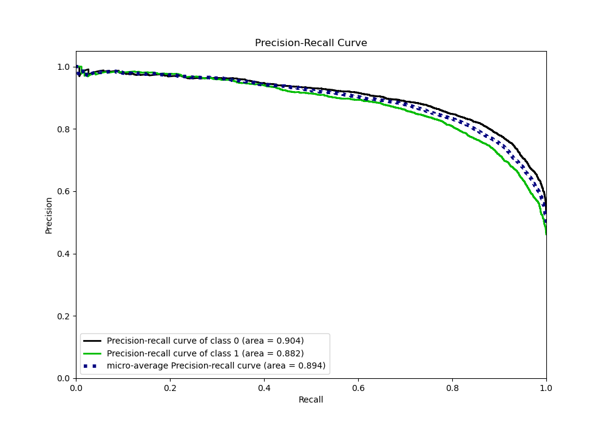
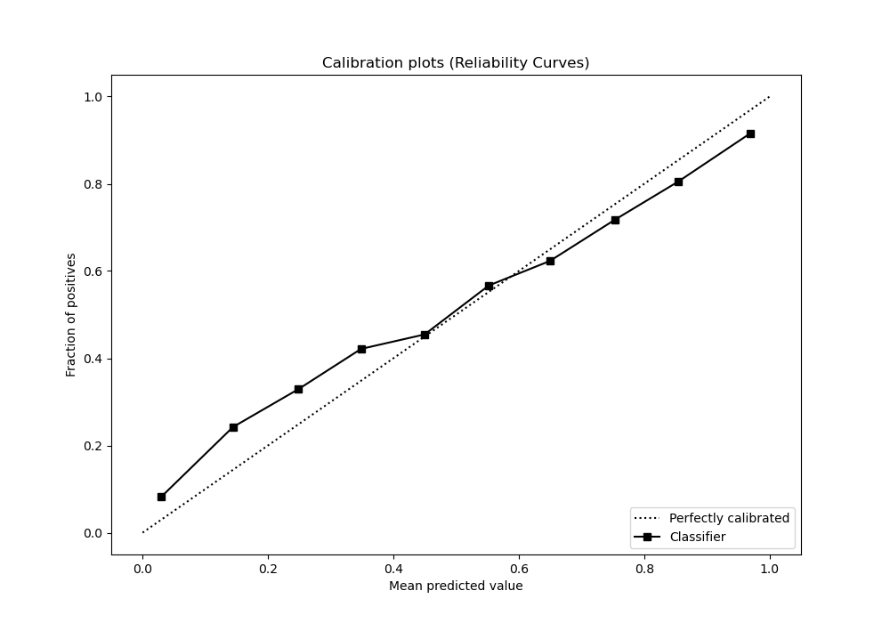
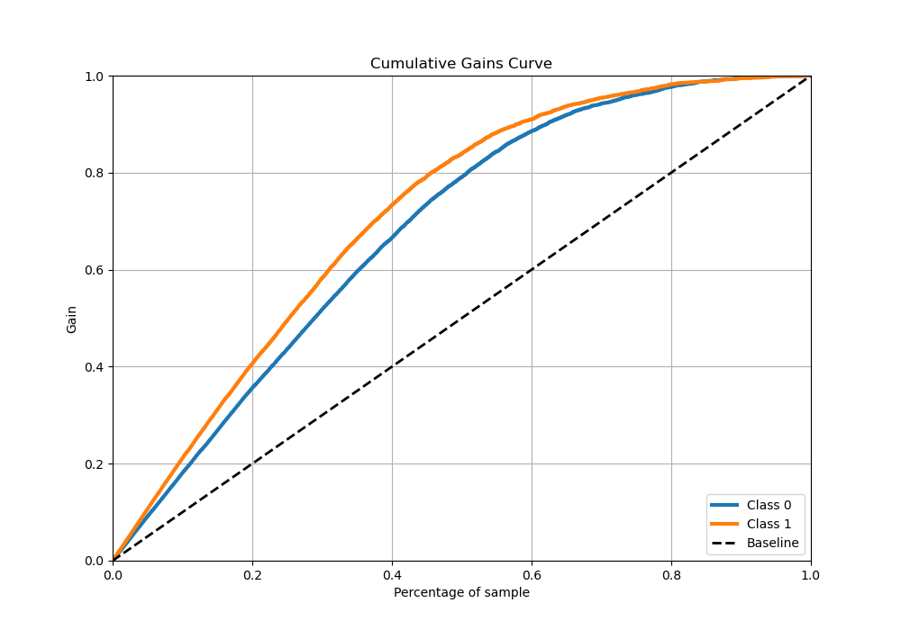
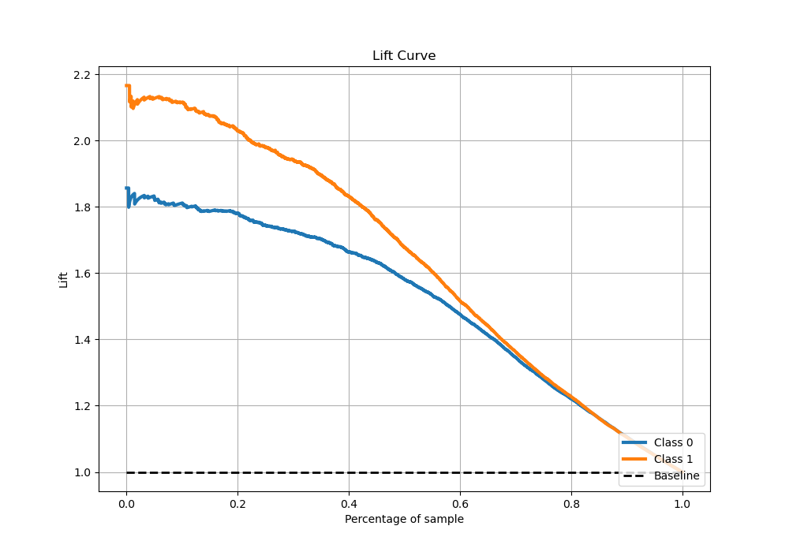

# Summary of 3_Xgboost

[<< Go back](../README.md)

## Extreme Gradient Boosting (Xgboost)
- **n_jobs**: -1
- **objective**: binary:logistic
- **eta**: 0.1
- **max_depth**: 8
- **min_child_weight**: 1
- **subsample**: 1.0
- **colsample_bytree**: 1.0
- **eval_metric**: auc
- **explain_level**: 1

## Validation
 - **validation_type**: kfold
 - **k_folds**: 5
 - **shuffle**: True
 - **stratify**: True

## Optimized metric
auc

## Training time

103.4 seconds

## Metric details
|           |    score |     threshold |
|:----------|---------:|--------------:|
| logloss   | 0.4338   | nan           |
| auc       | 0.895803 | nan           |
| f1        | 0.807189 |   0.25441     |
| accuracy  | 0.820867 |   0.516754    |
| precision | 0.984018 |   0.994496    |
| recall    | 1        |   1.75778e-05 |
| mcc       | 0.639056 |   0.516754    |

## Metric details with threshold from accuracy metric
|           |    score |   threshold |
|:----------|---------:|------------:|
| logloss   | 0.4338   |  nan        |
| auc       | 0.895803 |  nan        |
| f1        | 0.799942 |    0.516754 |
| accuracy  | 0.820867 |    0.516754 |
| precision | 0.825505 |    0.516754 |
| recall    | 0.775915 |    0.516754 |
| mcc       | 0.639056 |    0.516754 |

## Confusion matrix (at threshold=0.516754)
|              |   Predicted as 0 |   Predicted as 1 |
|:-------------|-----------------:|-----------------:|
| Labeled as 0 |             3588 |              587 |
| Labeled as 1 |              802 |             2777 |

## Learning curves

## Permutation-based Importance

## Confusion Matrix

## Normalized Confusion Matrix

## ROC Curve

## Kolmogorov-Smirnov Statistic

## Precision-Recall Curve

## Calibration Curve

## Cumulative Gains Curve

## Lift Curve

[<< Go back](../README.md)
