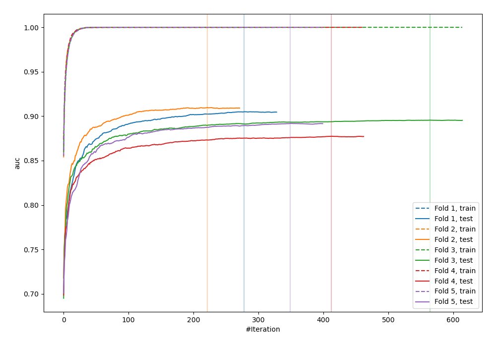
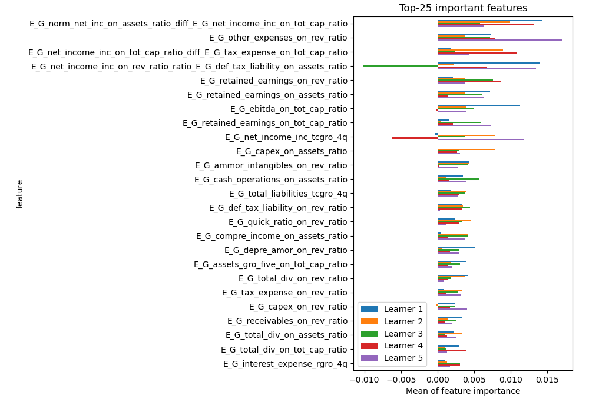
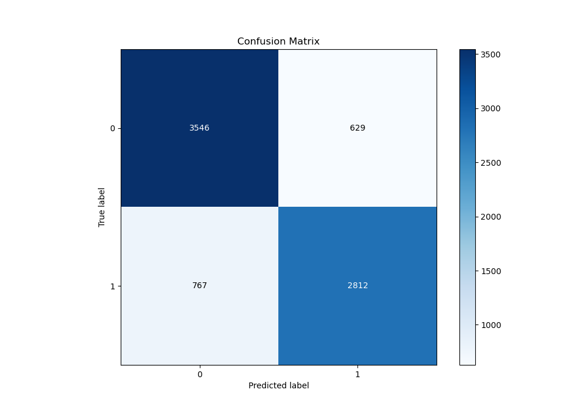
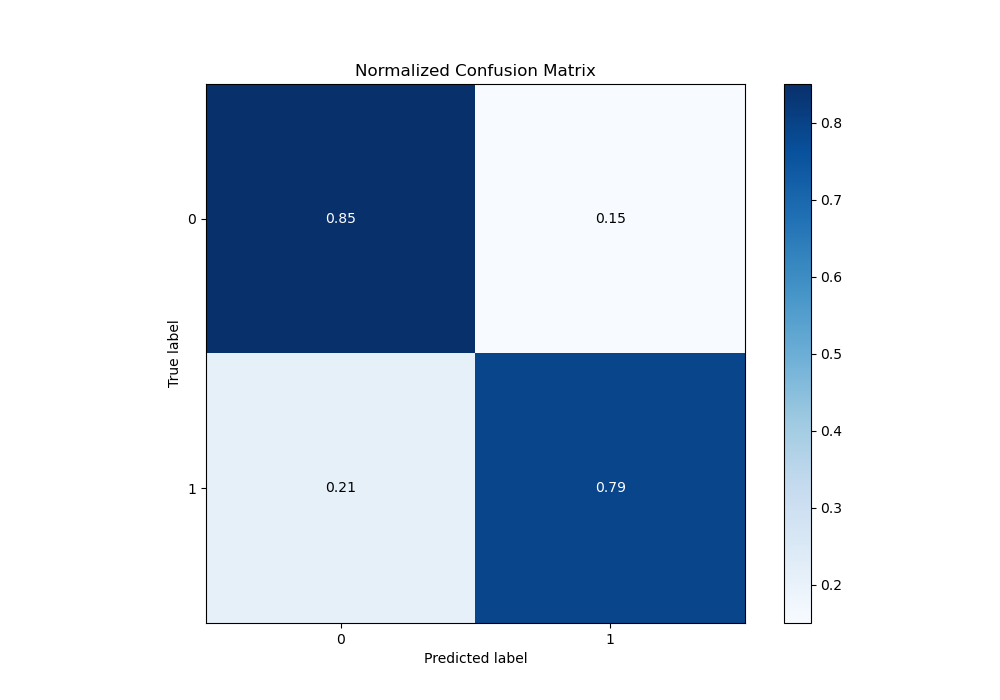
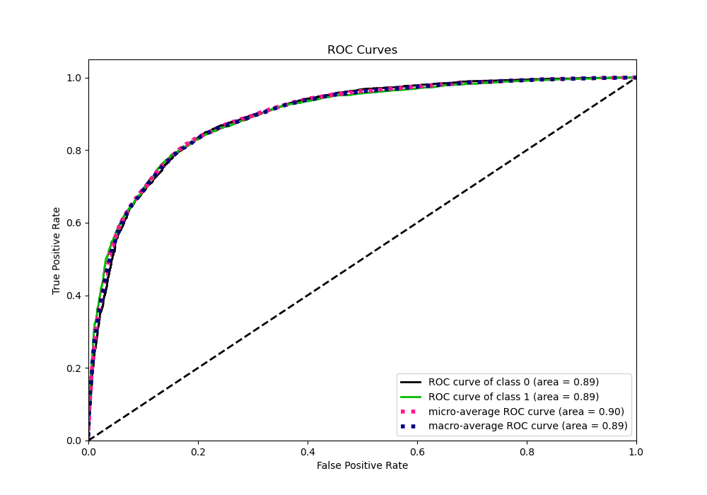
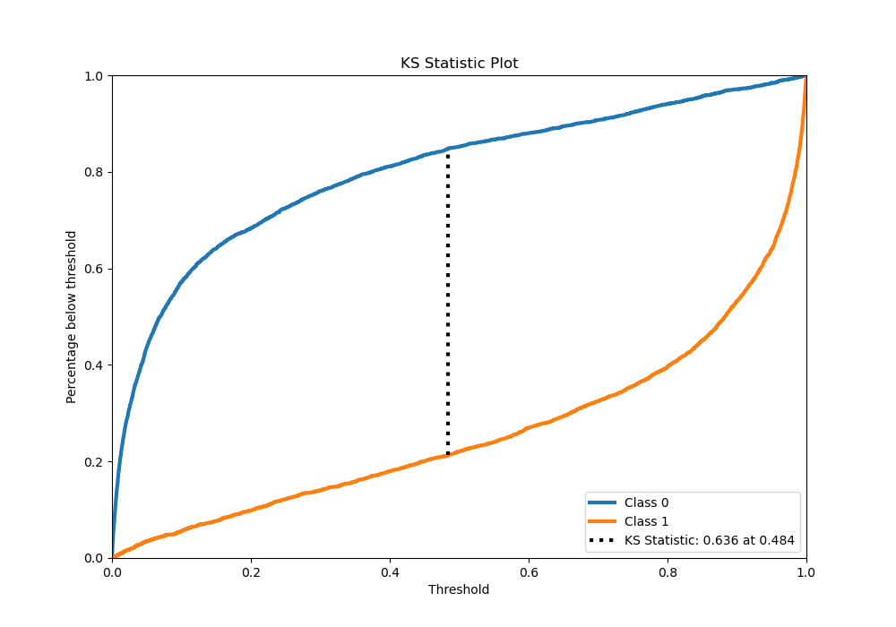
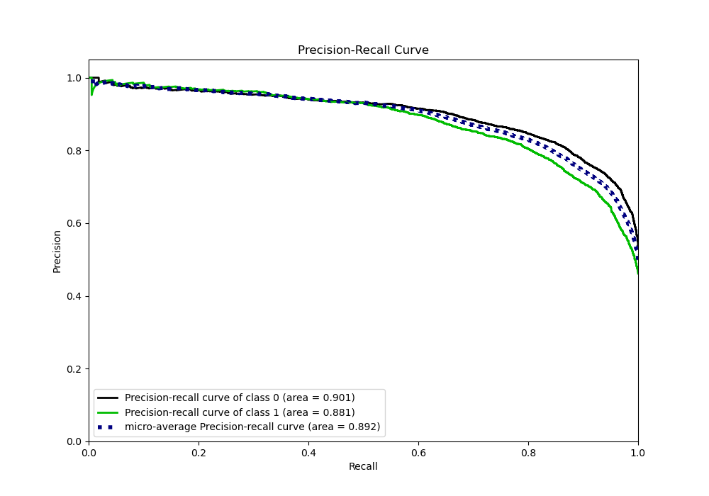
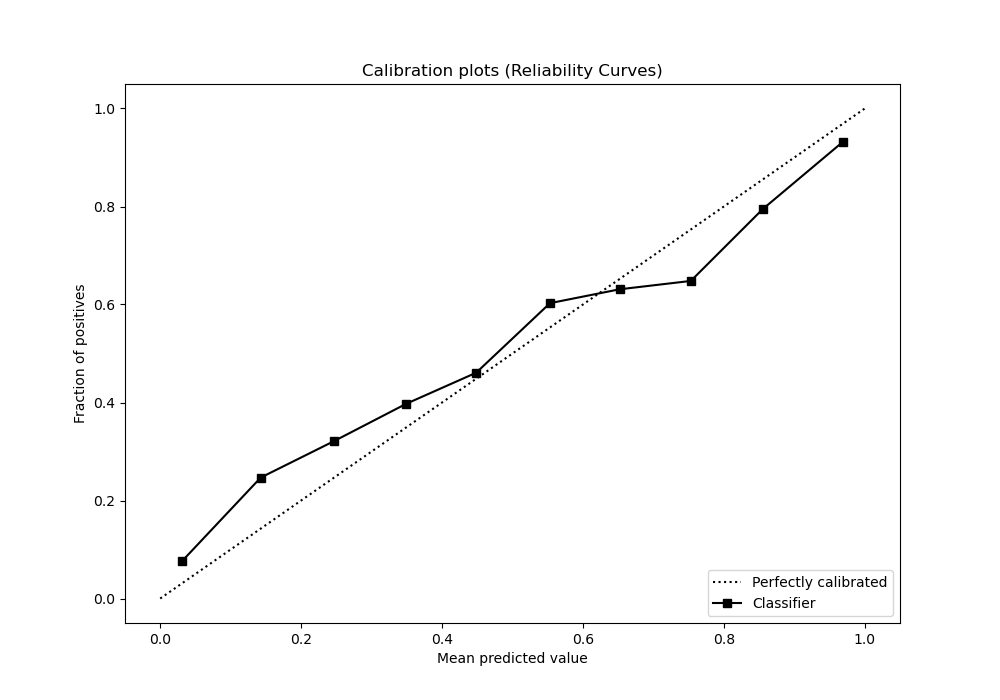
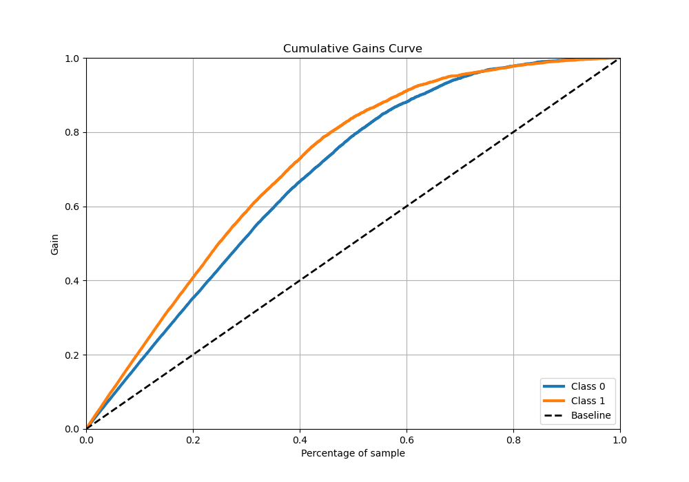

# Summary of 3_Xgboost_GoldenFeatures

[<< Go back](../README.md)

## Extreme Gradient Boosting (Xgboost)
- **n_jobs**: -1
- **objective**: binary:logistic
- **eta**: 0.1
- **max_depth**: 8
- **min_child_weight**: 1
- **subsample**: 1.0
- **colsample_bytree**: 1.0
- **eval_metric**: auc
- **explain_level**: 1

## Validation
 - **validation_type**: kfold
 - **k_folds**: 5
 - **shuffle**: True
 - **stratify**: True

## Optimized metric
auc

## Training time

302.3 seconds

## Metric details
|           |    score |    threshold |
|:----------|---------:|-------------:|
| logloss   | 0.431503 | nan          |
| auc       | 0.894396 | nan          |
| f1        | 0.805667 |   0.348852   |
| accuracy  | 0.819964 |   0.4873     |
| precision | 0.992308 |   0.998168   |
| recall    | 1        |   4.9116e-05 |
| mcc       | 0.637199 |   0.4873     |

## Metric details with threshold from accuracy metric
|           |    score |   threshold |
|:----------|---------:|------------:|
| logloss   | 0.431503 |    nan      |
| auc       | 0.894396 |    nan      |
| f1        | 0.80114  |      0.4873 |
| accuracy  | 0.819964 |      0.4873 |
| precision | 0.817204 |      0.4873 |
| recall    | 0.785694 |      0.4873 |
| mcc       | 0.637199 |      0.4873 |

## Confusion matrix (at threshold=0.4873)
|              |   Predicted as 0 |   Predicted as 1 |
|:-------------|-----------------:|-----------------:|
| Labeled as 0 |             3546 |              629 |
| Labeled as 1 |              767 |             2812 |

## Learning curves

## Permutation-based Importance

## Confusion Matrix

## Normalized Confusion Matrix

## ROC Curve

## Kolmogorov-Smirnov Statistic

## Precision-Recall Curve

## Calibration Curve

## Cumulative Gains Curve

## Lift Curve

[<< Go back](../README.md)
