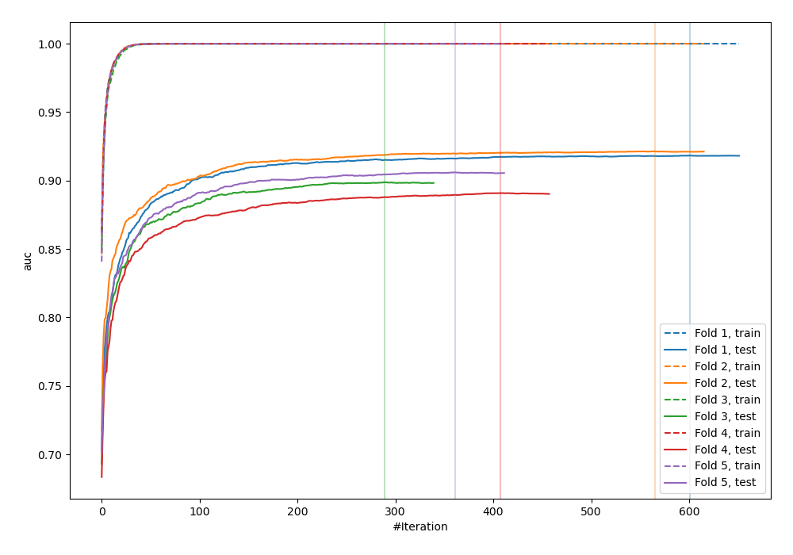
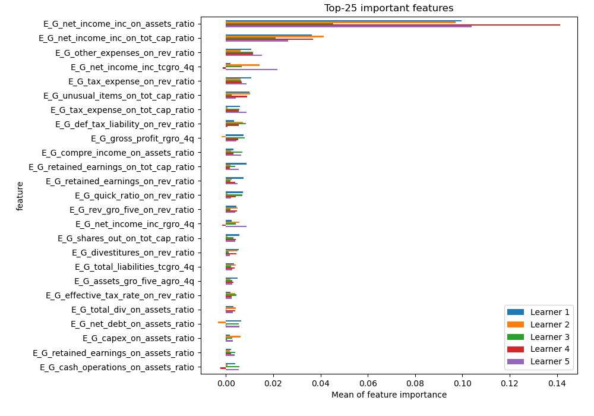
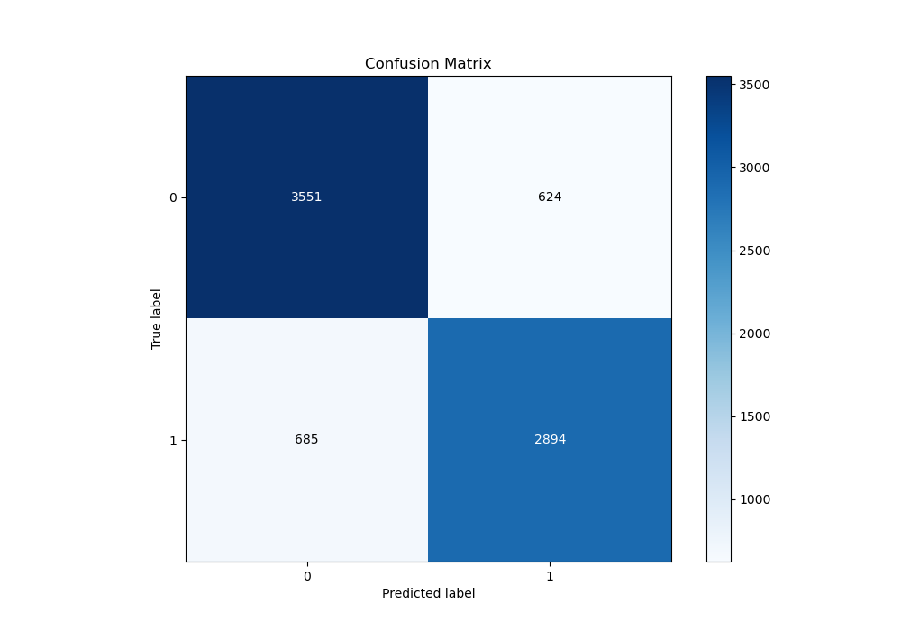
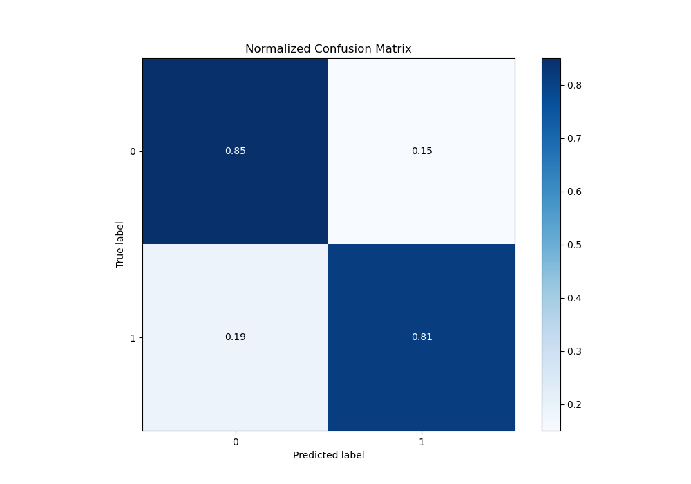
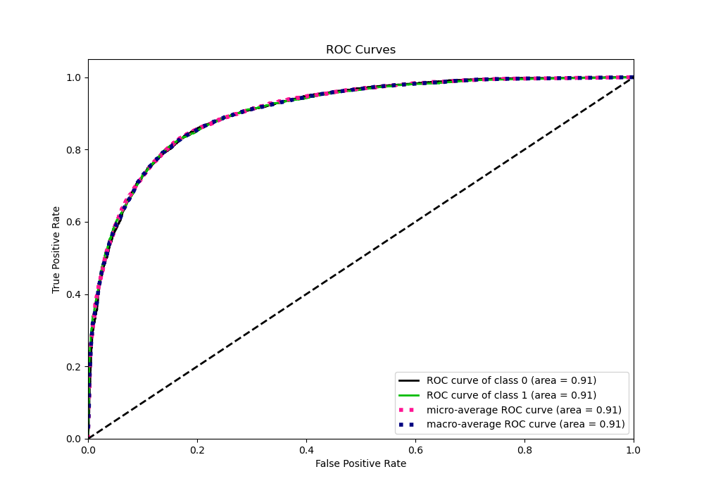
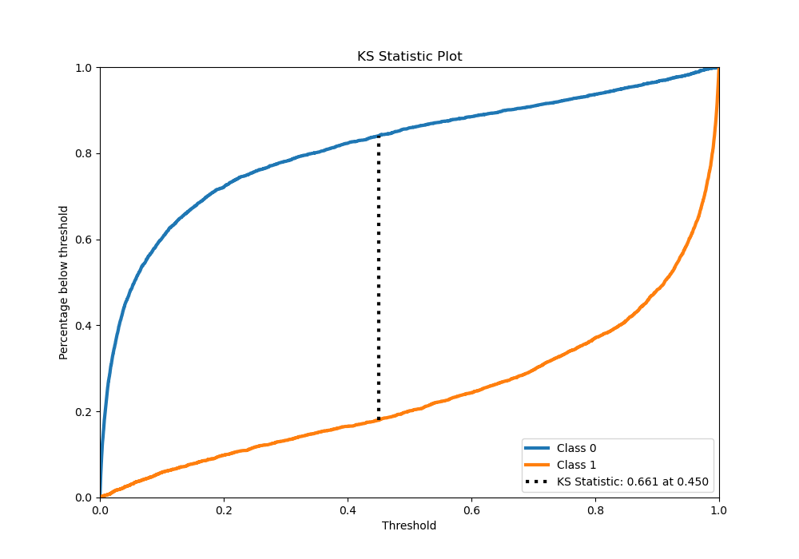
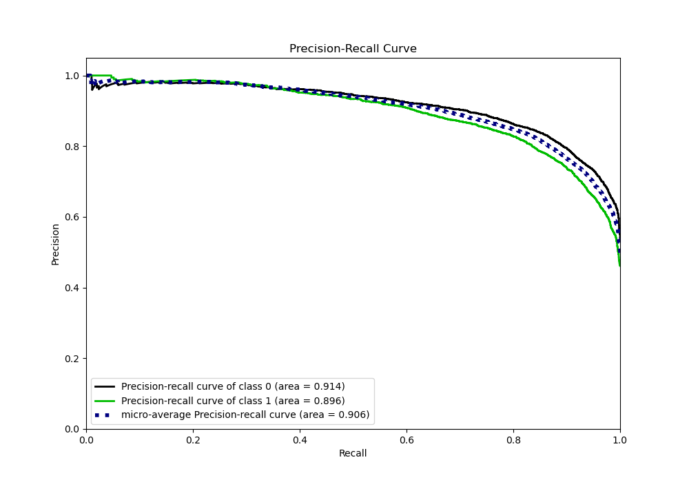
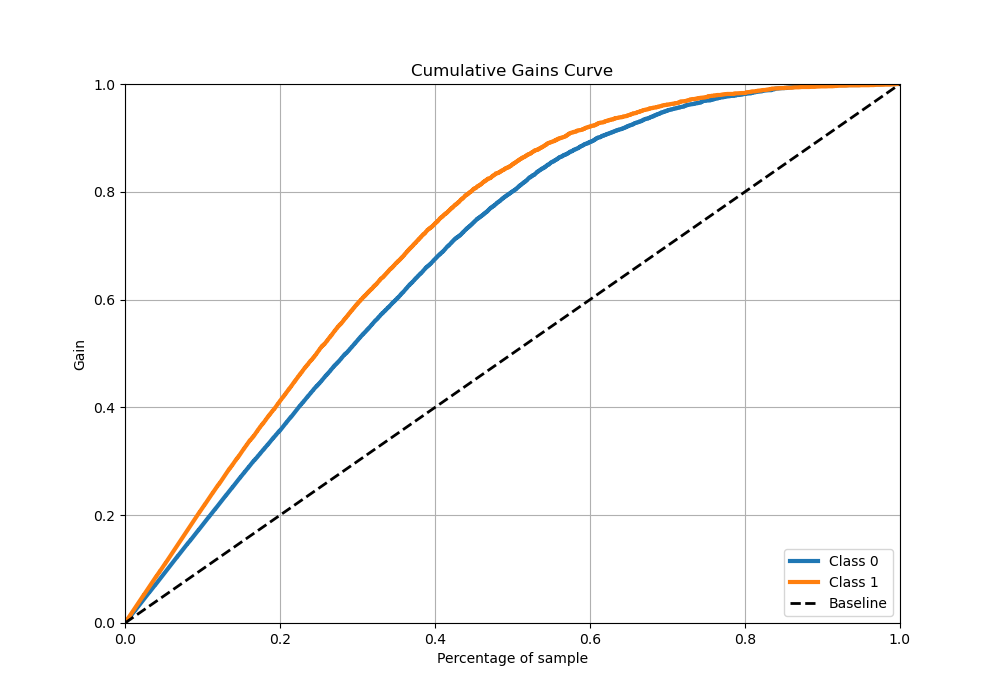
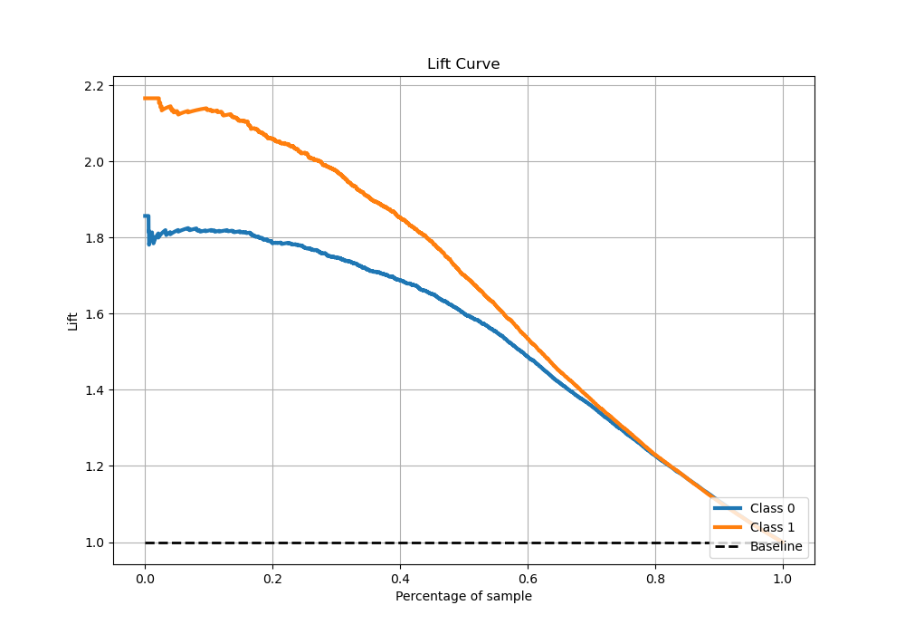

# Summary of 3_Xgboost_SelectedFeatures

[<< Go back](../README.md)

## Extreme Gradient Boosting (Xgboost)
- **n_jobs**: -1
- **objective**: binary:logistic
- **eta**: 0.1
- **max_depth**: 8
- **min_child_weight**: 1
- **subsample**: 1.0
- **colsample_bytree**: 1.0
- **eval_metric**: auc
- **explain_level**: 1

## Validation
 - **validation_type**: kfold
 - **k_folds**: 5
 - **shuffle**: True
 - **stratify**: True

## Optimized metric
auc

## Training time

48.8 seconds

## Metric details
|           |    score |     threshold |
|:----------|---------:|--------------:|
| logloss   | 0.40719  | nan           |
| auc       | 0.907104 | nan           |
| f1        | 0.817833 |   0.311466    |
| accuracy  | 0.831184 |   0.47945     |
| precision | 1        |   0.998761    |
| recall    | 1        |   1.66767e-05 |
| mcc       | 0.660216 |   0.451872    |

## Metric details with threshold from accuracy metric
|           |    score |   threshold |
|:----------|---------:|------------:|
| logloss   | 0.40719  |   nan       |
| auc       | 0.907104 |   nan       |
| f1        | 0.815556 |     0.47945 |
| accuracy  | 0.831184 |     0.47945 |
| precision | 0.822626 |     0.47945 |
| recall    | 0.808606 |     0.47945 |
| mcc       | 0.66003  |     0.47945 |

## Confusion matrix (at threshold=0.47945)
|              |   Predicted as 0 |   Predicted as 1 |
|:-------------|-----------------:|-----------------:|
| Labeled as 0 |             3551 |              624 |
| Labeled as 1 |              685 |             2894 |

## Learning curves

## Permutation-based Importance

## Confusion Matrix

## Normalized Confusion Matrix

## ROC Curve

## Kolmogorov-Smirnov Statistic

## Precision-Recall Curve

## Calibration Curve

## Cumulative Gains Curve

## Lift Curve

[<< Go back](../README.md)
