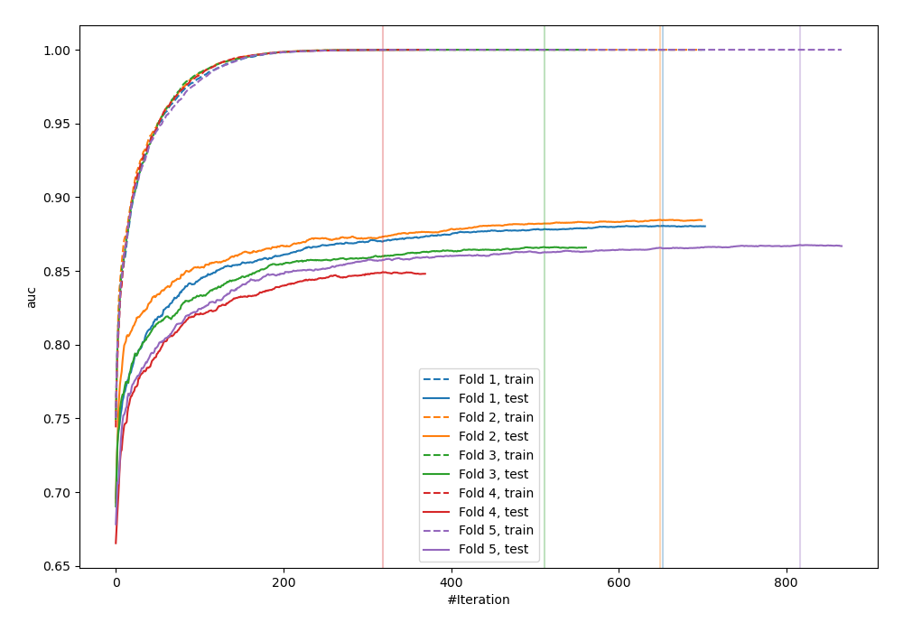
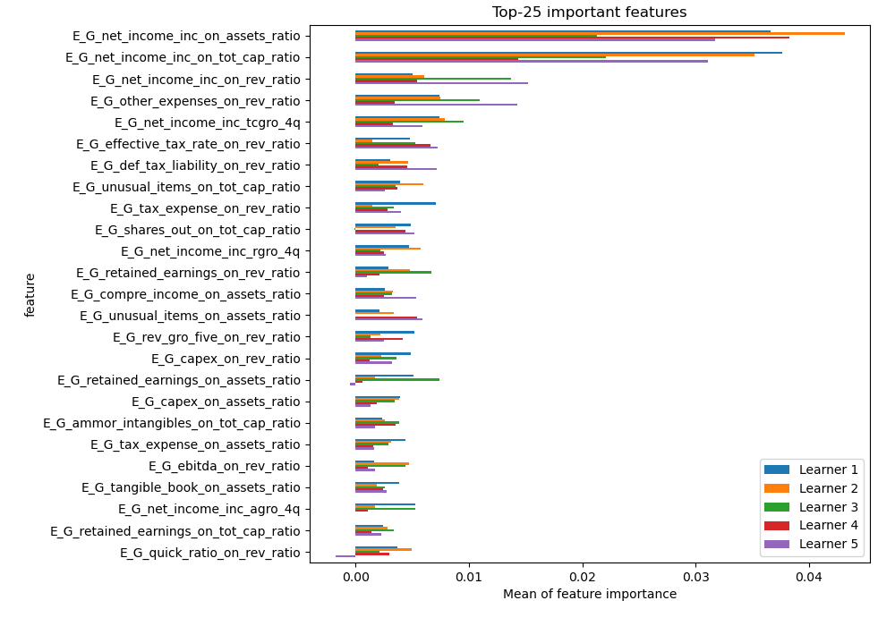
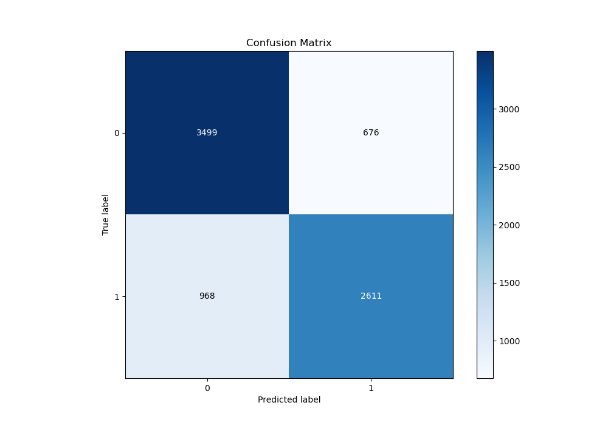
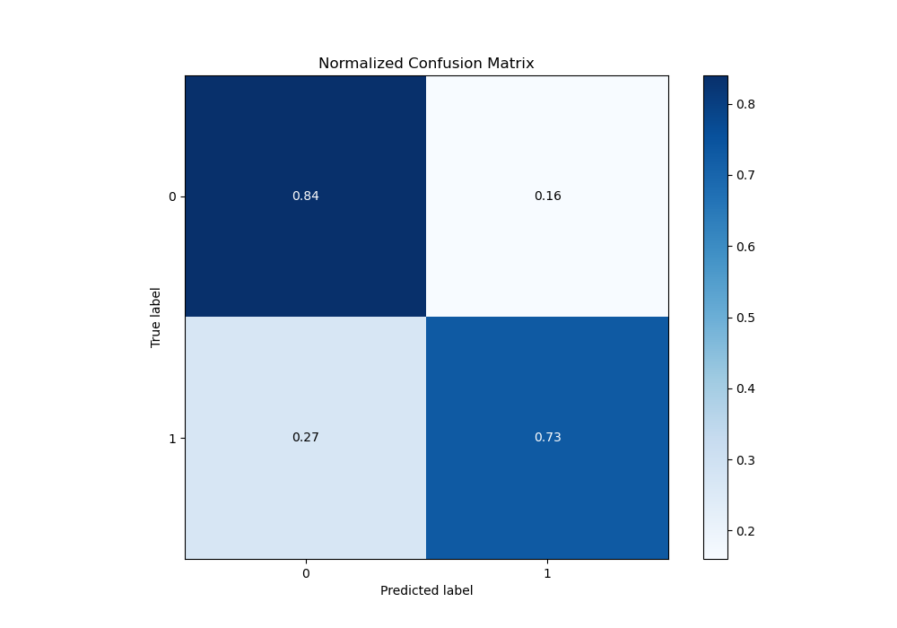
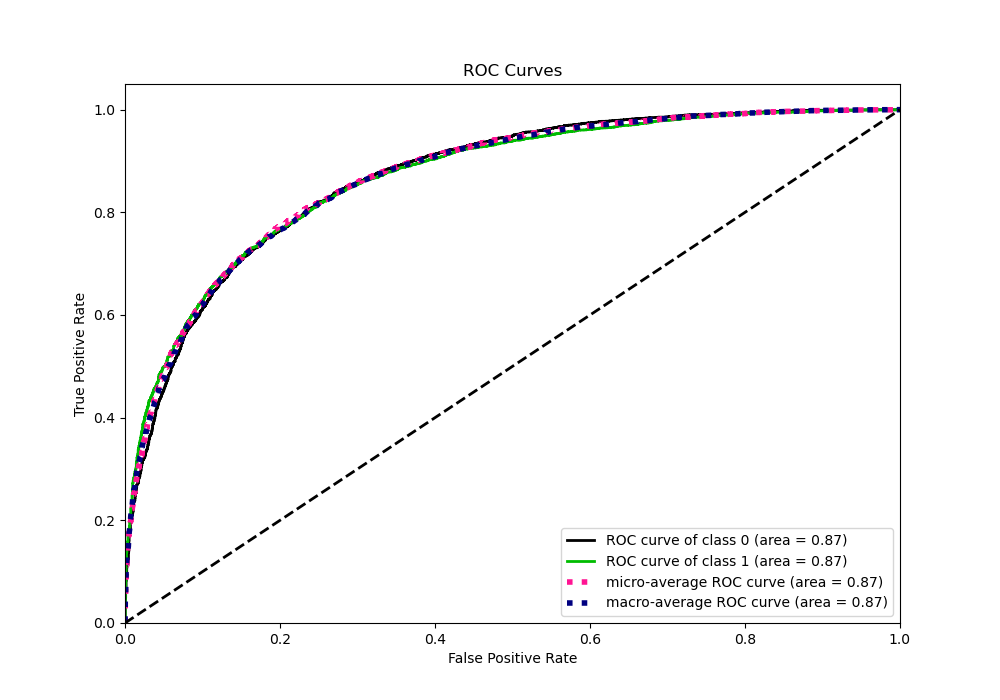
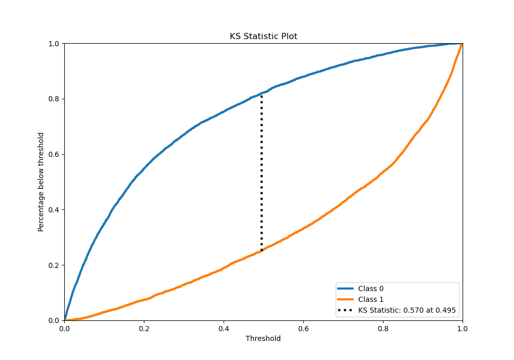
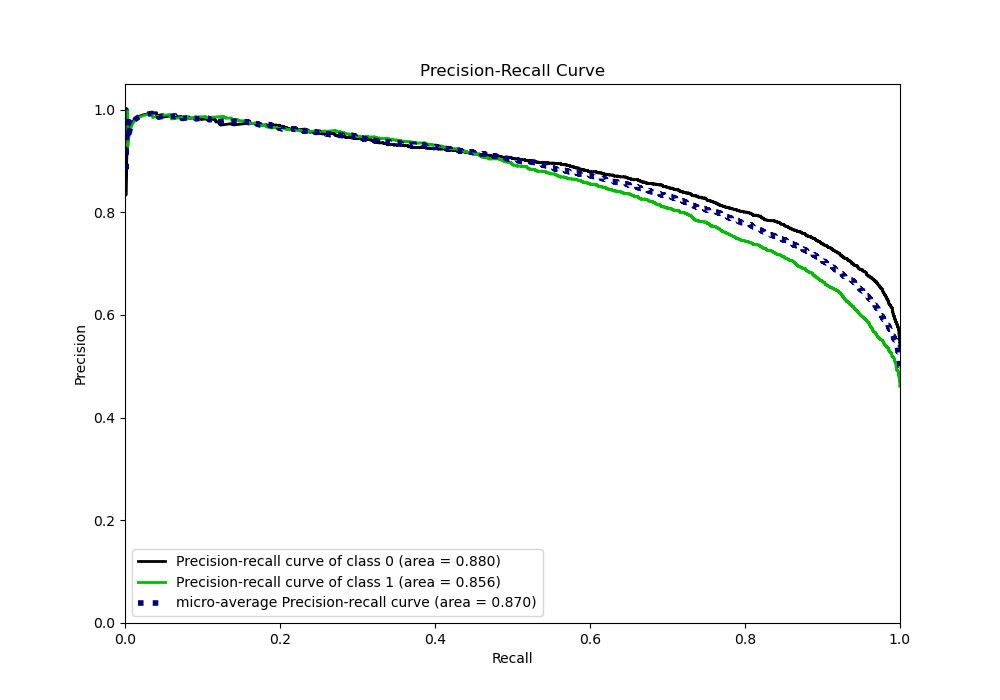
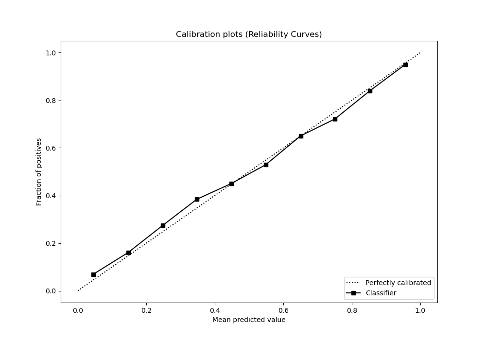
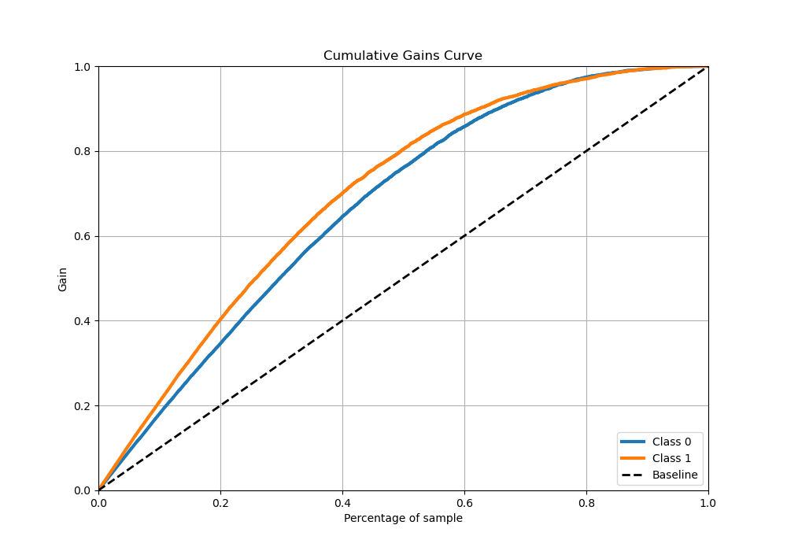
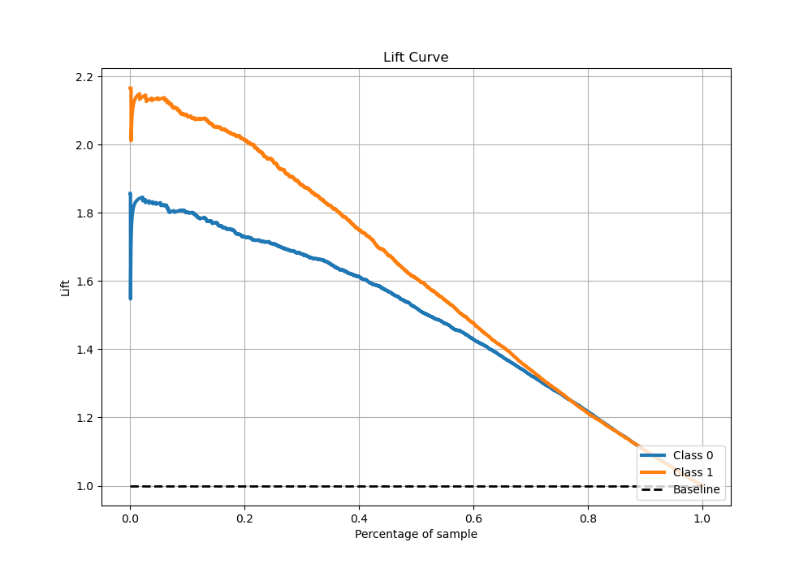

# Summary of 4_Xgboost

[<< Go back](../README.md)

## Extreme Gradient Boosting (Xgboost)
- **n_jobs**: -1
- **objective**: binary:logistic
- **eta**: 0.1
- **max_depth**: 7
- **min_child_weight**: 25
- **subsample**: 0.9
- **colsample_bytree**: 0.6
- **eval_metric**: auc
- **explain_level**: 1

## Validation
 - **validation_type**: kfold
 - **k_folds**: 5
 - **shuffle**: True
 - **stratify**: True

## Optimized metric
auc

## Training time

93.6 seconds

## Metric details
|           |    score |     threshold |
|:----------|---------:|--------------:|
| logloss   | 0.450533 | nan           |
| auc       | 0.869221 | nan           |
| f1        | 0.77568  |   0.320876    |
| accuracy  | 0.78798  |   0.52108     |
| precision | 0.990338 |   0.984046    |
| recall    | 1        |   0.000313493 |
| mcc       | 0.572607 |   0.52108     |

## Metric details with threshold from accuracy metric
|           |    score |   threshold |
|:----------|---------:|------------:|
| logloss   | 0.450533 |   nan       |
| auc       | 0.869221 |   nan       |
| f1        | 0.760559 |     0.52108 |
| accuracy  | 0.78798  |     0.52108 |
| precision | 0.794341 |     0.52108 |
| recall    | 0.729533 |     0.52108 |
| mcc       | 0.572607 |     0.52108 |

## Confusion matrix (at threshold=0.52108)
|              |   Predicted as 0 |   Predicted as 1 |
|:-------------|-----------------:|-----------------:|
| Labeled as 0 |             3499 |              676 |
| Labeled as 1 |              968 |             2611 |

## Learning curves

## Permutation-based Importance

## Confusion Matrix

## Normalized Confusion Matrix

## ROC Curve

## Kolmogorov-Smirnov Statistic

## Precision-Recall Curve

## Calibration Curve

## Cumulative Gains Curve

## Lift Curve

[<< Go back](../README.md)
