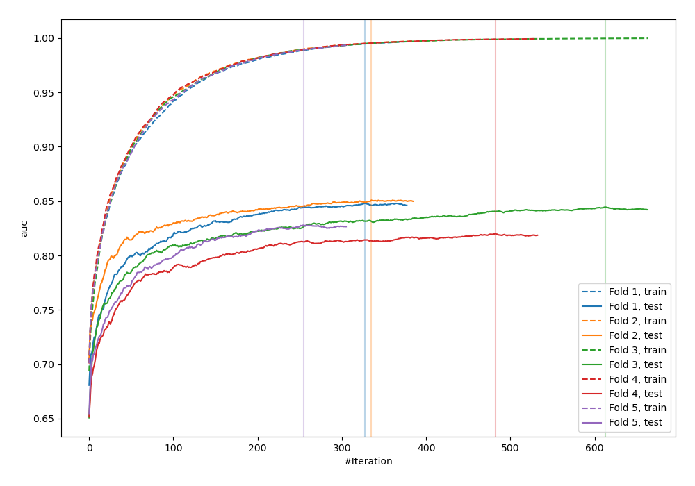
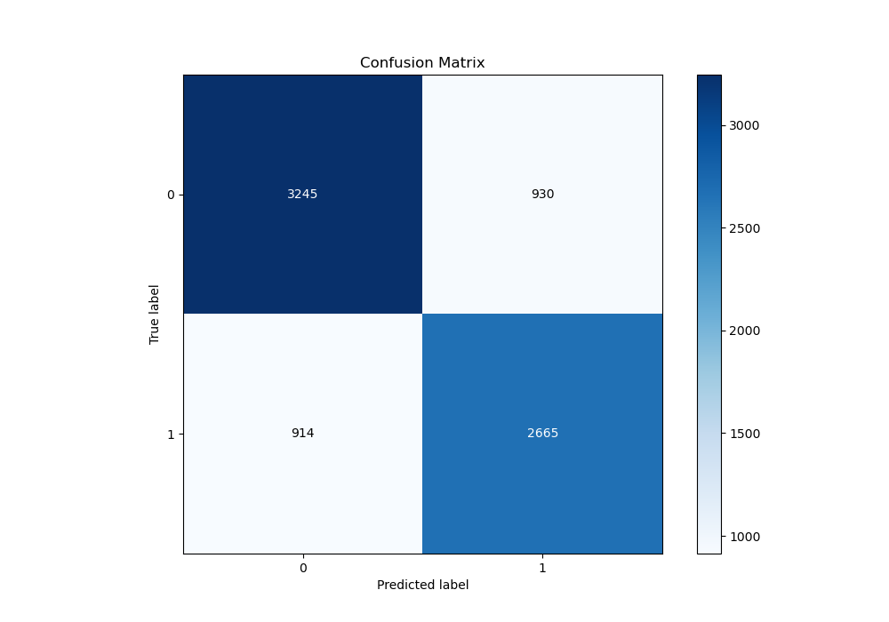
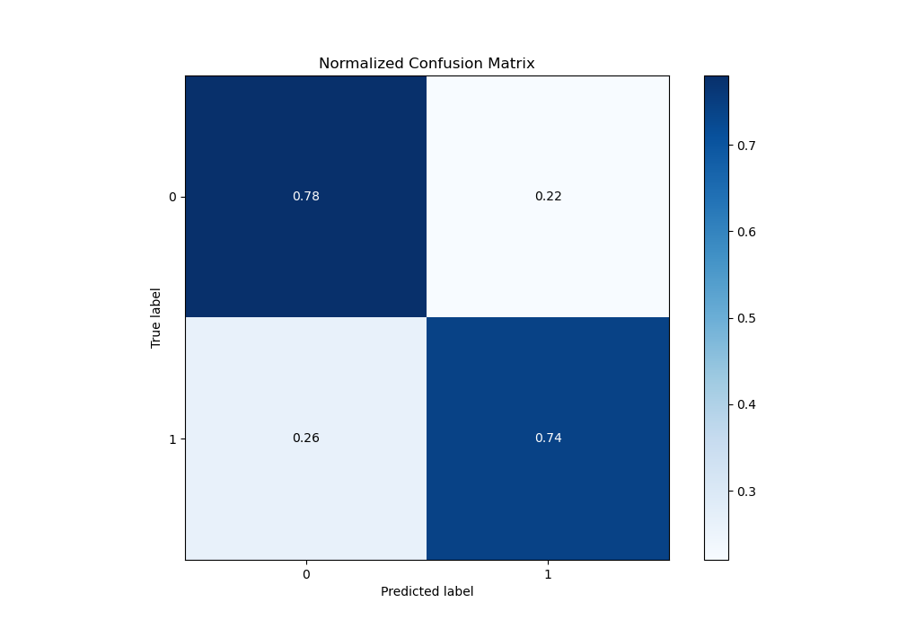
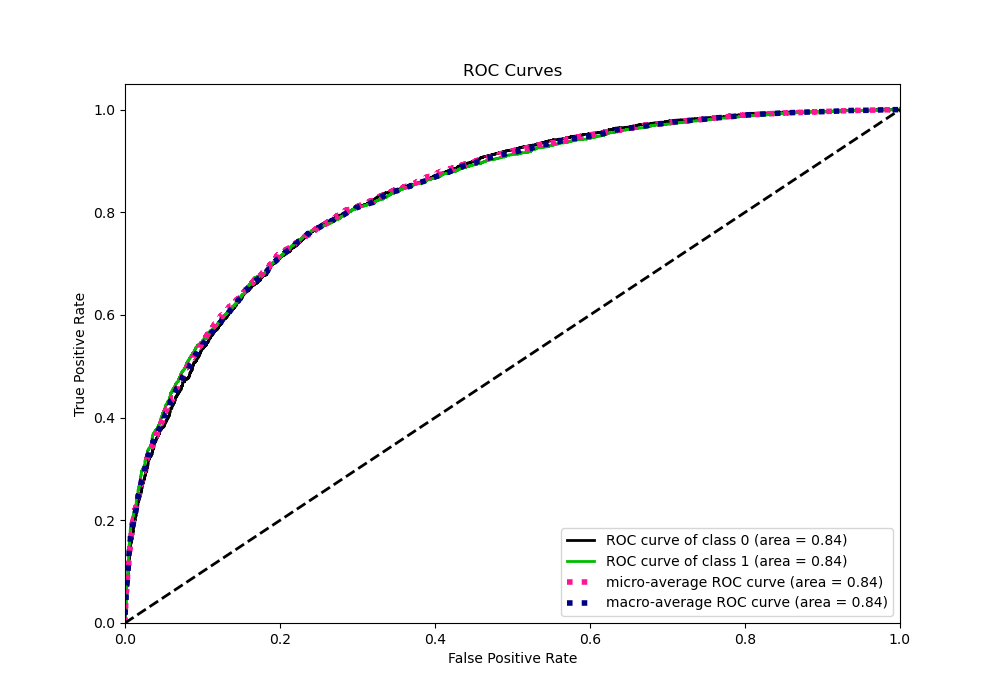
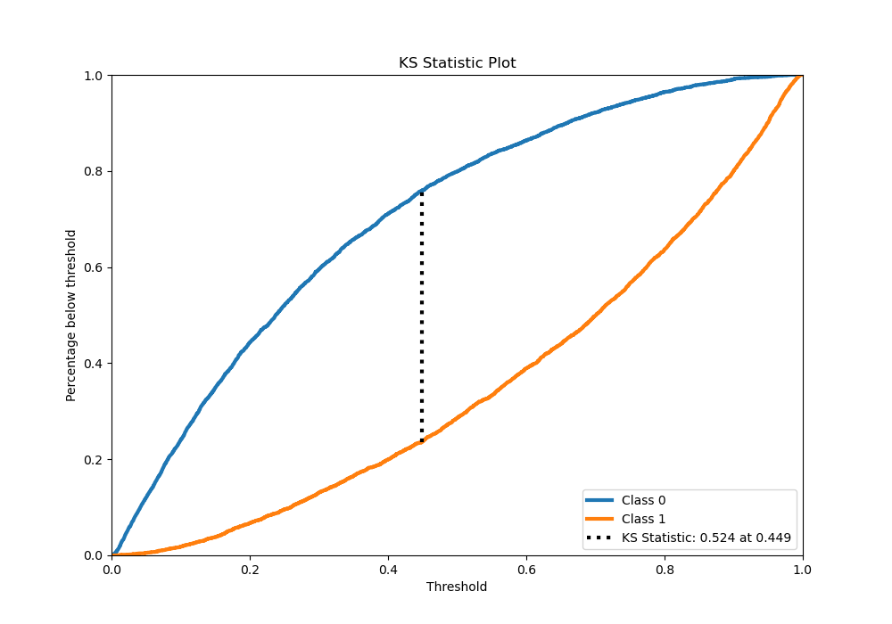
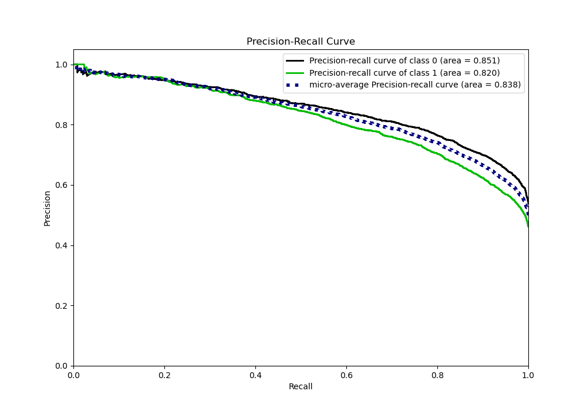
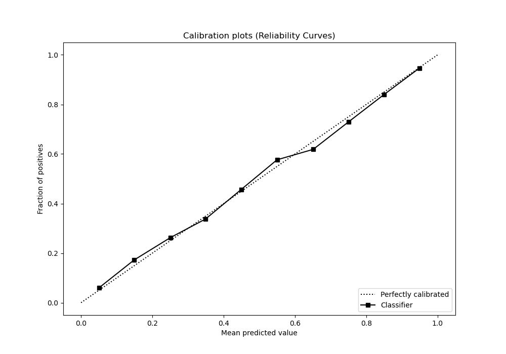
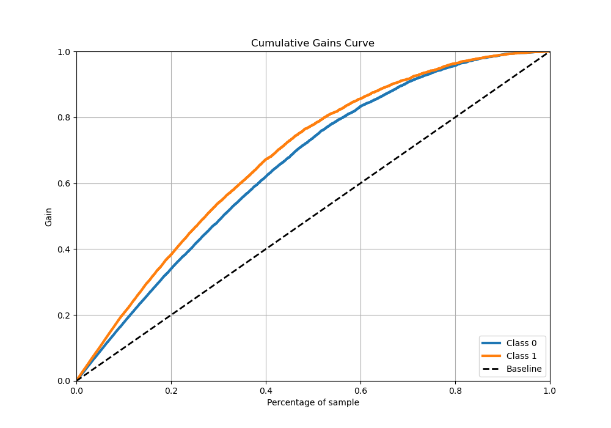
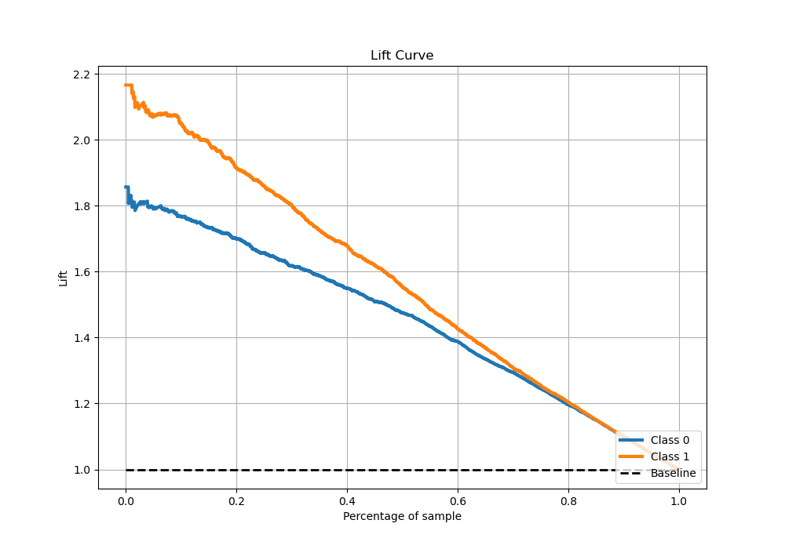

# Summary of 5_Xgboost

[<< Go back](../README.md)

## Extreme Gradient Boosting (Xgboost)
- **n_jobs**: -1
- **objective**: binary:logistic
- **eta**: 0.15
- **max_depth**: 8
- **min_child_weight**: 50
- **subsample**: 0.6
- **colsample_bytree**: 0.6
- **eval_metric**: auc
- **explain_level**: 1

## Validation
 - **validation_type**: kfold
 - **k_folds**: 5
 - **shuffle**: True
 - **stratify**: True

## Optimized metric
auc

## Training time

69.0 seconds

## Metric details
|           |    score |    threshold |
|:----------|---------:|-------------:|
| logloss   | 0.494105 | nan          |
| auc       | 0.837908 | nan          |
| f1        | 0.749643 |   0.391383   |
| accuracy  | 0.762187 |   0.47026    |
| precision | 0.971014 |   0.967255   |
| recall    | 1        |   0.00094609 |
| mcc       | 0.522118 |   0.447449   |

## Metric details with threshold from accuracy metric
|           |    score |   threshold |
|:----------|---------:|------------:|
| logloss   | 0.494105 |   nan       |
| auc       | 0.837908 |   nan       |
| f1        | 0.742961 |     0.47026 |
| accuracy  | 0.762187 |     0.47026 |
| precision | 0.741307 |     0.47026 |
| recall    | 0.744621 |     0.47026 |
| mcc       | 0.521705 |     0.47026 |

## Confusion matrix (at threshold=0.47026)
|              |   Predicted as 0 |   Predicted as 1 |
|:-------------|-----------------:|-----------------:|
| Labeled as 0 |             3245 |              930 |
| Labeled as 1 |              914 |             2665 |

## Learning curves

## Permutation-based Importance

## Confusion Matrix

## Normalized Confusion Matrix

## ROC Curve

## Kolmogorov-Smirnov Statistic

## Precision-Recall Curve

## Calibration Curve

## Cumulative Gains Curve

## Lift Curve

[<< Go back](../README.md)
