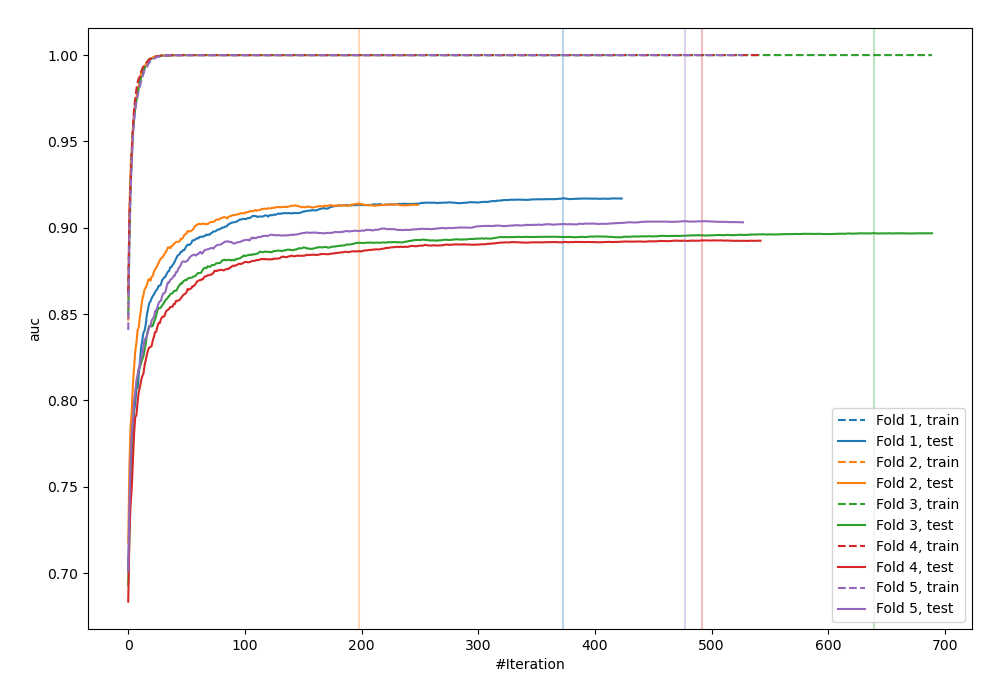
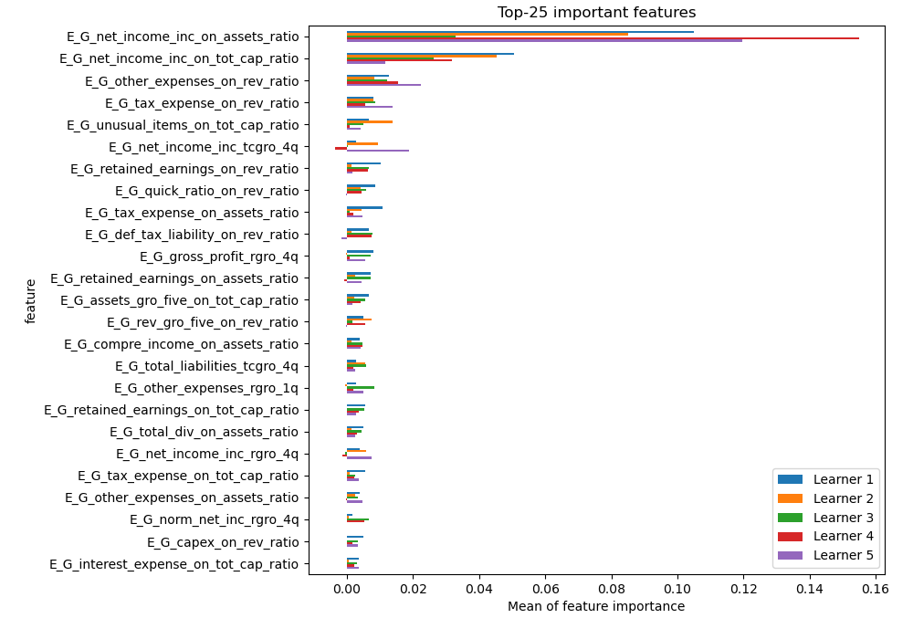
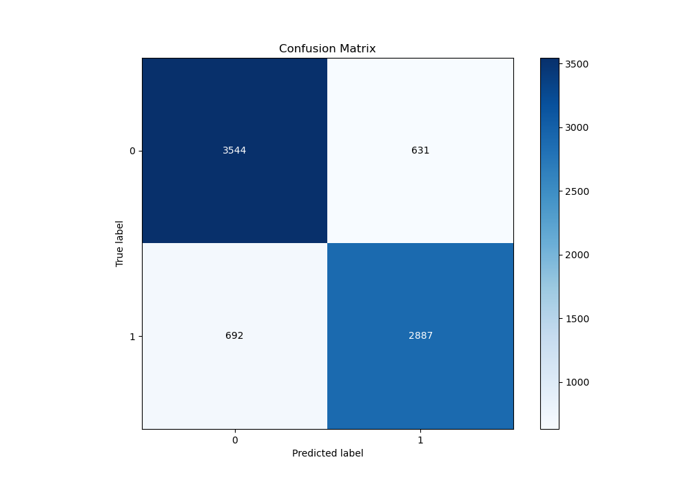
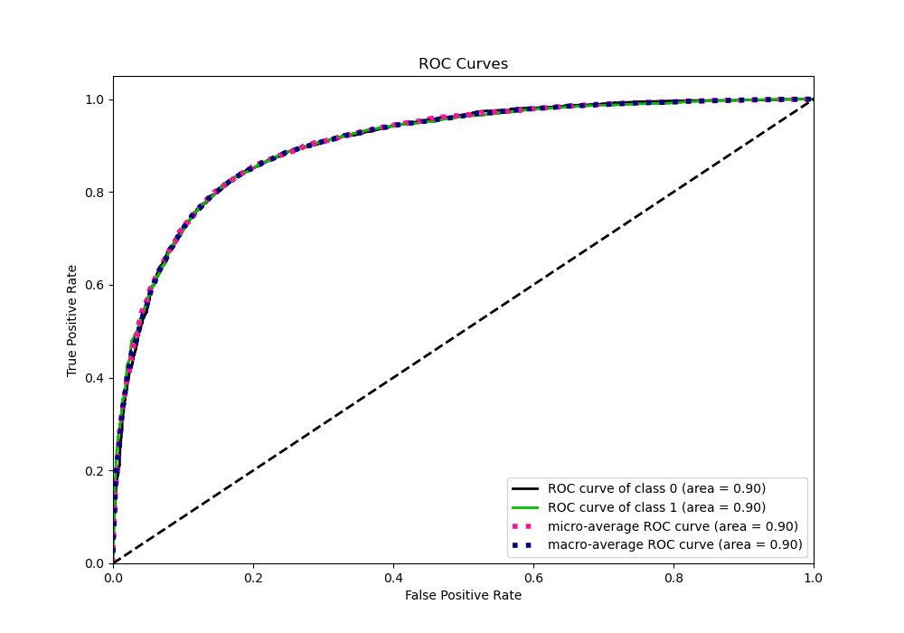
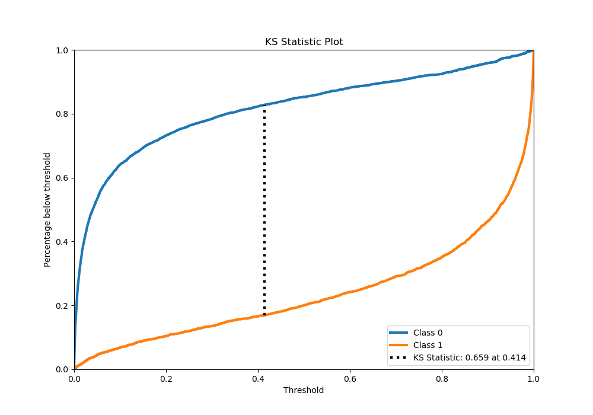
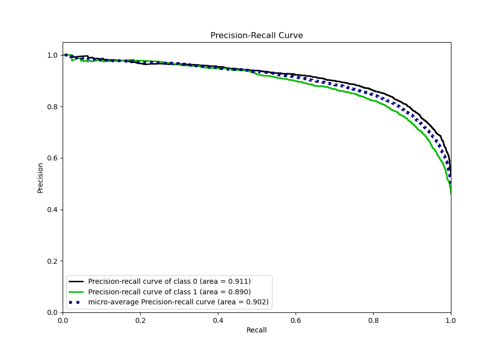
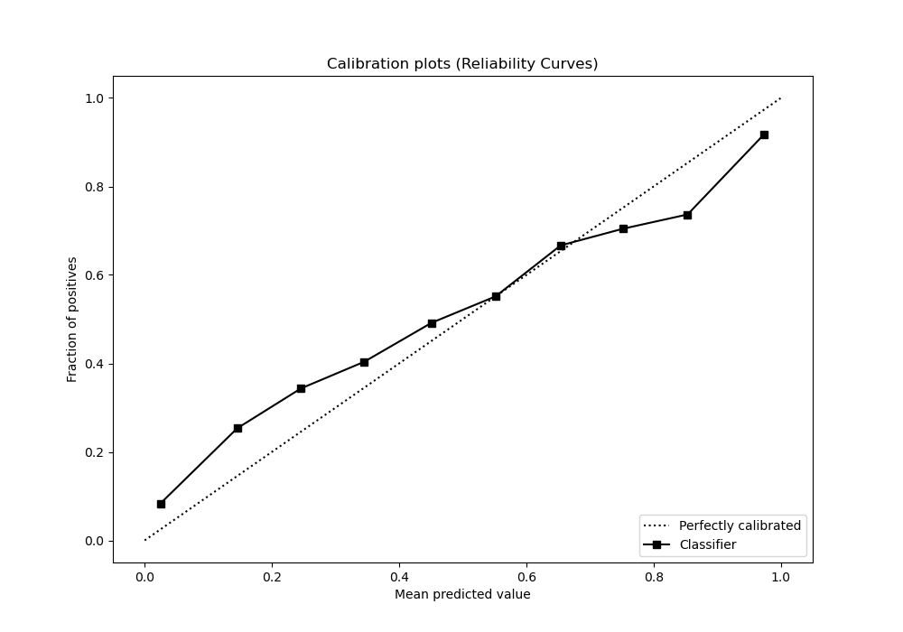
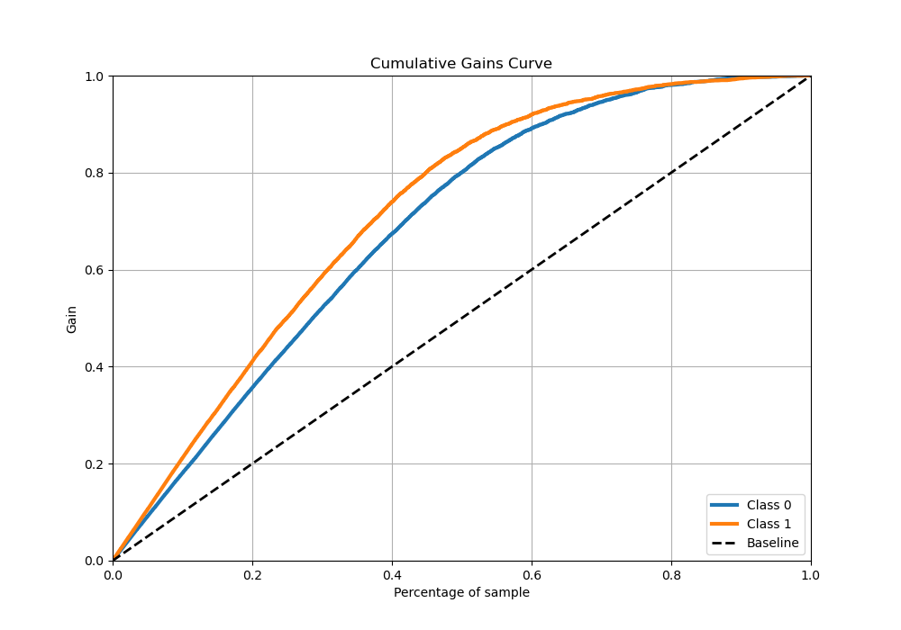

# Summary of 7_Xgboost_SelectedFeatures

[<< Go back](../README.md)

## Extreme Gradient Boosting (Xgboost)
- **n_jobs**: -1
- **objective**: binary:logistic
- **eta**: 0.15
- **max_depth**: 8
- **min_child_weight**: 1
- **subsample**: 1.0
- **colsample_bytree**: 1.0
- **eval_metric**: auc
- **explain_level**: 1

## Validation
 - **validation_type**: kfold
 - **k_folds**: 5
 - **shuffle**: True
 - **stratify**: True

## Optimized metric
auc

## Training time

45.0 seconds

## Metric details
|           |    score |     threshold |
|:----------|---------:|--------------:|
| logloss   | 0.43354  | nan           |
| auc       | 0.903125 | nan           |
| f1        | 0.817833 |   0.304467    |
| accuracy  | 0.829378 |   0.483969    |
| precision | 0.984615 |   0.999493    |
| recall    | 1        |   8.60685e-06 |
| mcc       | 0.656519 |   0.423543    |

## Metric details with threshold from accuracy metric
|           |    score |   threshold |
|:----------|---------:|------------:|
| logloss   | 0.43354  |  nan        |
| auc       | 0.903125 |  nan        |
| f1        | 0.813583 |    0.483969 |
| accuracy  | 0.829378 |    0.483969 |
| precision | 0.820637 |    0.483969 |
| recall    | 0.80665  |    0.483969 |
| mcc       | 0.656393 |    0.483969 |

## Confusion matrix (at threshold=0.483969)
|              |   Predicted as 0 |   Predicted as 1 |
|:-------------|-----------------:|-----------------:|
| Labeled as 0 |             3544 |              631 |
| Labeled as 1 |              692 |             2887 |

## Learning curves

## Permutation-based Importance

## Confusion Matrix

## Normalized Confusion Matrix

## ROC Curve

## Kolmogorov-Smirnov Statistic

## Precision-Recall Curve

## Calibration Curve

## Cumulative Gains Curve

## Lift Curve

[<< Go back](../README.md)
