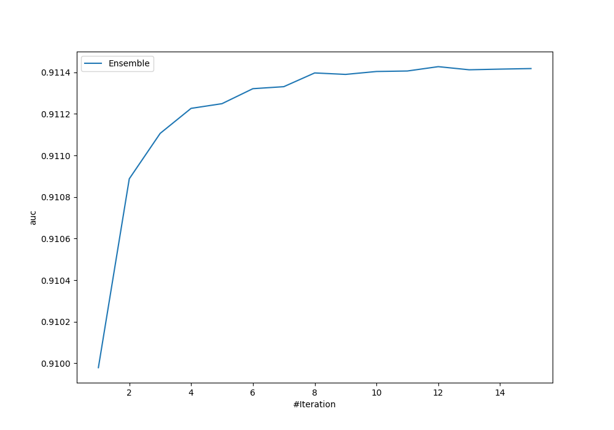
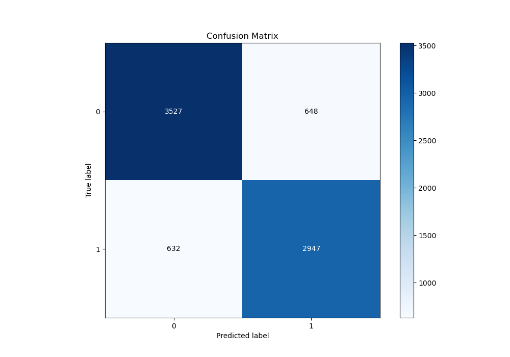
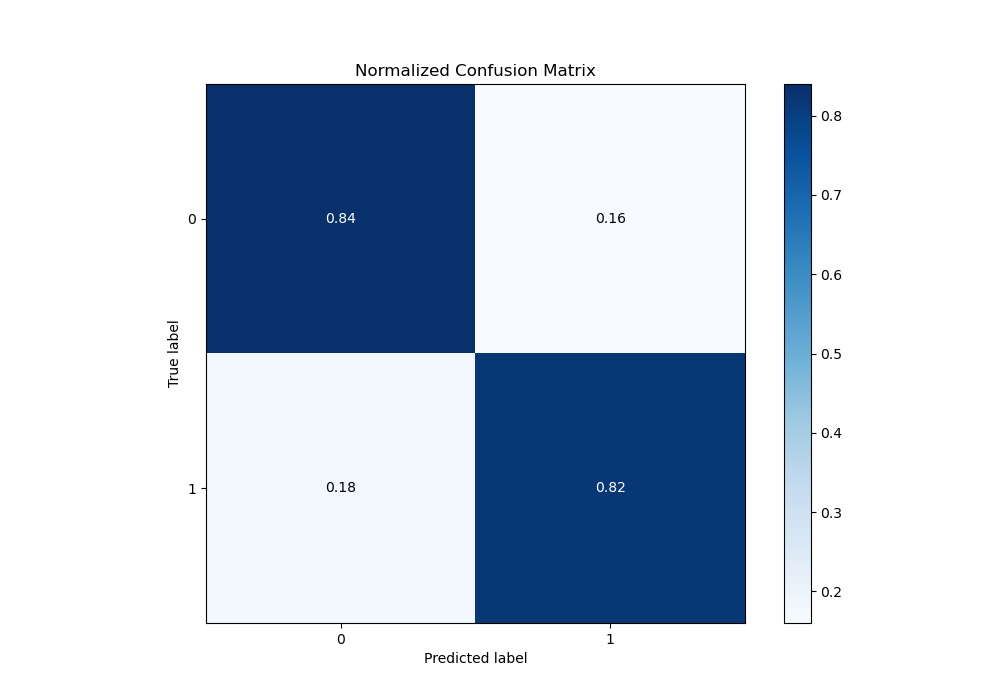
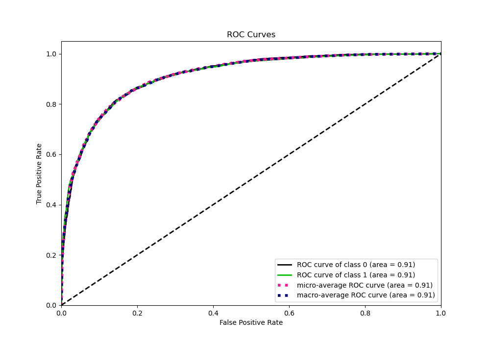
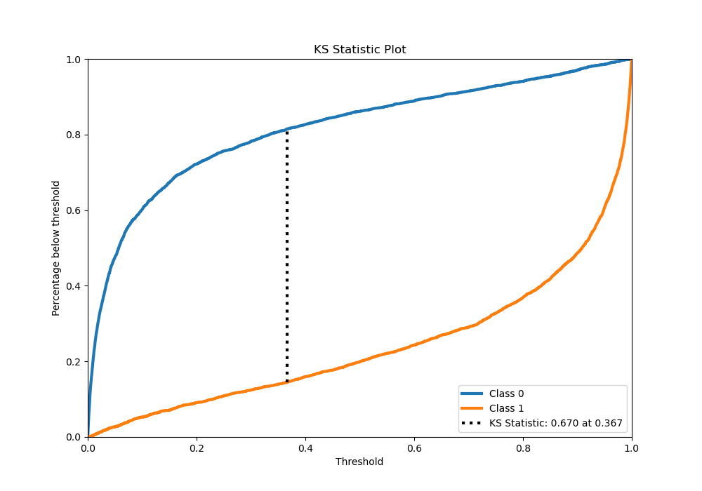
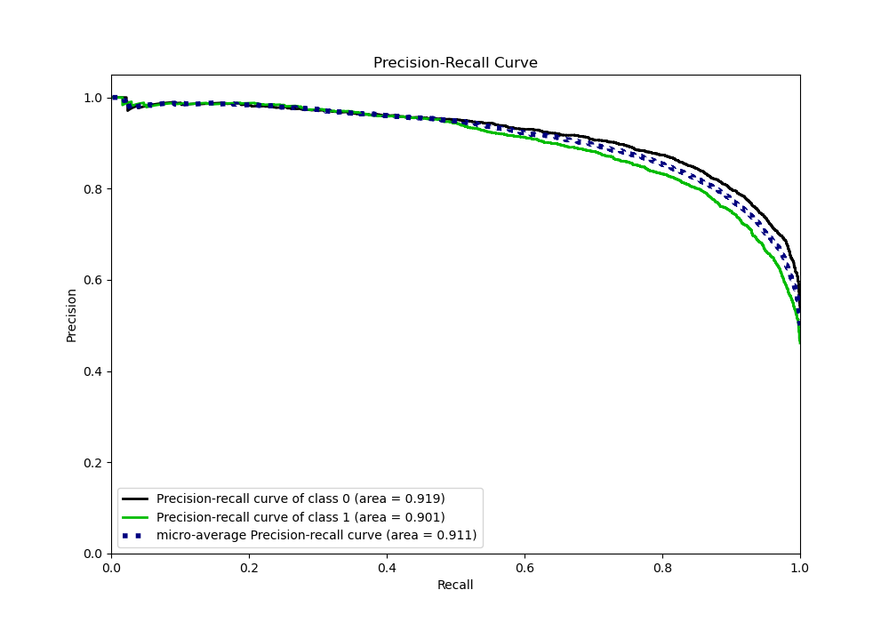
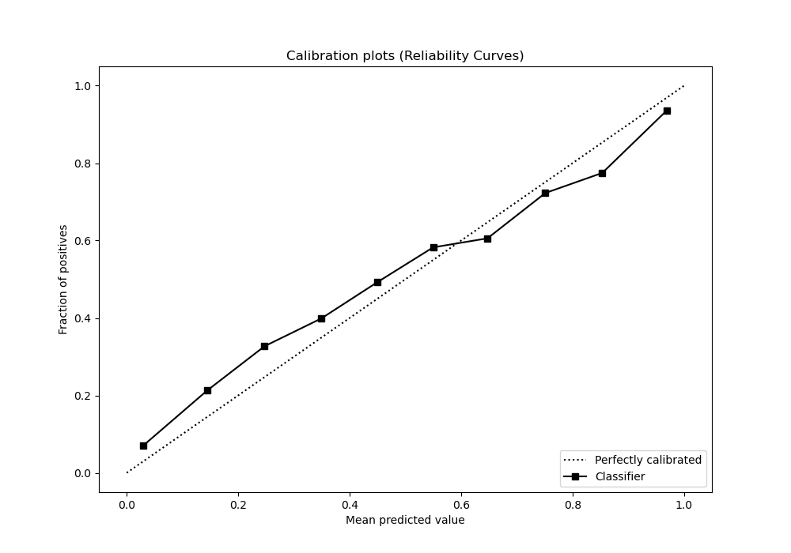
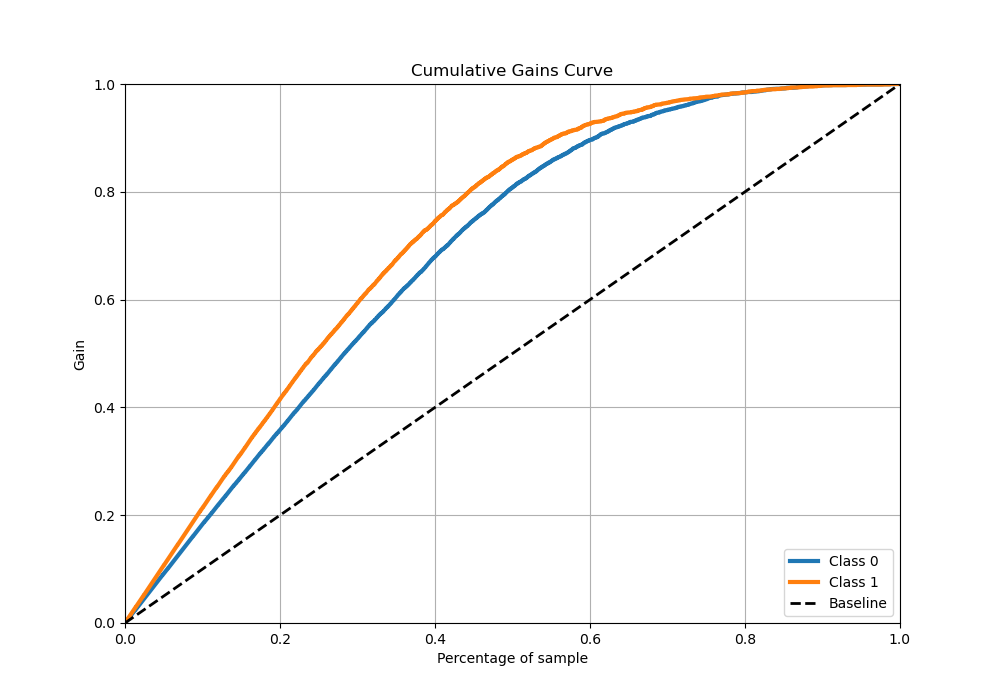
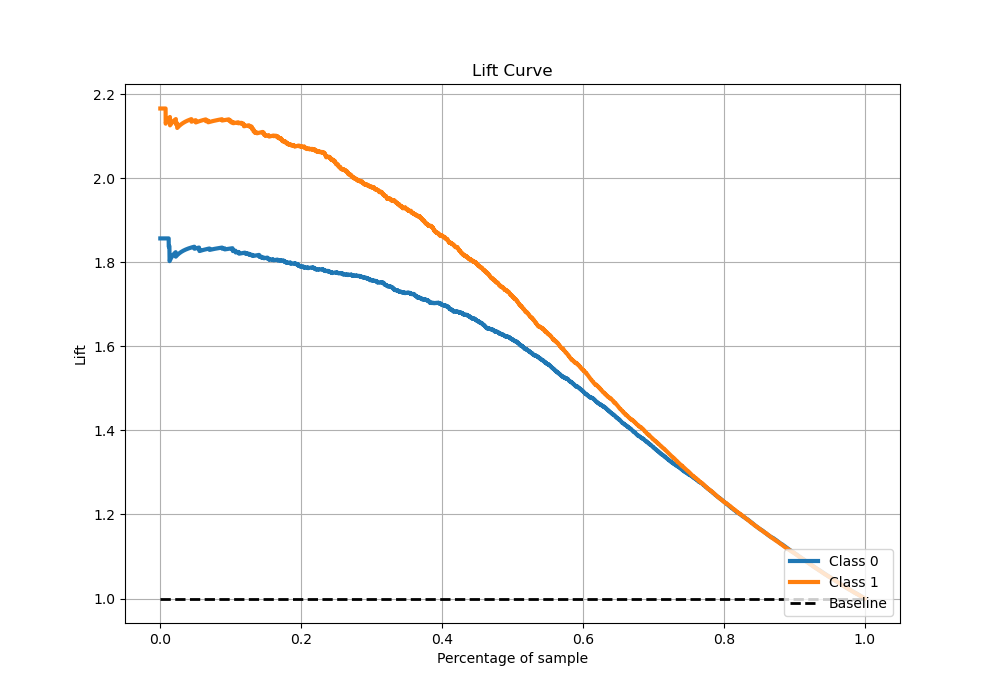

# Summary of Ensemble

[<< Go back](../README.md)

## Ensemble structure
| Model                       |   Weight |
|:----------------------------|---------:|
| 10_Xgboost_SelectedFeatures |        1 |
| 11_Xgboost_SelectedFeatures |        1 |
| 3_Xgboost_SelectedFeatures  |        3 |
| 6_Xgboost_SelectedFeatures  |        6 |
| 7_Xgboost_SelectedFeatures  |        1 |

## Metric details
|           |    score |     threshold |
|:----------|---------:|--------------:|
| logloss   | 0.392286 | nan           |
| auc       | 0.911427 | nan           |
| f1        | 0.825388 |   0.368852    |
| accuracy  | 0.834924 |   0.449852    |
| precision | 0.988042 |   0.989164    |
| recall    | 1        |   4.24534e-05 |
| mcc       | 0.667997 |   0.449852    |

## Metric details with threshold from accuracy metric
|           |    score |   threshold |
|:----------|---------:|------------:|
| logloss   | 0.392286 |  nan        |
| auc       | 0.911427 |  nan        |
| f1        | 0.821578 |    0.449852 |
| accuracy  | 0.834924 |    0.449852 |
| precision | 0.81975  |    0.449852 |
| recall    | 0.823414 |    0.449852 |
| mcc       | 0.667997 |    0.449852 |

## Confusion matrix (at threshold=0.449852)
|              |   Predicted as 0 |   Predicted as 1 |
|:-------------|-----------------:|-----------------:|
| Labeled as 0 |             3527 |              648 |
| Labeled as 1 |              632 |             2947 |

## Learning curves

## Confusion Matrix

## Normalized Confusion Matrix

## ROC Curve

## Kolmogorov-Smirnov Statistic

## Precision-Recall Curve

## Calibration Curve

## Cumulative Gains Curve

## Lift Curve

[<< Go back](../README.md)
