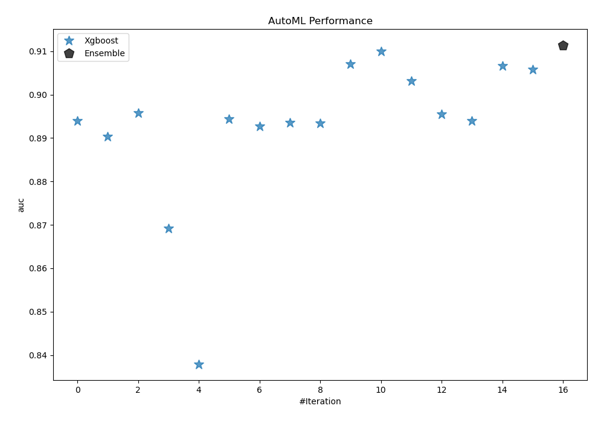
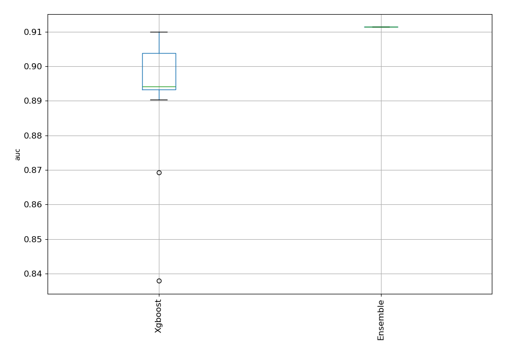
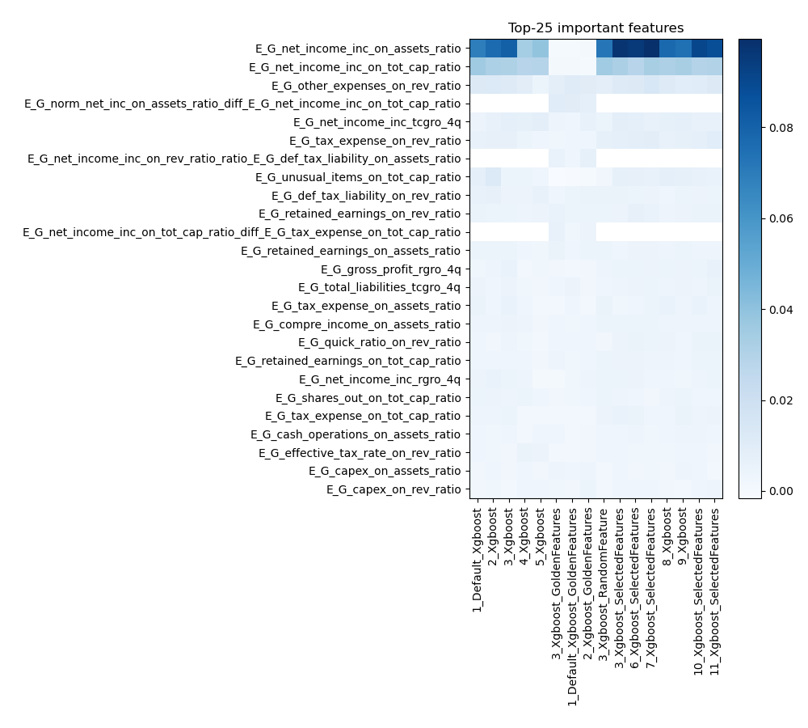
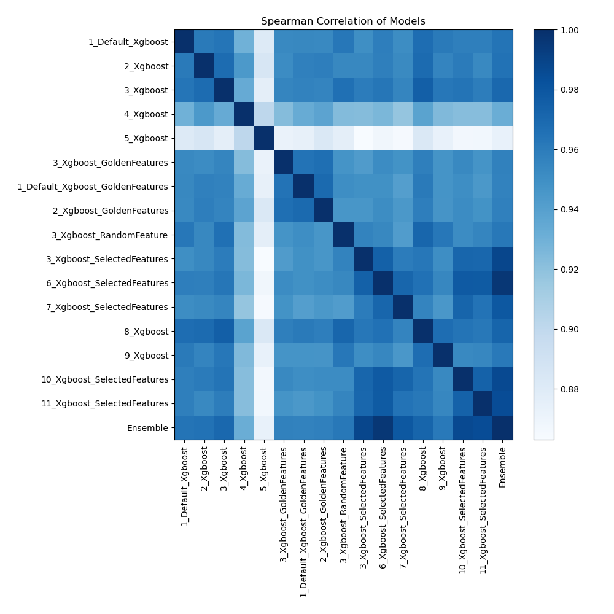

# AutoML Leaderboard

| Best model   | name                                                                           | model_type   | metric_type   |   metric_value |   train_time |   single_prediction_time |
|:-------------|:-------------------------------------------------------------------------------|:-------------|:--------------|---------------:|-------------:|-------------------------:|
|              | [1_Default_Xgboost](1_Default_Xgboost/README.md)                               | Xgboost      | auc           |       0.893993 |       108.01 |                   0.17   |
|              | [2_Xgboost](2_Xgboost/README.md)                                               | Xgboost      | auc           |       0.890385 |       107.03 |                   0.173  |
|              | [3_Xgboost](3_Xgboost/README.md)                                               | Xgboost      | auc           |       0.895803 |       104.02 |                   0.0924 |
|              | [4_Xgboost](4_Xgboost/README.md)                                               | Xgboost      | auc           |       0.869221 |        94.23 |                   0.0972 |
|              | [5_Xgboost](5_Xgboost/README.md)                                               | Xgboost      | auc           |       0.837908 |        69.67 |                   0.0973 |
|              | [3_Xgboost_GoldenFeatures](3_Xgboost_GoldenFeatures/README.md)                 | Xgboost      | auc           |       0.894396 |       302.83 |                   0.1744 |
|              | [1_Default_Xgboost_GoldenFeatures](1_Default_Xgboost_GoldenFeatures/README.md) | Xgboost      | auc           |       0.892669 |       117.2  |                   0.1728 |
|              | [2_Xgboost_GoldenFeatures](2_Xgboost_GoldenFeatures/README.md)                 | Xgboost      | auc           |       0.893535 |       117.56 |                   0.1692 |
|              | [3_Xgboost_RandomFeature](3_Xgboost_RandomFeature/README.md)                   | Xgboost      | auc           |       0.893394 |       109.88 |                   0.1039 |
|              | [3_Xgboost_SelectedFeatures](3_Xgboost_SelectedFeatures/README.md)             | Xgboost      | auc           |       0.907104 |        49.35 |                   0.0495 |
|              | [6_Xgboost_SelectedFeatures](6_Xgboost_SelectedFeatures/README.md)             | Xgboost      | auc           |       0.909979 |        61.01 |                   0.0481 |
|              | [7_Xgboost_SelectedFeatures](7_Xgboost_SelectedFeatures/README.md)             | Xgboost      | auc           |       0.903125 |        45.54 |                   0.0472 |
|              | [8_Xgboost](8_Xgboost/README.md)                                               | Xgboost      | auc           |       0.895472 |       142.87 |                   0.1015 |
|              | [9_Xgboost](9_Xgboost/README.md)                                               | Xgboost      | auc           |       0.893925 |        79.71 |                   0.0961 |
|              | [10_Xgboost_SelectedFeatures](10_Xgboost_SelectedFeatures/README.md)           | Xgboost      | auc           |       0.906634 |        54.63 |                   0.0476 |
|              | [11_Xgboost_SelectedFeatures](11_Xgboost_SelectedFeatures/README.md)           | Xgboost      | auc           |       0.905852 |        50.52 |                   0.0489 |
| **the best** | [Ensemble](Ensemble/README.md)                                                 | Ensemble     | auc           |       0.911427 |         1.55 |                   0.235  |

### AutoML Performance

### AutoML Performance Boxplot

### Features Importance

### Spearman Correlation of Models

