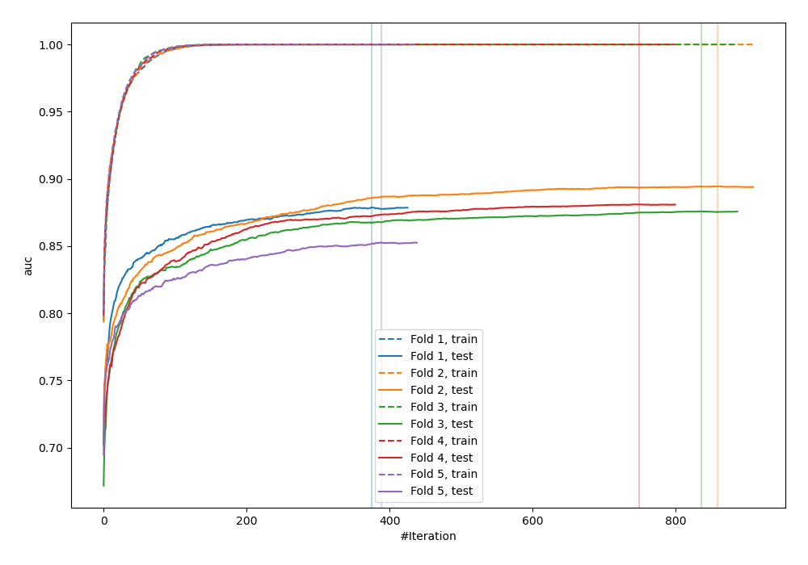
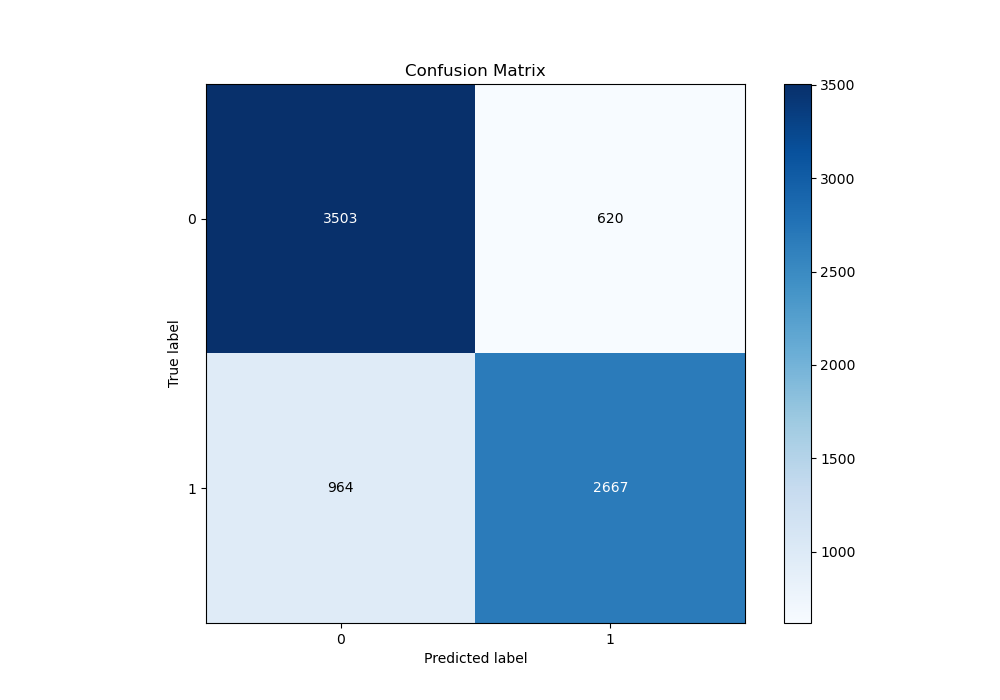
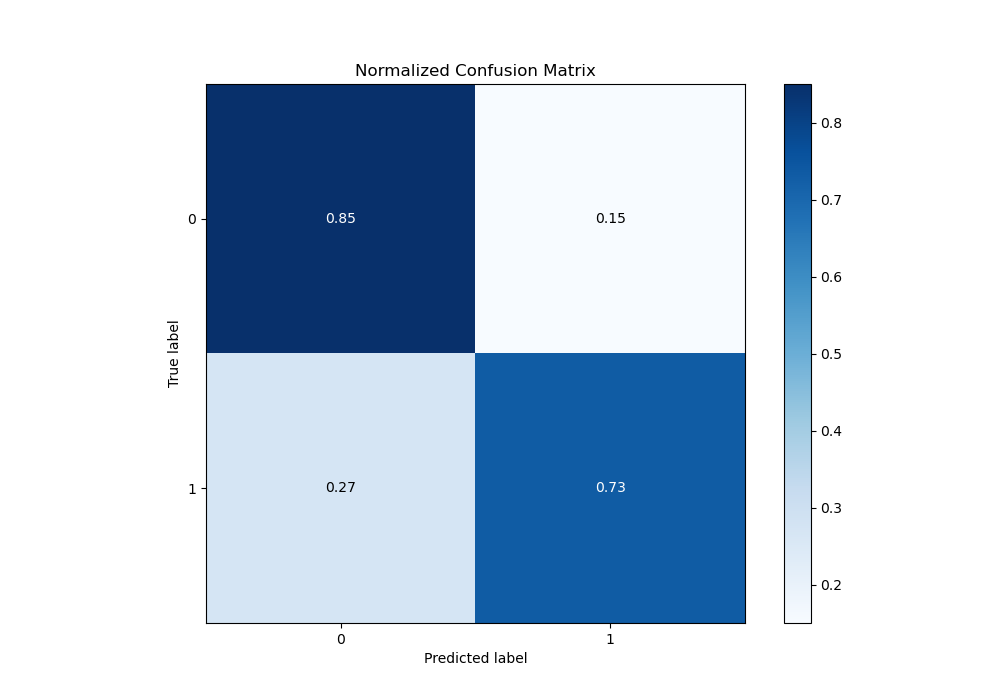
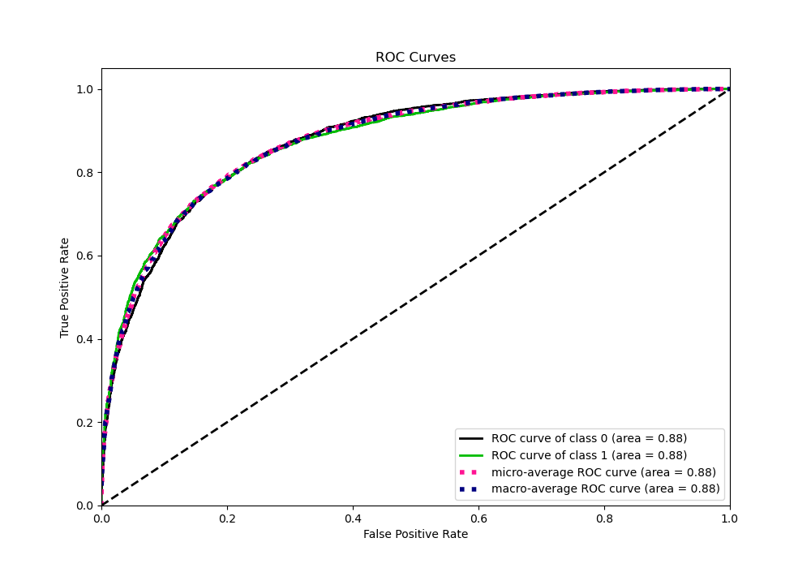
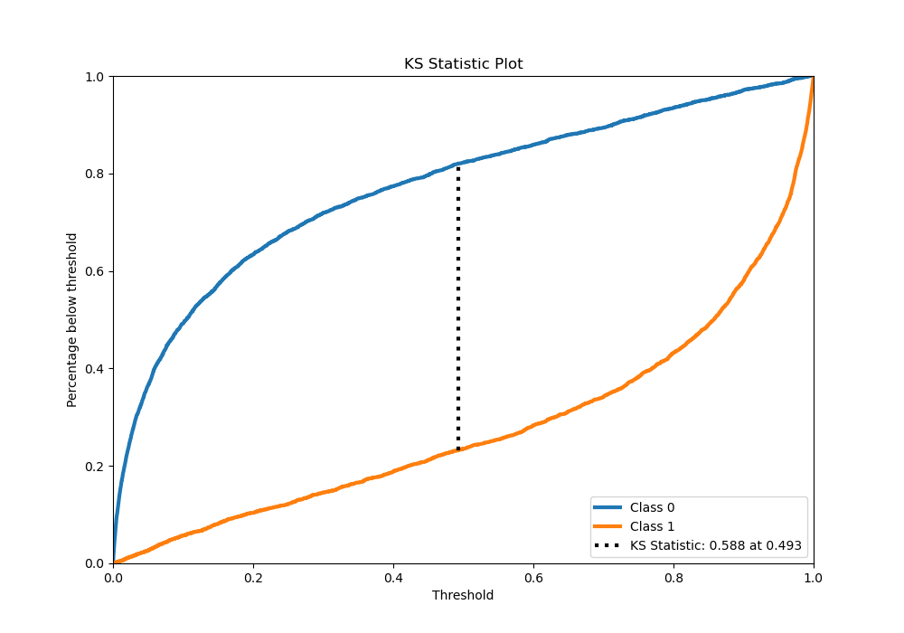
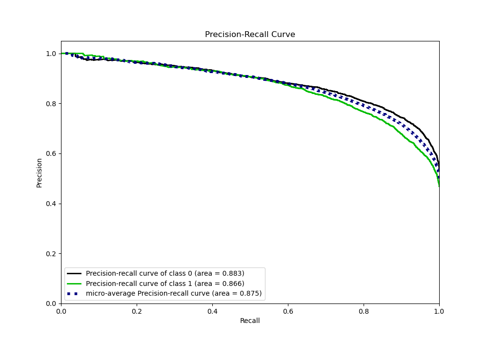
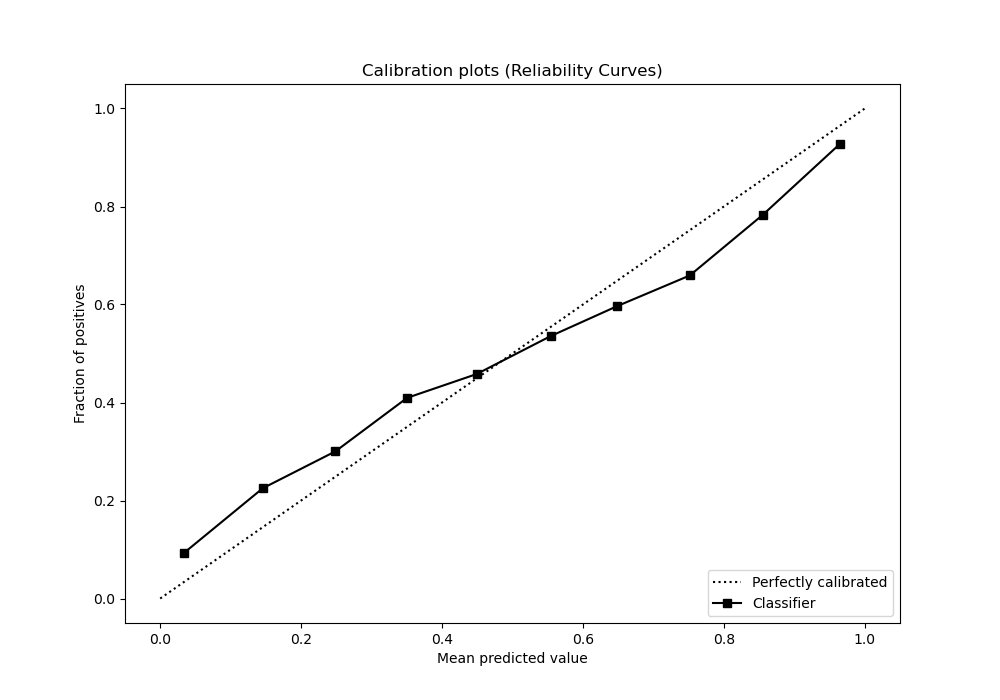
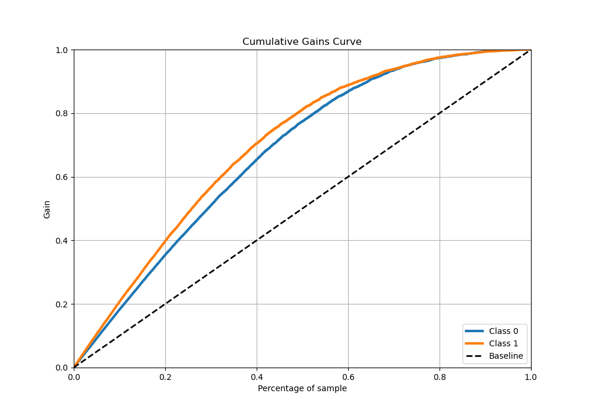
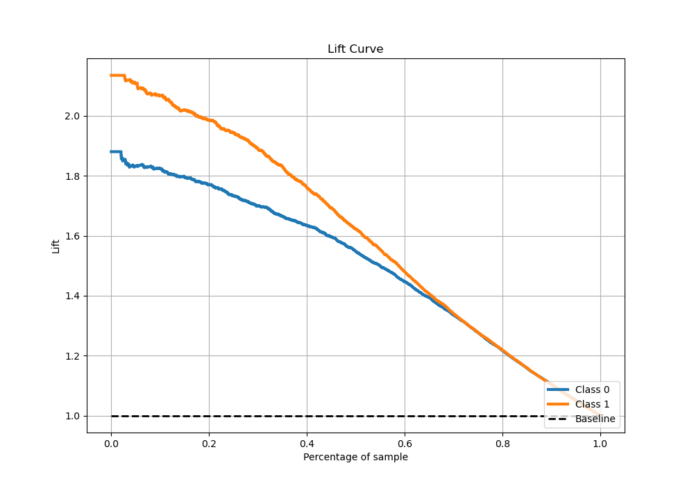

# Summary of 1_Default_Xgboost_GoldenFeatures

[<< Go back](../README.md)

## Extreme Gradient Boosting (Xgboost)
- **n_jobs**: -1
- **objective**: binary:logistic
- **eta**: 0.075
- **max_depth**: 6
- **min_child_weight**: 1
- **subsample**: 1.0
- **colsample_bytree**: 1.0
- **eval_metric**: auc
- **explain_level**: 1

## Validation
 - **validation_type**: kfold
 - **k_folds**: 5
 - **shuffle**: True
 - **stratify**: True

## Optimized metric
auc

## Training time

110.3 seconds

## Metric details
|           |    score |     threshold |
|:----------|---------:|--------------:|
| logloss   | 0.461654 | nan           |
| auc       | 0.875741 | nan           |
| f1        | 0.787554 |   0.315127    |
| accuracy  | 0.795718 |   0.574584    |
| precision | 1        |   0.995189    |
| recall    | 1        |   1.19173e-05 |
| mcc       | 0.589825 |   0.574584    |

## Metric details with threshold from accuracy metric
|           |    score |   threshold |
|:----------|---------:|------------:|
| logloss   | 0.461654 |  nan        |
| auc       | 0.875741 |  nan        |
| f1        | 0.771032 |    0.574584 |
| accuracy  | 0.795718 |    0.574584 |
| precision | 0.811378 |    0.574584 |
| recall    | 0.734508 |    0.574584 |
| mcc       | 0.589825 |    0.574584 |

## Confusion matrix (at threshold=0.574584)
|              |   Predicted as 0 |   Predicted as 1 |
|:-------------|-----------------:|-----------------:|
| Labeled as 0 |             3503 |              620 |
| Labeled as 1 |              964 |             2667 |

## Learning curves

## Permutation-based Importance

## Confusion Matrix

## Normalized Confusion Matrix

## ROC Curve

## Kolmogorov-Smirnov Statistic

## Precision-Recall Curve

## Calibration Curve

## Cumulative Gains Curve

## Lift Curve

[<< Go back](../README.md)
