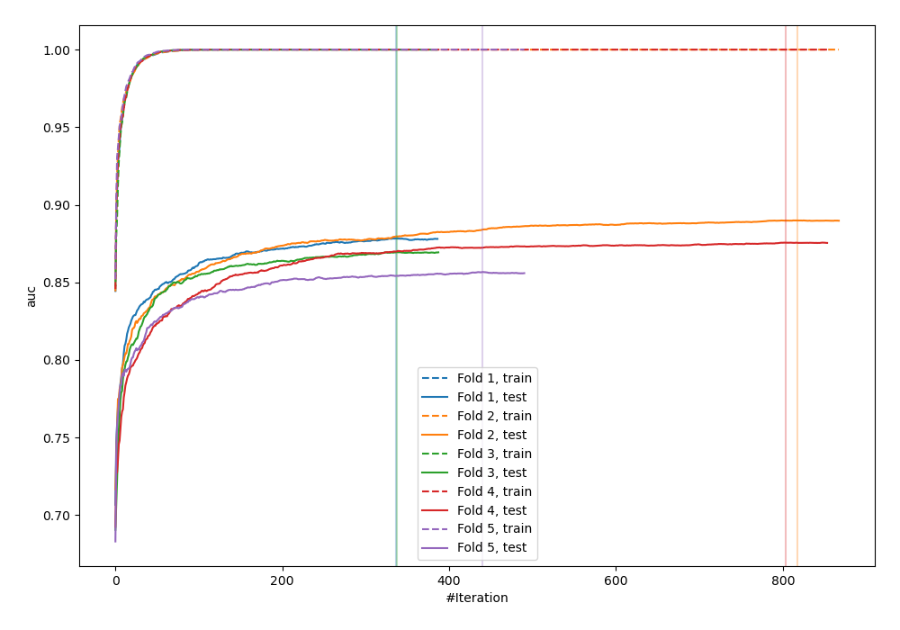
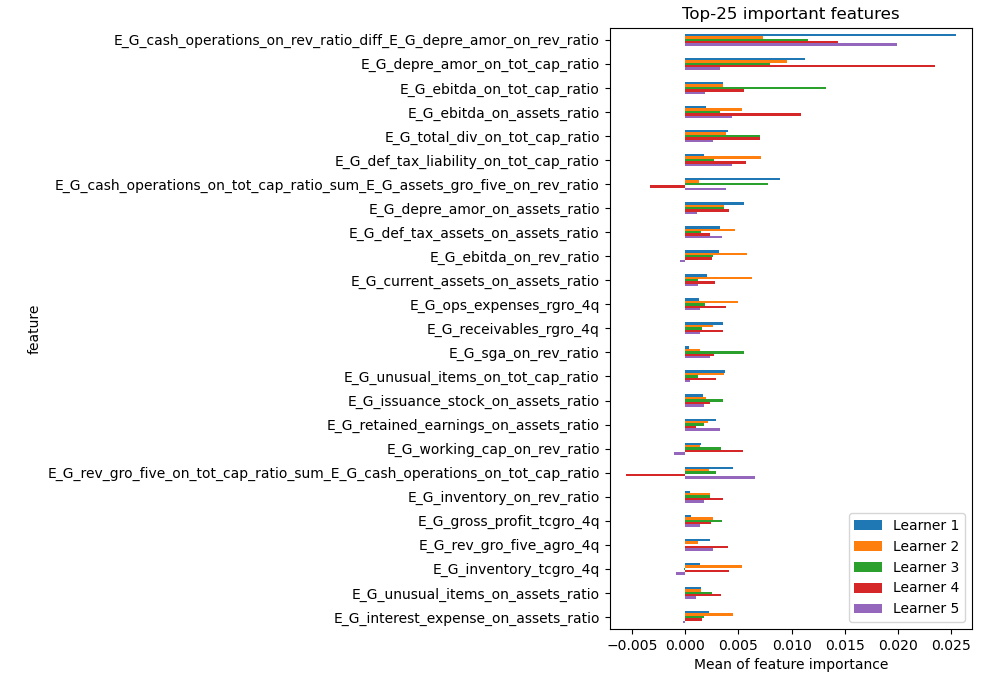
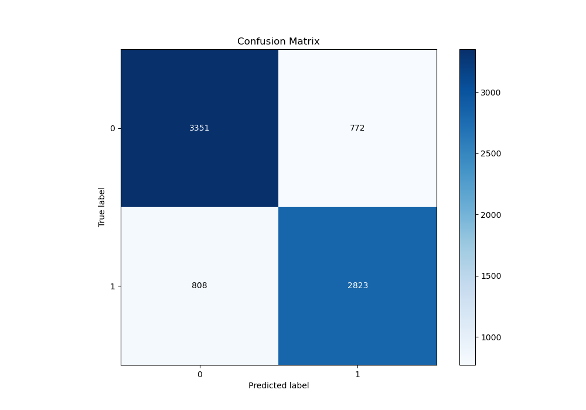
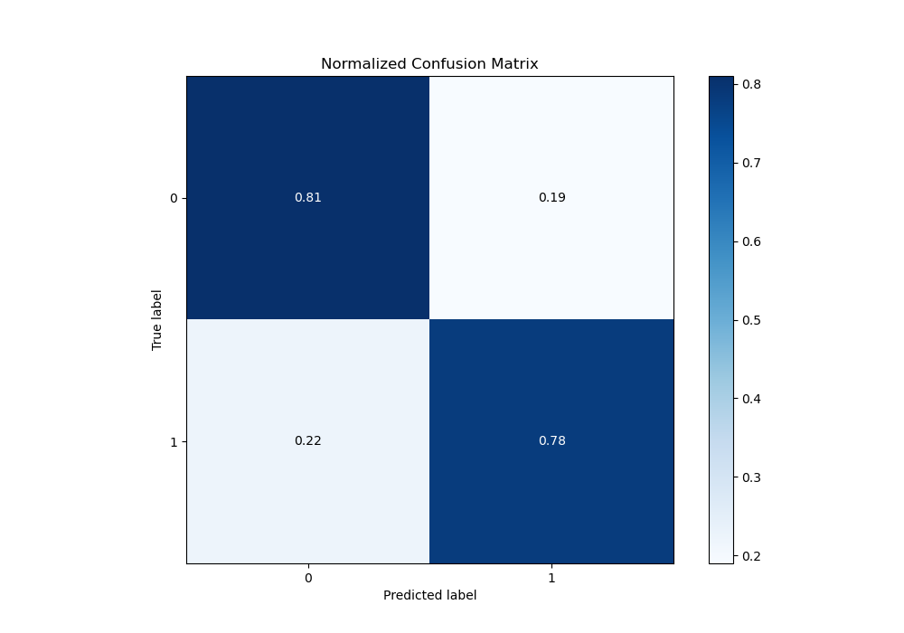
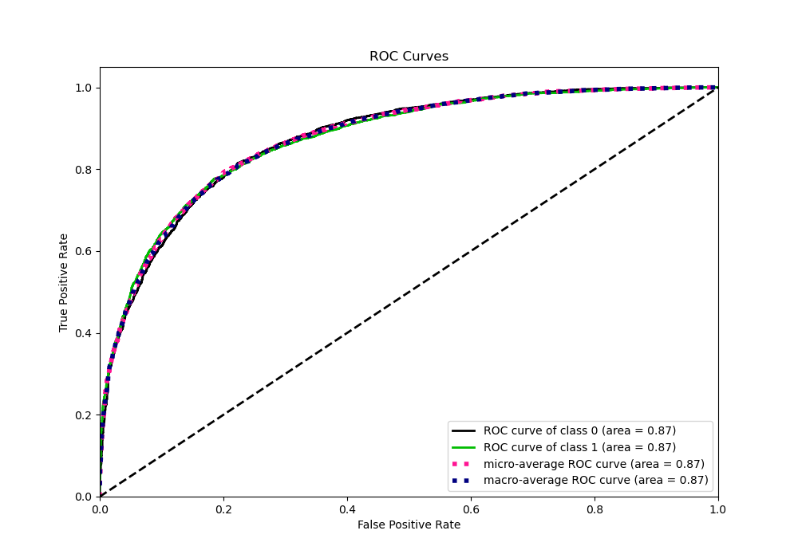
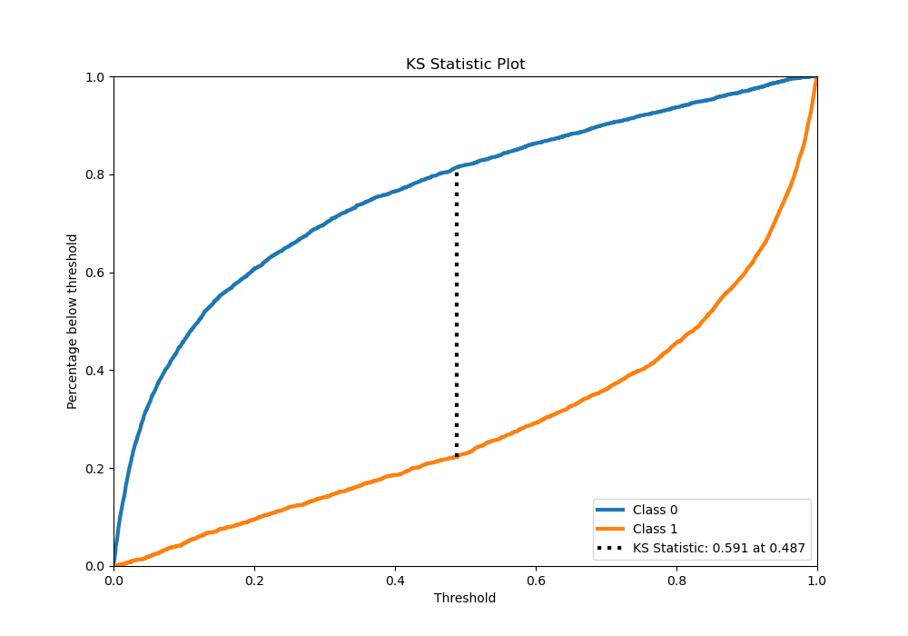
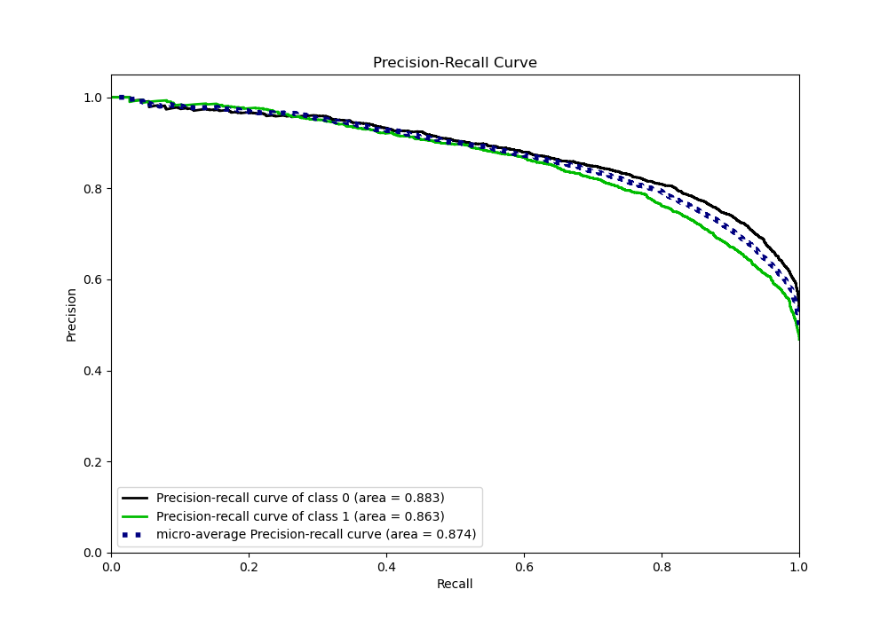
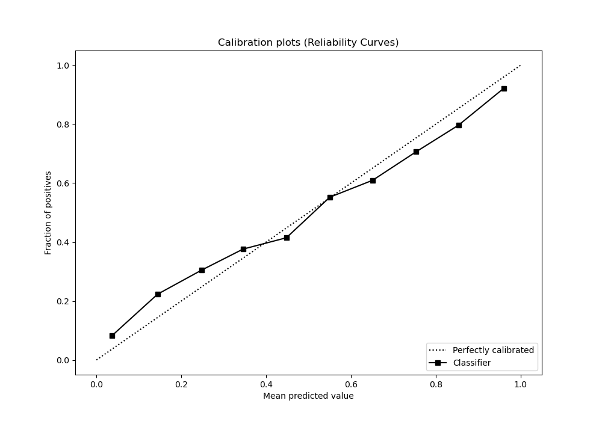
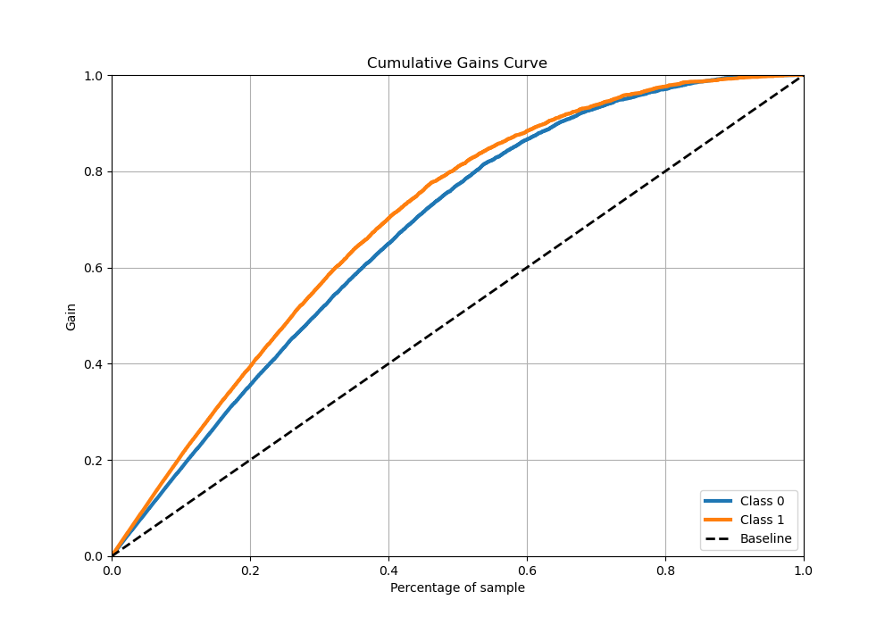
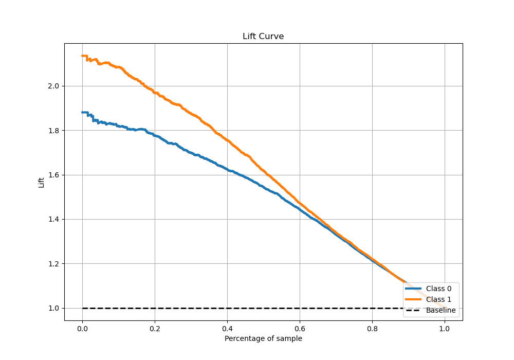

# Summary of 2_Xgboost_GoldenFeatures

[<< Go back](../README.md)

## Extreme Gradient Boosting (Xgboost)
- **n_jobs**: -1
- **objective**: binary:logistic
- **eta**: 0.075
- **max_depth**: 8
- **min_child_weight**: 5
- **subsample**: 1.0
- **colsample_bytree**: 1.0
- **eval_metric**: auc
- **explain_level**: 1

## Validation
 - **validation_type**: kfold
 - **k_folds**: 5
 - **shuffle**: True
 - **stratify**: True

## Optimized metric
auc

## Training time

116.3 seconds

## Metric details
|           |    score |     threshold |
|:----------|---------:|--------------:|
| logloss   | 0.456755 | nan           |
| auc       | 0.873541 | nan           |
| f1        | 0.783516 |   0.345432    |
| accuracy  | 0.796234 |   0.48563     |
| precision | 0.992958 |   0.990357    |
| recall    | 1        |   2.17005e-05 |
| mcc       | 0.590605 |   0.48563     |

## Metric details with threshold from accuracy metric
|           |    score |   threshold |
|:----------|---------:|------------:|
| logloss   | 0.456755 |   nan       |
| auc       | 0.873541 |   nan       |
| f1        | 0.781345 |     0.48563 |
| accuracy  | 0.796234 |     0.48563 |
| precision | 0.785257 |     0.48563 |
| recall    | 0.777472 |     0.48563 |
| mcc       | 0.590605 |     0.48563 |

## Confusion matrix (at threshold=0.48563)
|              |   Predicted as 0 |   Predicted as 1 |
|:-------------|-----------------:|-----------------:|
| Labeled as 0 |             3351 |              772 |
| Labeled as 1 |              808 |             2823 |

## Learning curves

## Permutation-based Importance

## Confusion Matrix

## Normalized Confusion Matrix

## ROC Curve

## Kolmogorov-Smirnov Statistic

## Precision-Recall Curve

## Calibration Curve

## Cumulative Gains Curve

## Lift Curve

[<< Go back](../README.md)
