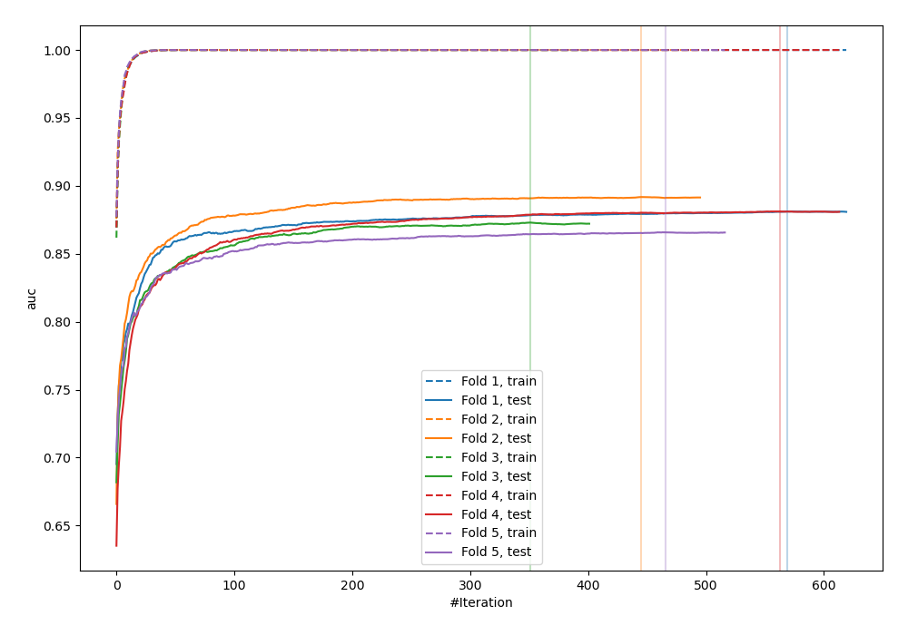
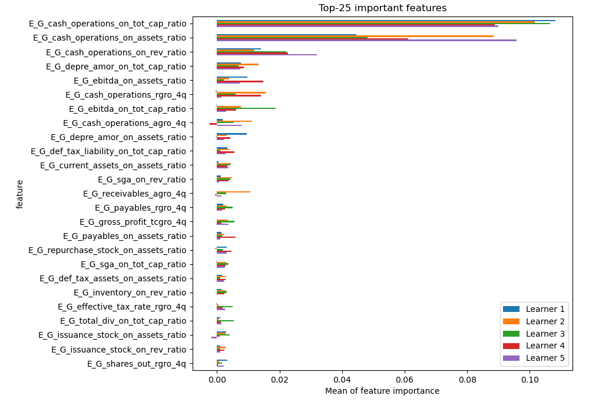
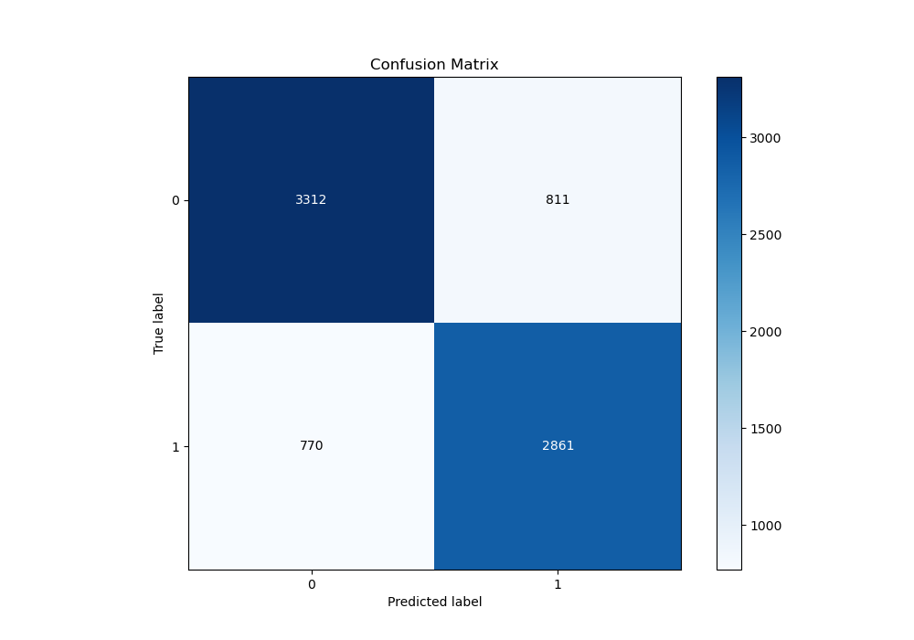
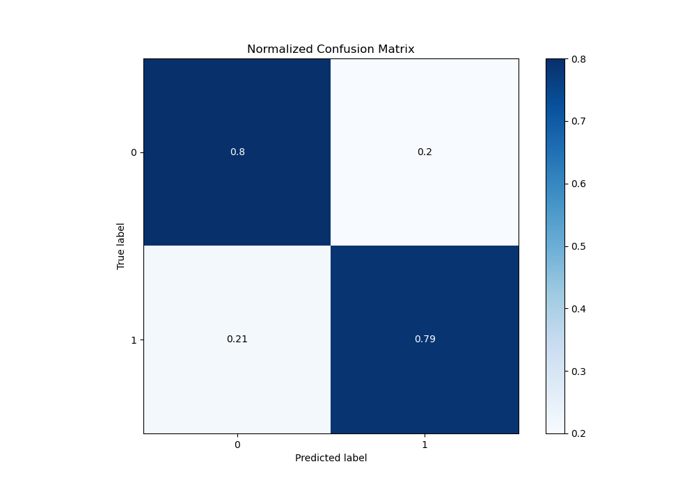
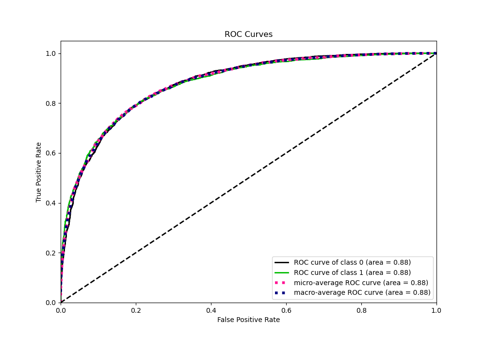
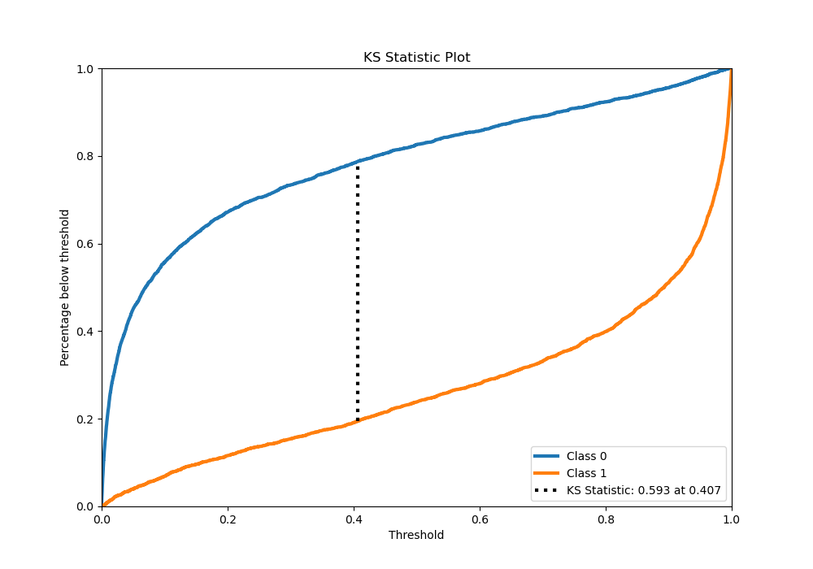
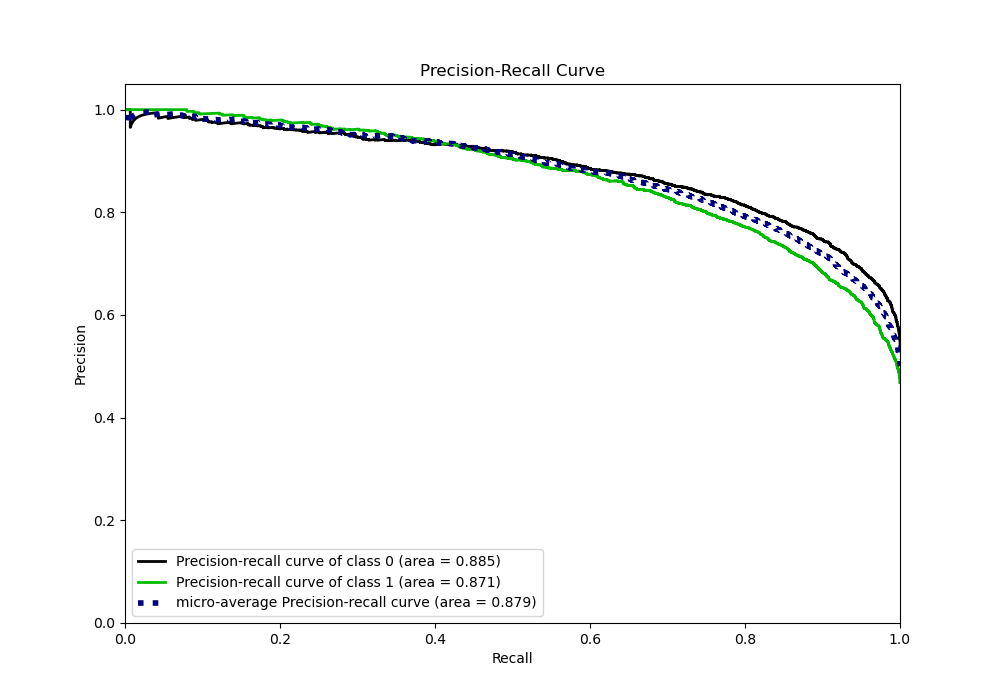
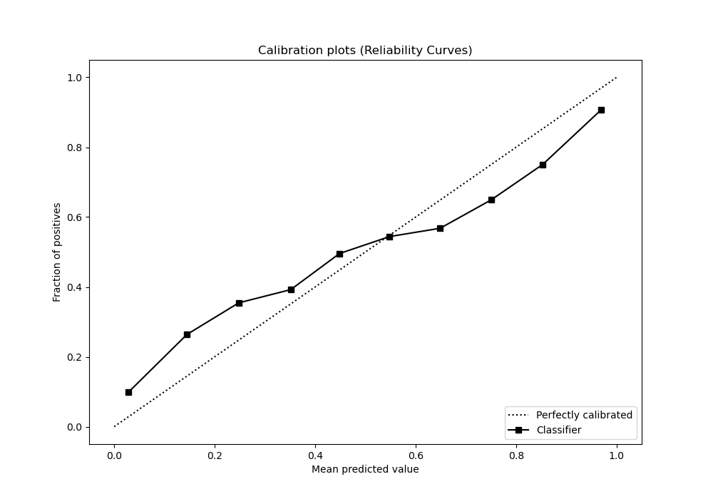
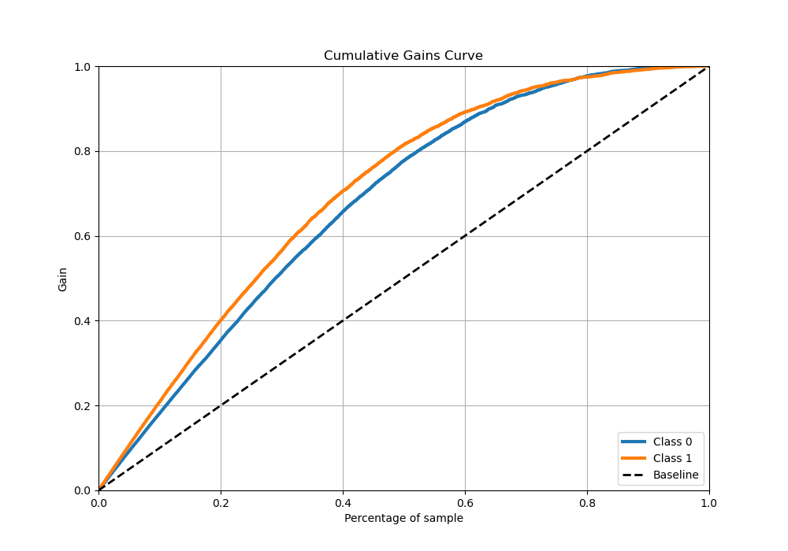
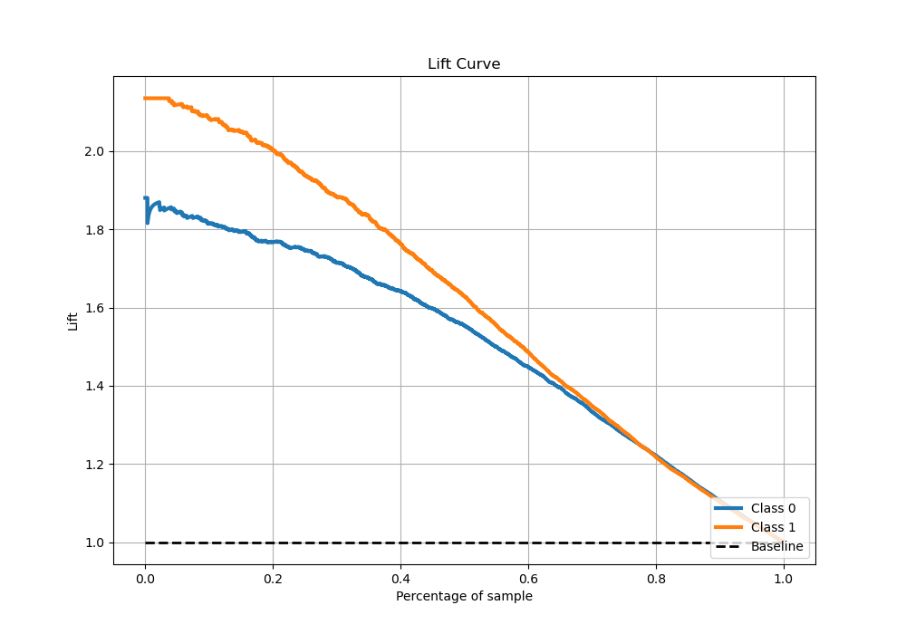

# Summary of 3_Xgboost

[<< Go back](../README.md)

## Extreme Gradient Boosting (Xgboost)
- **n_jobs**: -1
- **objective**: binary:logistic
- **eta**: 0.1
- **max_depth**: 8
- **min_child_weight**: 1
- **subsample**: 1.0
- **colsample_bytree**: 1.0
- **eval_metric**: auc
- **explain_level**: 1

## Validation
 - **validation_type**: kfold
 - **k_folds**: 5
 - **shuffle**: True
 - **stratify**: True

## Optimized metric
auc

## Training time

109.1 seconds

## Metric details
|           |    score |    threshold |
|:----------|---------:|-------------:|
| logloss   | 0.478067 | nan          |
| auc       | 0.87842  | nan          |
| f1        | 0.788691 |   0.380044   |
| accuracy  | 0.796105 |   0.443856   |
| precision | 1        |   0.996208   |
| recall    | 1        |   1.3312e-05 |
| mcc       | 0.59107  |   0.400736   |

## Metric details with threshold from accuracy metric
|           |    score |   threshold |
|:----------|---------:|------------:|
| logloss   | 0.478067 |  nan        |
| auc       | 0.87842  |  nan        |
| f1        | 0.783514 |    0.443856 |
| accuracy  | 0.796105 |    0.443856 |
| precision | 0.779139 |    0.443856 |
| recall    | 0.787937 |    0.443856 |
| mcc       | 0.590871 |    0.443856 |

## Confusion matrix (at threshold=0.443856)
|              |   Predicted as 0 |   Predicted as 1 |
|:-------------|-----------------:|-----------------:|
| Labeled as 0 |             3312 |              811 |
| Labeled as 1 |              770 |             2861 |

## Learning curves

## Permutation-based Importance

## Confusion Matrix

## Normalized Confusion Matrix

## ROC Curve

## Kolmogorov-Smirnov Statistic

## Precision-Recall Curve

## Calibration Curve

## Cumulative Gains Curve

## Lift Curve

[<< Go back](../README.md)
