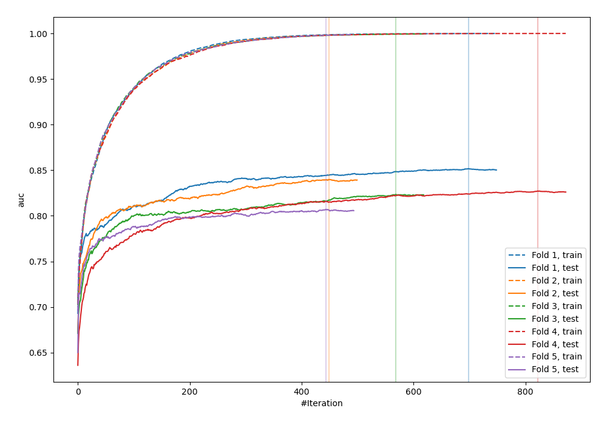
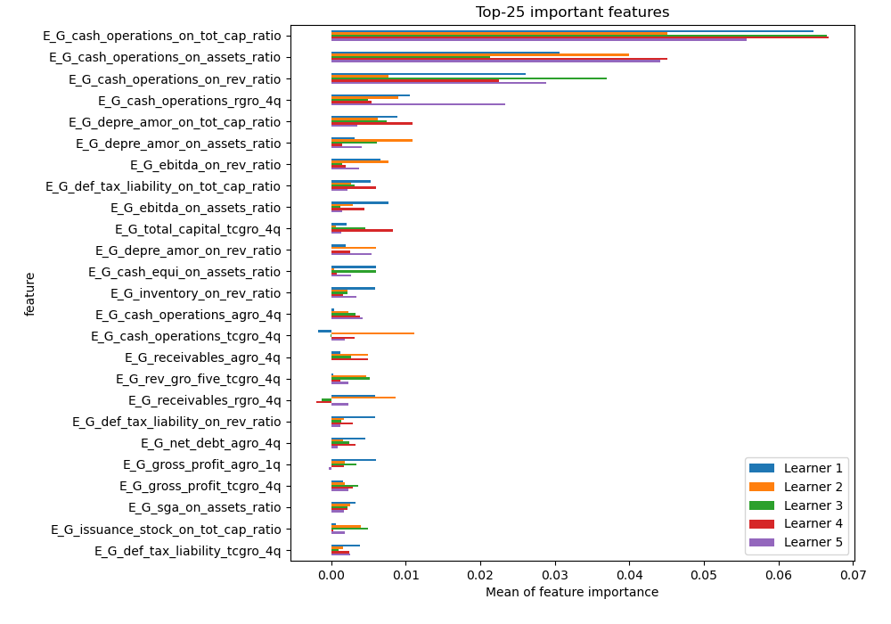
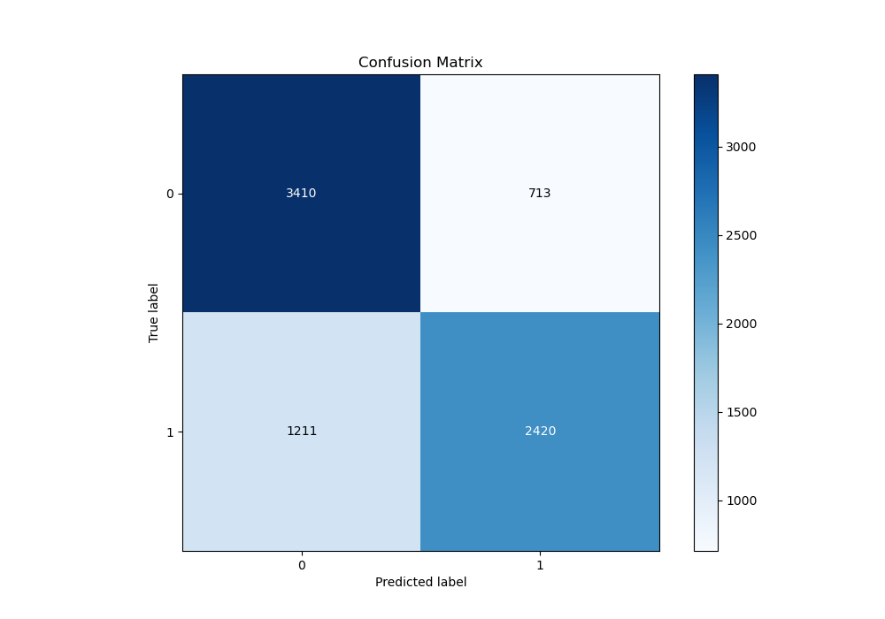
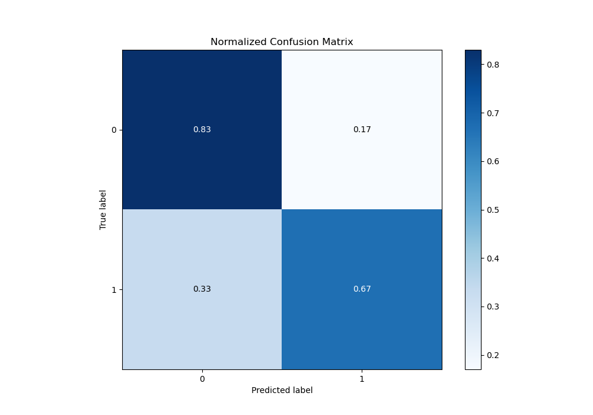
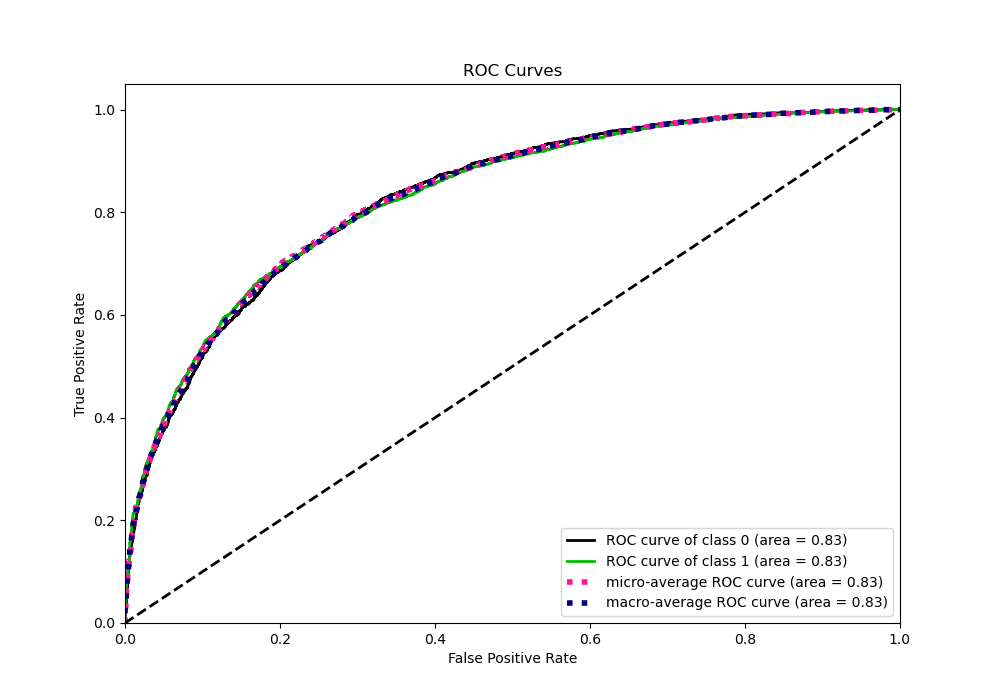
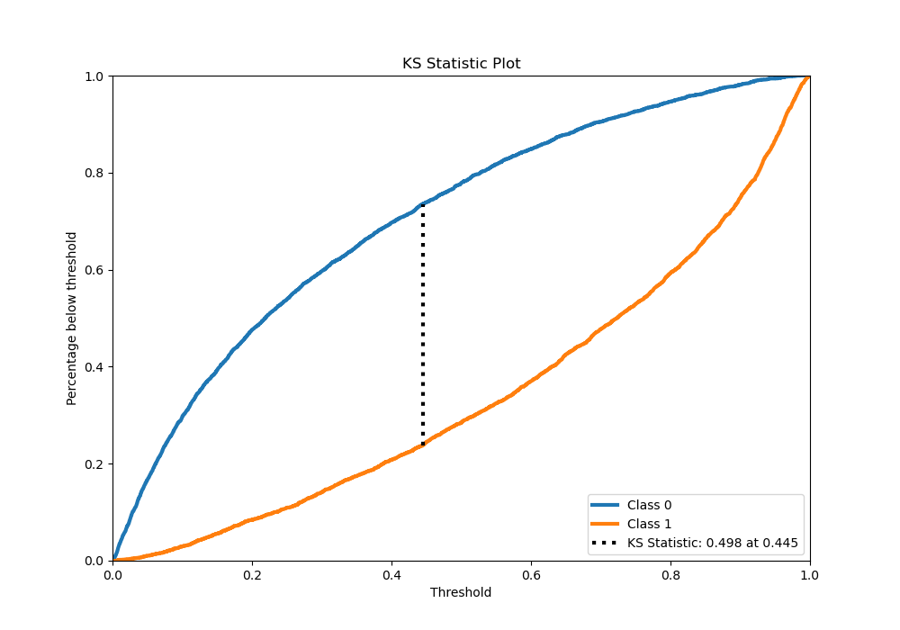
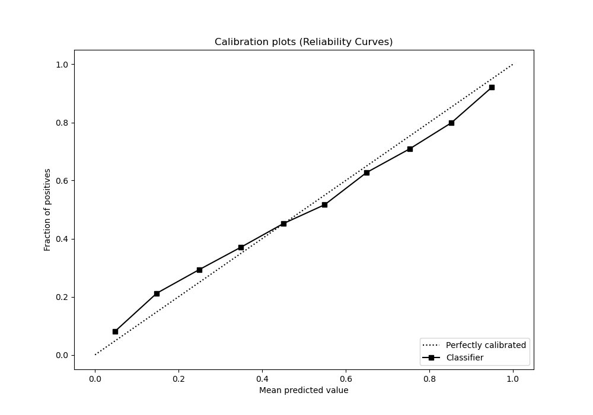
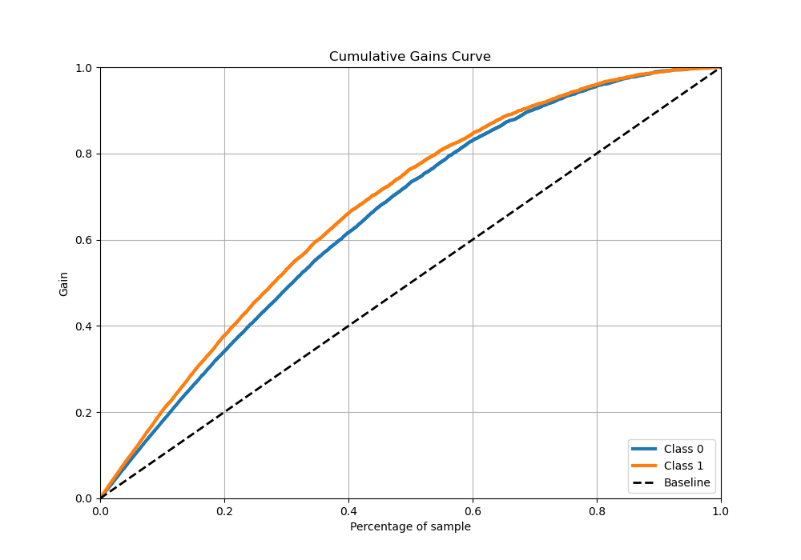
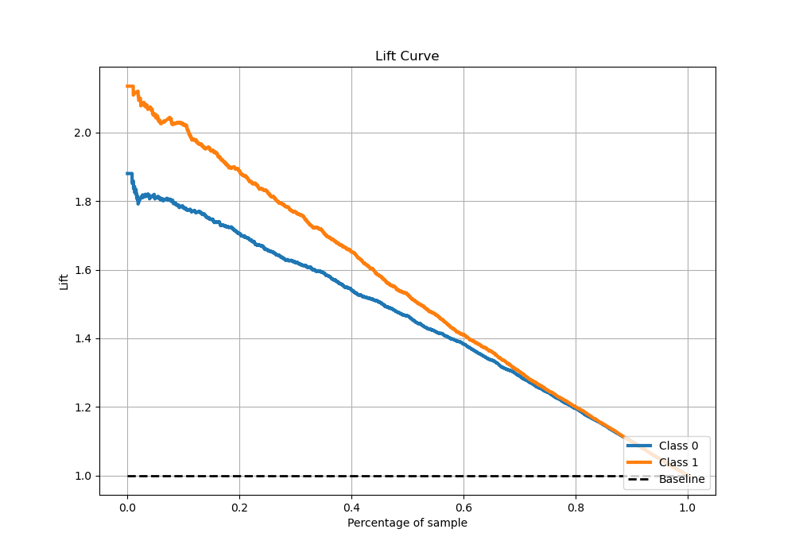

# Summary of 5_Xgboost

[<< Go back](../README.md)

## Extreme Gradient Boosting (Xgboost)
- **n_jobs**: -1
- **objective**: binary:logistic
- **eta**: 0.15
- **max_depth**: 8
- **min_child_weight**: 50
- **subsample**: 0.6
- **colsample_bytree**: 0.6
- **eval_metric**: auc
- **explain_level**: 1

## Validation
 - **validation_type**: kfold
 - **k_folds**: 5
 - **shuffle**: True
 - **stratify**: True

## Optimized metric
auc

## Training time

79.5 seconds

## Metric details
|           |    score |     threshold |
|:----------|---------:|--------------:|
| logloss   | 0.510987 | nan           |
| auc       | 0.829755 | nan           |
| f1        | 0.743781 |   0.374974    |
| accuracy  | 0.75187  |   0.563235    |
| precision | 0.992308 |   0.982134    |
| recall    | 1        |   0.000299438 |
| mcc       | 0.501884 |   0.563235    |

## Metric details with threshold from accuracy metric
|           |    score |   threshold |
|:----------|---------:|------------:|
| logloss   | 0.510987 |  nan        |
| auc       | 0.829755 |  nan        |
| f1        | 0.715553 |    0.563235 |
| accuracy  | 0.75187  |    0.563235 |
| precision | 0.772423 |    0.563235 |
| recall    | 0.666483 |    0.563235 |
| mcc       | 0.501884 |    0.563235 |

## Confusion matrix (at threshold=0.563235)
|              |   Predicted as 0 |   Predicted as 1 |
|:-------------|-----------------:|-----------------:|
| Labeled as 0 |             3410 |              713 |
| Labeled as 1 |             1211 |             2420 |

## Learning curves

## Permutation-based Importance

## Confusion Matrix

## Normalized Confusion Matrix

## ROC Curve

## Kolmogorov-Smirnov Statistic

## Precision-Recall Curve

## Calibration Curve

## Cumulative Gains Curve

## Lift Curve

[<< Go back](../README.md)
