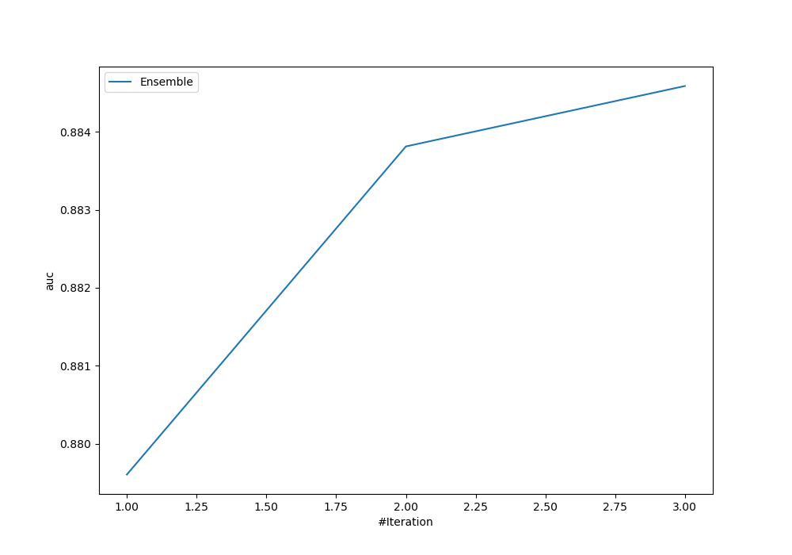
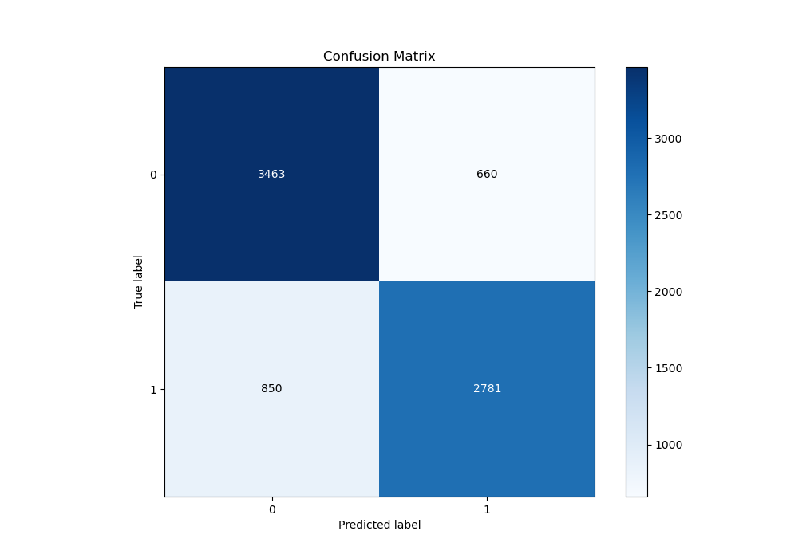
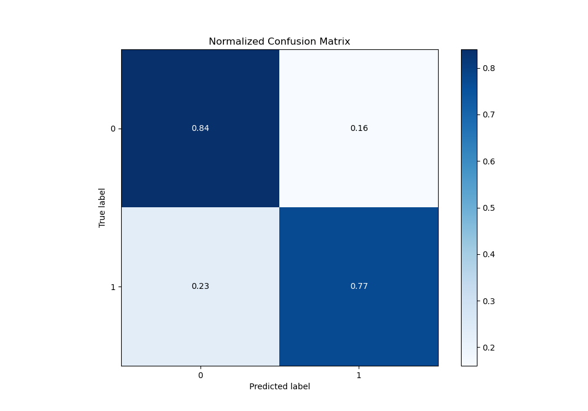
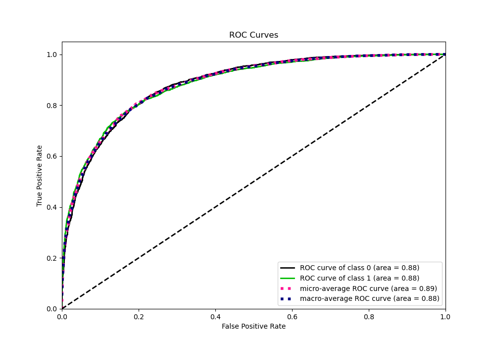
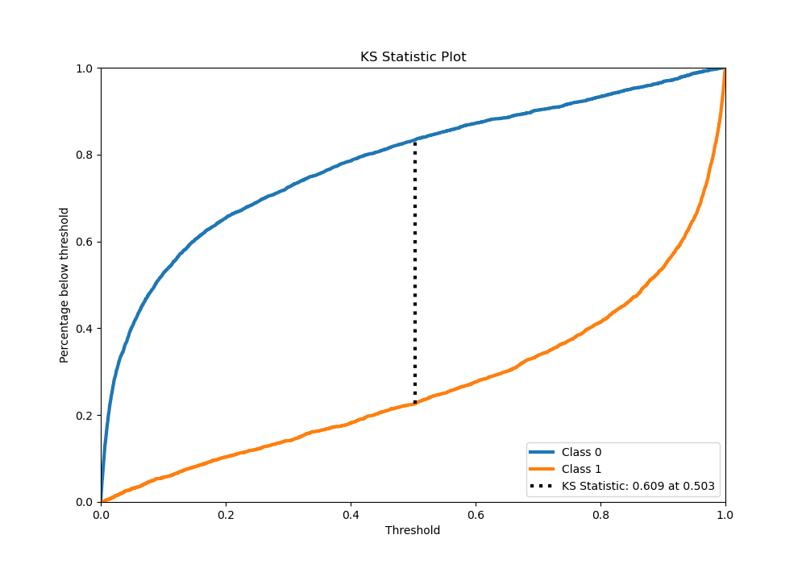
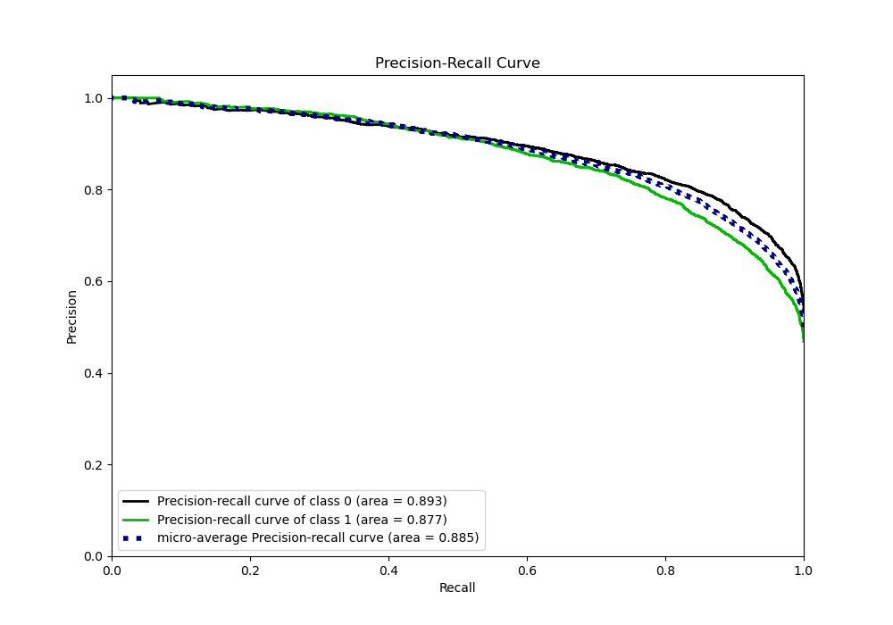
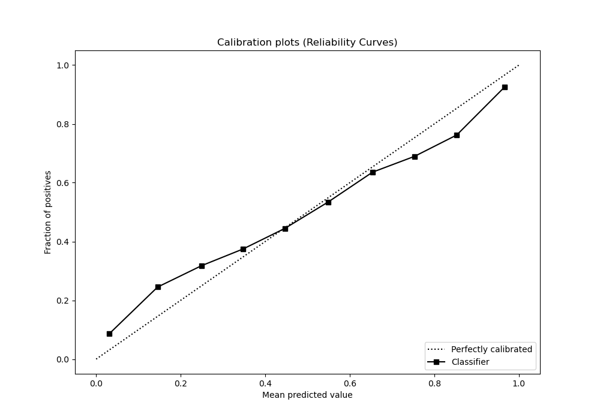
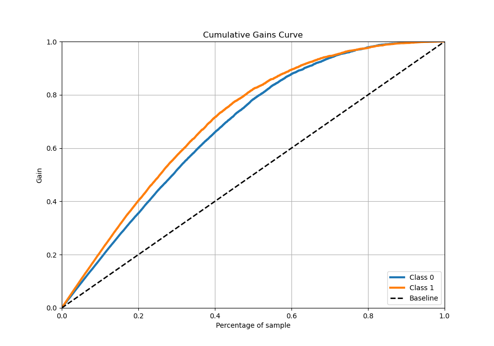
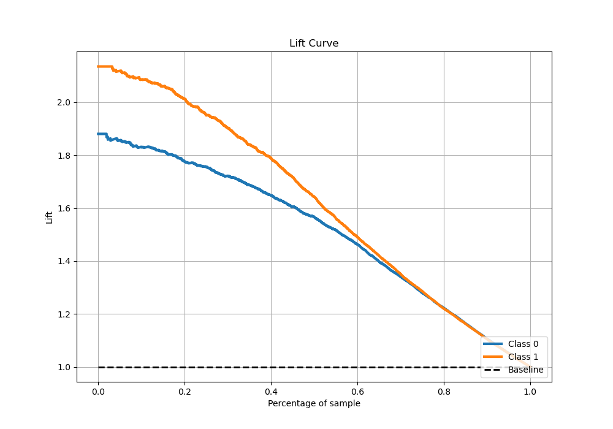

# Summary of Ensemble

[<< Go back](../README.md)

## Ensemble structure
| Model                    |   Weight |
|:-------------------------|---------:|
| 3_Xgboost                |        1 |
| 3_Xgboost_GoldenFeatures |        1 |
| 6_Xgboost_GoldenFeatures |        1 |

## Metric details
|           |    score |    threshold |
|:----------|---------:|-------------:|
| logloss   | 0.447405 | nan          |
| auc       | 0.884586 | nan          |
| f1        | 0.794797 |   0.386153   |
| accuracy  | 0.805262 |   0.51513    |
| precision | 1        |   0.996327   |
| recall    | 1        |   1.7893e-05 |
| mcc       | 0.608466 |   0.51513    |

## Metric details with threshold from accuracy metric
|           |    score |   threshold |
|:----------|---------:|------------:|
| logloss   | 0.447405 |   nan       |
| auc       | 0.884586 |   nan       |
| f1        | 0.786482 |     0.51513 |
| accuracy  | 0.805262 |     0.51513 |
| precision | 0.808195 |     0.51513 |
| recall    | 0.765905 |     0.51513 |
| mcc       | 0.608466 |     0.51513 |

## Confusion matrix (at threshold=0.51513)
|              |   Predicted as 0 |   Predicted as 1 |
|:-------------|-----------------:|-----------------:|
| Labeled as 0 |             3463 |              660 |
| Labeled as 1 |              850 |             2781 |

## Learning curves

## Confusion Matrix

## Normalized Confusion Matrix

## ROC Curve

## Kolmogorov-Smirnov Statistic

## Precision-Recall Curve

## Calibration Curve

## Cumulative Gains Curve

## Lift Curve

[<< Go back](../README.md)
