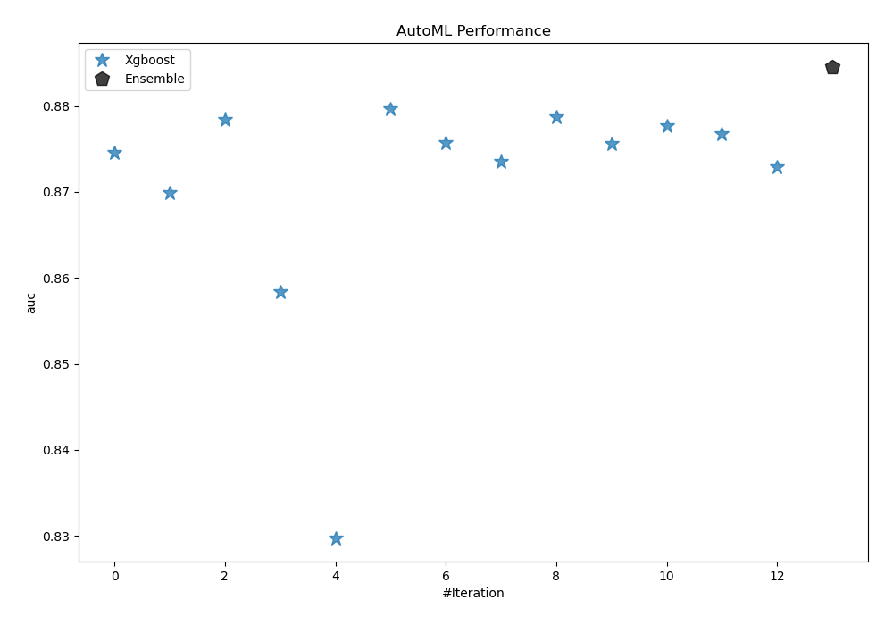
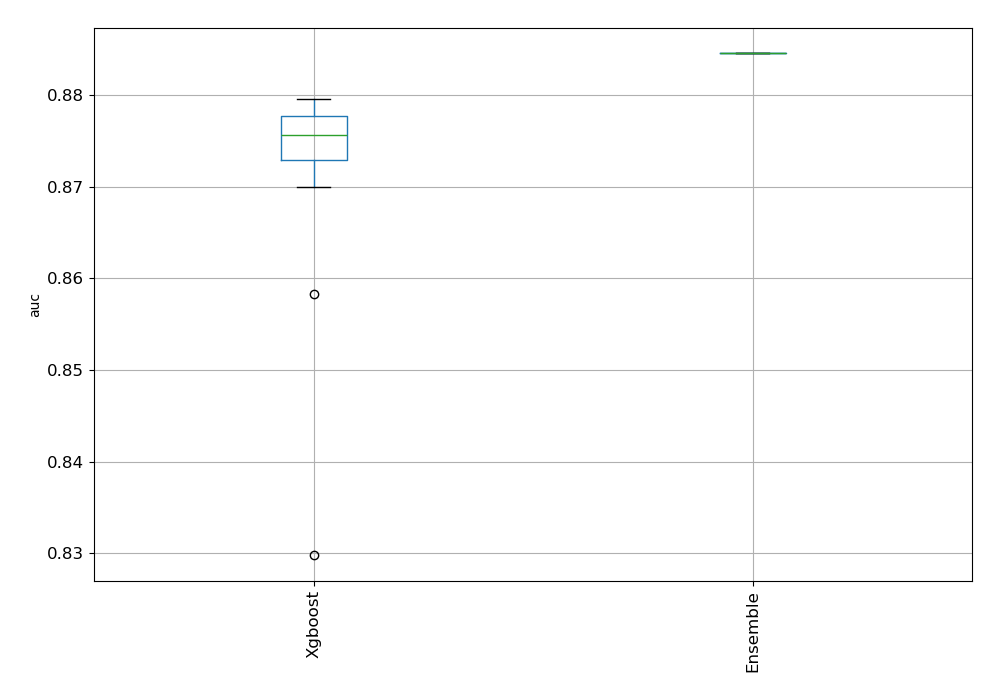
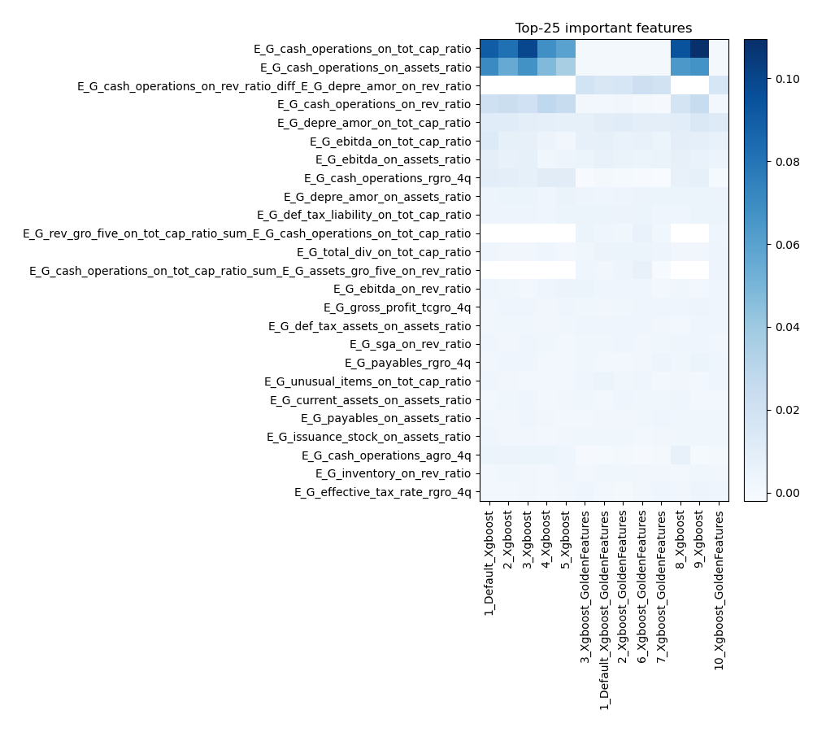
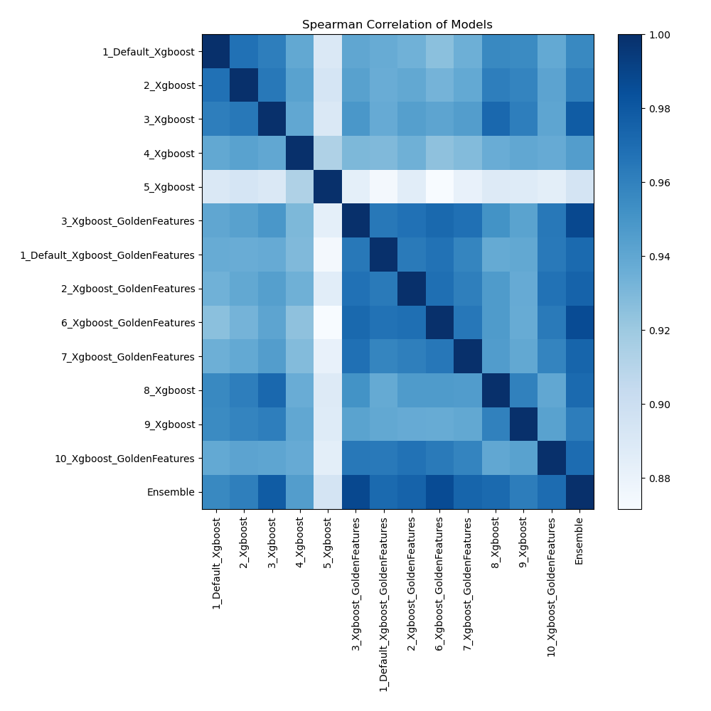

# AutoML Leaderboard

| Best model   | name                                                                           | model_type   | metric_type   |   metric_value |   train_time |   single_prediction_time |
|:-------------|:-------------------------------------------------------------------------------|:-------------|:--------------|---------------:|-------------:|-------------------------:|
|              | [1_Default_Xgboost](1_Default_Xgboost/README.md)                               | Xgboost      | auc           |       0.874554 |       121.11 |                   0.1531 |
|              | [2_Xgboost](2_Xgboost/README.md)                                               | Xgboost      | auc           |       0.869906 |        96.78 |                   0.1547 |
|              | [3_Xgboost](3_Xgboost/README.md)                                               | Xgboost      | auc           |       0.87842  |       109.63 |                   0.1786 |
|              | [4_Xgboost](4_Xgboost/README.md)                                               | Xgboost      | auc           |       0.858333 |        97.18 |                   0.1684 |
|              | [5_Xgboost](5_Xgboost/README.md)                                               | Xgboost      | auc           |       0.829755 |        80.02 |                   0.1761 |
| **the best** | [3_Xgboost_GoldenFeatures](3_Xgboost_GoldenFeatures/README.md)                 | Xgboost      | auc           |       0.879606 |       313.94 |                   0.1546 |
|              | [1_Default_Xgboost_GoldenFeatures](1_Default_Xgboost_GoldenFeatures/README.md) | Xgboost      | auc           |       0.875741 |       110.9  |                   0.1553 |
|              | [2_Xgboost_GoldenFeatures](2_Xgboost_GoldenFeatures/README.md)                 | Xgboost      | auc           |       0.873541 |       116.83 |                   0.1531 |
|              | [6_Xgboost_GoldenFeatures](6_Xgboost_GoldenFeatures/README.md)                 | Xgboost      | auc           |       0.8787   |       141.33 |                   0.1542 |
|              | [7_Xgboost_GoldenFeatures](7_Xgboost_GoldenFeatures/README.md)                 | Xgboost      | auc           |       0.875619 |       104.09 |                   0.1583 |
|              | [8_Xgboost](8_Xgboost/README.md)                                               | Xgboost      | auc           |       0.877694 |       117.46 |                   0.1031 |
|              | [9_Xgboost](9_Xgboost/README.md)                                               | Xgboost      | auc           |       0.876716 |       108.89 |                   0.0975 |
|              | [10_Xgboost_GoldenFeatures](10_Xgboost_GoldenFeatures/README.md)               | Xgboost      | auc           |       0.872932 |       115.97 |                   0.1664 |
|              | [Ensemble](Ensemble/README.md)                                                 | Ensemble     | auc           |       0.884586 |         1.16 |                   0.623  |

### AutoML Performance

### AutoML Performance Boxplot

### Features Importance

### Spearman Correlation of Models

