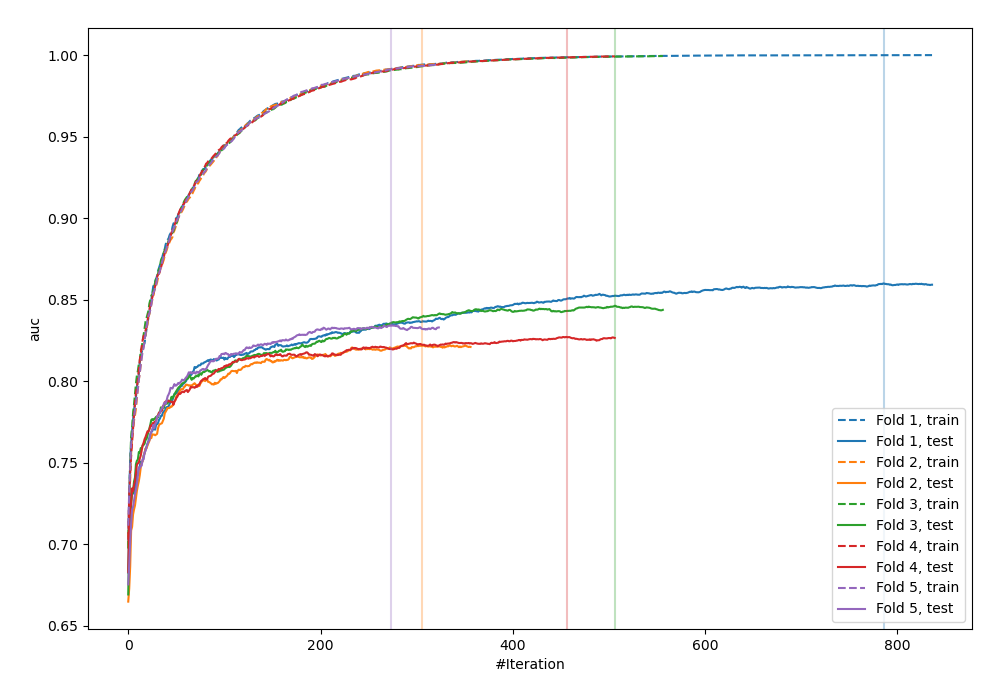
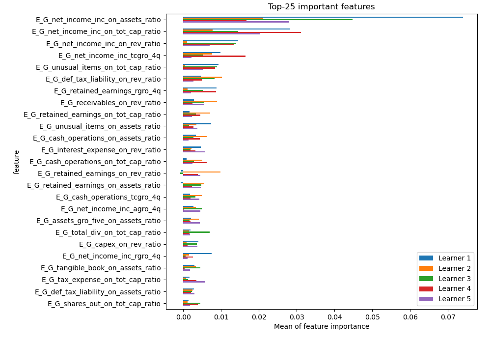
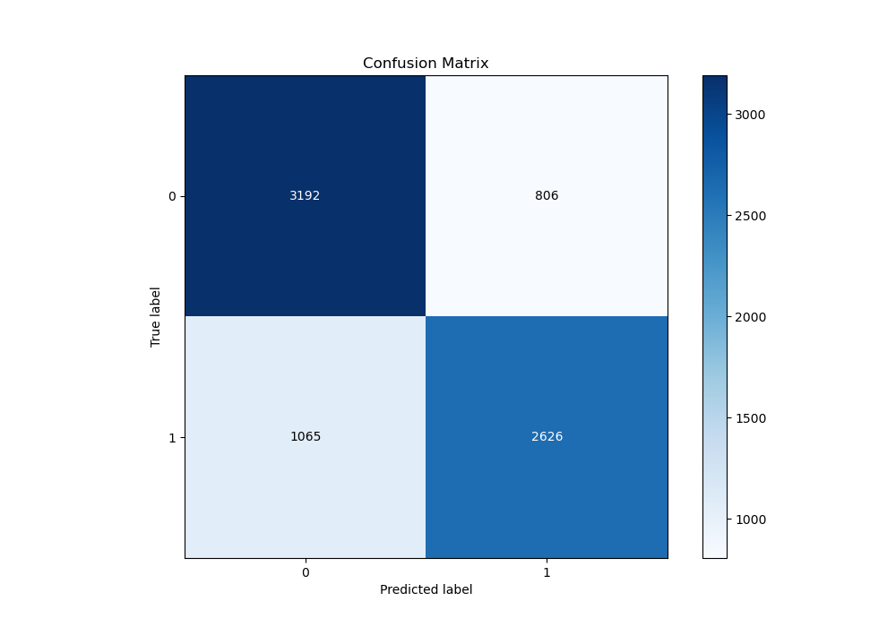
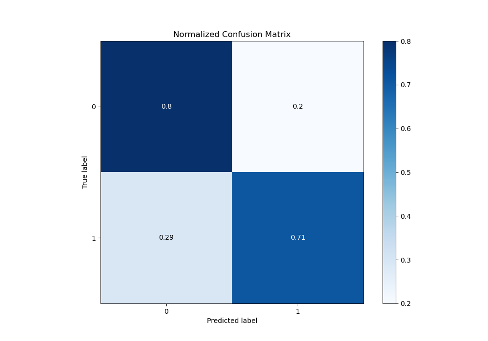
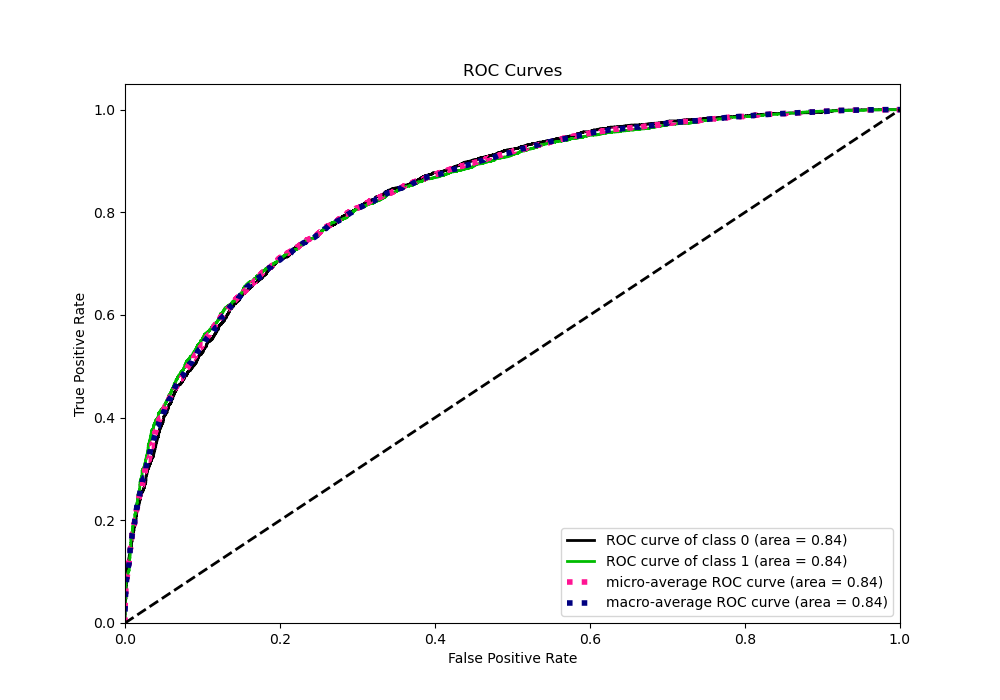
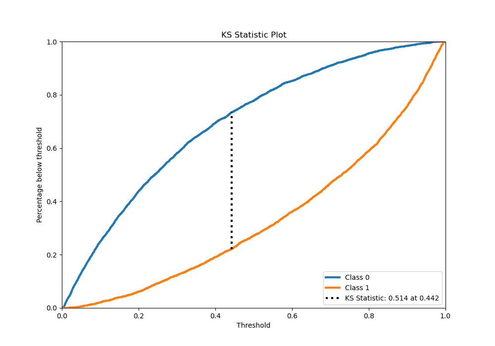
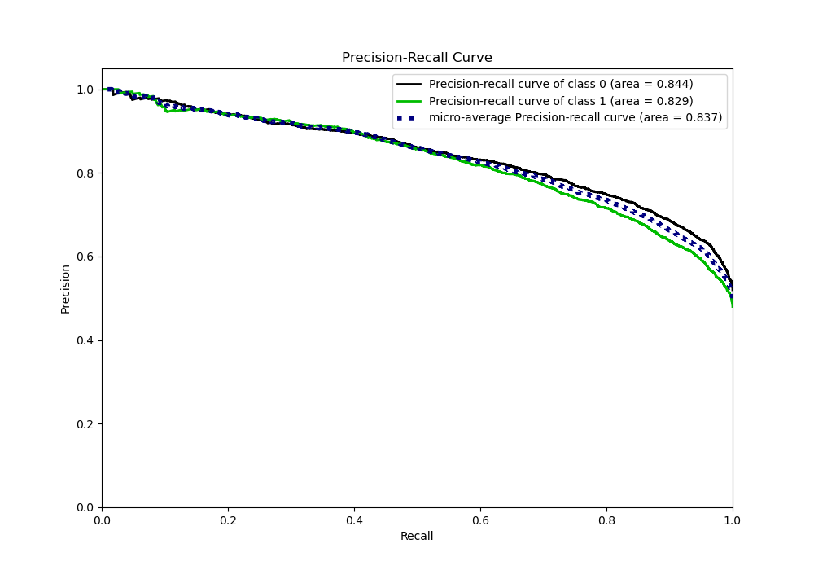
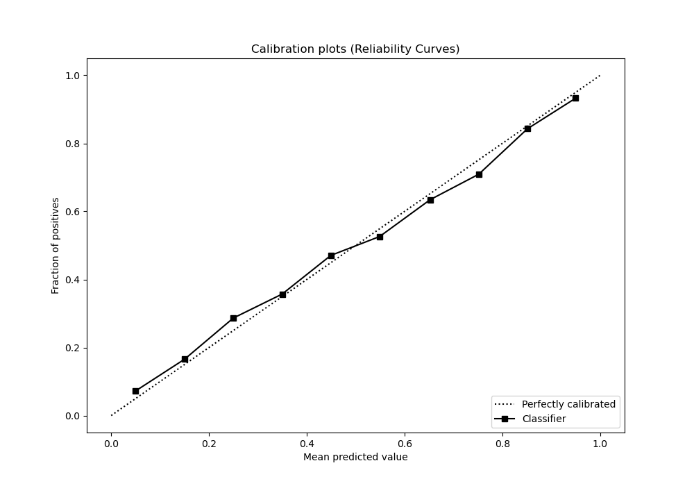
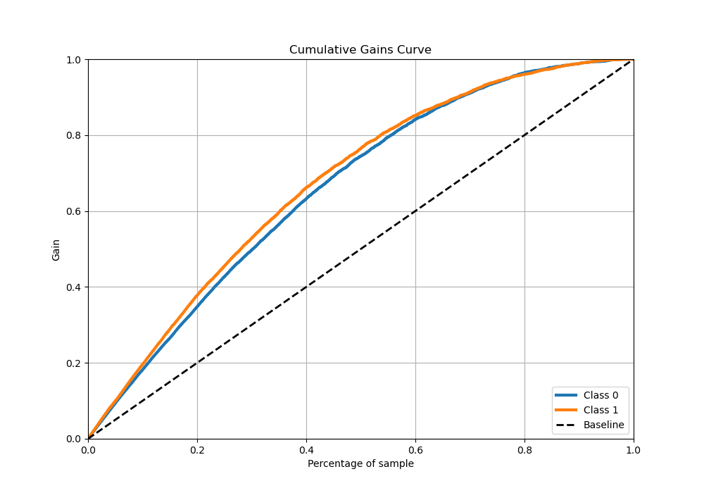
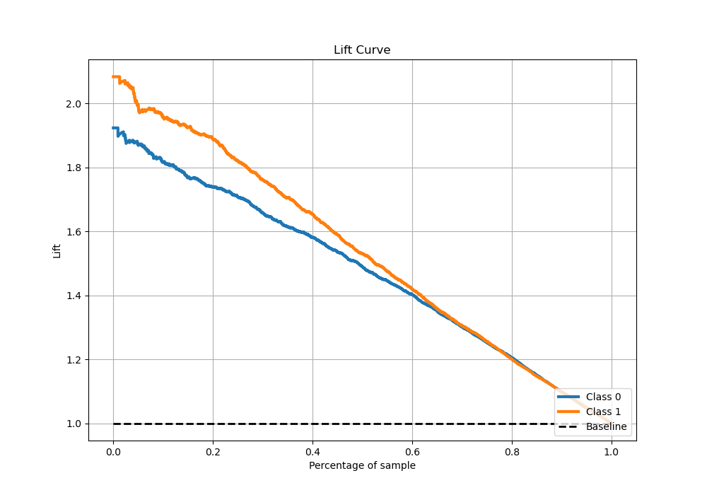

# Summary of 5_Xgboost

[<< Go back](../README.md)

## Extreme Gradient Boosting (Xgboost)
- **n_jobs**: -1
- **objective**: binary:logistic
- **eta**: 0.15
- **max_depth**: 8
- **min_child_weight**: 50
- **subsample**: 0.6
- **colsample_bytree**: 0.6
- **eval_metric**: auc
- **explain_level**: 1

## Validation
 - **validation_type**: kfold
 - **k_folds**: 5
 - **shuffle**: True
 - **stratify**: True

## Optimized metric
auc

## Training time

224.7 seconds

## Metric details
|           |    score |    threshold |
|:----------|---------:|-------------:|
| logloss   | 0.496358 | nan          |
| auc       | 0.838035 | nan          |
| f1        | 0.757836 |   0.346461   |
| accuracy  | 0.756665 |   0.522227   |
| precision | 0.993902 |   0.979511   |
| recall    | 1        |   0.00108011 |
| mcc       | 0.513438 |   0.546227   |

## Metric details with threshold from accuracy metric
|           |    score |   threshold |
|:----------|---------:|------------:|
| logloss   | 0.496358 |  nan        |
| auc       | 0.838035 |  nan        |
| f1        | 0.73733  |    0.522227 |
| accuracy  | 0.756665 |    0.522227 |
| precision | 0.765152 |    0.522227 |
| recall    | 0.71146  |    0.522227 |
| mcc       | 0.512411 |    0.522227 |

## Confusion matrix (at threshold=0.522227)
|              |   Predicted as 0 |   Predicted as 1 |
|:-------------|-----------------:|-----------------:|
| Labeled as 0 |             3192 |              806 |
| Labeled as 1 |             1065 |             2626 |

## Learning curves

## Permutation-based Importance

## Confusion Matrix

## Normalized Confusion Matrix

## ROC Curve

## Kolmogorov-Smirnov Statistic

## Precision-Recall Curve

## Calibration Curve

## Cumulative Gains Curve

## Lift Curve

[<< Go back](../README.md)
