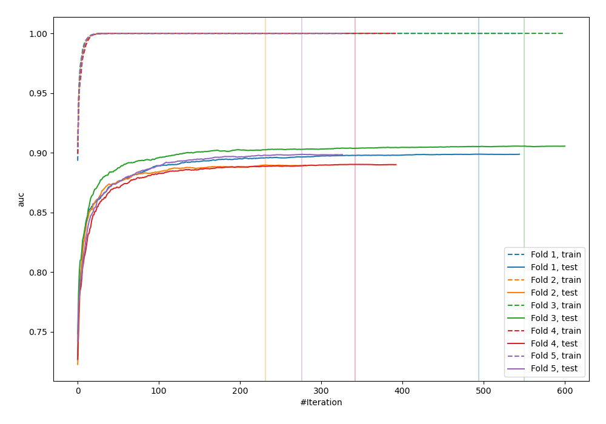
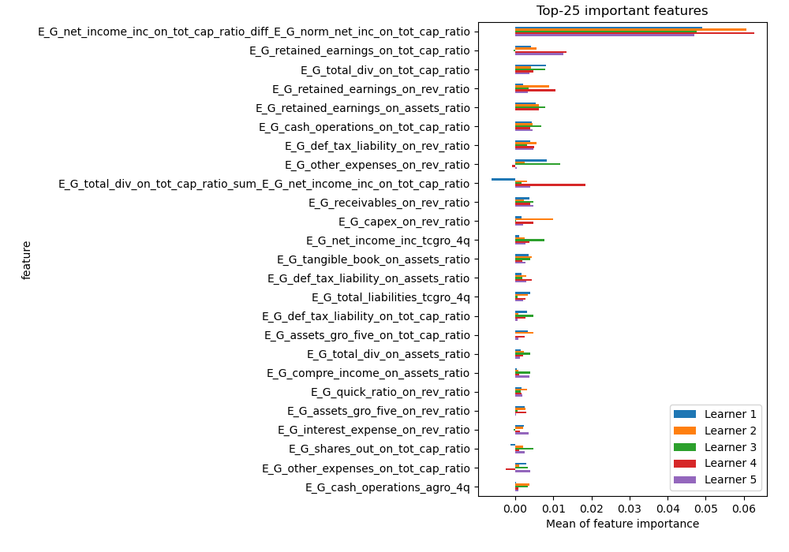
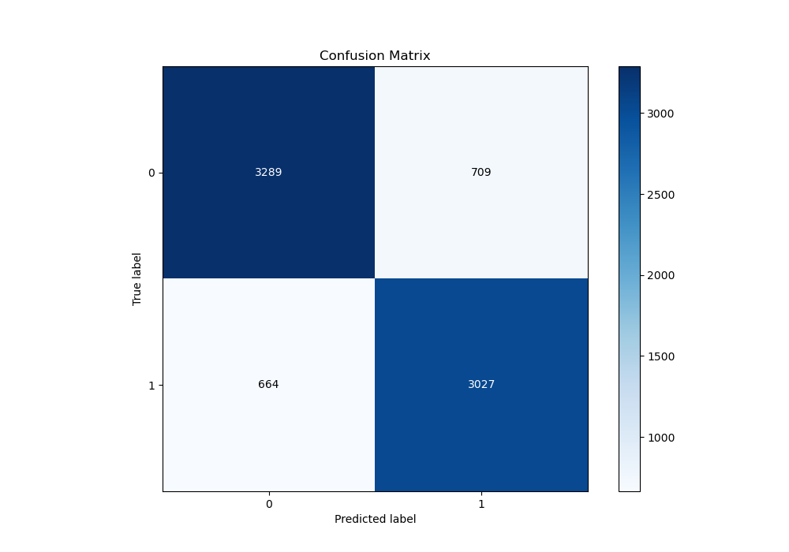
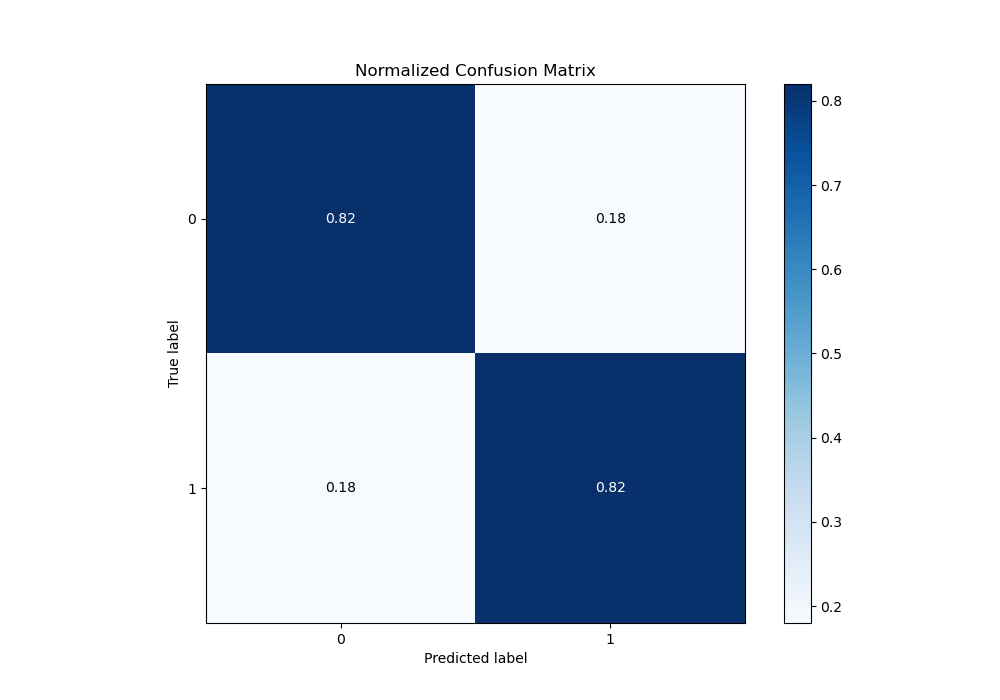
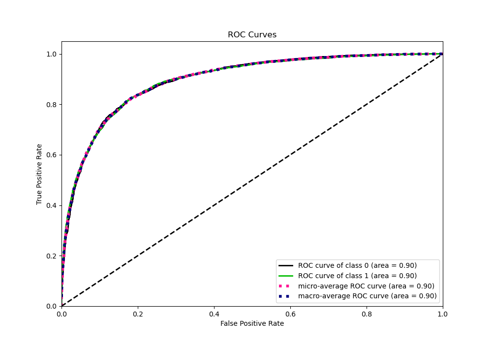
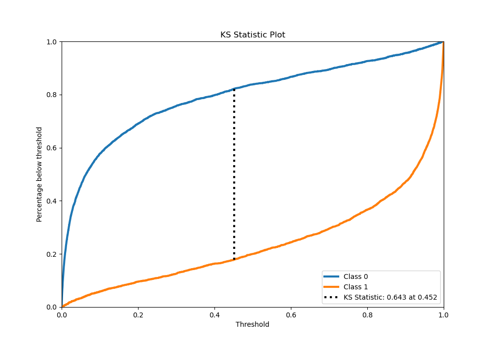
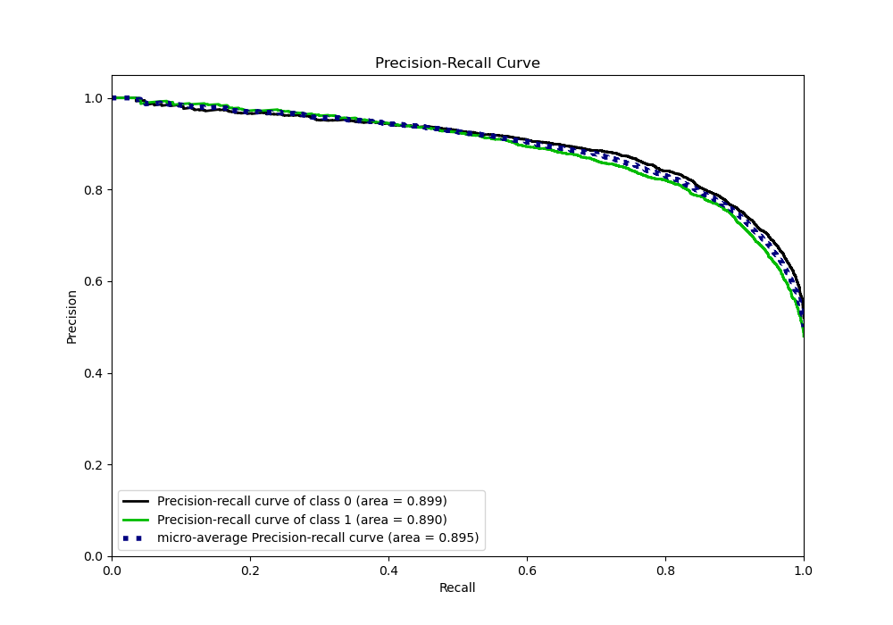
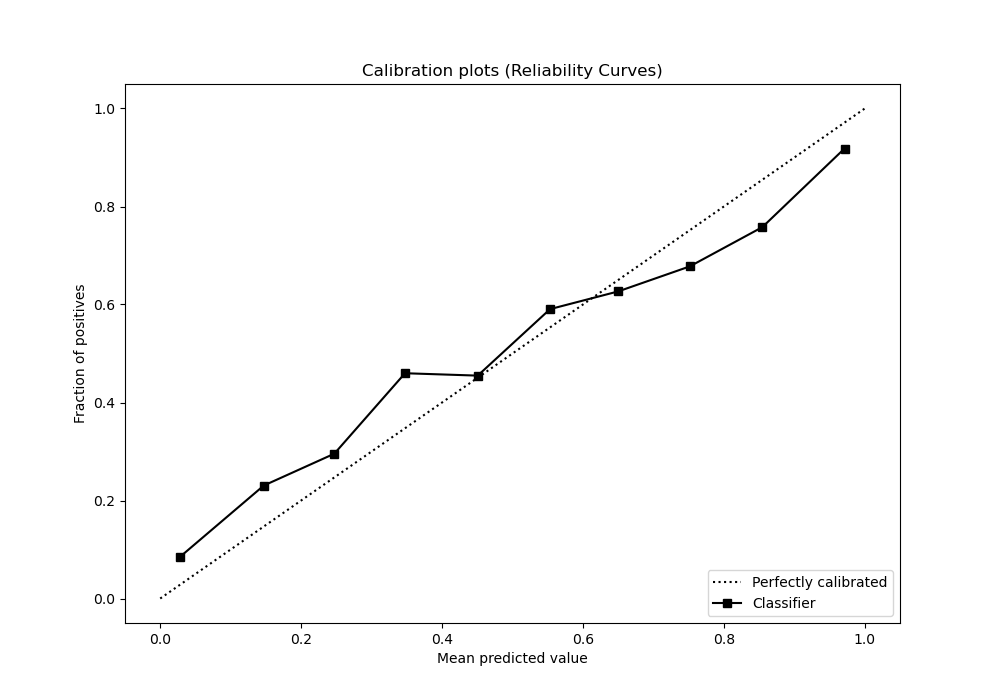
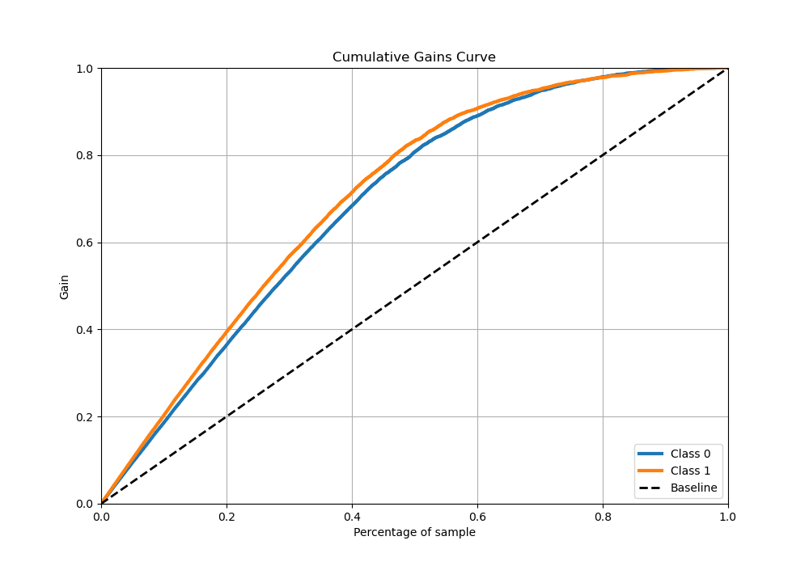
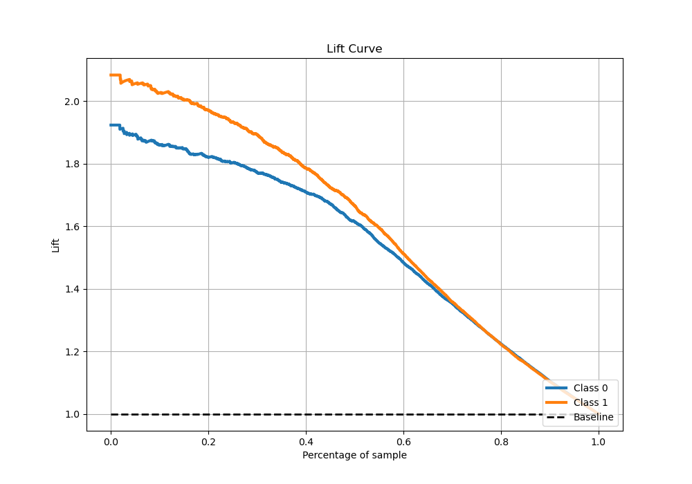

# Summary of 7_Xgboost_GoldenFeatures

[<< Go back](../README.md)

## Extreme Gradient Boosting (Xgboost)
- **n_jobs**: -1
- **objective**: binary:logistic
- **eta**: 0.1
- **max_depth**: 9
- **min_child_weight**: 1
- **subsample**: 1.0
- **colsample_bytree**: 1.0
- **eval_metric**: auc
- **explain_level**: 1

## Validation
 - **validation_type**: kfold
 - **k_folds**: 5
 - **shuffle**: True
 - **stratify**: True

## Optimized metric
auc

## Training time

178.2 seconds

## Metric details
|           |    score |     threshold |
|:----------|---------:|--------------:|
| logloss   | 0.438516 | nan           |
| auc       | 0.896164 | nan           |
| f1        | 0.818216 |   0.301502    |
| accuracy  | 0.821433 |   0.454145    |
| precision | 0.991667 |   0.998051    |
| recall    | 1        |   5.73363e-05 |
| mcc       | 0.642508 |   0.454145    |

## Metric details with threshold from accuracy metric
|           |    score |   threshold |
|:----------|---------:|------------:|
| logloss   | 0.438516 |  nan        |
| auc       | 0.896164 |  nan        |
| f1        | 0.815134 |    0.454145 |
| accuracy  | 0.821433 |    0.454145 |
| precision | 0.810225 |    0.454145 |
| recall    | 0.820103 |    0.454145 |
| mcc       | 0.642508 |    0.454145 |

## Confusion matrix (at threshold=0.454145)
|              |   Predicted as 0 |   Predicted as 1 |
|:-------------|-----------------:|-----------------:|
| Labeled as 0 |             3289 |              709 |
| Labeled as 1 |              664 |             3027 |

## Learning curves

## Permutation-based Importance

## Confusion Matrix

## Normalized Confusion Matrix

## ROC Curve

## Kolmogorov-Smirnov Statistic

## Precision-Recall Curve

## Calibration Curve

## Cumulative Gains Curve

## Lift Curve

[<< Go back](../README.md)
