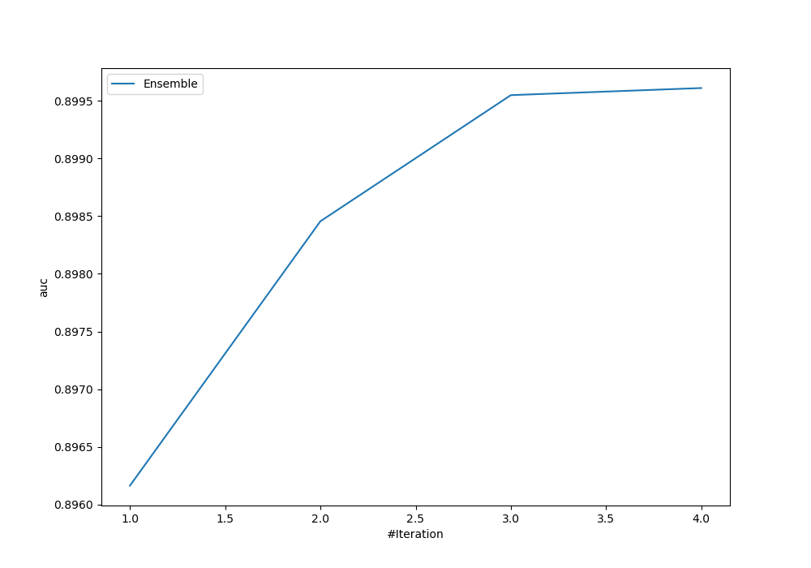
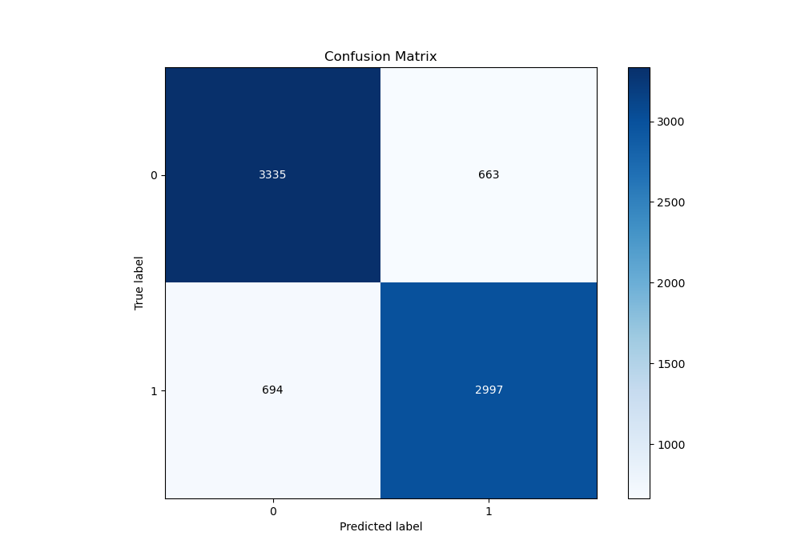
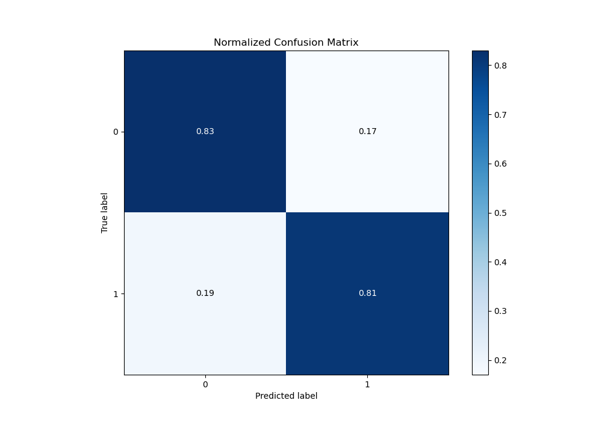
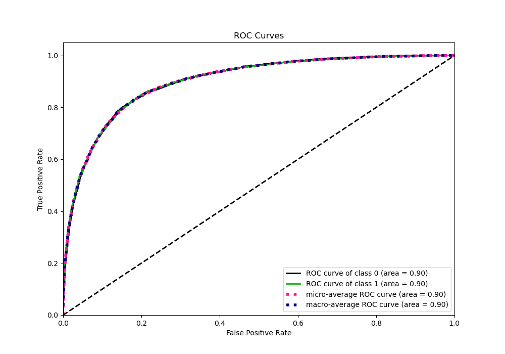
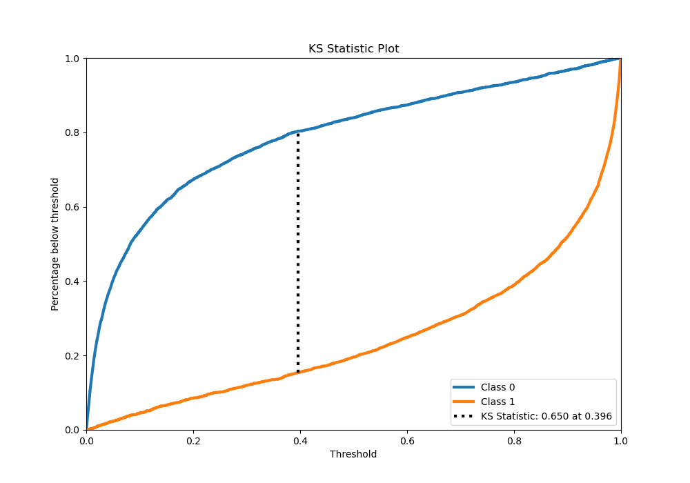
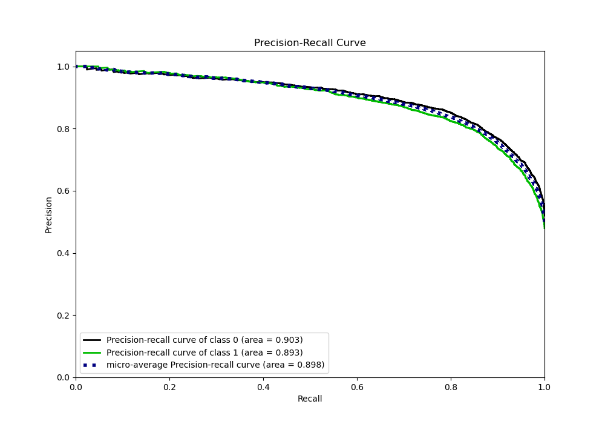
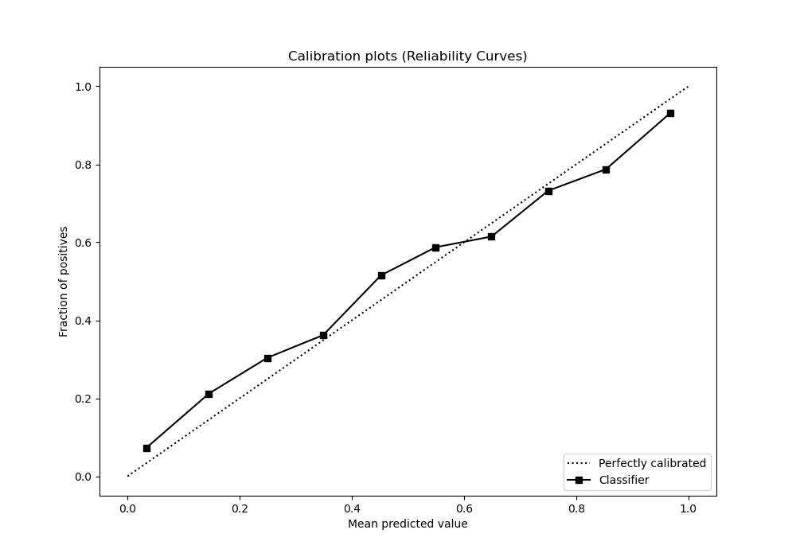
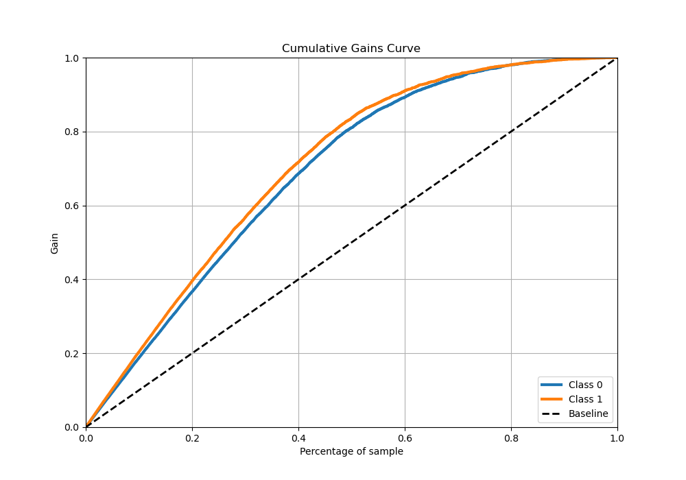
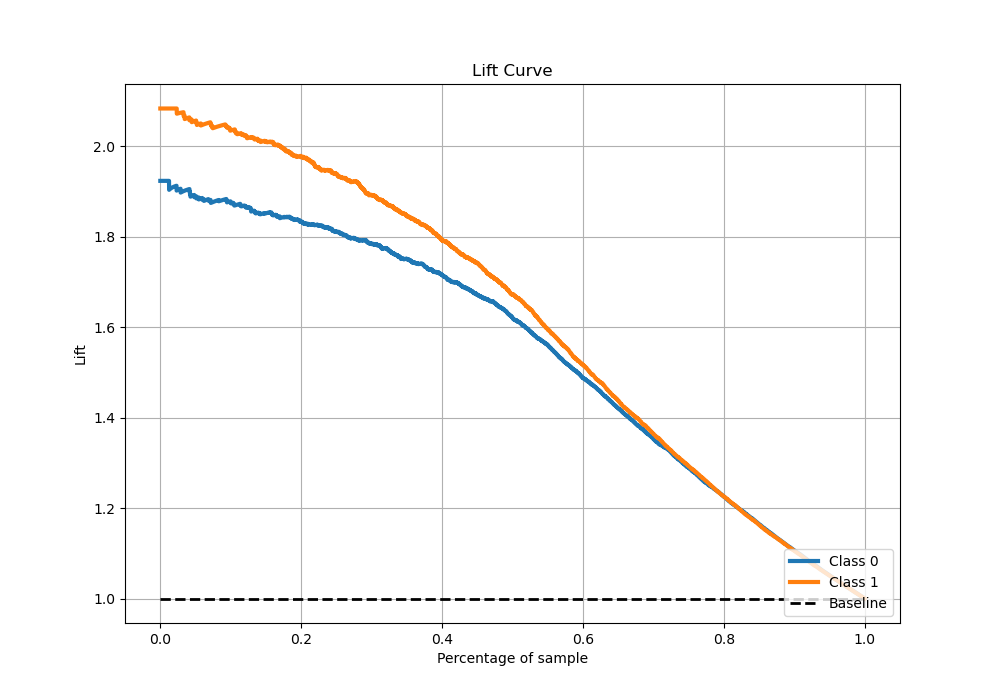

# Summary of Ensemble

[<< Go back](../README.md)

## Ensemble structure
| Model                    |   Weight |
|:-------------------------|---------:|
| 3_Xgboost                |        1 |
| 3_Xgboost_GoldenFeatures |        1 |
| 7_Xgboost_GoldenFeatures |        1 |
| 8_Xgboost                |        1 |

## Metric details
|           |    score |     threshold |
|:----------|---------:|--------------:|
| logloss   | 0.413943 | nan           |
| auc       | 0.89961  | nan           |
| f1        | 0.822403 |   0.364421    |
| accuracy  | 0.823514 |   0.483436    |
| precision | 1        |   0.997372    |
| recall    | 1        |   0.000115555 |
| mcc       | 0.647538 |   0.378236    |

## Metric details with threshold from accuracy metric
|           |    score |   threshold |
|:----------|---------:|------------:|
| logloss   | 0.413943 |  nan        |
| auc       | 0.89961  |  nan        |
| f1        | 0.815399 |    0.483436 |
| accuracy  | 0.823514 |    0.483436 |
| precision | 0.818852 |    0.483436 |
| recall    | 0.811975 |    0.483436 |
| mcc       | 0.646372 |    0.483436 |

## Confusion matrix (at threshold=0.483436)
|              |   Predicted as 0 |   Predicted as 1 |
|:-------------|-----------------:|-----------------:|
| Labeled as 0 |             3335 |              663 |
| Labeled as 1 |              694 |             2997 |

## Learning curves

## Confusion Matrix

## Normalized Confusion Matrix

## ROC Curve

## Kolmogorov-Smirnov Statistic

## Precision-Recall Curve

## Calibration Curve

## Cumulative Gains Curve

## Lift Curve

[<< Go back](../README.md)
