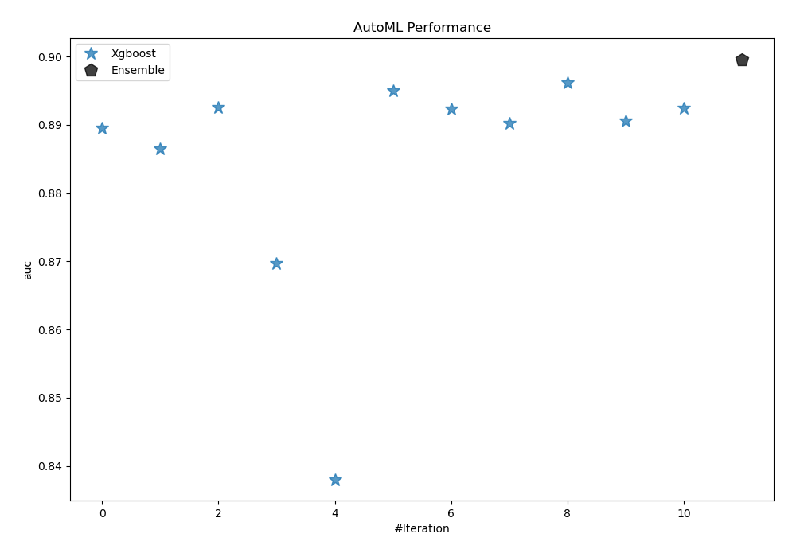
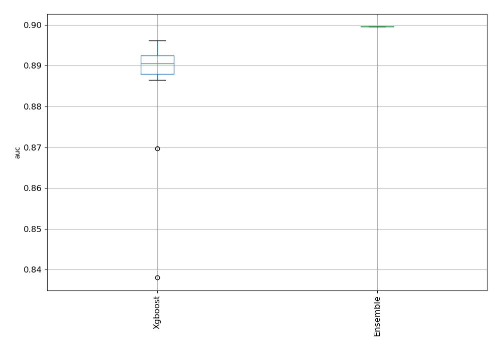
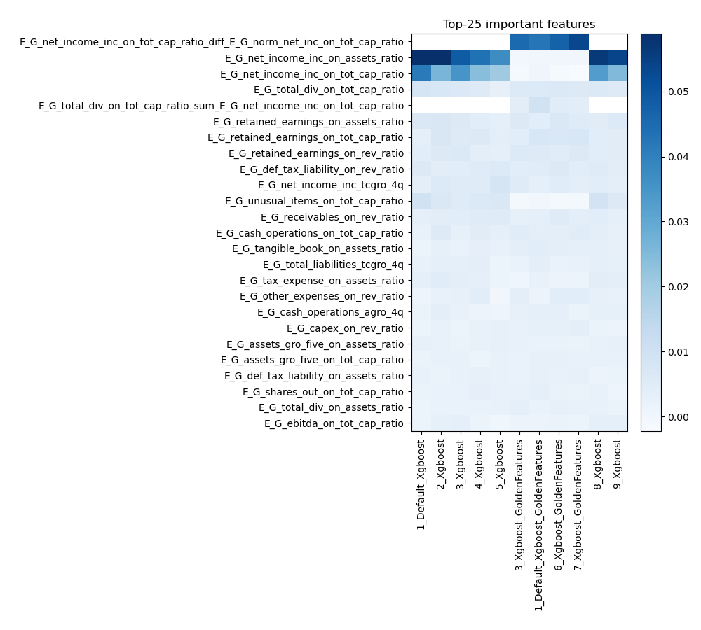
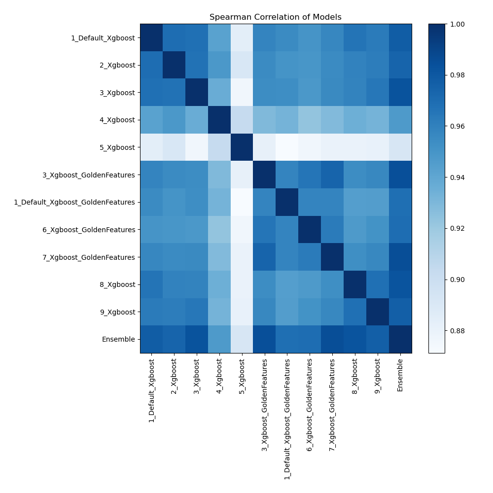

# AutoML Leaderboard

| Best model   | name                                                                           | model_type   | metric_type   |   metric_value |   train_time |   single_prediction_time |
|:-------------|:-------------------------------------------------------------------------------|:-------------|:--------------|---------------:|-------------:|-------------------------:|
|              | [1_Default_Xgboost](1_Default_Xgboost/README.md)                               | Xgboost      | auc           |       0.889499 |        94.53 |                   0.1744 |
|              | [2_Xgboost](2_Xgboost/README.md)                                               | Xgboost      | auc           |       0.88649  |        99.82 |                   0.0932 |
|              | [3_Xgboost](3_Xgboost/README.md)                                               | Xgboost      | auc           |       0.892543 |        86.11 |                   0.0918 |
|              | [4_Xgboost](4_Xgboost/README.md)                                               | Xgboost      | auc           |       0.8697   |       252.11 |                   0.0913 |
|              | [5_Xgboost](5_Xgboost/README.md)                                               | Xgboost      | auc           |       0.838035 |       225.34 |                   0.102  |
|              | [3_Xgboost_GoldenFeatures](3_Xgboost_GoldenFeatures/README.md)                 | Xgboost      | auc           |       0.895007 |       744.82 |                   0.1562 |
|              | [1_Default_Xgboost_GoldenFeatures](1_Default_Xgboost_GoldenFeatures/README.md) | Xgboost      | auc           |       0.892357 |      1236.89 |                   0.1529 |
|              | [6_Xgboost_GoldenFeatures](6_Xgboost_GoldenFeatures/README.md)                 | Xgboost      | auc           |       0.890223 |       102.74 |                   0.165  |
| **the best** | [7_Xgboost_GoldenFeatures](7_Xgboost_GoldenFeatures/README.md)                 | Xgboost      | auc           |       0.896164 |       178.76 |                   0.1555 |
|              | [8_Xgboost](8_Xgboost/README.md)                                               | Xgboost      | auc           |       0.890557 |        94.06 |                   0.0958 |
|              | [9_Xgboost](9_Xgboost/README.md)                                               | Xgboost      | auc           |       0.892425 |       130.53 |                   0.0945 |
|              | [Ensemble](Ensemble/README.md)                                                 | Ensemble     | auc           |       0.89961  |         1.14 |                   0.8186 |

### AutoML Performance

### AutoML Performance Boxplot

### Features Importance

### Spearman Correlation of Models

