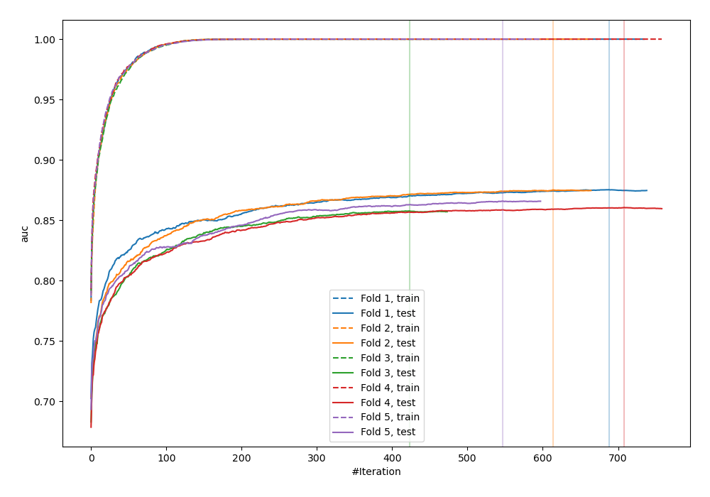
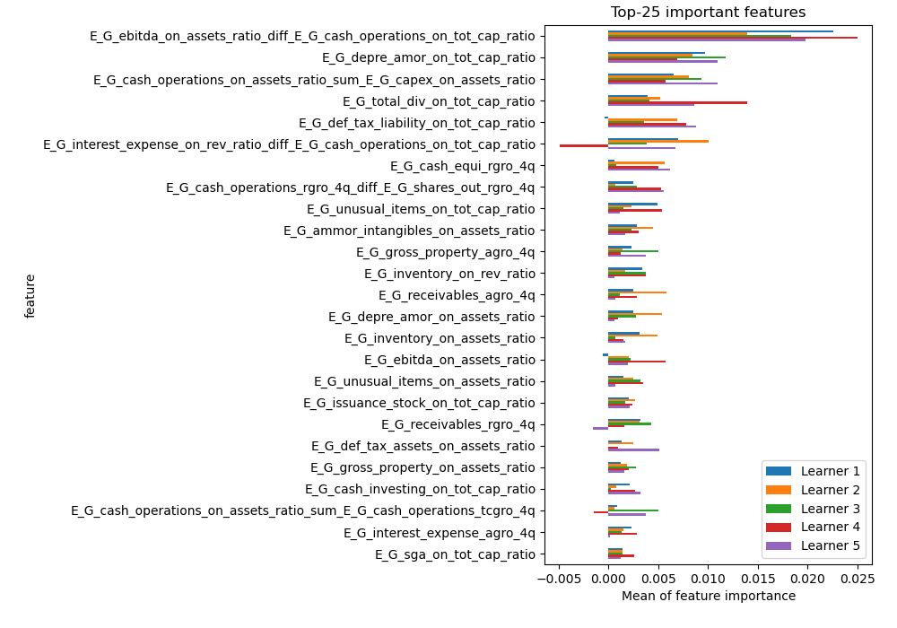
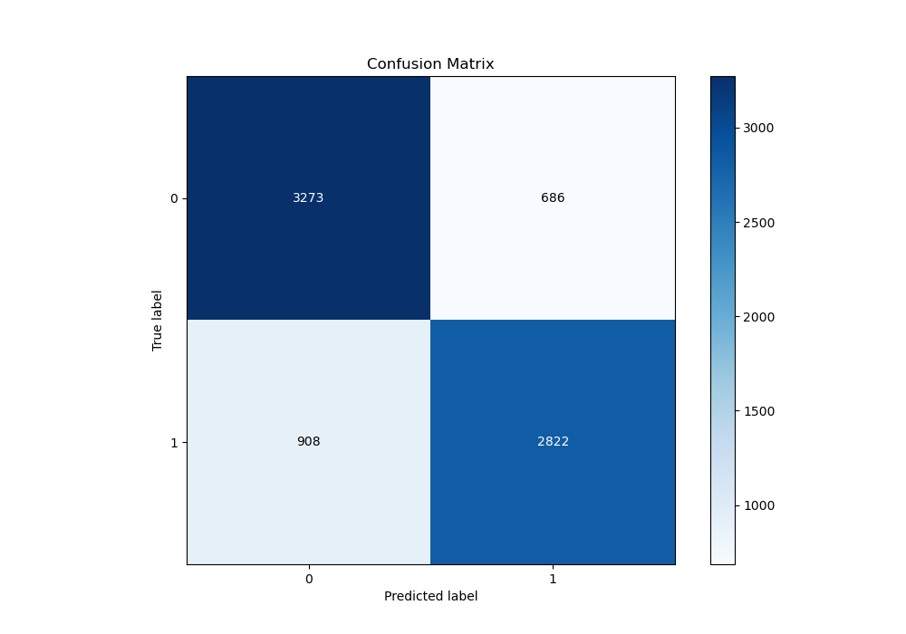
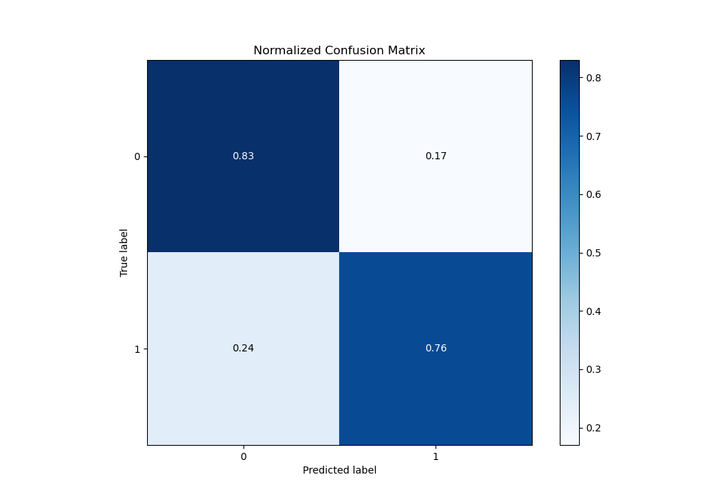
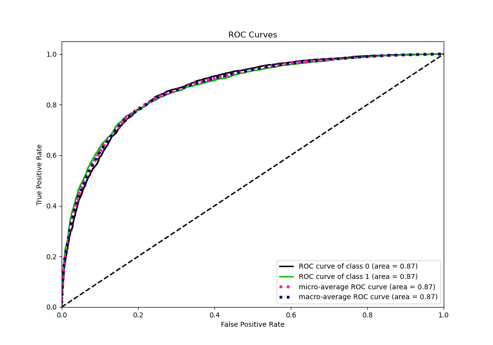
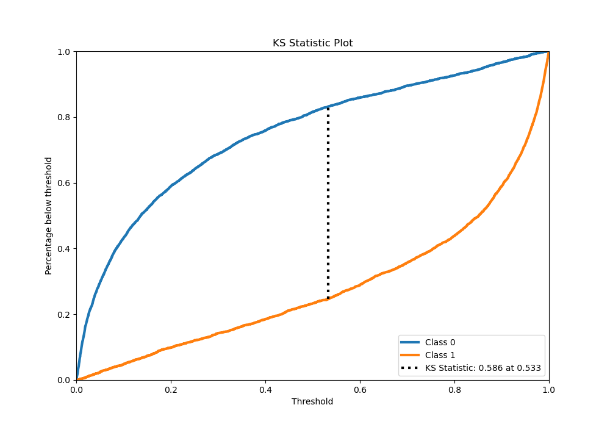
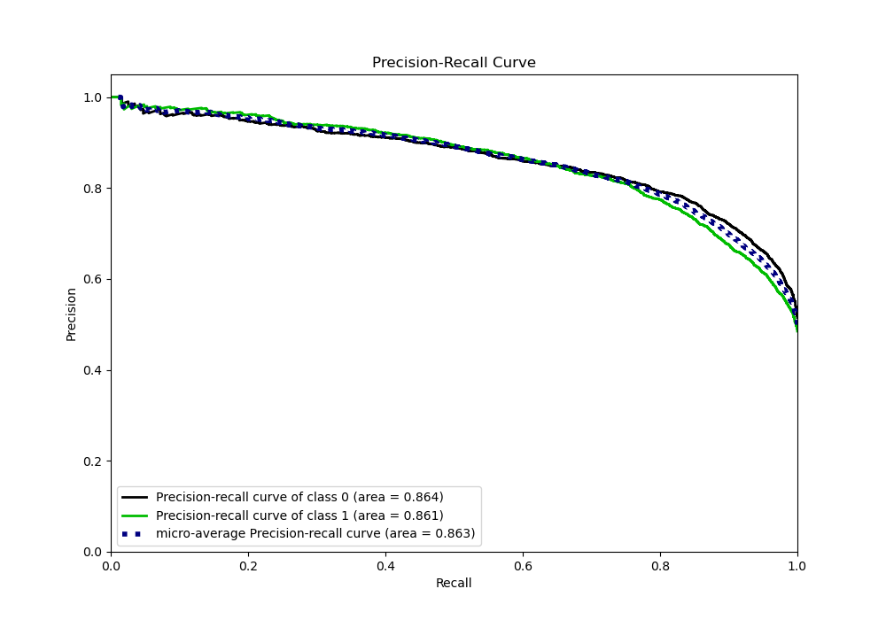
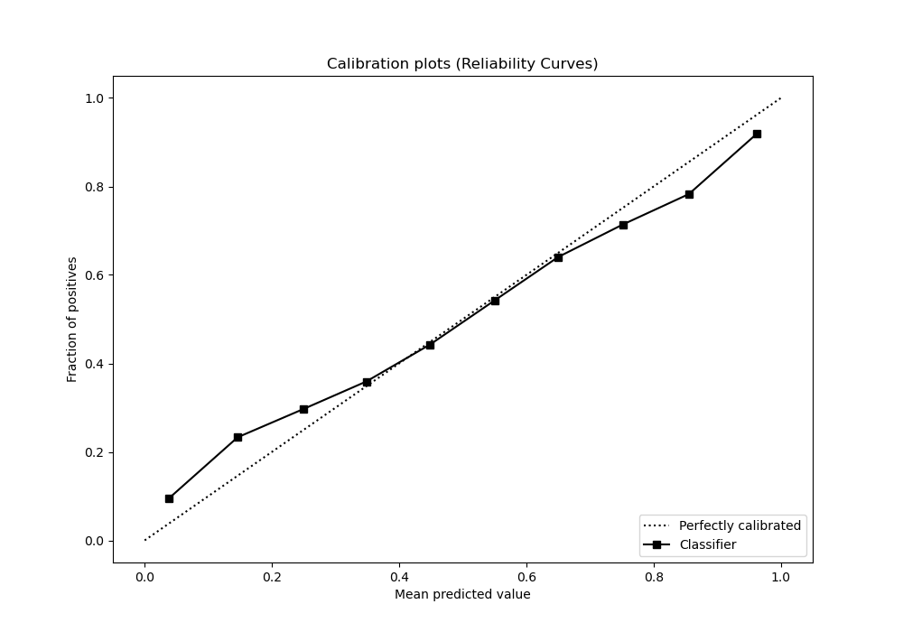
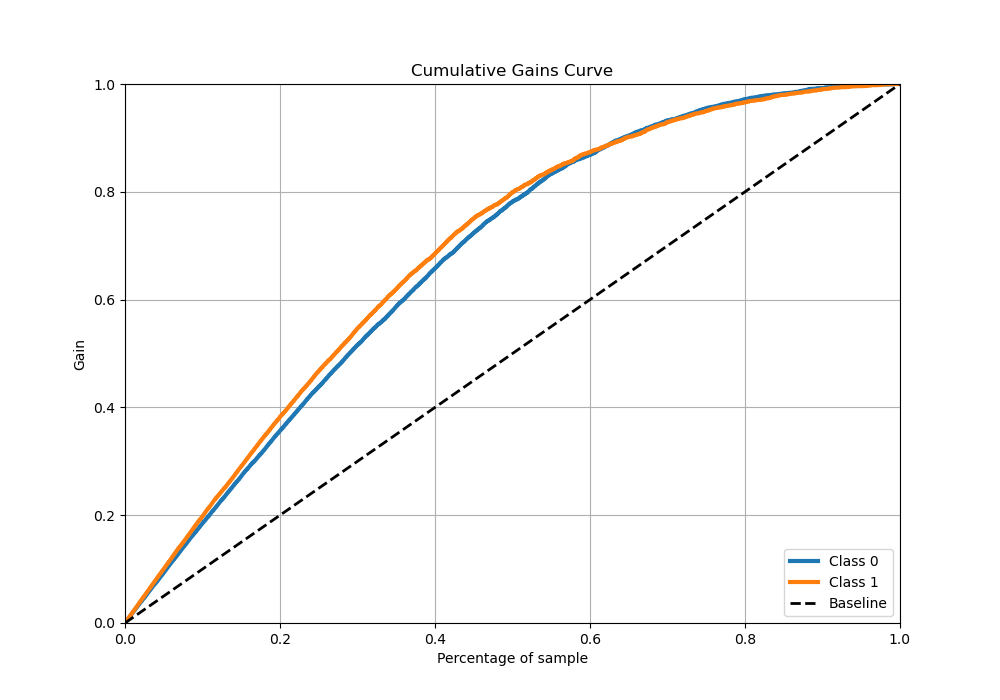
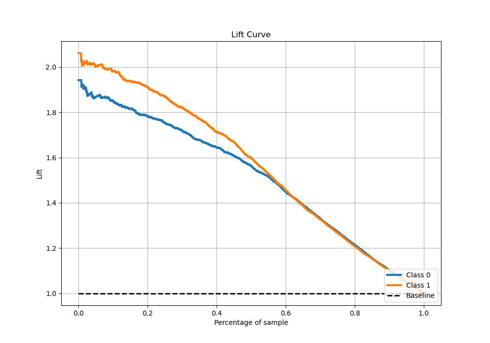

# Summary of 10_Xgboost_GoldenFeatures_SelectedFeatures

[<< Go back](../README.md)

## Extreme Gradient Boosting (Xgboost)
- **n_jobs**: -1
- **objective**: binary:logistic
- **eta**: 0.075
- **max_depth**: 6
- **min_child_weight**: 1
- **subsample**: 1.0
- **colsample_bytree**: 0.9
- **eval_metric**: auc
- **explain_level**: 1

## Validation
 - **validation_type**: kfold
 - **k_folds**: 5
 - **shuffle**: True
 - **stratify**: True

## Optimized metric
auc

## Training time

65.1 seconds

## Metric details
|           |    score |     threshold |
|:----------|---------:|--------------:|
| logloss   | 0.475401 | nan           |
| auc       | 0.866286 | nan           |
| f1        | 0.789192 |   0.369198    |
| accuracy  | 0.792691 |   0.522076    |
| precision | 0.981707 |   0.994609    |
| recall    | 1        |   0.000132105 |
| mcc       | 0.585826 |   0.543784    |

## Metric details with threshold from accuracy metric
|           |    score |   threshold |
|:----------|---------:|------------:|
| logloss   | 0.475401 |  nan        |
| auc       | 0.866286 |  nan        |
| f1        | 0.779773 |    0.522076 |
| accuracy  | 0.792691 |    0.522076 |
| precision | 0.804447 |    0.522076 |
| recall    | 0.756568 |    0.522076 |
| mcc       | 0.58528  |    0.522076 |

## Confusion matrix (at threshold=0.522076)
|              |   Predicted as 0 |   Predicted as 1 |
|:-------------|-----------------:|-----------------:|
| Labeled as 0 |             3273 |              686 |
| Labeled as 1 |              908 |             2822 |

## Learning curves

## Permutation-based Importance

## Confusion Matrix

## Normalized Confusion Matrix

## ROC Curve

## Kolmogorov-Smirnov Statistic

## Precision-Recall Curve

## Calibration Curve

## Cumulative Gains Curve

## Lift Curve

[<< Go back](../README.md)
