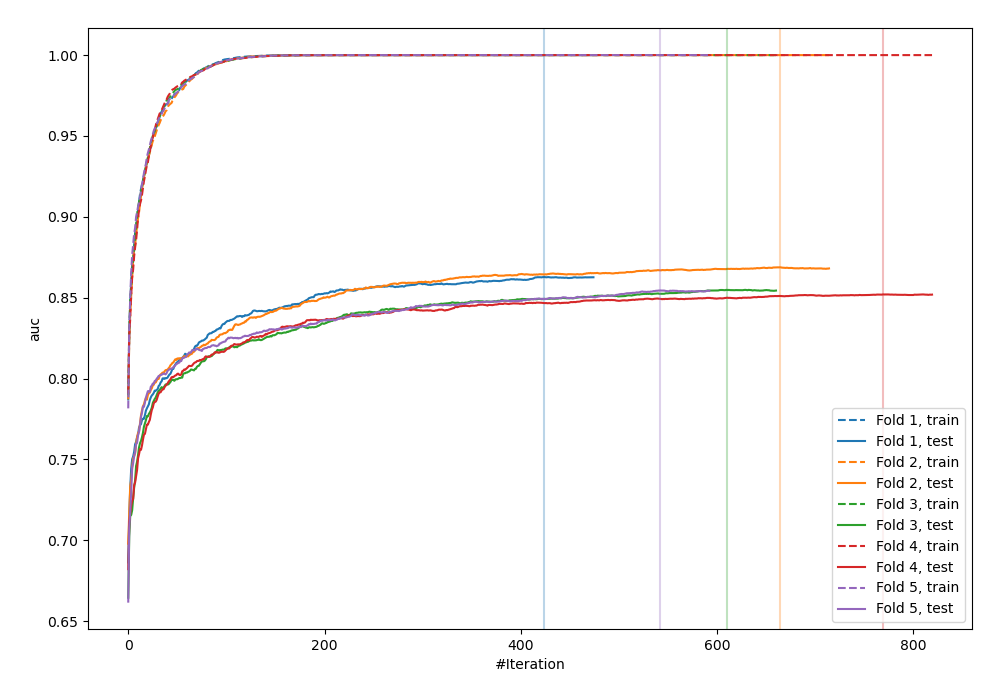
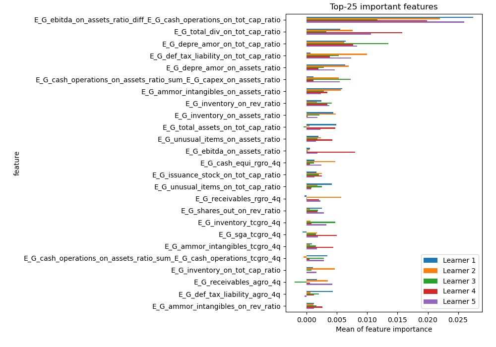
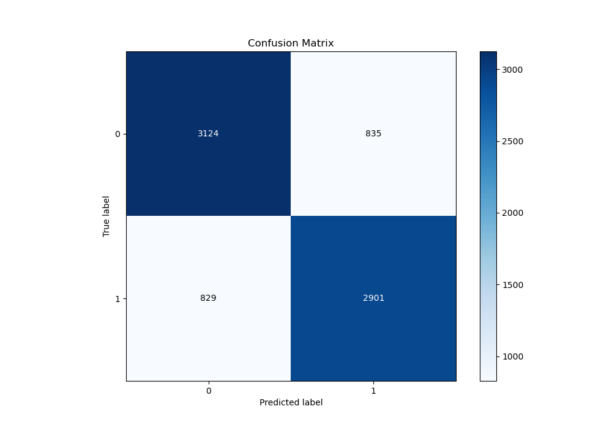
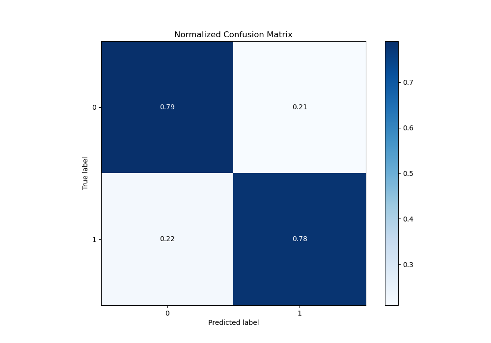
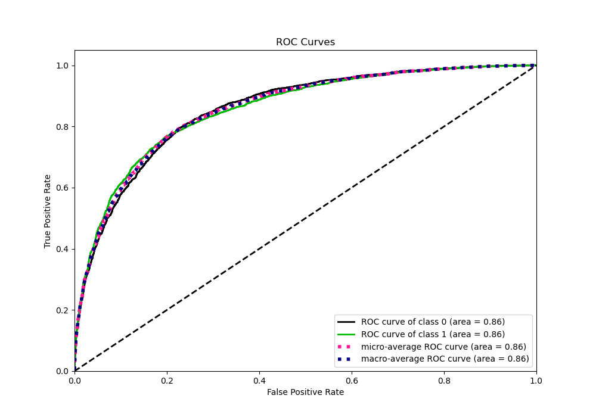
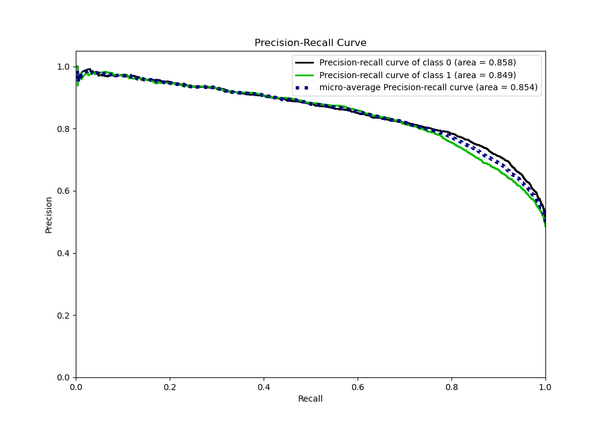
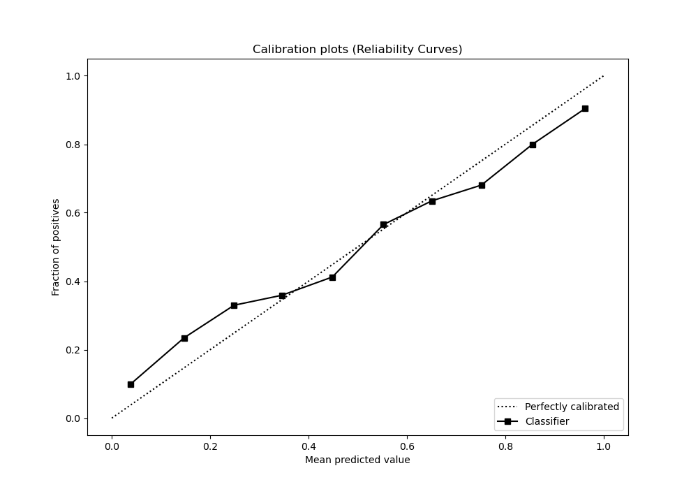
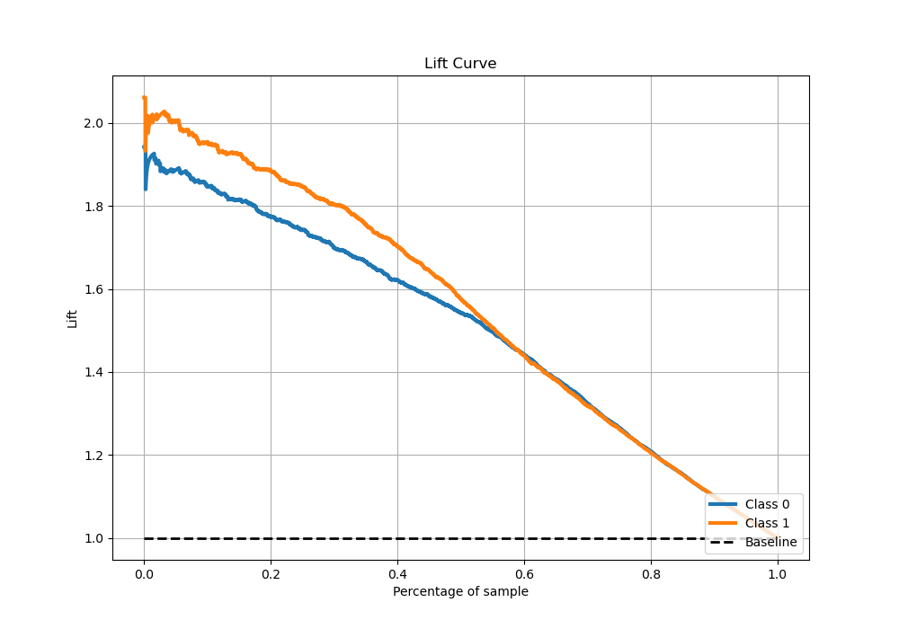

# Summary of 1_Default_Xgboost_GoldenFeatures

[<< Go back](../README.md)

## Extreme Gradient Boosting (Xgboost)
- **n_jobs**: -1
- **objective**: binary:logistic
- **eta**: 0.075
- **max_depth**: 6
- **min_child_weight**: 1
- **subsample**: 1.0
- **colsample_bytree**: 1.0
- **eval_metric**: auc
- **explain_level**: 1

## Validation
 - **validation_type**: kfold
 - **k_folds**: 5
 - **shuffle**: True
 - **stratify**: True

## Optimized metric
auc

## Training time

107.7 seconds

## Metric details
|           |    score |     threshold |
|:----------|---------:|--------------:|
| logloss   | 0.492571 | nan           |
| auc       | 0.857567 | nan           |
| f1        | 0.777489 |   0.41502     |
| accuracy  | 0.783587 |   0.470929    |
| precision | 0.983333 |   0.992331    |
| recall    | 1        |   0.000123124 |
| mcc       | 0.56681  |   0.470929    |

## Metric details with threshold from accuracy metric
|           |    score |   threshold |
|:----------|---------:|------------:|
| logloss   | 0.492571 |  nan        |
| auc       | 0.857567 |  nan        |
| f1        | 0.777123 |    0.470929 |
| accuracy  | 0.783587 |    0.470929 |
| precision | 0.776499 |    0.470929 |
| recall    | 0.777748 |    0.470929 |
| mcc       | 0.56681  |    0.470929 |

## Confusion matrix (at threshold=0.470929)
|              |   Predicted as 0 |   Predicted as 1 |
|:-------------|-----------------:|-----------------:|
| Labeled as 0 |             3124 |              835 |
| Labeled as 1 |              829 |             2901 |

## Learning curves

## Permutation-based Importance

## Confusion Matrix

## Normalized Confusion Matrix

## ROC Curve

## Kolmogorov-Smirnov Statistic

## Precision-Recall Curve

## Calibration Curve

## Cumulative Gains Curve

## Lift Curve

[<< Go back](../README.md)
