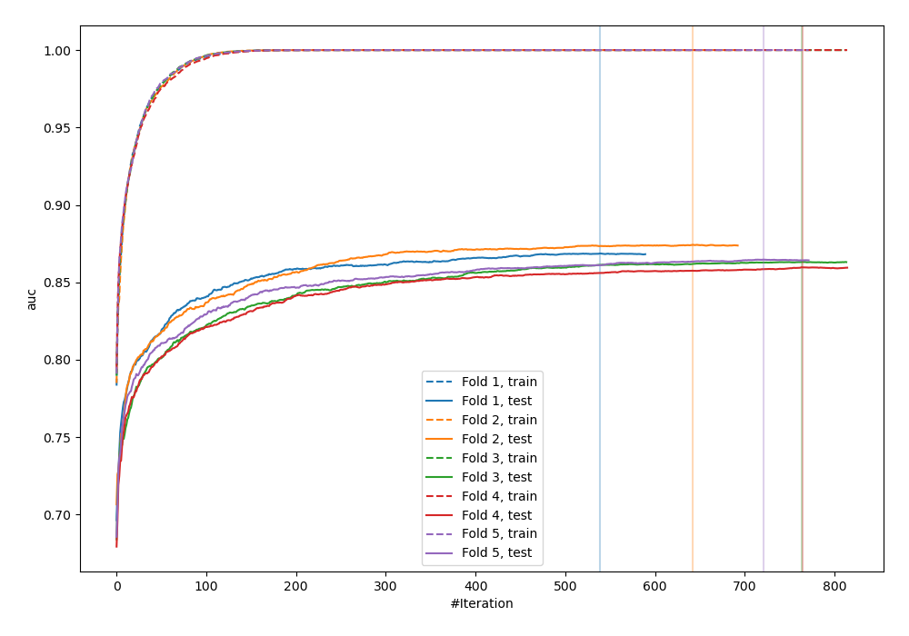
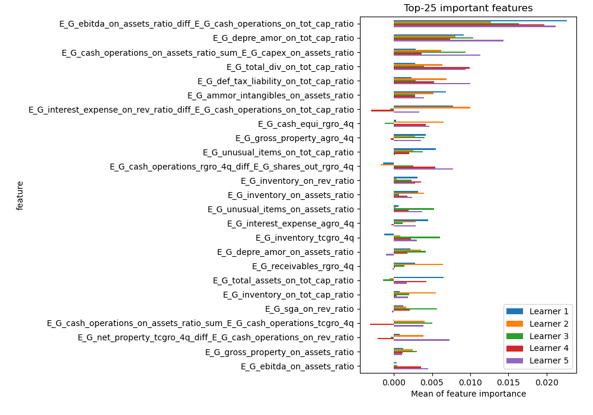
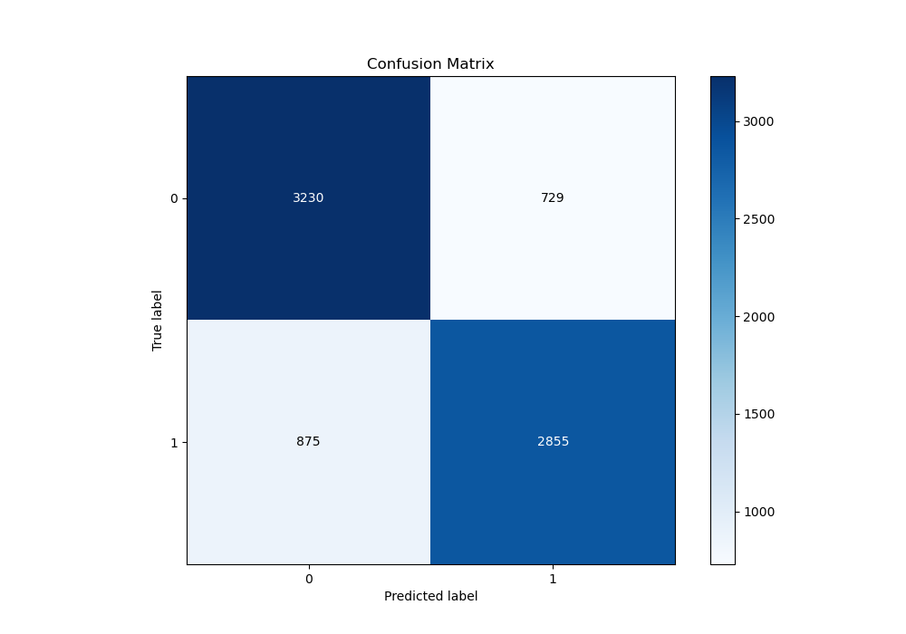
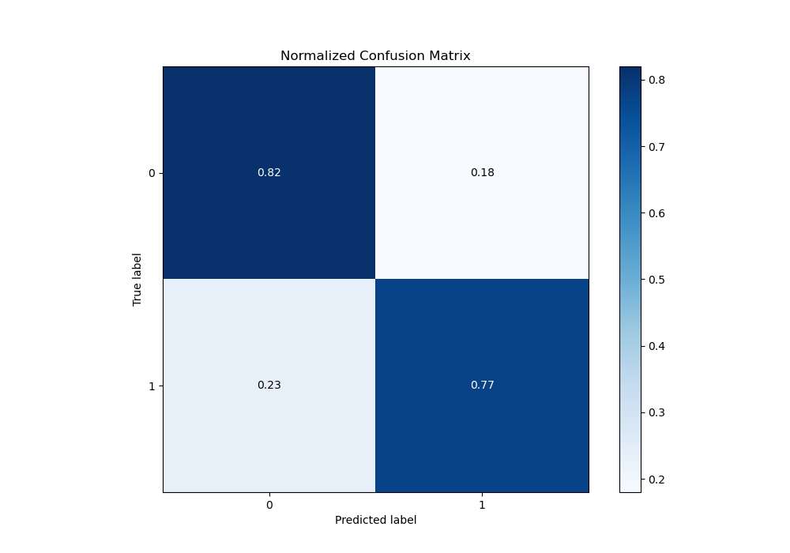
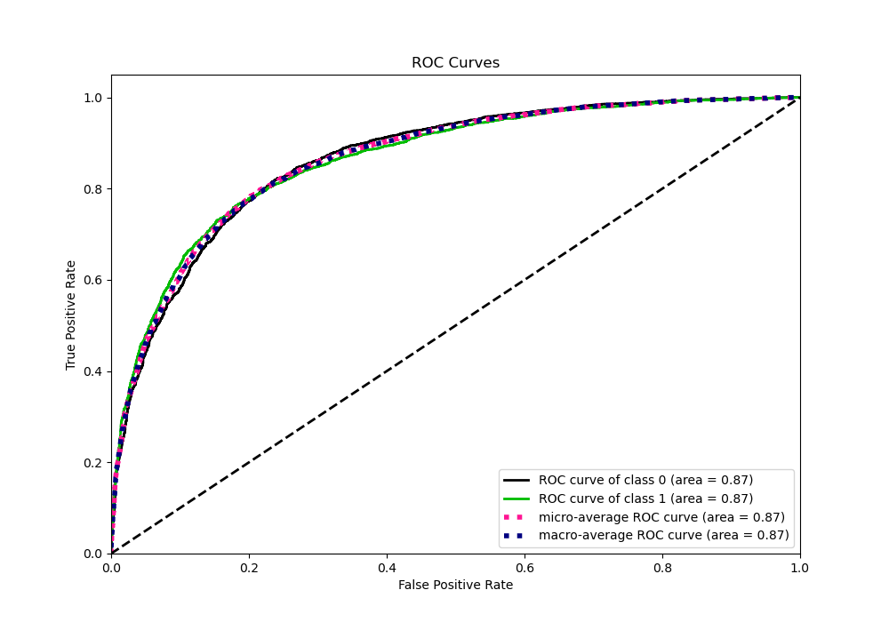
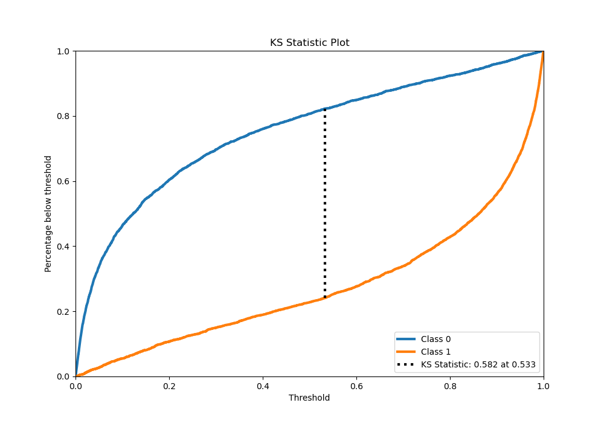
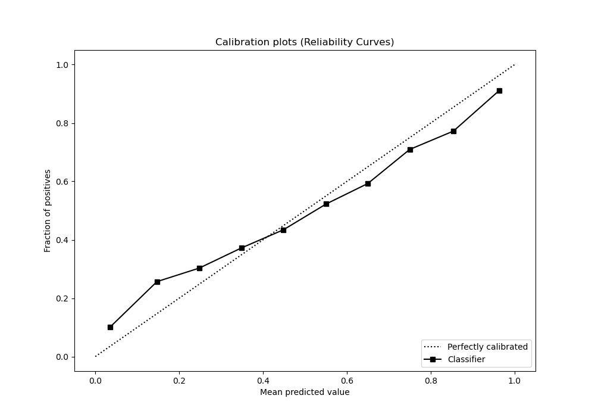
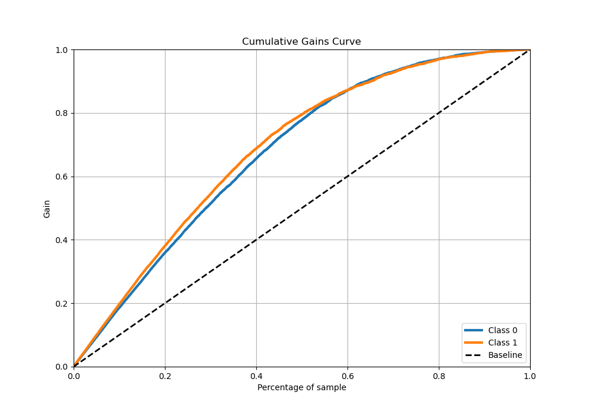
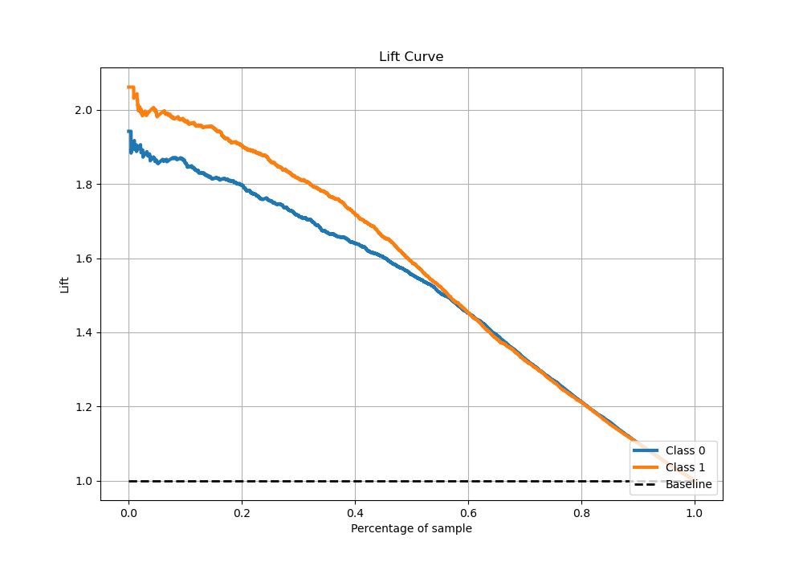

# Summary of 1_Default_Xgboost_GoldenFeatures_SelectedFeatures

[<< Go back](../README.md)

## Extreme Gradient Boosting (Xgboost)
- **n_jobs**: -1
- **objective**: binary:logistic
- **eta**: 0.075
- **max_depth**: 6
- **min_child_weight**: 1
- **subsample**: 1.0
- **colsample_bytree**: 1.0
- **eval_metric**: auc
- **explain_level**: 1

## Validation
 - **validation_type**: kfold
 - **k_folds**: 5
 - **shuffle**: True
 - **stratify**: True

## Optimized metric
auc

## Training time

73.6 seconds

## Metric details
|           |    score |     threshold |
|:----------|---------:|--------------:|
| logloss   | 0.485997 | nan           |
| auc       | 0.865418 | nan           |
| f1        | 0.78566  |   0.345002    |
| accuracy  | 0.79139  |   0.518835    |
| precision | 0.971519 |   0.992028    |
| recall    | 1        |   8.44197e-05 |
| mcc       | 0.582359 |   0.518835    |

## Metric details with threshold from accuracy metric
|           |    score |   threshold |
|:----------|---------:|------------:|
| logloss   | 0.485997 |  nan        |
| auc       | 0.865418 |  nan        |
| f1        | 0.780695 |    0.518835 |
| accuracy  | 0.79139  |    0.518835 |
| precision | 0.796596 |    0.518835 |
| recall    | 0.765416 |    0.518835 |
| mcc       | 0.582359 |    0.518835 |

## Confusion matrix (at threshold=0.518835)
|              |   Predicted as 0 |   Predicted as 1 |
|:-------------|-----------------:|-----------------:|
| Labeled as 0 |             3230 |              729 |
| Labeled as 1 |              875 |             2855 |

## Learning curves

## Permutation-based Importance

## Confusion Matrix

## Normalized Confusion Matrix

## ROC Curve

## Kolmogorov-Smirnov Statistic

## Precision-Recall Curve

## Calibration Curve

## Cumulative Gains Curve

## Lift Curve

[<< Go back](../README.md)
