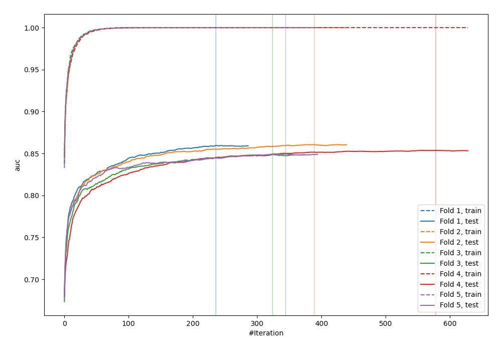
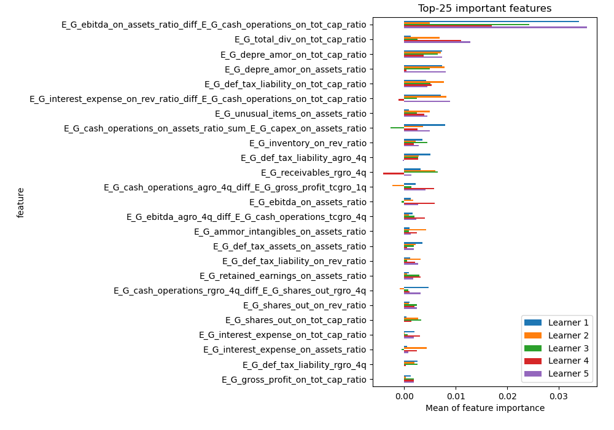
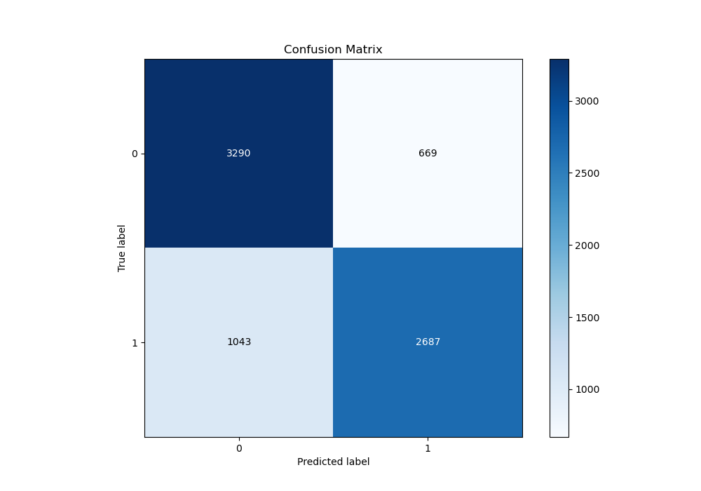
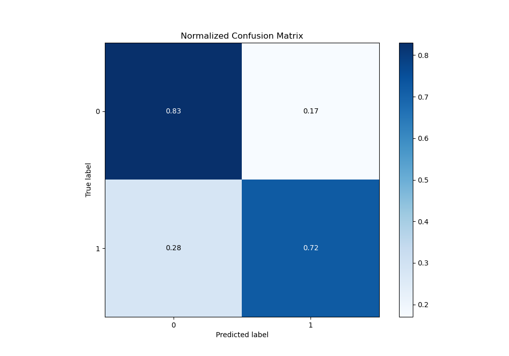
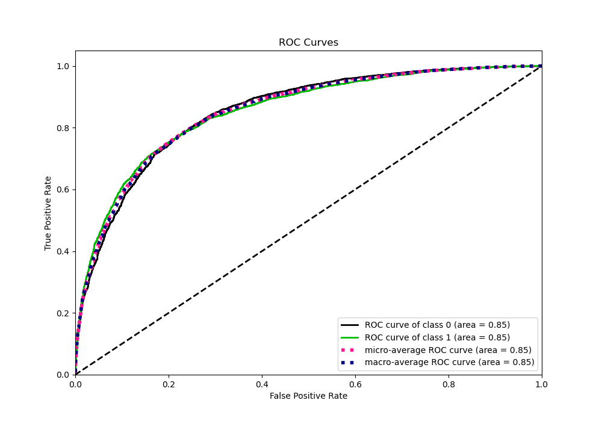
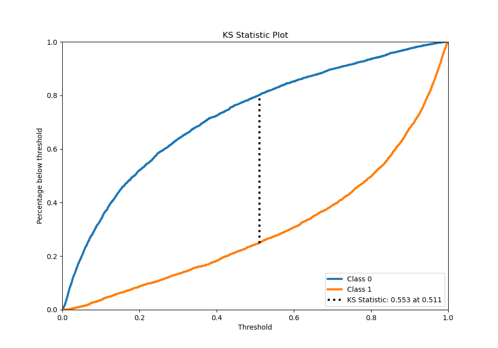
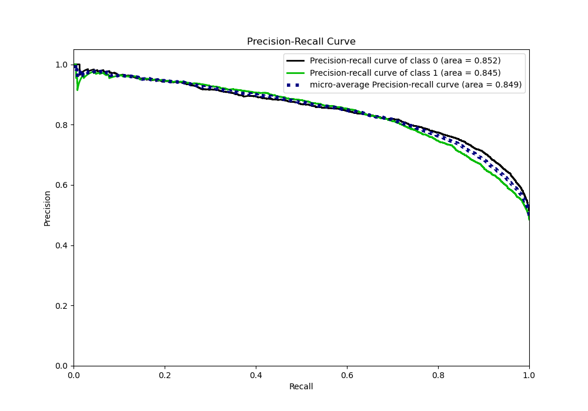
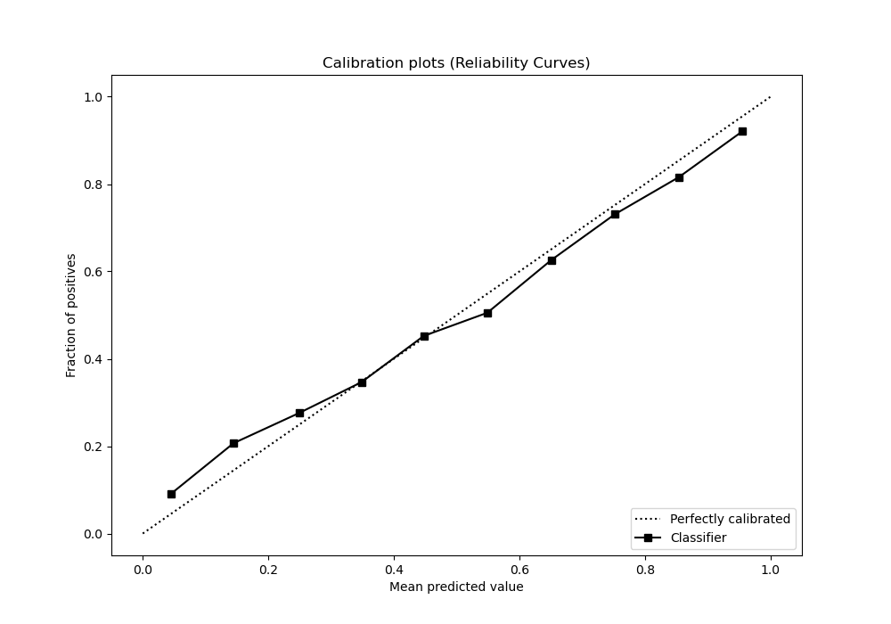
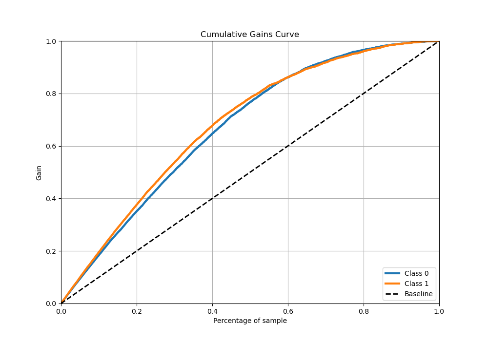
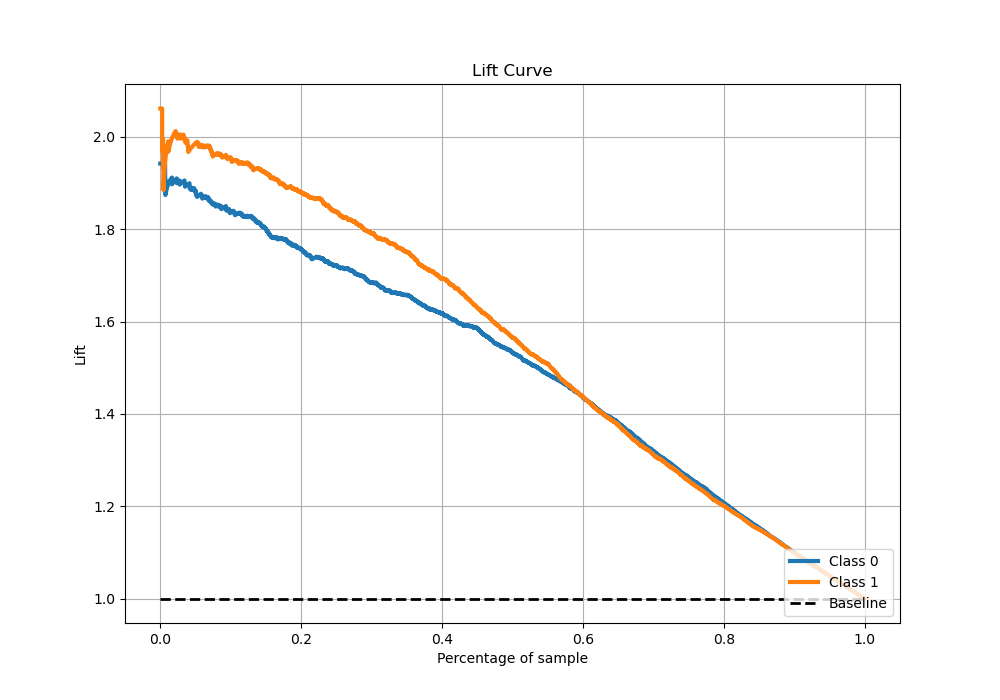

# Summary of 2_Xgboost_GoldenFeatures

[<< Go back](../README.md)

## Extreme Gradient Boosting (Xgboost)
- **n_jobs**: -1
- **objective**: binary:logistic
- **eta**: 0.075
- **max_depth**: 8
- **min_child_weight**: 5
- **subsample**: 1.0
- **colsample_bytree**: 1.0
- **eval_metric**: auc
- **explain_level**: 1

## Validation
 - **validation_type**: kfold
 - **k_folds**: 5
 - **shuffle**: True
 - **stratify**: True

## Optimized metric
auc

## Training time

94.9 seconds

## Metric details
|           |    score |     threshold |
|:----------|---------:|--------------:|
| logloss   | 0.484679 | nan           |
| auc       | 0.852889 | nan           |
| f1        | 0.776319 |   0.387673    |
| accuracy  | 0.777344 |   0.559883    |
| precision | 0.97561  |   0.987826    |
| recall    | 1        |   0.000475312 |
| mcc       | 0.555653 |   0.559883    |

## Metric details with threshold from accuracy metric
|           |    score |   threshold |
|:----------|---------:|------------:|
| logloss   | 0.484679 |  nan        |
| auc       | 0.852889 |  nan        |
| f1        | 0.758397 |    0.559883 |
| accuracy  | 0.777344 |    0.559883 |
| precision | 0.800656 |    0.559883 |
| recall    | 0.720375 |    0.559883 |
| mcc       | 0.555653 |    0.559883 |

## Confusion matrix (at threshold=0.559883)
|              |   Predicted as 0 |   Predicted as 1 |
|:-------------|-----------------:|-----------------:|
| Labeled as 0 |             3290 |              669 |
| Labeled as 1 |             1043 |             2687 |

## Learning curves

## Permutation-based Importance

## Confusion Matrix

## Normalized Confusion Matrix

## ROC Curve

## Kolmogorov-Smirnov Statistic

## Precision-Recall Curve

## Calibration Curve

## Cumulative Gains Curve

## Lift Curve

[<< Go back](../README.md)
