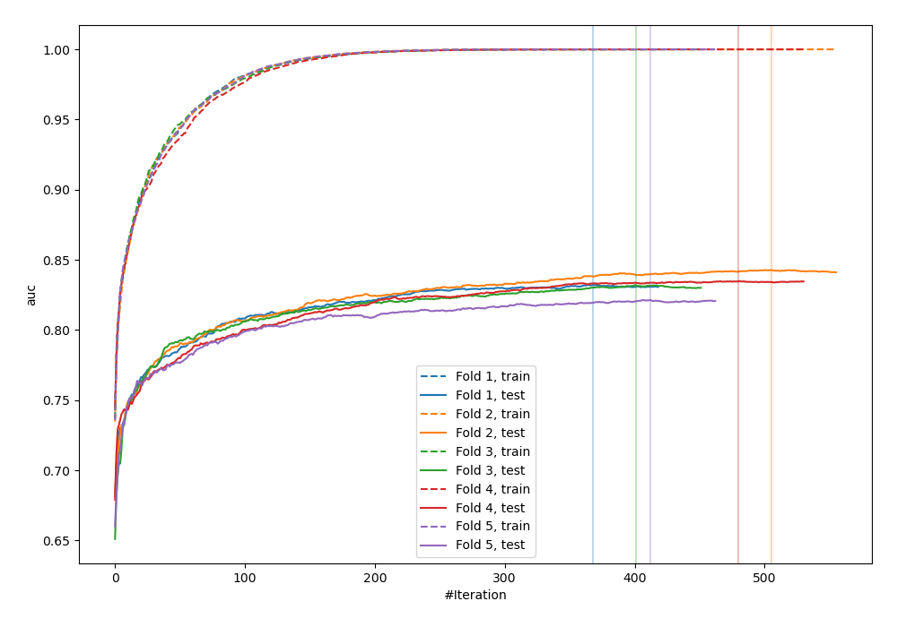
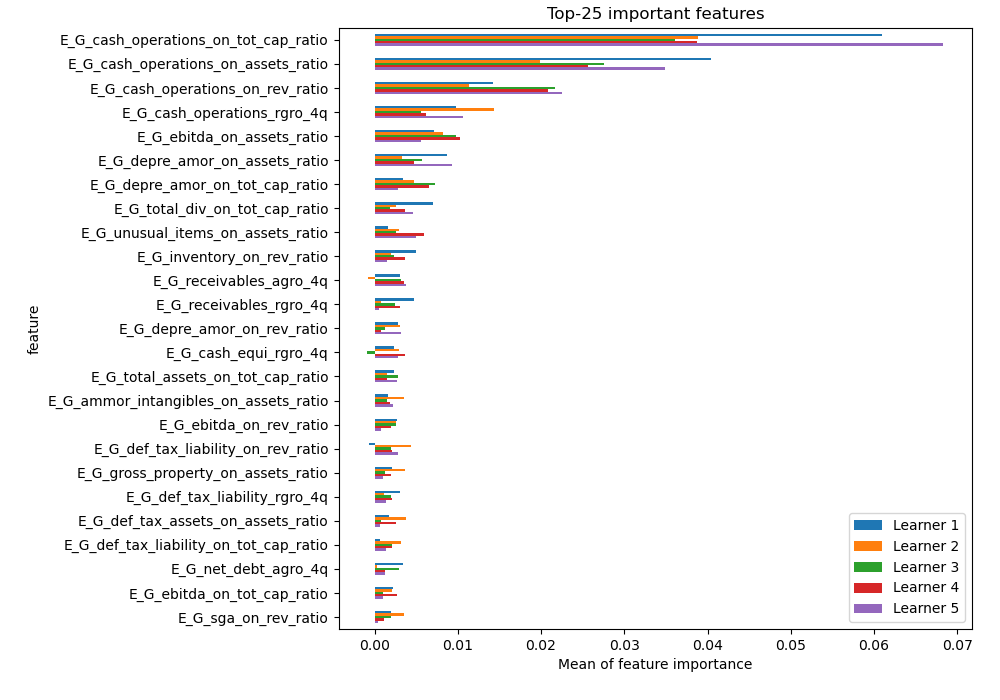
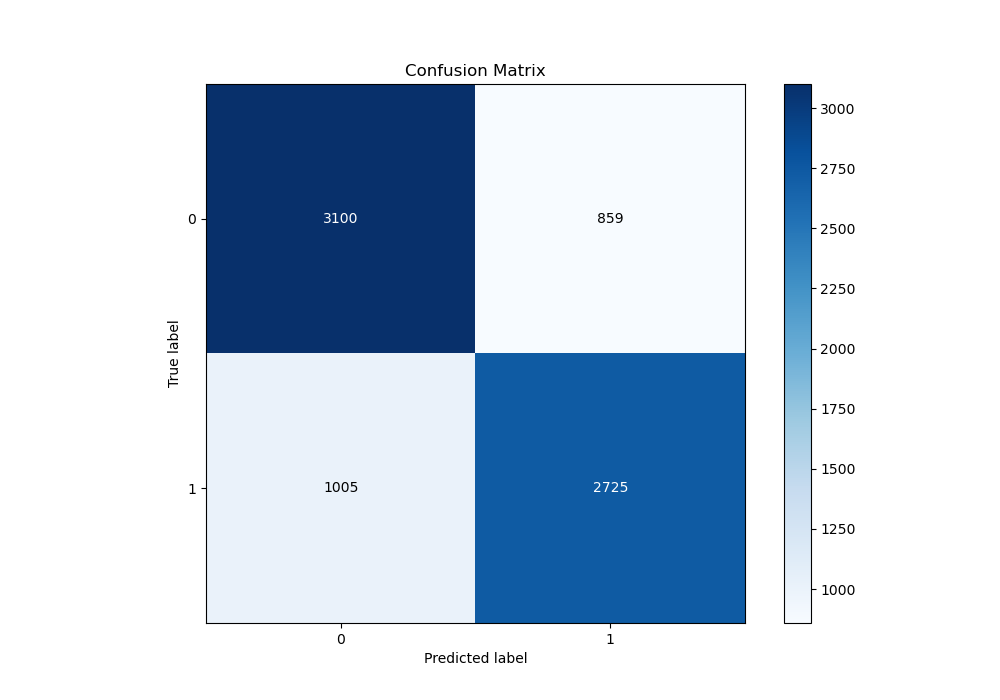
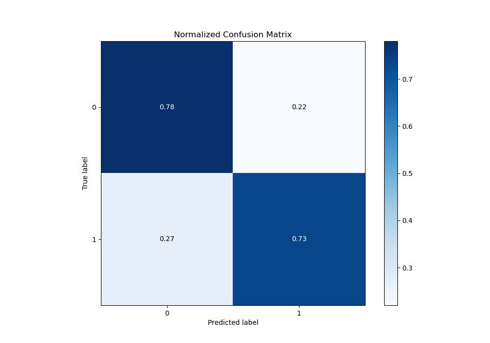
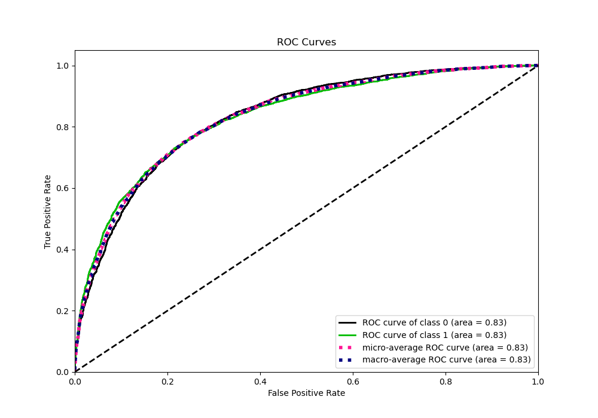
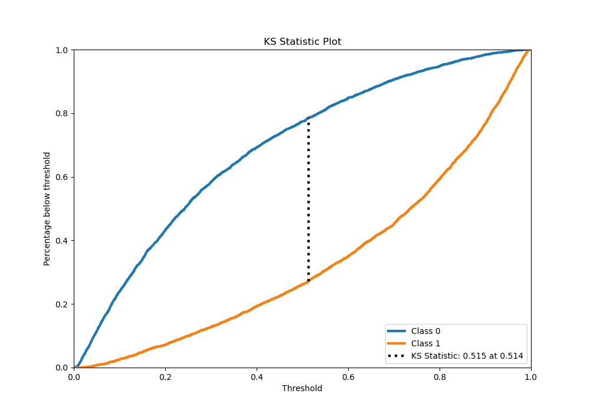
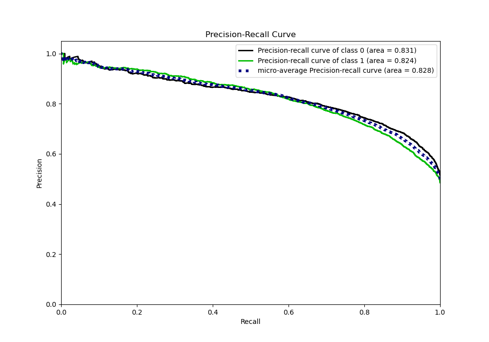
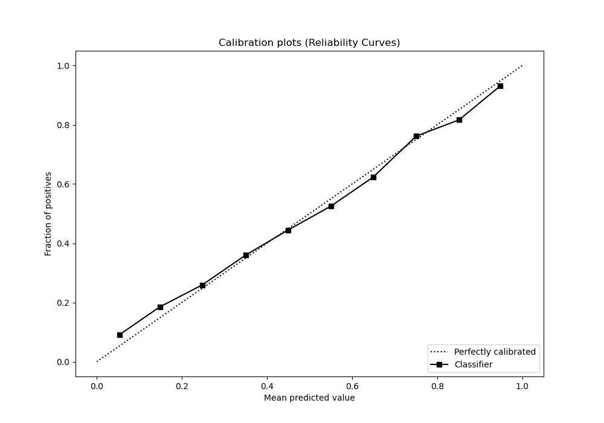
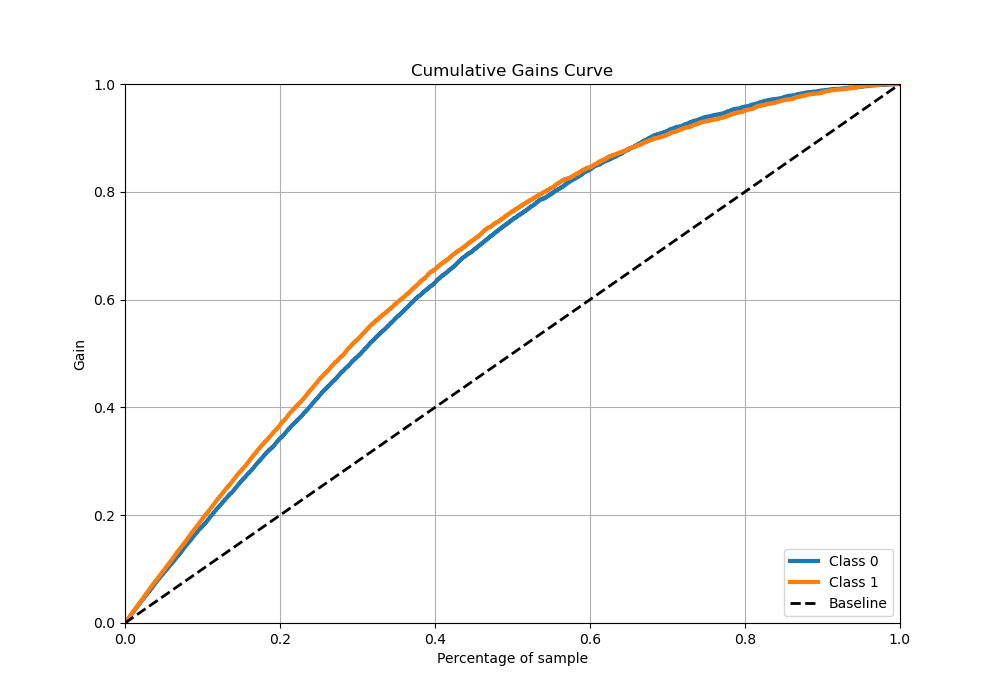
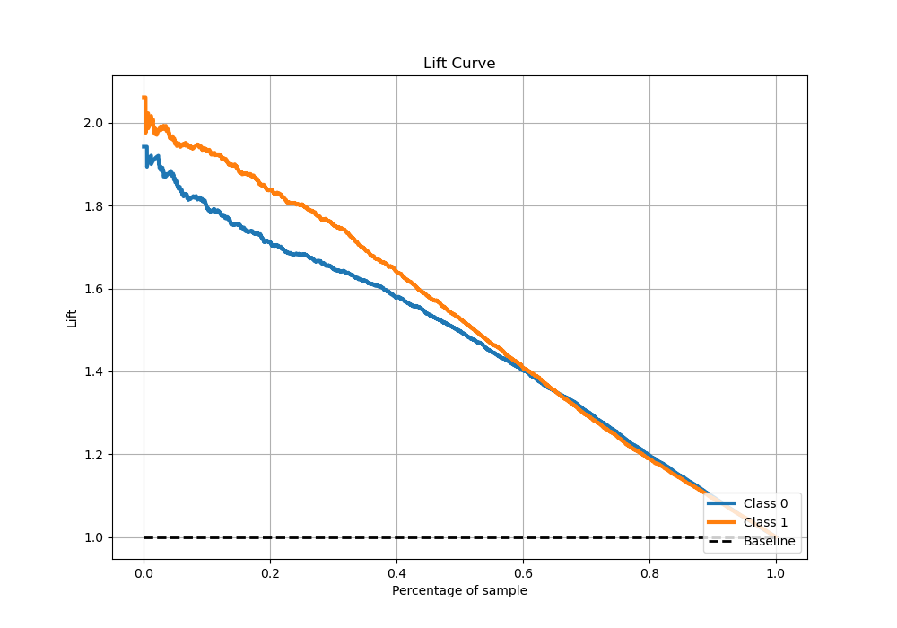

# Summary of 4_Xgboost

[<< Go back](../README.md)

## Extreme Gradient Boosting (Xgboost)
- **n_jobs**: -1
- **objective**: binary:logistic
- **eta**: 0.1
- **max_depth**: 7
- **min_child_weight**: 25
- **subsample**: 0.9
- **colsample_bytree**: 0.6
- **eval_metric**: auc
- **explain_level**: 1

## Validation
 - **validation_type**: kfold
 - **k_folds**: 5
 - **shuffle**: True
 - **stratify**: True

## Optimized metric
auc

## Training time

73.2 seconds

## Metric details
|           |    score |     threshold |
|:----------|---------:|--------------:|
| logloss   | 0.506868 | nan           |
| auc       | 0.832455 | nan           |
| f1        | 0.758732 |   0.383025    |
| accuracy  | 0.757576 |   0.511413    |
| precision | 0.966667 |   0.968301    |
| recall    | 1        |   0.000989078 |
| mcc       | 0.514544 |   0.511413    |

## Metric details with threshold from accuracy metric
|           |    score |   threshold |
|:----------|---------:|------------:|
| logloss   | 0.506868 |  nan        |
| auc       | 0.832455 |  nan        |
| f1        | 0.745146 |    0.511413 |
| accuracy  | 0.757576 |    0.511413 |
| precision | 0.760324 |    0.511413 |
| recall    | 0.730563 |    0.511413 |
| mcc       | 0.514544 |    0.511413 |

## Confusion matrix (at threshold=0.511413)
|              |   Predicted as 0 |   Predicted as 1 |
|:-------------|-----------------:|-----------------:|
| Labeled as 0 |             3100 |              859 |
| Labeled as 1 |             1005 |             2725 |

## Learning curves

## Permutation-based Importance

## Confusion Matrix

## Normalized Confusion Matrix

## ROC Curve

## Kolmogorov-Smirnov Statistic

## Precision-Recall Curve

## Calibration Curve

## Cumulative Gains Curve

## Lift Curve

[<< Go back](../README.md)
