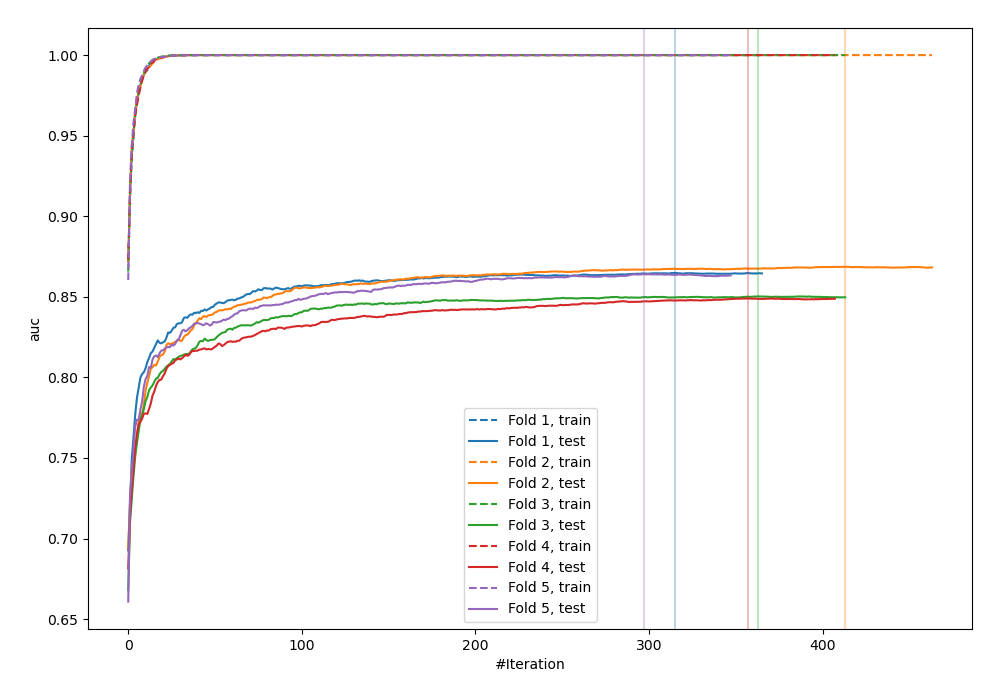
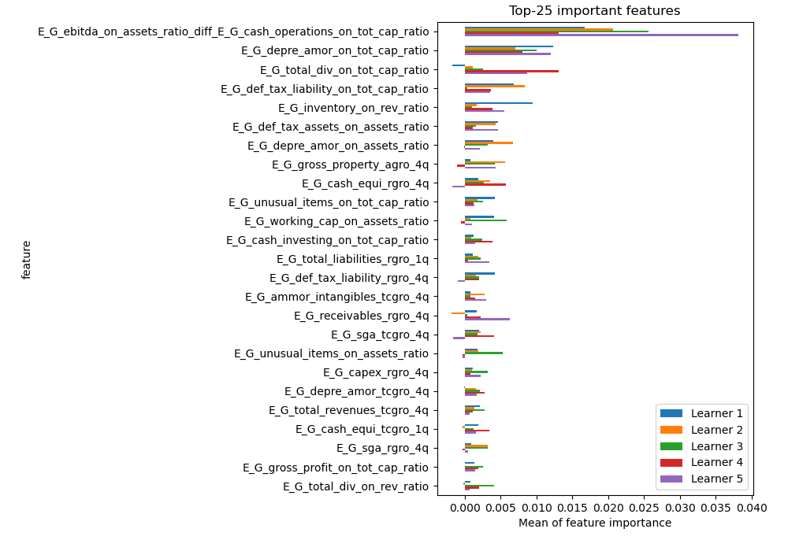
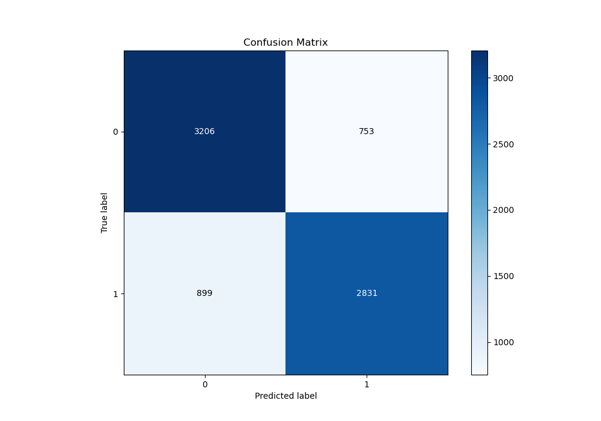
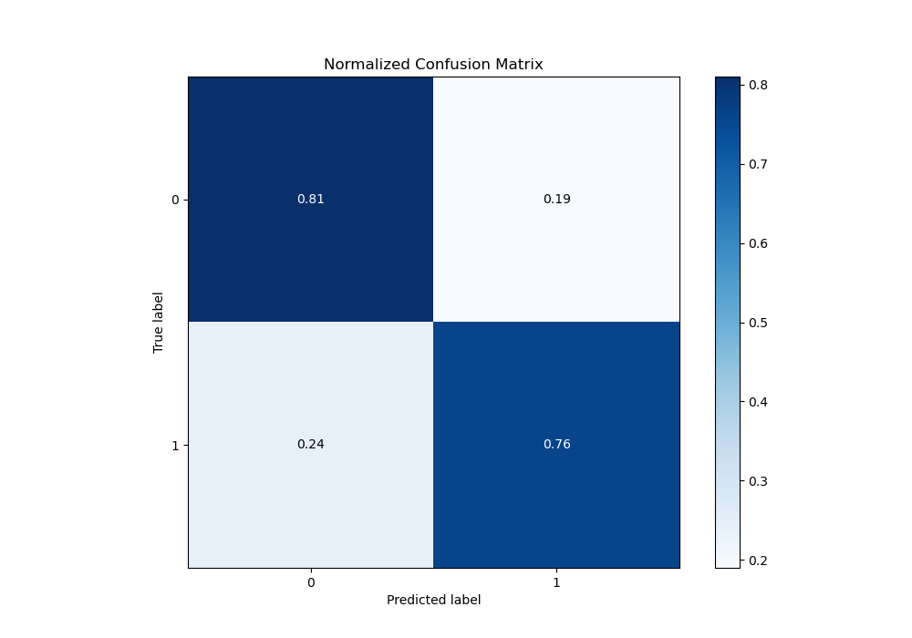
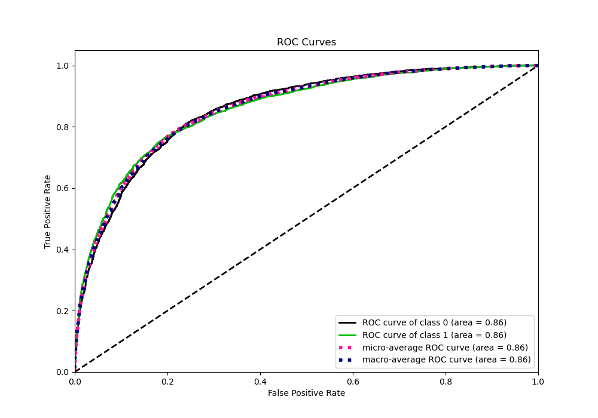
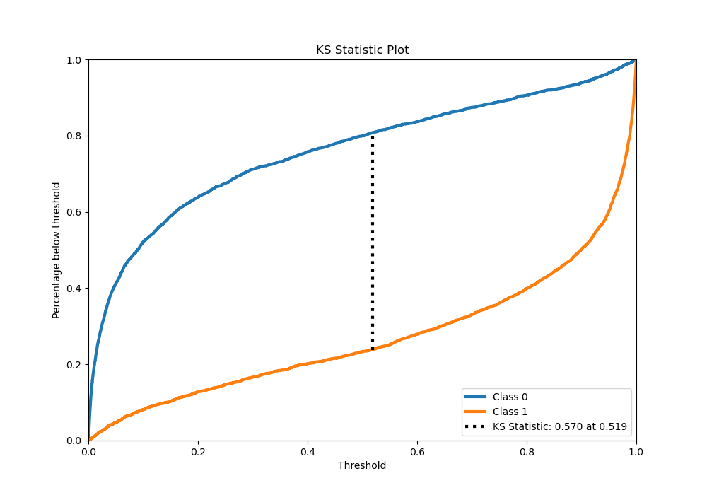
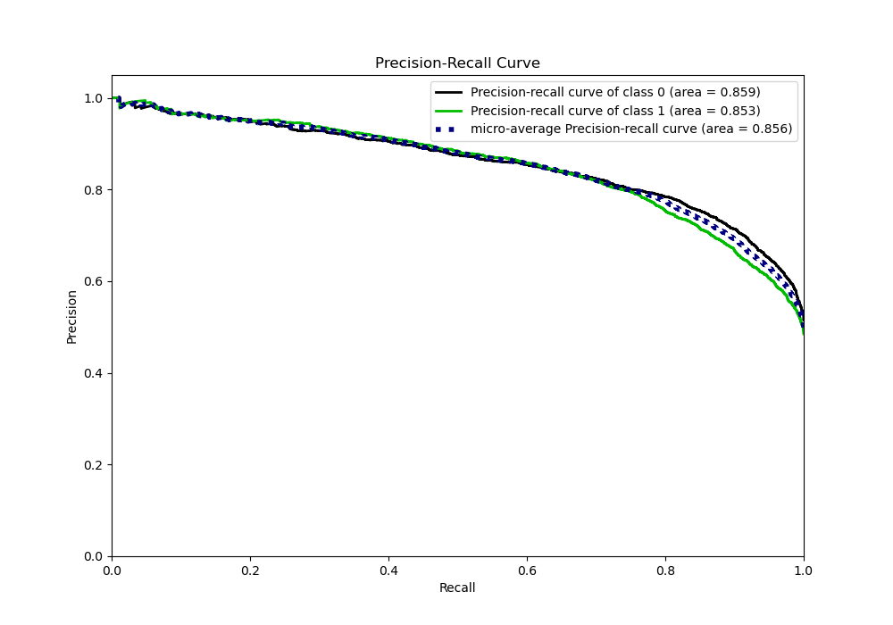
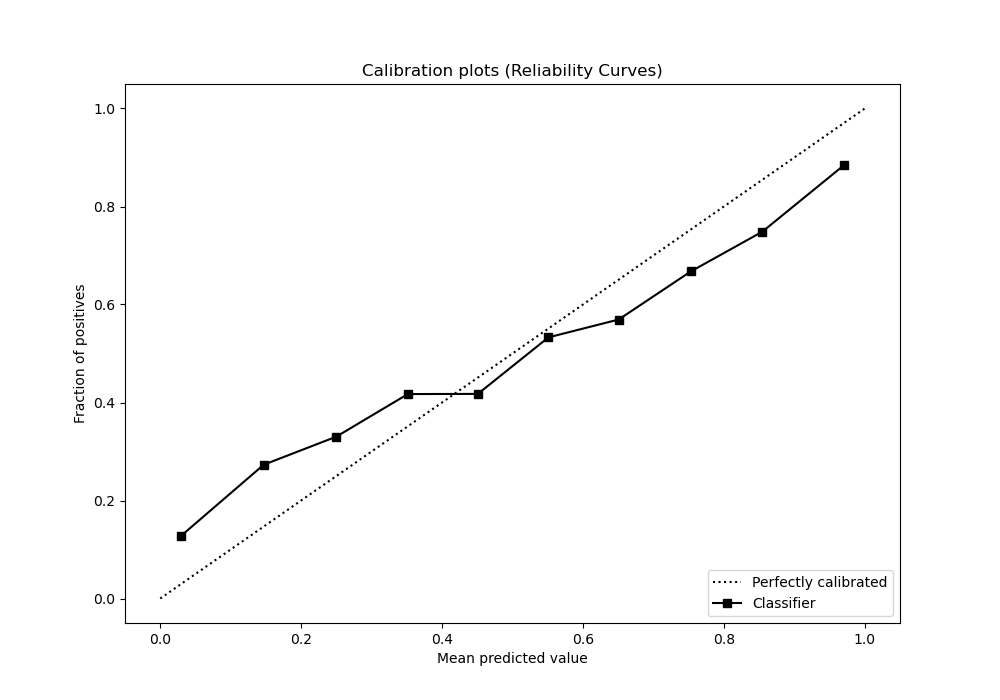
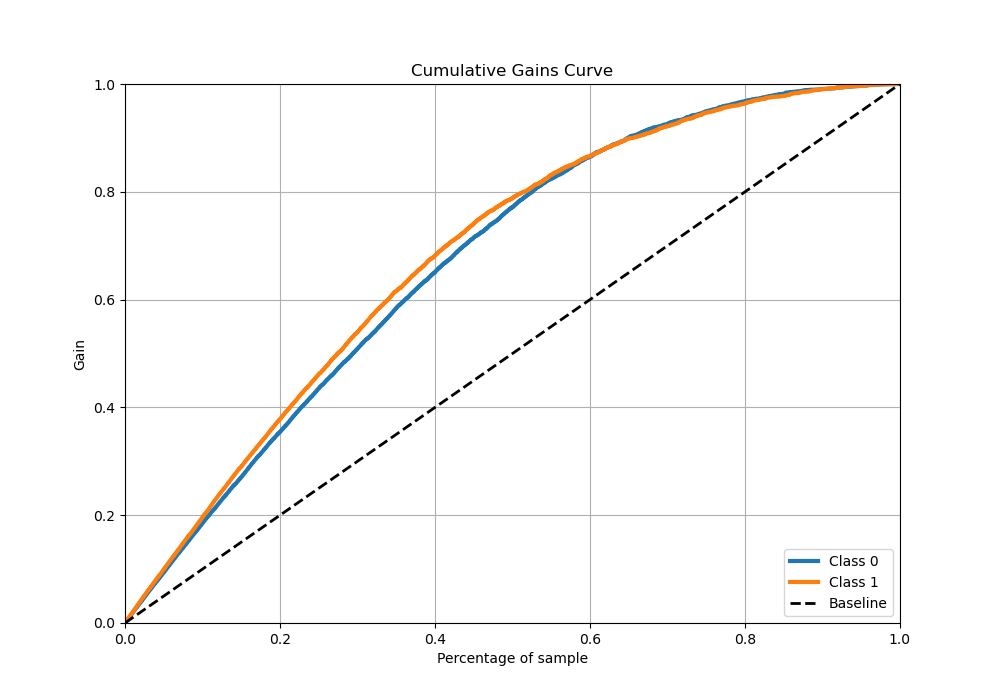
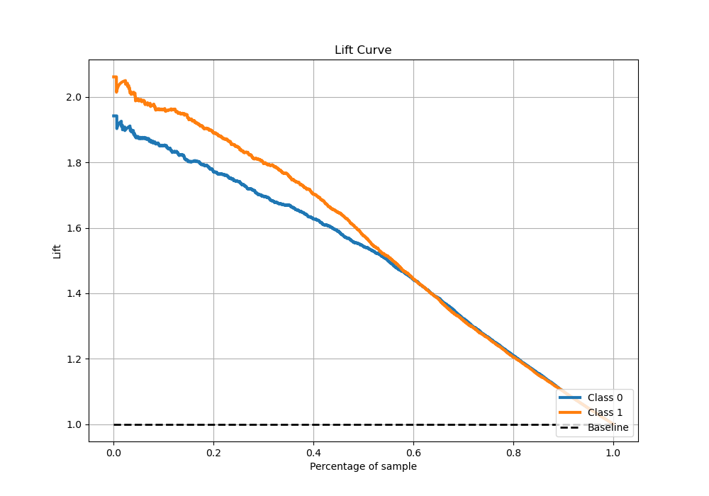

# Summary of 9_Xgboost_GoldenFeatures

[<< Go back](../README.md)

## Extreme Gradient Boosting (Xgboost)
- **n_jobs**: -1
- **objective**: binary:logistic
- **eta**: 0.15
- **max_depth**: 8
- **min_child_weight**: 1
- **subsample**: 1.0
- **colsample_bytree**: 1.0
- **eval_metric**: auc
- **explain_level**: 1

## Validation
 - **validation_type**: kfold
 - **k_folds**: 5
 - **shuffle**: True
 - **stratify**: True

## Optimized metric
auc

## Training time

271.7 seconds

## Metric details
|           |    score |     threshold |
|:----------|---------:|--------------:|
| logloss   | 0.533736 | nan           |
| auc       | 0.858817 | nan           |
| f1        | 0.779445 |   0.29538     |
| accuracy  | 0.785148 |   0.524188    |
| precision | 0.993902 |   0.99841     |
| recall    | 1        |   7.31321e-05 |
| mcc       | 0.570128 |   0.549715    |

## Metric details with threshold from accuracy metric
|           |    score |   threshold |
|:----------|---------:|------------:|
| logloss   | 0.533736 |  nan        |
| auc       | 0.858817 |  nan        |
| f1        | 0.774132 |    0.524188 |
| accuracy  | 0.785148 |    0.524188 |
| precision | 0.7899   |    0.524188 |
| recall    | 0.758981 |    0.524188 |
| mcc       | 0.569839 |    0.524188 |

## Confusion matrix (at threshold=0.524188)
|              |   Predicted as 0 |   Predicted as 1 |
|:-------------|-----------------:|-----------------:|
| Labeled as 0 |             3206 |              753 |
| Labeled as 1 |              899 |             2831 |

## Learning curves

## Permutation-based Importance

## Confusion Matrix

## Normalized Confusion Matrix

## ROC Curve

## Kolmogorov-Smirnov Statistic

## Precision-Recall Curve

## Calibration Curve

## Cumulative Gains Curve

## Lift Curve

[<< Go back](../README.md)
