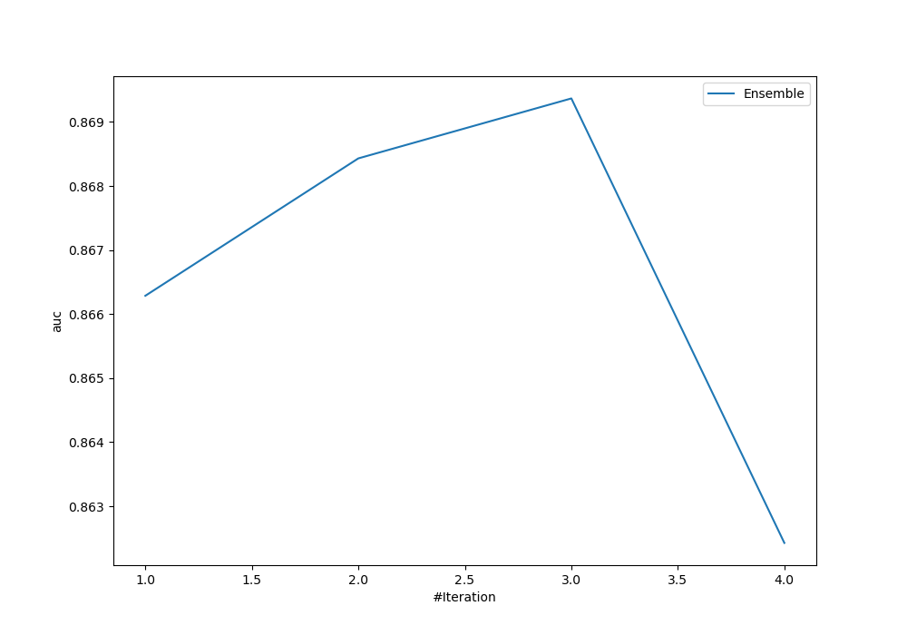
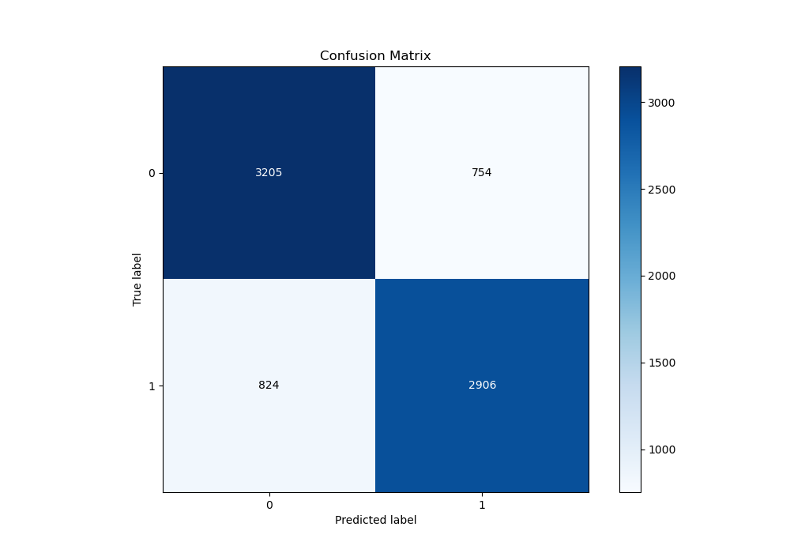
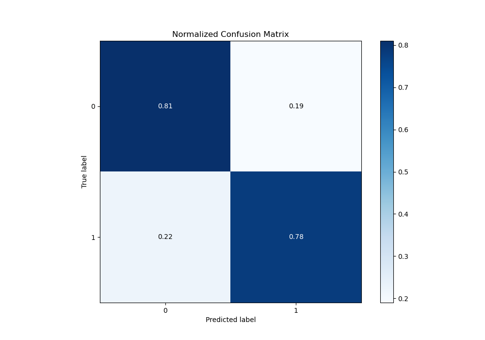
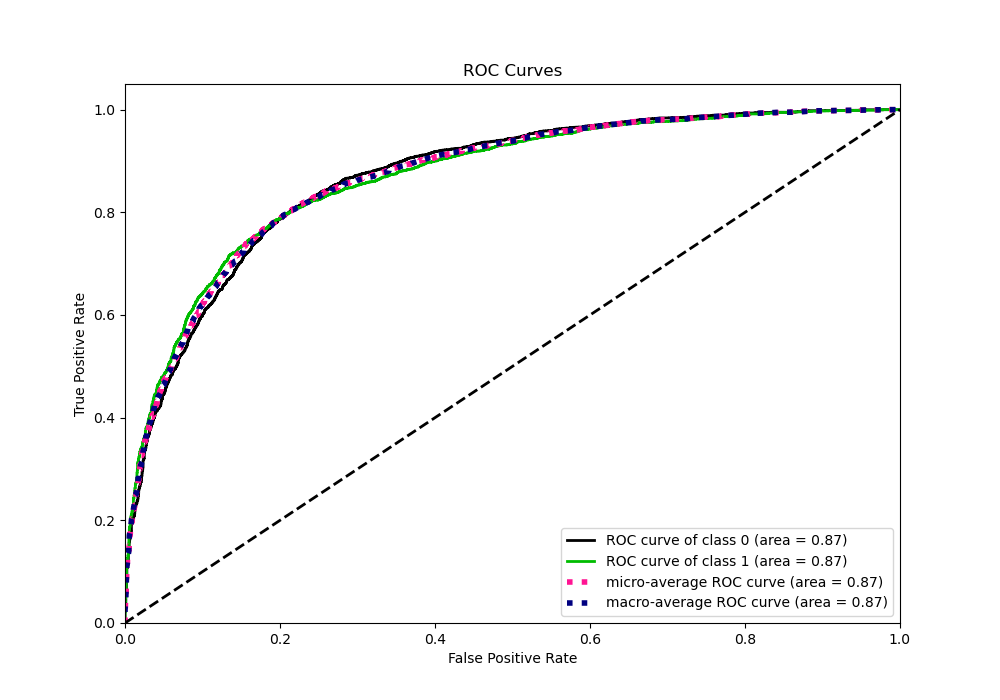
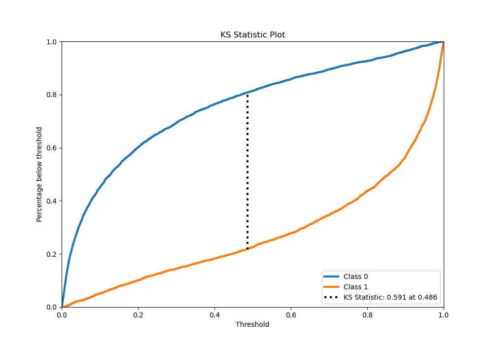
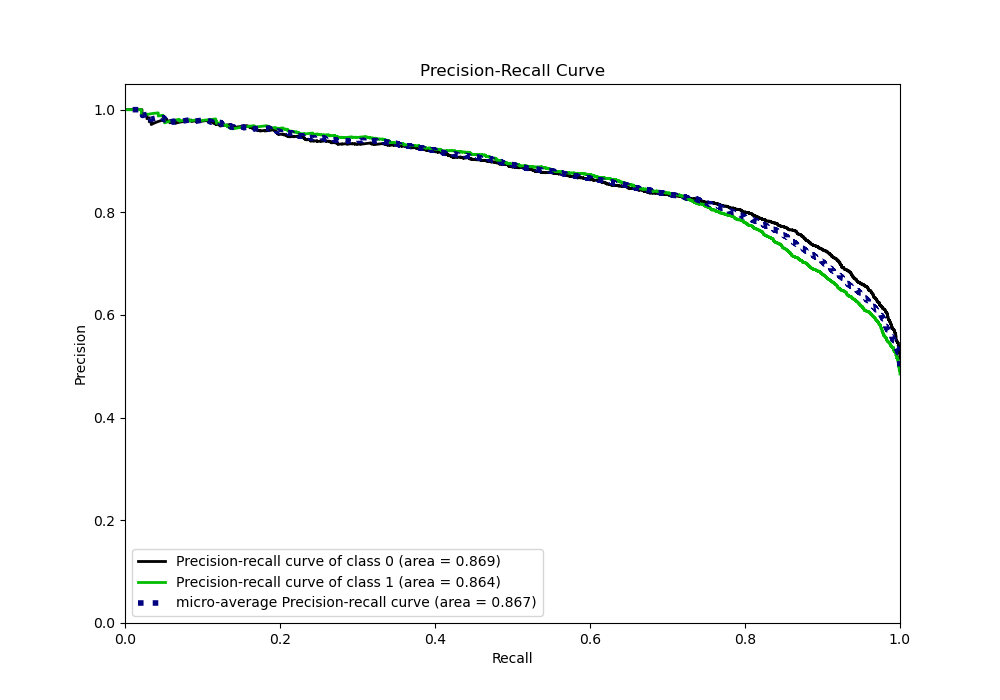
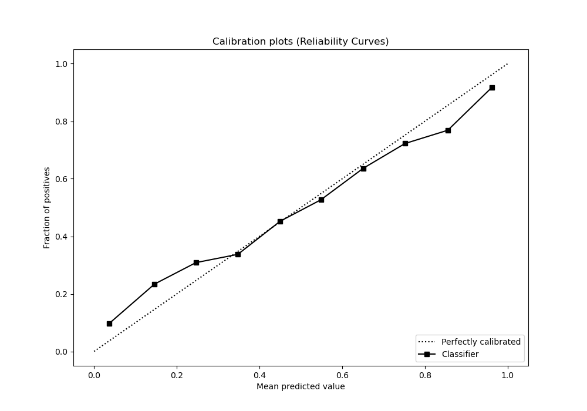
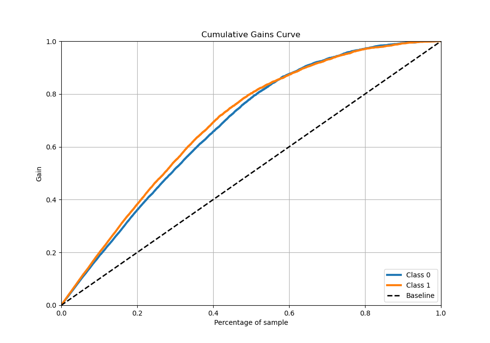
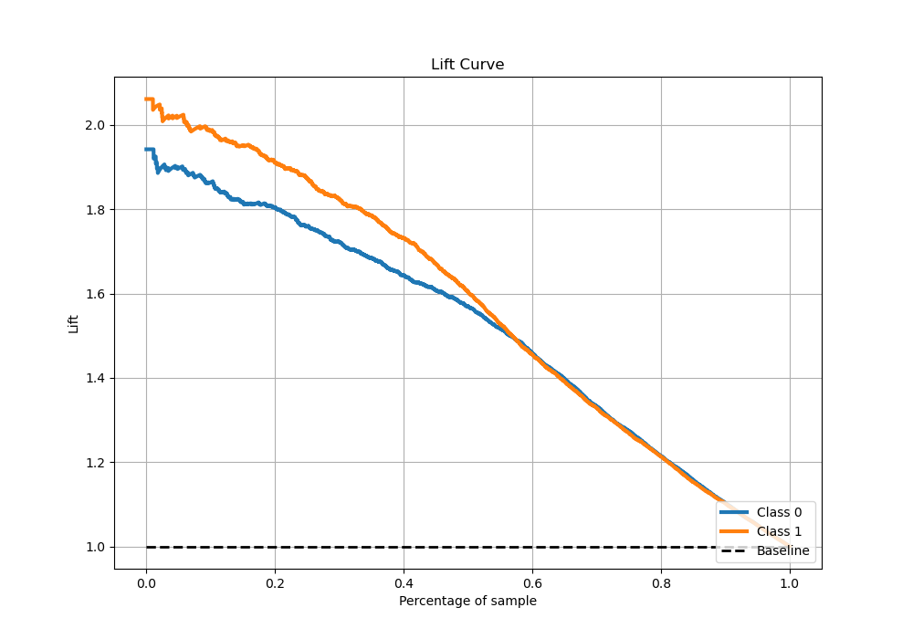

# Summary of Ensemble

[<< Go back](../README.md)

## Ensemble structure
| Model                                             |   Weight |
|:--------------------------------------------------|---------:|
| 10_Xgboost_GoldenFeatures_SelectedFeatures        |        1 |
| 1_Default_Xgboost_GoldenFeatures_SelectedFeatures |        1 |
| 3_Xgboost_GoldenFeatures                          |        1 |

## Metric details
|           |    score |    threshold |
|:----------|---------:|-------------:|
| logloss   | 0.471763 | nan          |
| auc       | 0.869367 | nan          |
| f1        | 0.790746 |   0.406391   |
| accuracy  | 0.794772 |   0.491096   |
| precision | 0.987805 |   0.994889   |
| recall    | 1        |   0.00010542 |
| mcc       | 0.589054 |   0.491096   |

## Metric details with threshold from accuracy metric
|           |    score |   threshold |
|:----------|---------:|------------:|
| logloss   | 0.471763 |  nan        |
| auc       | 0.869367 |  nan        |
| f1        | 0.786468 |    0.491096 |
| accuracy  | 0.794772 |    0.491096 |
| precision | 0.793989 |    0.491096 |
| recall    | 0.779088 |    0.491096 |
| mcc       | 0.589054 |    0.491096 |

## Confusion matrix (at threshold=0.491096)
|              |   Predicted as 0 |   Predicted as 1 |
|:-------------|-----------------:|-----------------:|
| Labeled as 0 |             3205 |              754 |
| Labeled as 1 |              824 |             2906 |

## Learning curves

## Confusion Matrix

## Normalized Confusion Matrix

## ROC Curve

## Kolmogorov-Smirnov Statistic

## Precision-Recall Curve

## Calibration Curve

## Cumulative Gains Curve

## Lift Curve

[<< Go back](../README.md)
