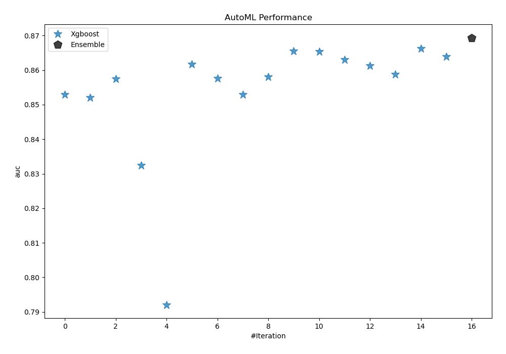
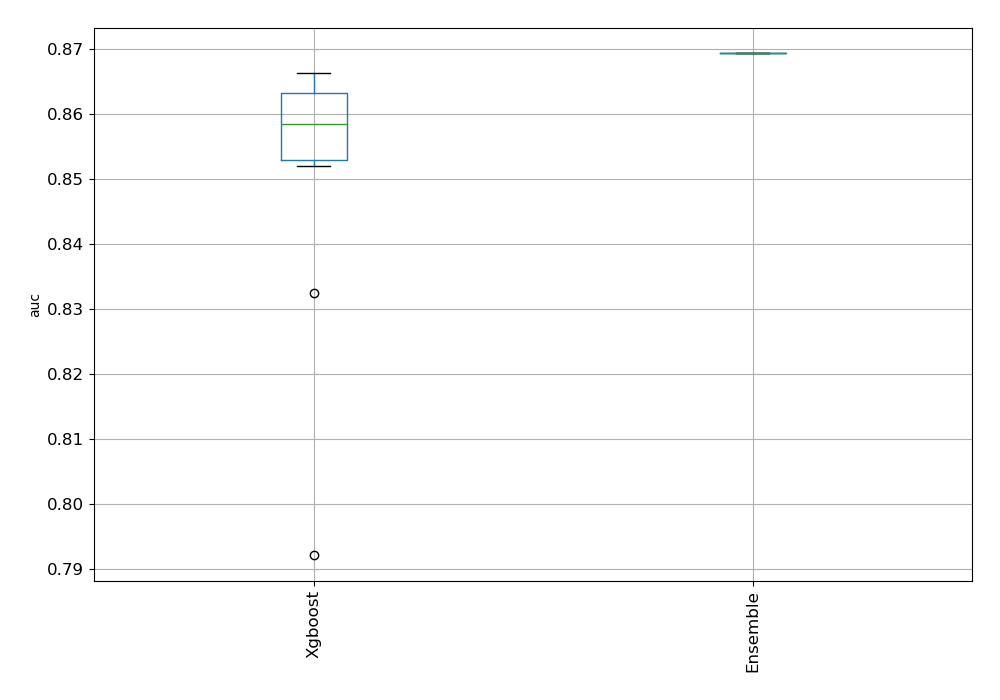
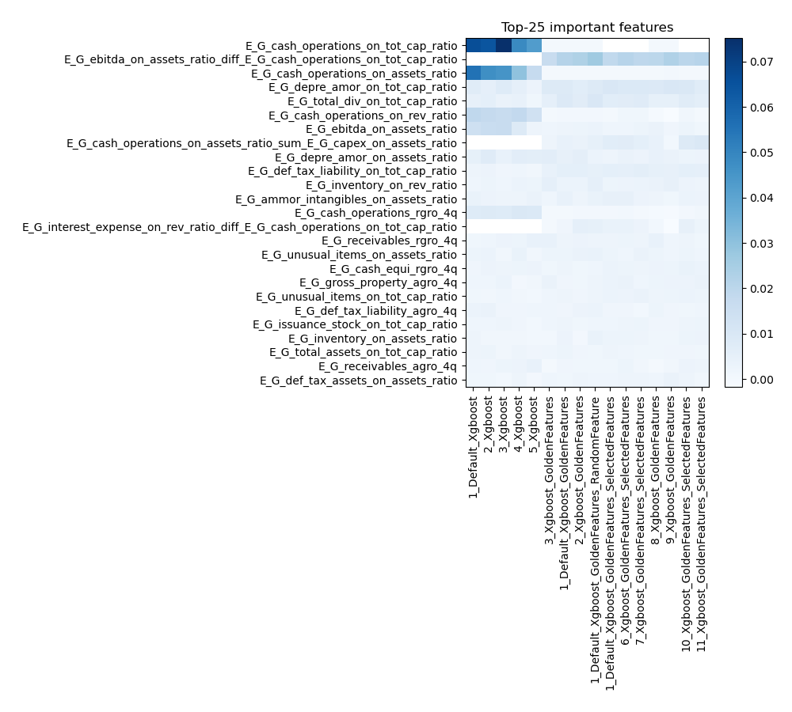
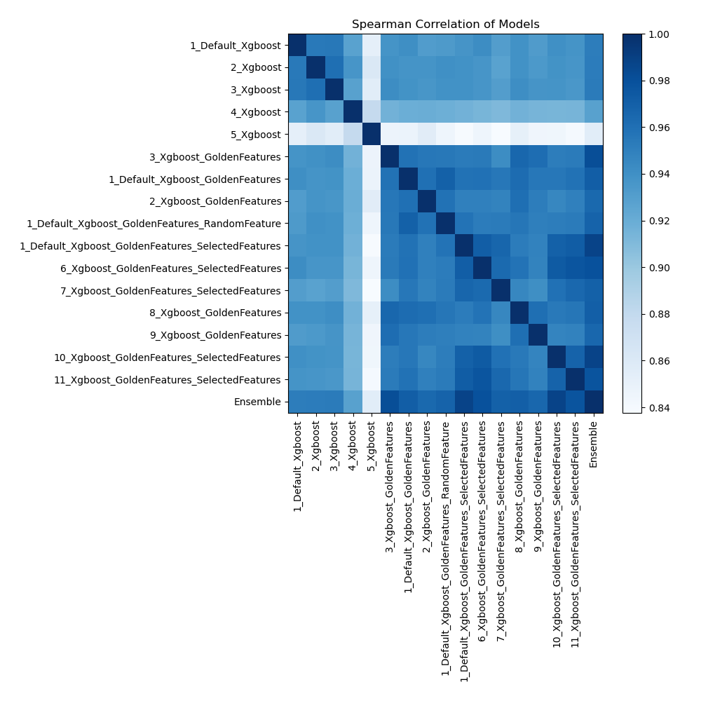

# AutoML Leaderboard

| Best model   | name                                                                                                             | model_type   | metric_type   |   metric_value |   train_time |   single_prediction_time |
|:-------------|:-----------------------------------------------------------------------------------------------------------------|:-------------|:--------------|---------------:|-------------:|-------------------------:|
|              | [1_Default_Xgboost](1_Default_Xgboost/README.md)                                                                 | Xgboost      | auc           |       0.852908 |        98.13 |                   0.1637 |
|              | [2_Xgboost](2_Xgboost/README.md)                                                                                 | Xgboost      | auc           |       0.851954 |       104.49 |                   0.1707 |
|              | [3_Xgboost](3_Xgboost/README.md)                                                                                 | Xgboost      | auc           |       0.857418 |       100.9  |                   0.1789 |
|              | [4_Xgboost](4_Xgboost/README.md)                                                                                 | Xgboost      | auc           |       0.832455 |        73.7  |                   0.1691 |
|              | [5_Xgboost](5_Xgboost/README.md)                                                                                 | Xgboost      | auc           |       0.792091 |        57.55 |                   0.0915 |
|              | [3_Xgboost_GoldenFeatures](3_Xgboost_GoldenFeatures/README.md)                                                   | Xgboost      | auc           |       0.861677 |       420.53 |                   0.1733 |
|              | [1_Default_Xgboost_GoldenFeatures](1_Default_Xgboost_GoldenFeatures/README.md)                                   | Xgboost      | auc           |       0.857567 |       108.35 |                   0.1761 |
|              | [2_Xgboost_GoldenFeatures](2_Xgboost_GoldenFeatures/README.md)                                                   | Xgboost      | auc           |       0.852889 |        95.42 |                   0.1717 |
|              | [1_Default_Xgboost_GoldenFeatures_RandomFeature](1_Default_Xgboost_GoldenFeatures_RandomFeature/README.md)       | Xgboost      | auc           |       0.857964 |       112.87 |                   0.1604 |
|              | [1_Default_Xgboost_GoldenFeatures_SelectedFeatures](1_Default_Xgboost_GoldenFeatures_SelectedFeatures/README.md) | Xgboost      | auc           |       0.865418 |        74.21 |                   0.1188 |
|              | [6_Xgboost_GoldenFeatures_SelectedFeatures](6_Xgboost_GoldenFeatures_SelectedFeatures/README.md)                 | Xgboost      | auc           |       0.865295 |        85.05 |                   0.1101 |
|              | [7_Xgboost_GoldenFeatures_SelectedFeatures](7_Xgboost_GoldenFeatures_SelectedFeatures/README.md)                 | Xgboost      | auc           |       0.862983 |        64.91 |                   0.1167 |
|              | [8_Xgboost_GoldenFeatures](8_Xgboost_GoldenFeatures/README.md)                                                   | Xgboost      | auc           |       0.86121  |       131.75 |                   0.1607 |
|              | [9_Xgboost_GoldenFeatures](9_Xgboost_GoldenFeatures/README.md)                                                   | Xgboost      | auc           |       0.858817 |       272.23 |                   0.1571 |
|              | [10_Xgboost_GoldenFeatures_SelectedFeatures](10_Xgboost_GoldenFeatures_SelectedFeatures/README.md)               | Xgboost      | auc           |       0.866286 |        65.7  |                   0.1154 |
|              | [11_Xgboost_GoldenFeatures_SelectedFeatures](11_Xgboost_GoldenFeatures_SelectedFeatures/README.md)               | Xgboost      | auc           |       0.863935 |        87.62 |                   0.1195 |
| **the best** | [Ensemble](Ensemble/README.md)                                                                                   | Ensemble     | auc           |       0.869367 |         1.25 |                   0.4179 |

### AutoML Performance

### AutoML Performance Boxplot

### Features Importance

### Spearman Correlation of Models

