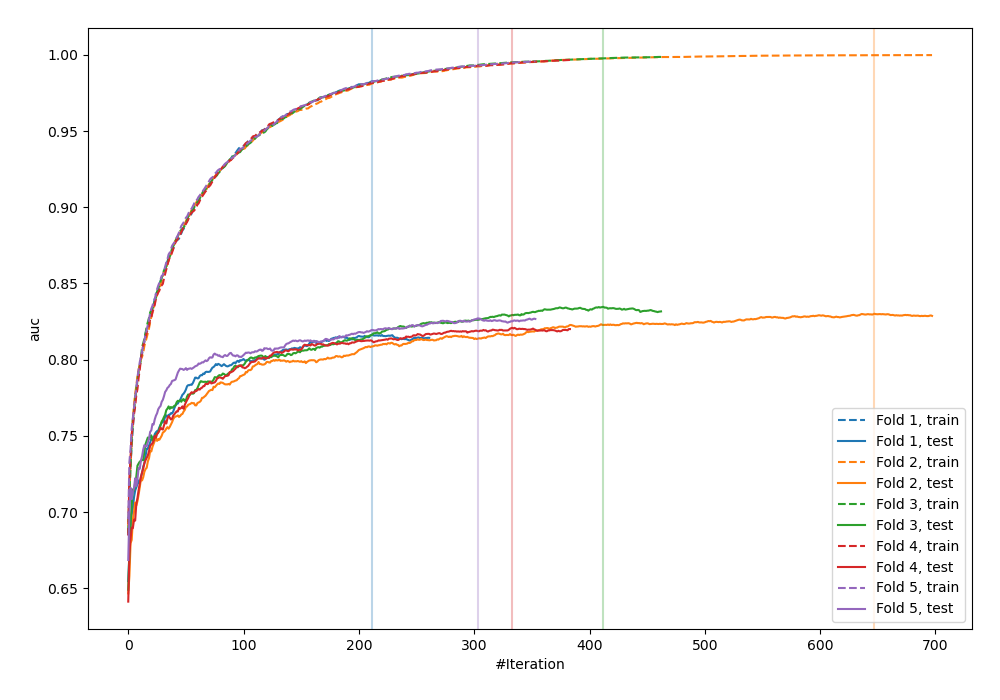
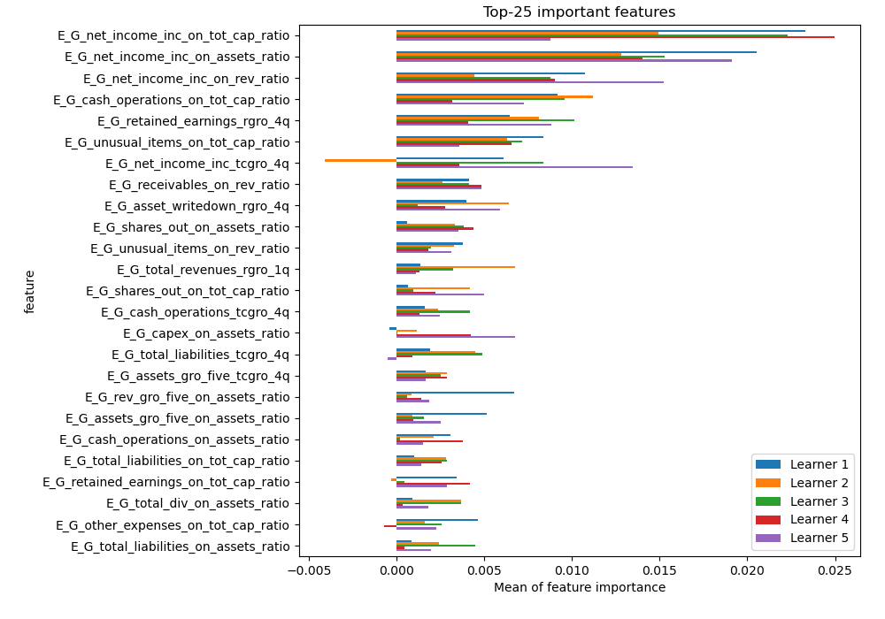
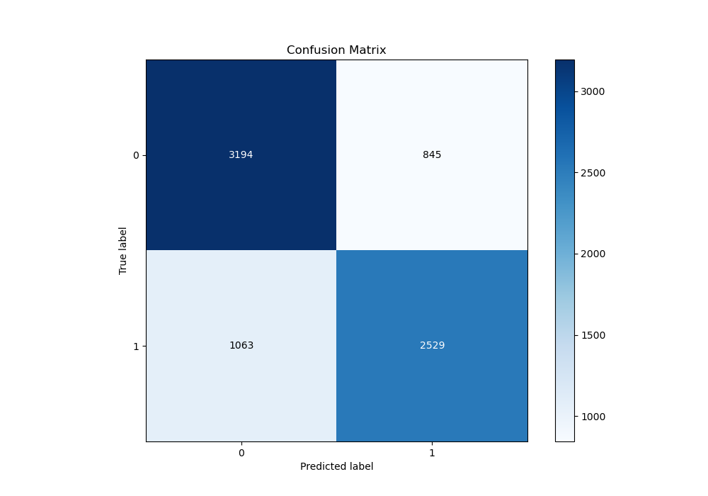
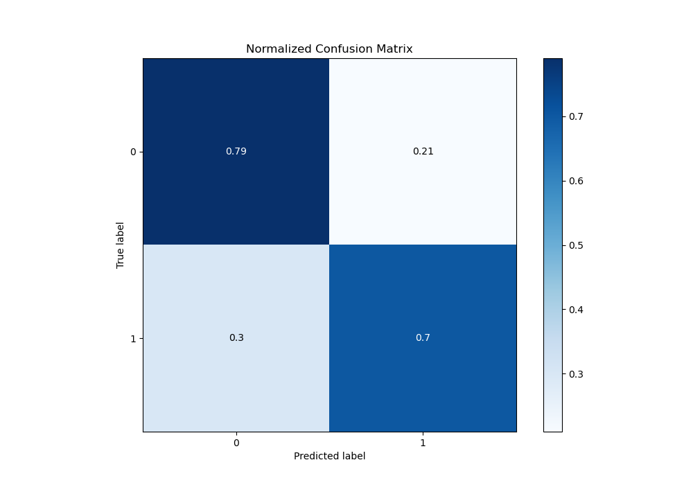
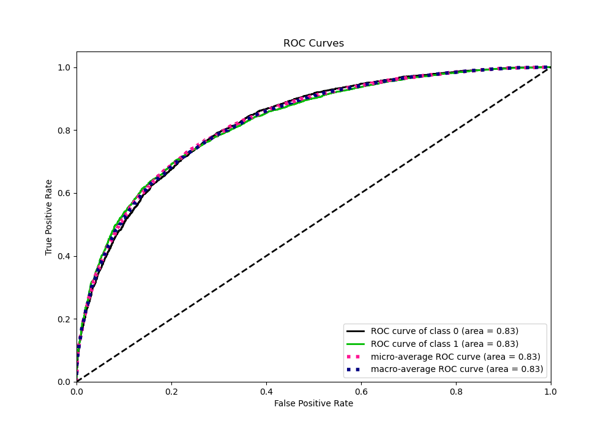
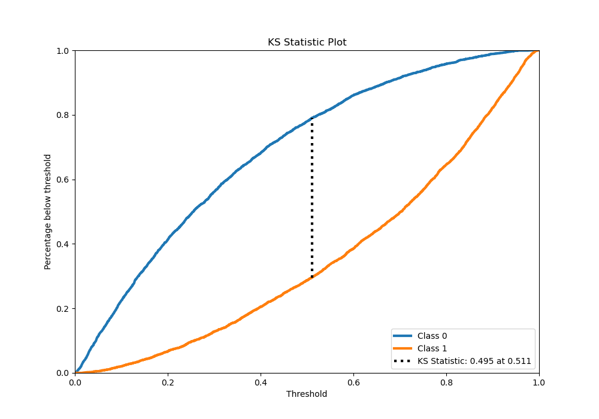
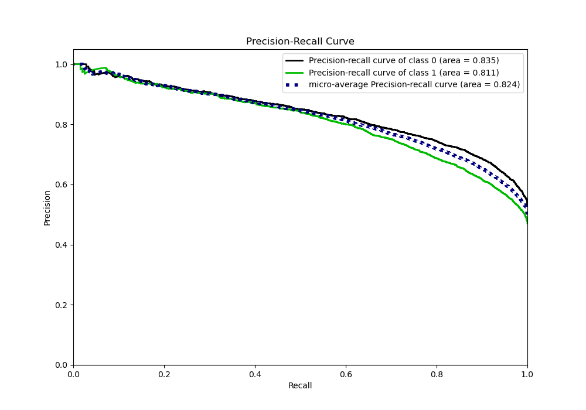
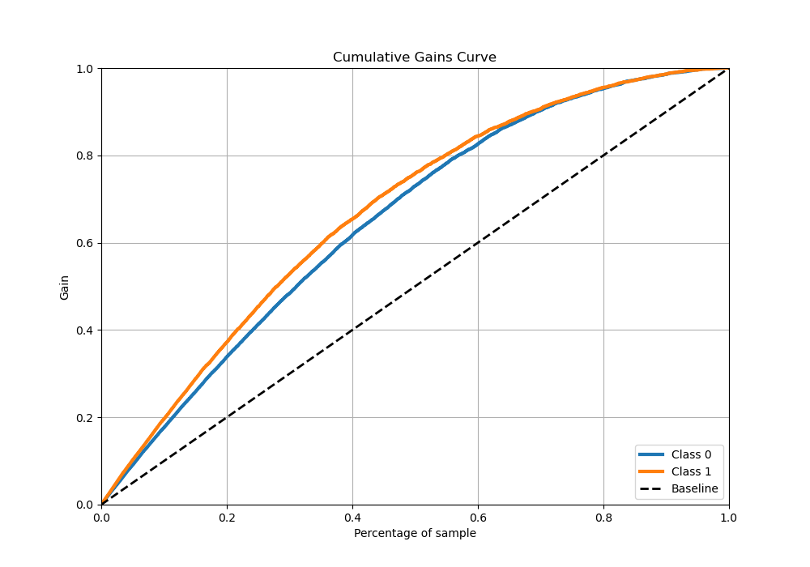
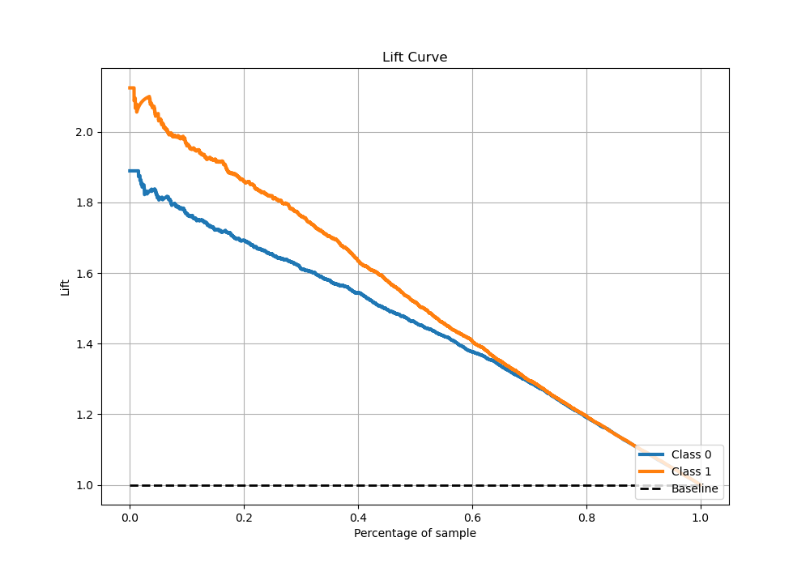

# Summary of 5_Xgboost

[<< Go back](../README.md)

## Extreme Gradient Boosting (Xgboost)
- **n_jobs**: -1
- **objective**: binary:logistic
- **eta**: 0.15
- **max_depth**: 8
- **min_child_weight**: 50
- **subsample**: 0.6
- **colsample_bytree**: 0.6
- **eval_metric**: auc
- **explain_level**: 1

## Validation
 - **validation_type**: kfold
 - **k_folds**: 5
 - **shuffle**: True
 - **stratify**: True

## Optimized metric
auc

## Training time

63.7 seconds

## Metric details
|           |    score |     threshold |
|:----------|---------:|--------------:|
| logloss   | 0.511636 | nan           |
| auc       | 0.825534 | nan           |
| f1        | 0.743153 |   0.350433    |
| accuracy  | 0.749967 |   0.51088     |
| precision | 0.988372 |   0.954614    |
| recall    | 1        |   0.000987675 |
| mcc       | 0.497345 |   0.51088     |

## Metric details with threshold from accuracy metric
|           |    score |   threshold |
|:----------|---------:|------------:|
| logloss   | 0.511636 |   nan       |
| auc       | 0.825534 |   nan       |
| f1        | 0.726098 |     0.51088 |
| accuracy  | 0.749967 |     0.51088 |
| precision | 0.749555 |     0.51088 |
| recall    | 0.704065 |     0.51088 |
| mcc       | 0.497345 |     0.51088 |

## Confusion matrix (at threshold=0.51088)
|              |   Predicted as 0 |   Predicted as 1 |
|:-------------|-----------------:|-----------------:|
| Labeled as 0 |             3194 |              845 |
| Labeled as 1 |             1063 |             2529 |

## Learning curves

## Permutation-based Importance

## Confusion Matrix

## Normalized Confusion Matrix

## ROC Curve

## Kolmogorov-Smirnov Statistic

## Precision-Recall Curve

## Calibration Curve

## Cumulative Gains Curve

## Lift Curve

[<< Go back](../README.md)
