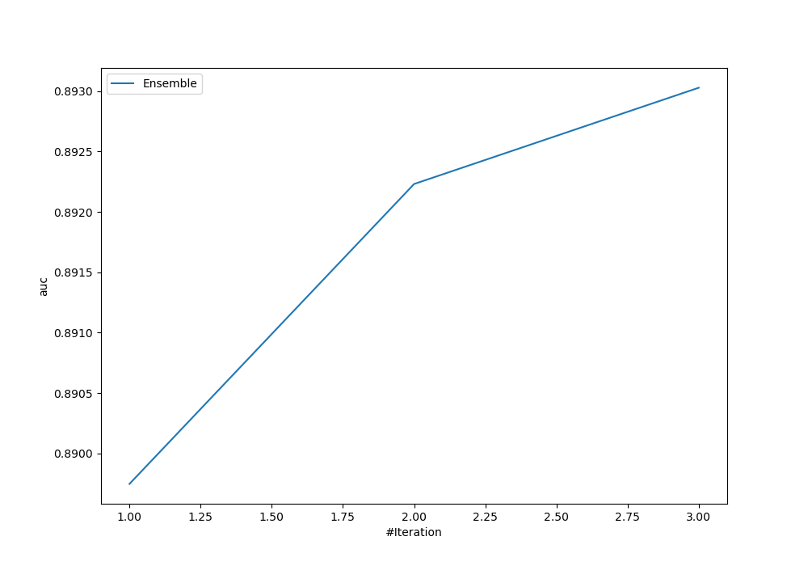
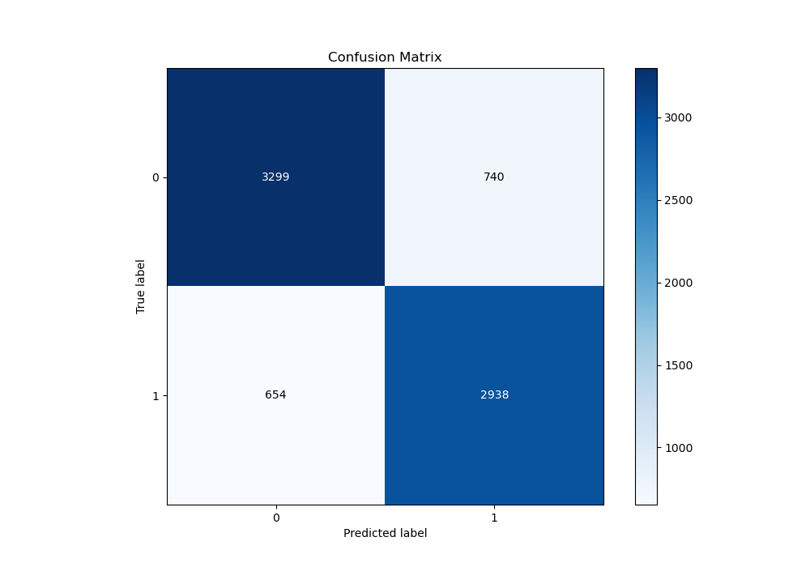
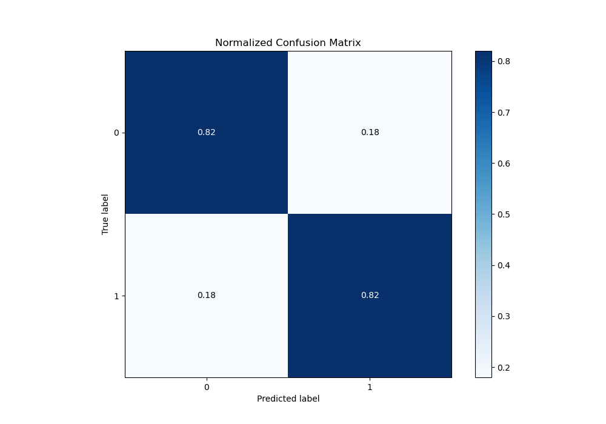
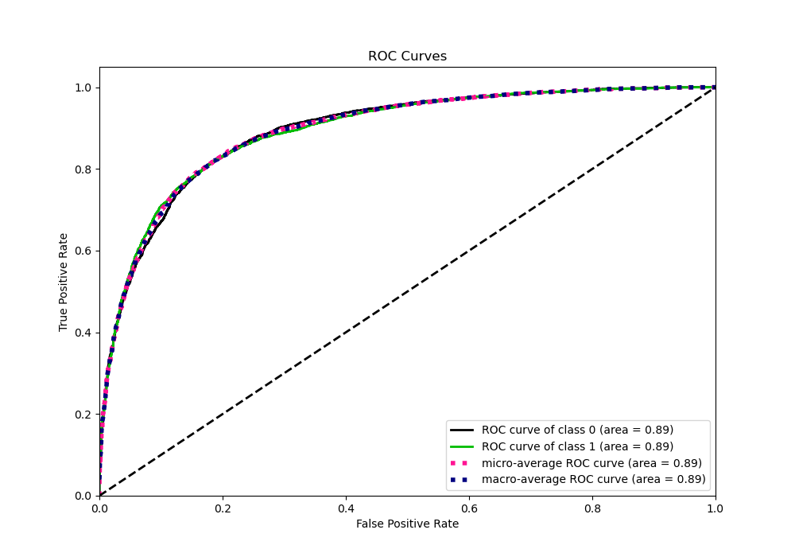
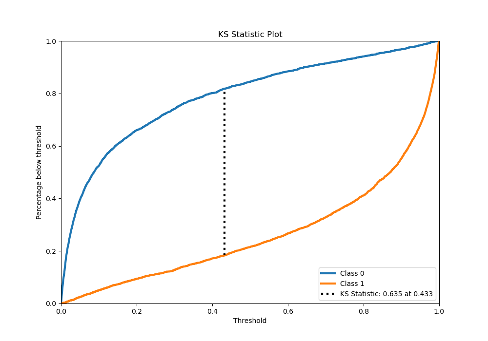
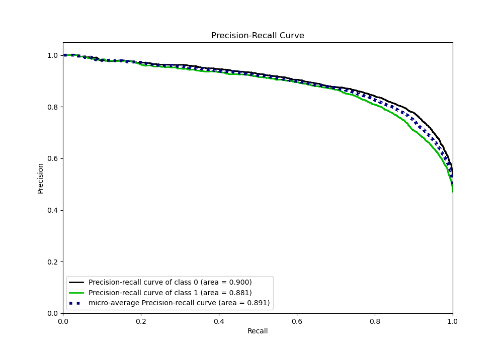
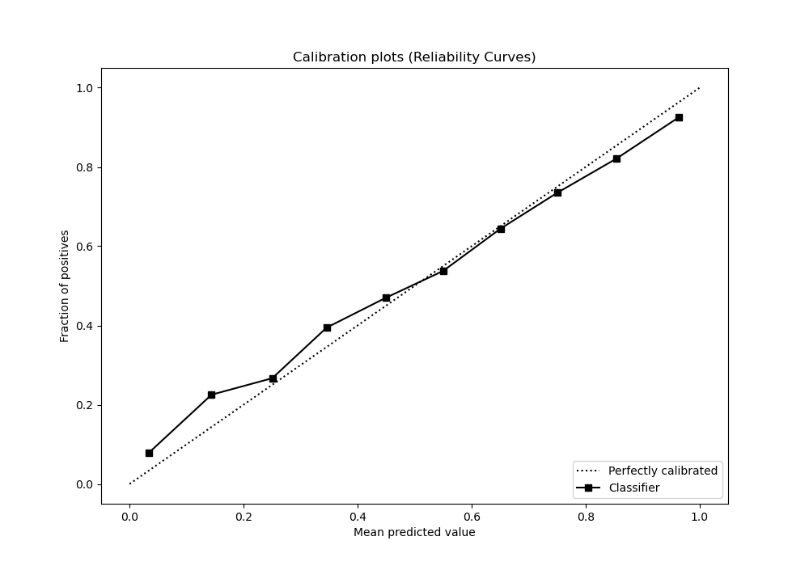
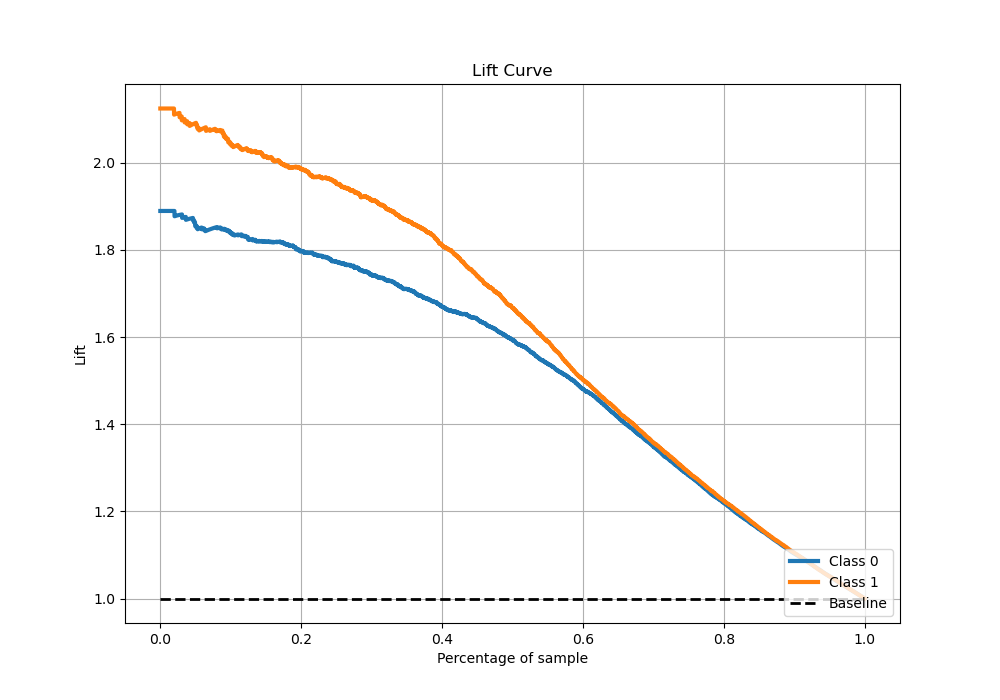

# Summary of Ensemble

[<< Go back](../README.md)

## Ensemble structure
| Model                    |   Weight |
|:-------------------------|---------:|
| 3_Xgboost                |        1 |
| 3_Xgboost_GoldenFeatures |        1 |
| 6_Xgboost_GoldenFeatures |        1 |

## Metric details
|           |    score |     threshold |
|:----------|---------:|--------------:|
| logloss   | 0.425743 | nan           |
| auc       | 0.893027 | nan           |
| f1        | 0.809016 |   0.365832    |
| accuracy  | 0.817324 |   0.428992    |
| precision | 1        |   0.996683    |
| recall    | 1        |   7.17524e-05 |
| mcc       | 0.634037 |   0.428992    |

## Metric details with threshold from accuracy metric
|           |    score |   threshold |
|:----------|---------:|------------:|
| logloss   | 0.425743 |  nan        |
| auc       | 0.893027 |  nan        |
| f1        | 0.808253 |    0.428992 |
| accuracy  | 0.817324 |    0.428992 |
| precision | 0.798804 |    0.428992 |
| recall    | 0.817929 |    0.428992 |
| mcc       | 0.634037 |    0.428992 |

## Confusion matrix (at threshold=0.428992)
|              |   Predicted as 0 |   Predicted as 1 |
|:-------------|-----------------:|-----------------:|
| Labeled as 0 |             3299 |              740 |
| Labeled as 1 |              654 |             2938 |

## Learning curves

## Confusion Matrix

## Normalized Confusion Matrix

## ROC Curve

## Kolmogorov-Smirnov Statistic

## Precision-Recall Curve

## Calibration Curve

## Cumulative Gains Curve

## Lift Curve

[<< Go back](../README.md)
