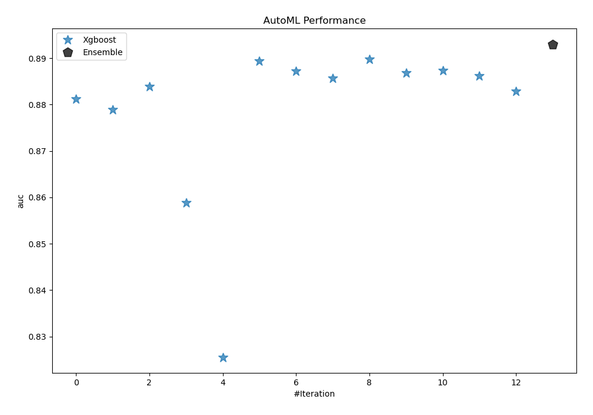
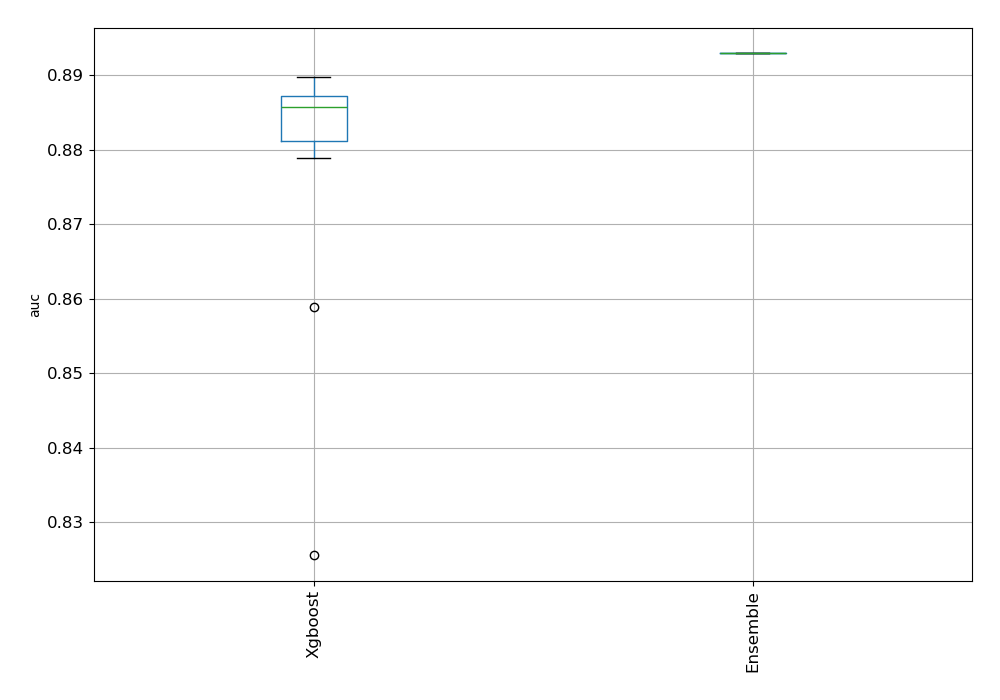
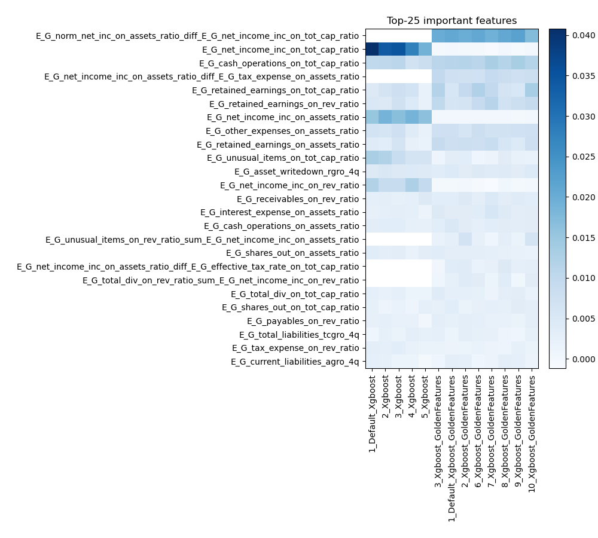
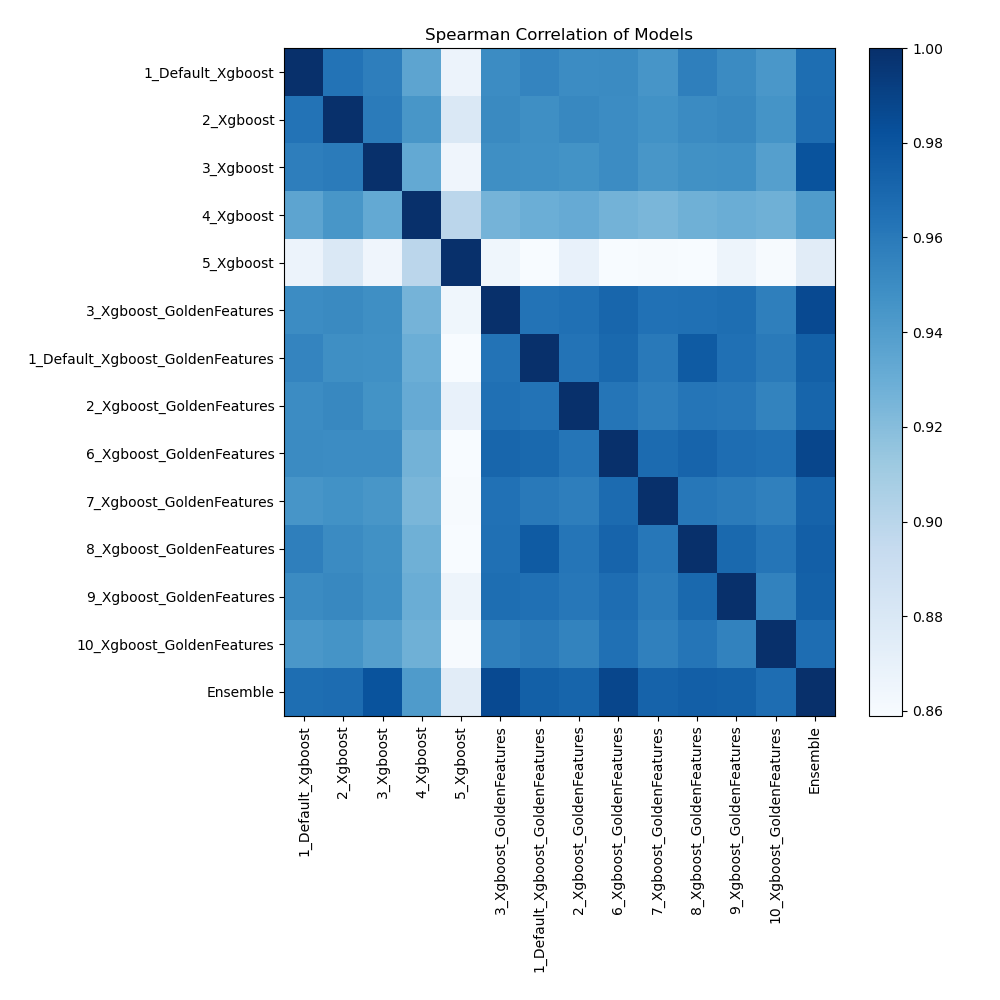

# AutoML Leaderboard

| Best model   | name                                                                           | model_type   | metric_type   |   metric_value |   train_time |   single_prediction_time |
|:-------------|:-------------------------------------------------------------------------------|:-------------|:--------------|---------------:|-------------:|-------------------------:|
|              | [1_Default_Xgboost](1_Default_Xgboost/README.md)                               | Xgboost      | auc           |       0.881159 |        88    |                   0.1565 |
|              | [2_Xgboost](2_Xgboost/README.md)                                               | Xgboost      | auc           |       0.878884 |       109.36 |                   0.0995 |
|              | [3_Xgboost](3_Xgboost/README.md)                                               | Xgboost      | auc           |       0.883934 |        89.67 |                   0.1018 |
|              | [4_Xgboost](4_Xgboost/README.md)                                               | Xgboost      | auc           |       0.858885 |        83.48 |                   0.0986 |
|              | [5_Xgboost](5_Xgboost/README.md)                                               | Xgboost      | auc           |       0.825534 |        64.32 |                   0.0922 |
|              | [3_Xgboost_GoldenFeatures](3_Xgboost_GoldenFeatures/README.md)                 | Xgboost      | auc           |       0.889347 |       319.94 |                   0.1601 |
|              | [1_Default_Xgboost_GoldenFeatures](1_Default_Xgboost_GoldenFeatures/README.md) | Xgboost      | auc           |       0.887258 |       108.48 |                   0.1618 |
|              | [2_Xgboost_GoldenFeatures](2_Xgboost_GoldenFeatures/README.md)                 | Xgboost      | auc           |       0.885723 |       101.92 |                   0.1629 |
| **the best** | [6_Xgboost_GoldenFeatures](6_Xgboost_GoldenFeatures/README.md)                 | Xgboost      | auc           |       0.889749 |       119.29 |                   0.1564 |
|              | [7_Xgboost_GoldenFeatures](7_Xgboost_GoldenFeatures/README.md)                 | Xgboost      | auc           |       0.886818 |        96.2  |                   0.1549 |
|              | [8_Xgboost_GoldenFeatures](8_Xgboost_GoldenFeatures/README.md)                 | Xgboost      | auc           |       0.88739  |       124.28 |                   0.179  |
|              | [9_Xgboost_GoldenFeatures](9_Xgboost_GoldenFeatures/README.md)                 | Xgboost      | auc           |       0.886249 |        98.42 |                   0.1717 |
|              | [10_Xgboost_GoldenFeatures](10_Xgboost_GoldenFeatures/README.md)               | Xgboost      | auc           |       0.882827 |        96.04 |                   0.1763 |
|              | [Ensemble](Ensemble/README.md)                                                 | Ensemble     | auc           |       0.893027 |         1.19 |                   0.6514 |

### AutoML Performance

### AutoML Performance Boxplot

### Features Importance

### Spearman Correlation of Models

