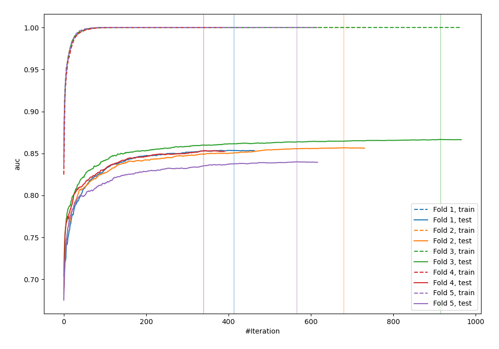
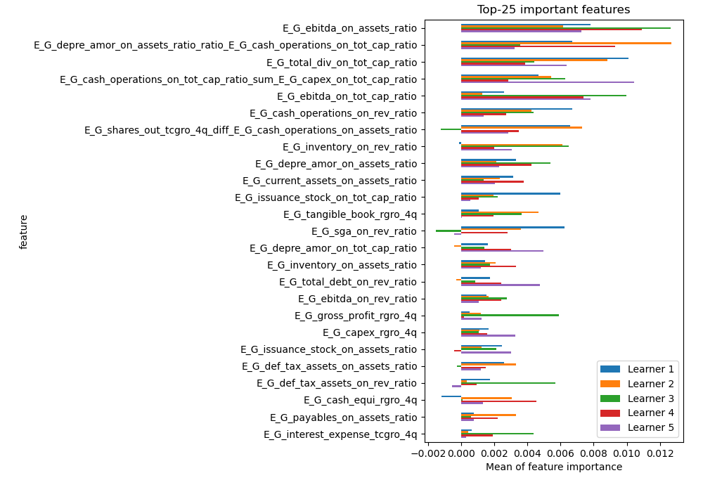
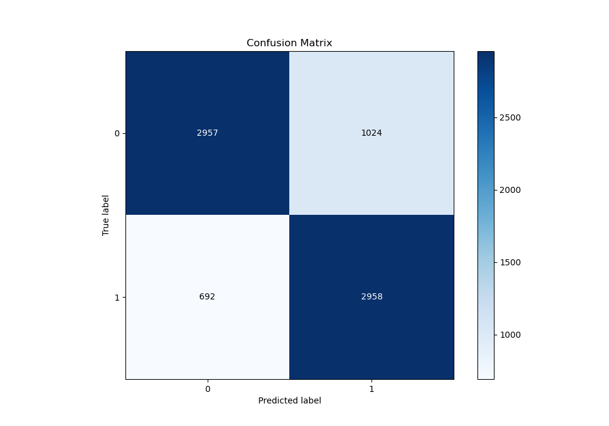
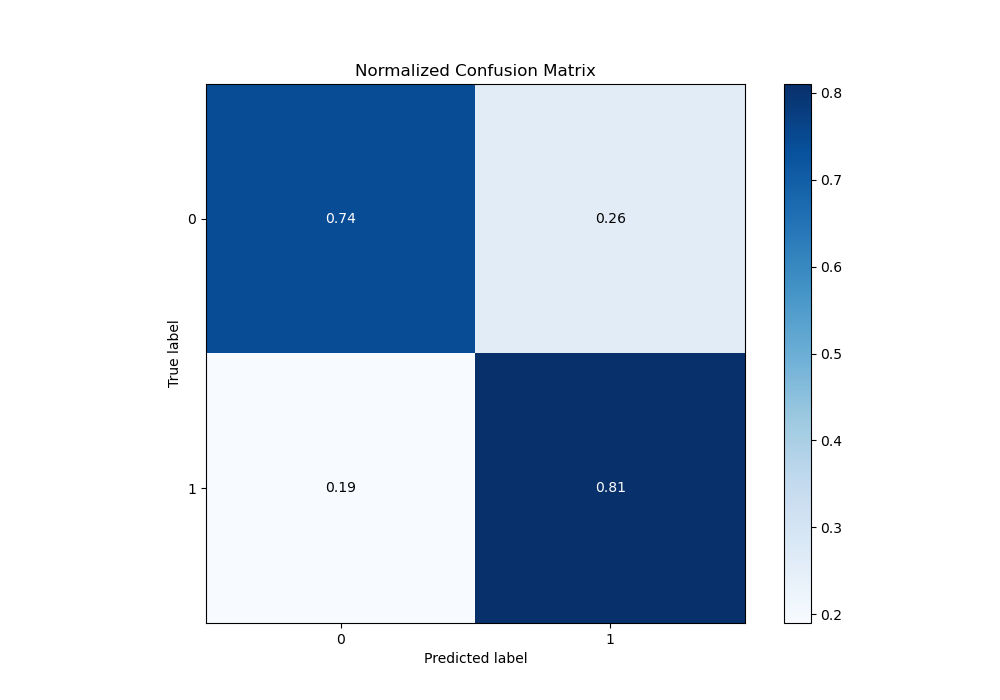
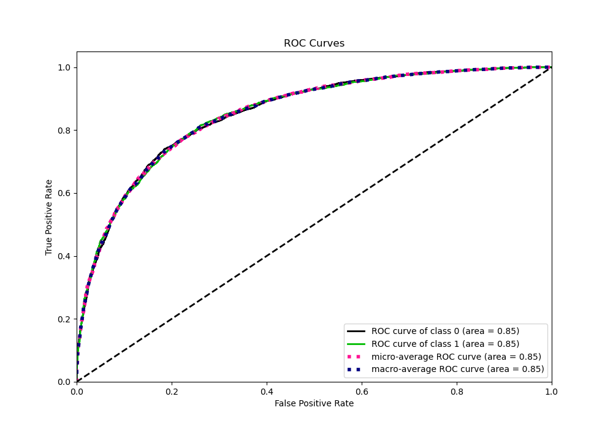
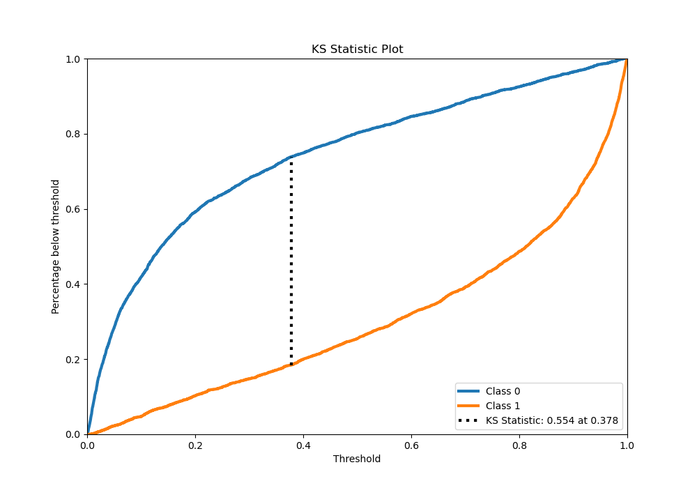
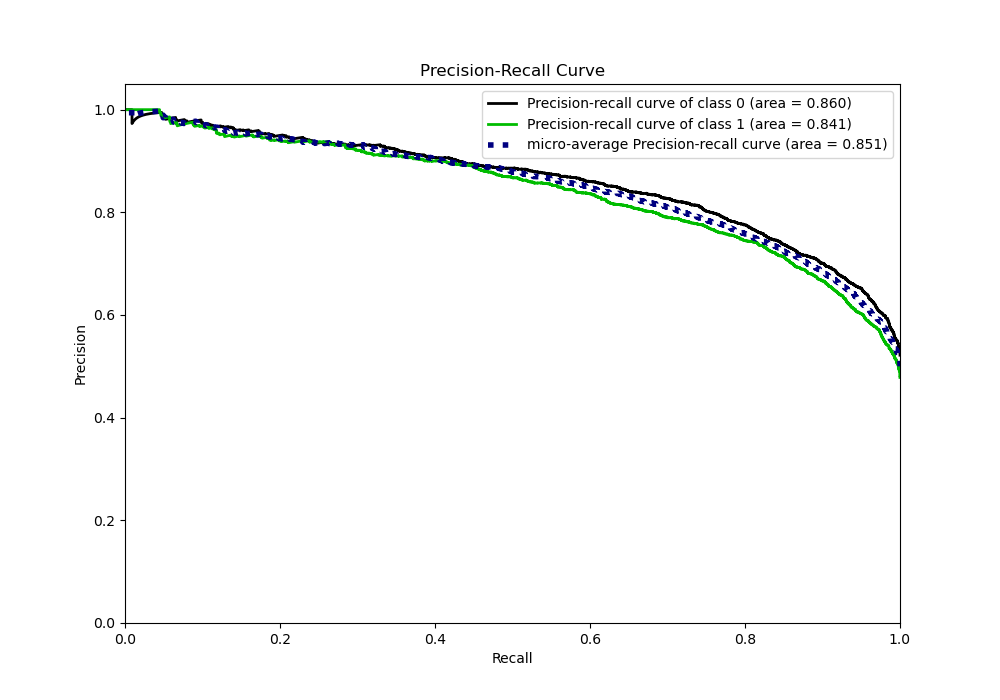
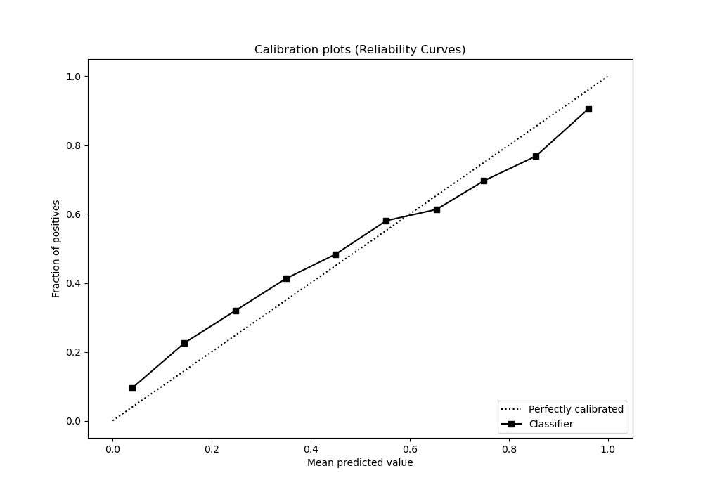
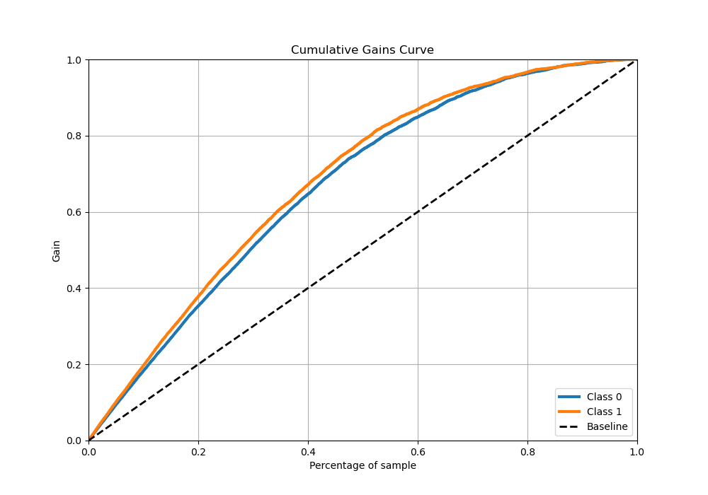
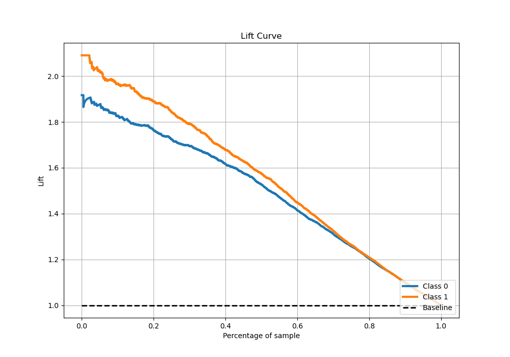

# Summary of 2_Xgboost_GoldenFeatures

[<< Go back](../README.md)

## Extreme Gradient Boosting (Xgboost)
- **n_jobs**: -1
- **objective**: binary:logistic
- **eta**: 0.075
- **max_depth**: 8
- **min_child_weight**: 5
- **subsample**: 1.0
- **colsample_bytree**: 1.0
- **eval_metric**: auc
- **explain_level**: 1

## Validation
 - **validation_type**: kfold
 - **k_folds**: 5
 - **shuffle**: True
 - **stratify**: True

## Optimized metric
auc

## Training time

130.7 seconds

## Metric details
|           |    score |     threshold |
|:----------|---------:|--------------:|
| logloss   | 0.496816 | nan           |
| auc       | 0.853194 | nan           |
| f1        | 0.775951 |   0.35375     |
| accuracy  | 0.775128 |   0.386213    |
| precision | 1        |   0.995658    |
| recall    | 1        |   0.000205953 |
| mcc       | 0.553195 |   0.386213    |

## Metric details with threshold from accuracy metric
|           |    score |   threshold |
|:----------|---------:|------------:|
| logloss   | 0.496816 |  nan        |
| auc       | 0.853194 |  nan        |
| f1        | 0.775157 |    0.386213 |
| accuracy  | 0.775128 |    0.386213 |
| precision | 0.742843 |    0.386213 |
| recall    | 0.810411 |    0.386213 |
| mcc       | 0.553195 |    0.386213 |

## Confusion matrix (at threshold=0.386213)
|              |   Predicted as 0 |   Predicted as 1 |
|:-------------|-----------------:|-----------------:|
| Labeled as 0 |             2957 |             1024 |
| Labeled as 1 |              692 |             2958 |

## Learning curves

## Permutation-based Importance

## Confusion Matrix

## Normalized Confusion Matrix

## ROC Curve

## Kolmogorov-Smirnov Statistic

## Precision-Recall Curve

## Calibration Curve

## Cumulative Gains Curve

## Lift Curve

[<< Go back](../README.md)
