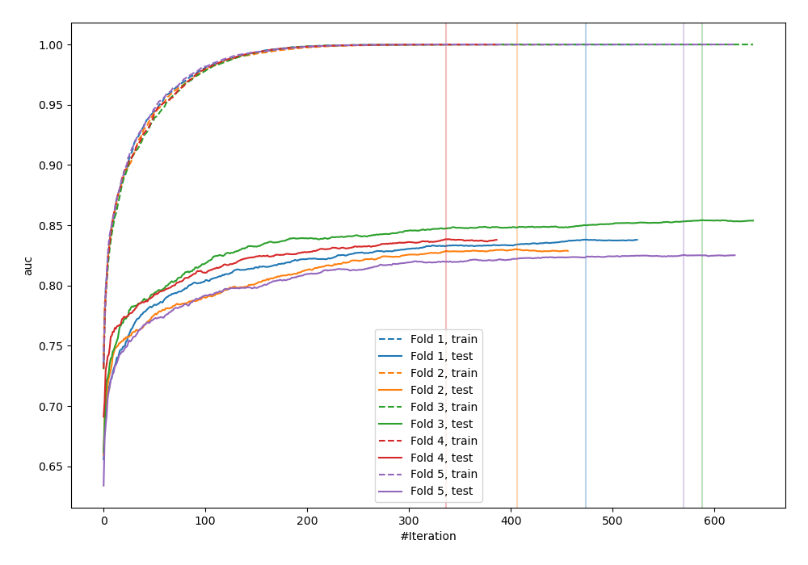
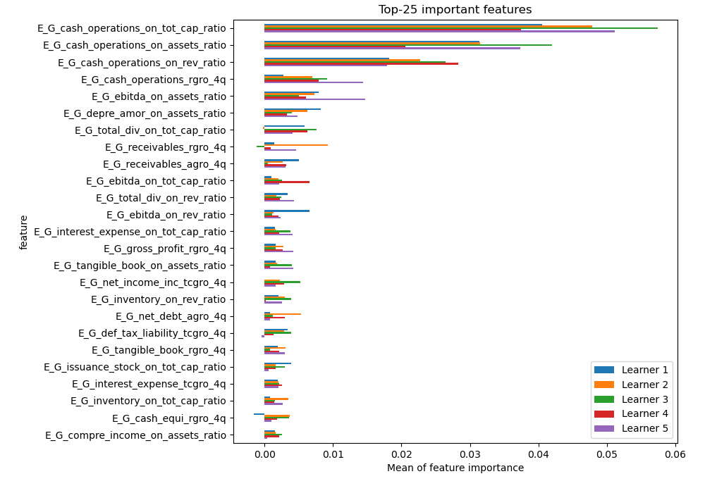
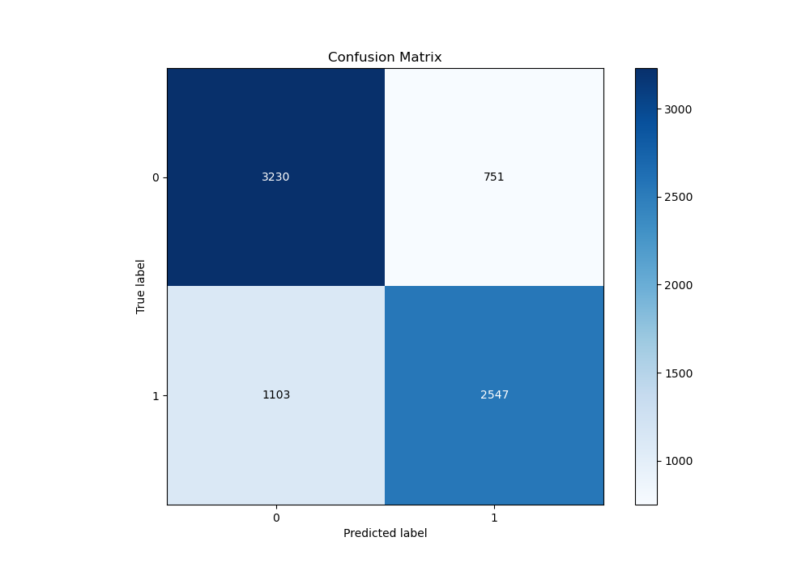
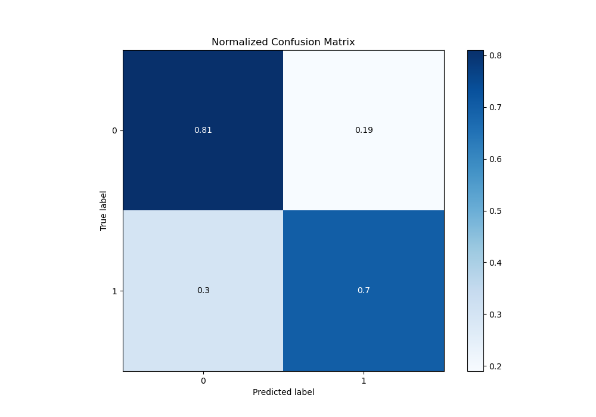
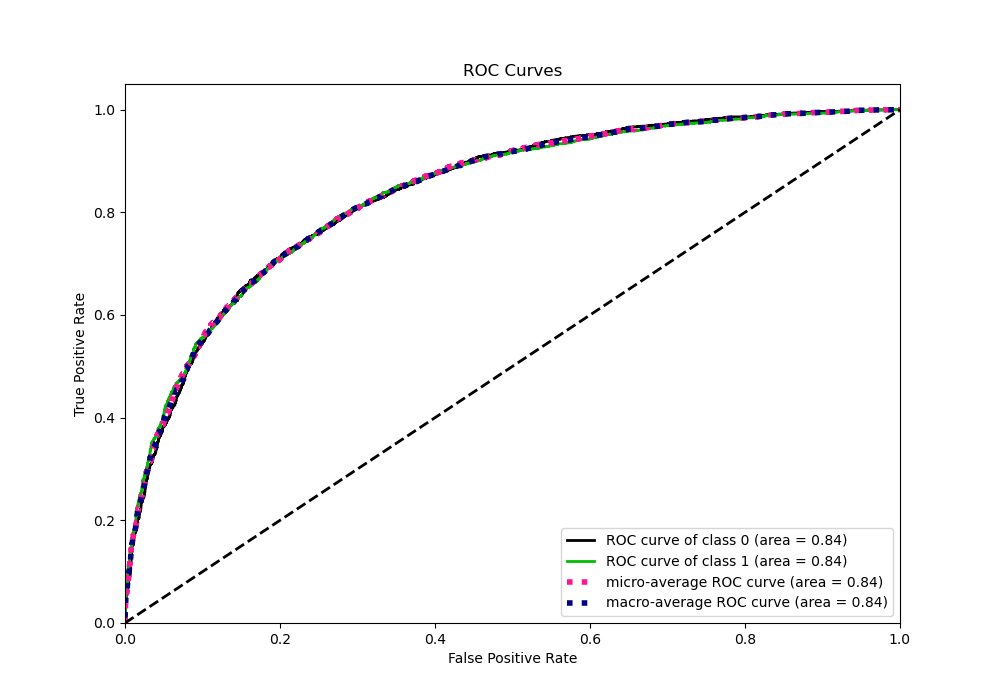
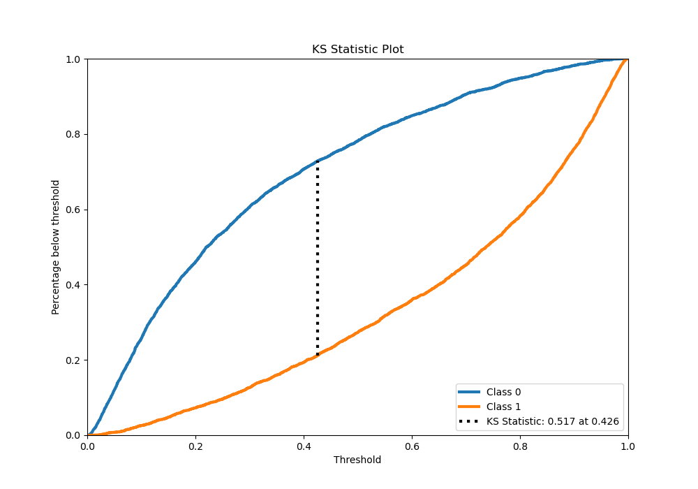
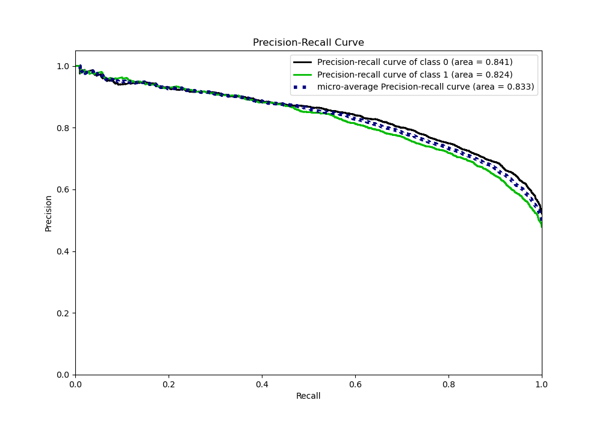
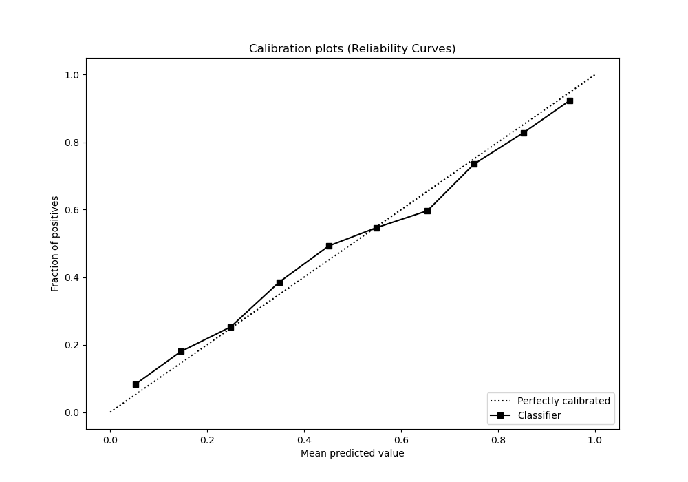
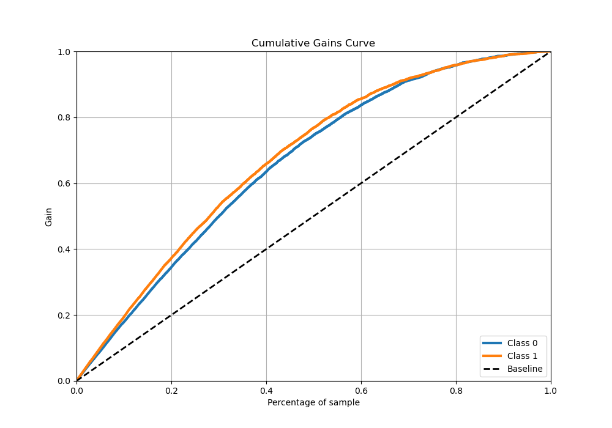
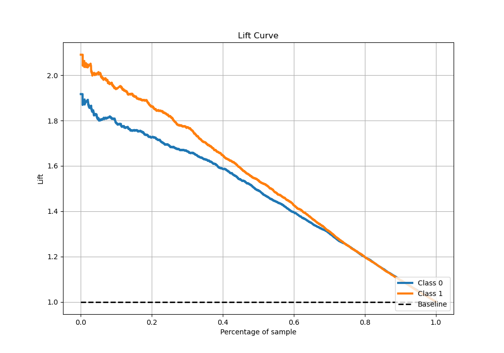

# Summary of 4_Xgboost

[<< Go back](../README.md)

## Extreme Gradient Boosting (Xgboost)
- **n_jobs**: -1
- **objective**: binary:logistic
- **eta**: 0.1
- **max_depth**: 7
- **min_child_weight**: 25
- **subsample**: 0.9
- **colsample_bytree**: 0.6
- **eval_metric**: auc
- **explain_level**: 1

## Validation
 - **validation_type**: kfold
 - **k_folds**: 5
 - **shuffle**: True
 - **stratify**: True

## Optimized metric
auc

## Training time

75.6 seconds

## Metric details
|           |    score |    threshold |
|:----------|---------:|-------------:|
| logloss   | 0.500956 | nan          |
| auc       | 0.836948 | nan          |
| f1        | 0.761636 |   0.335058   |
| accuracy  | 0.757044 |   0.537817   |
| precision | 0.981132 |   0.983365   |
| recall    | 1        |   0.00281883 |
| mcc       | 0.515908 |   0.421828   |

## Metric details with threshold from accuracy metric
|           |    score |   threshold |
|:----------|---------:|------------:|
| logloss   | 0.500956 |  nan        |
| auc       | 0.836948 |  nan        |
| f1        | 0.733161 |    0.537817 |
| accuracy  | 0.757044 |    0.537817 |
| precision | 0.772286 |    0.537817 |
| recall    | 0.697808 |    0.537817 |
| mcc       | 0.513427 |    0.537817 |

## Confusion matrix (at threshold=0.537817)
|              |   Predicted as 0 |   Predicted as 1 |
|:-------------|-----------------:|-----------------:|
| Labeled as 0 |             3230 |              751 |
| Labeled as 1 |             1103 |             2547 |

## Learning curves

## Permutation-based Importance

## Confusion Matrix

## Normalized Confusion Matrix

## ROC Curve

## Kolmogorov-Smirnov Statistic

## Precision-Recall Curve

## Calibration Curve

## Cumulative Gains Curve

## Lift Curve

[<< Go back](../README.md)
