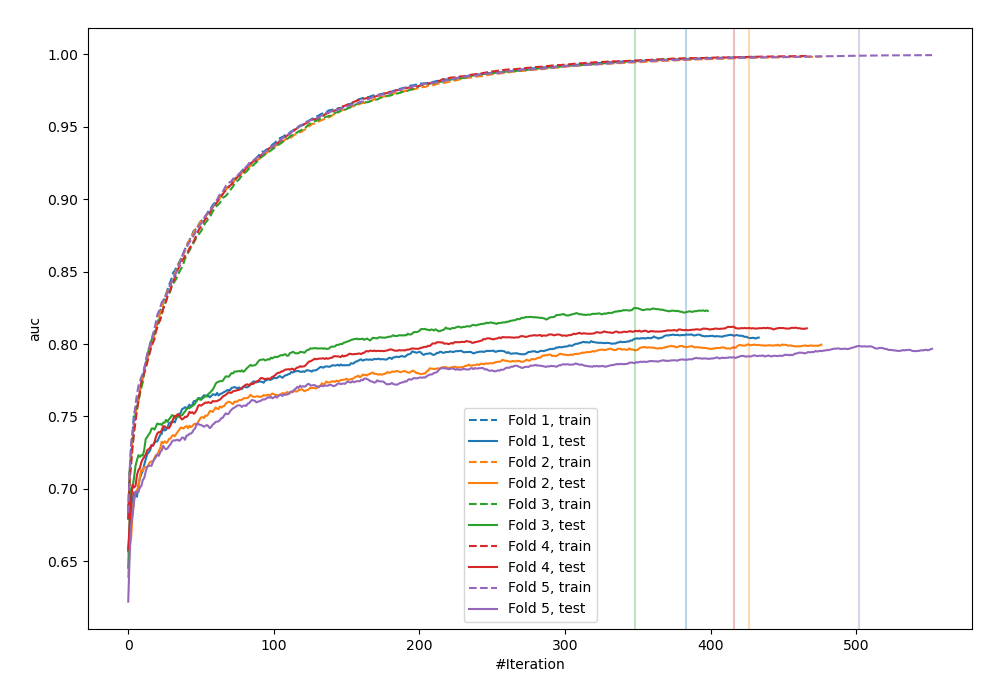
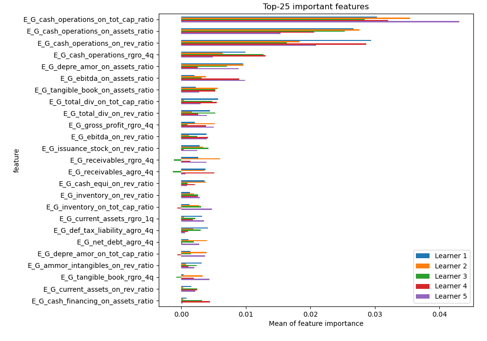
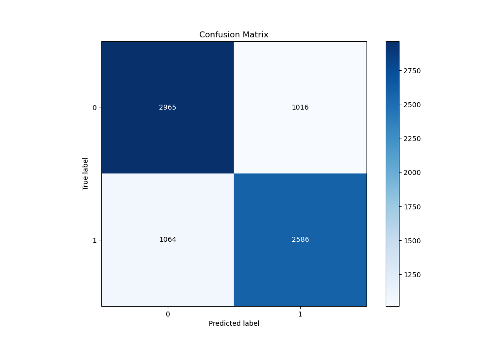
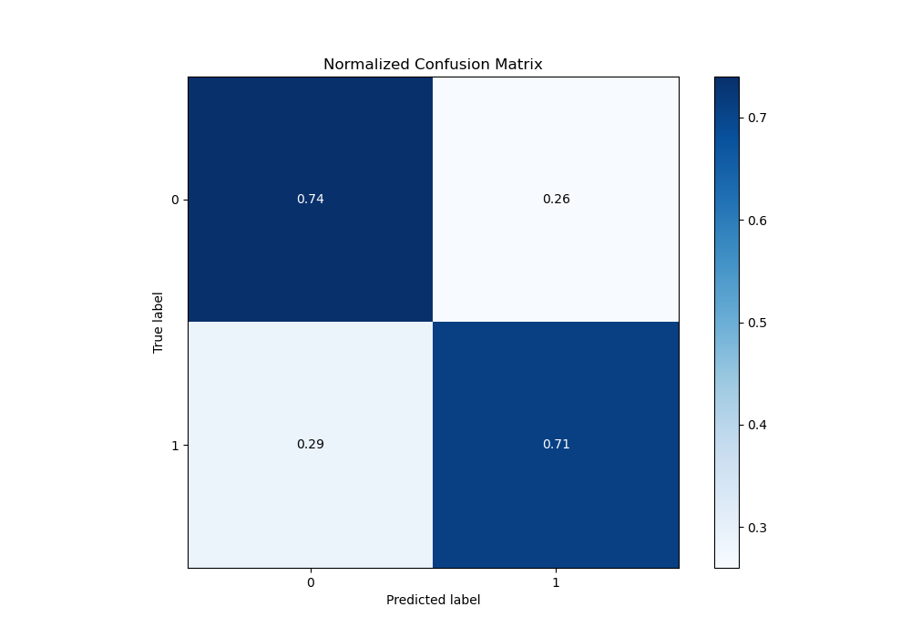
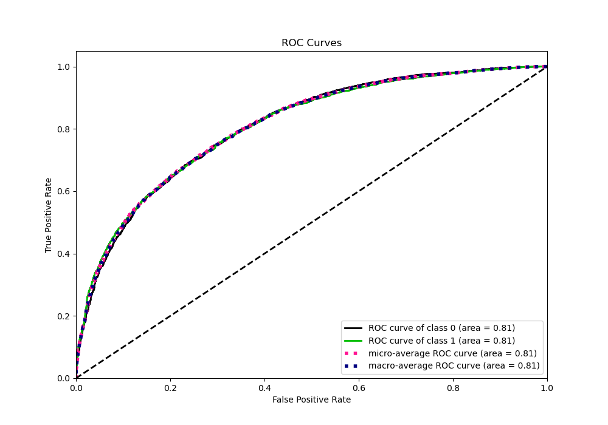
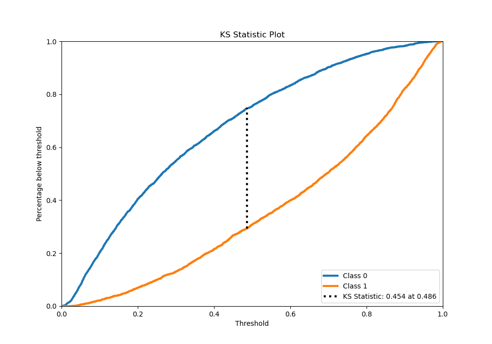
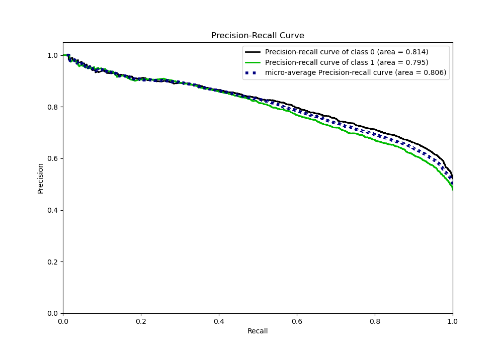
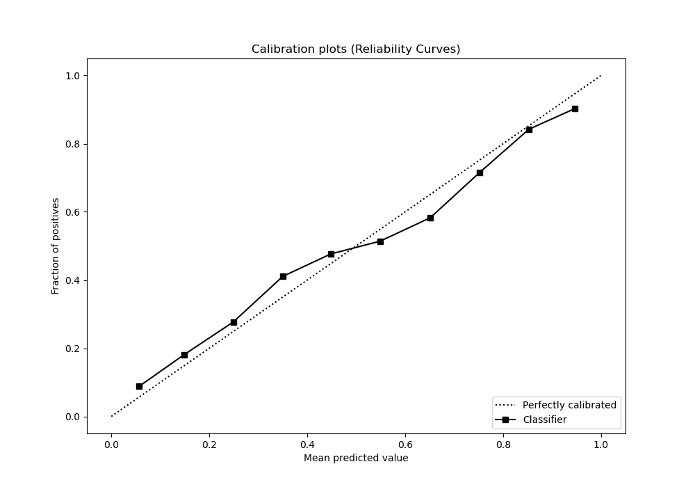
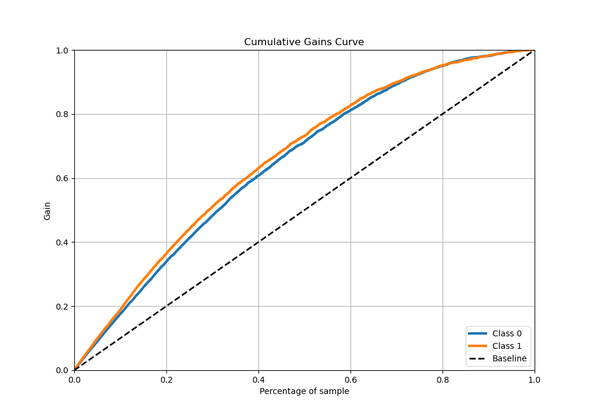
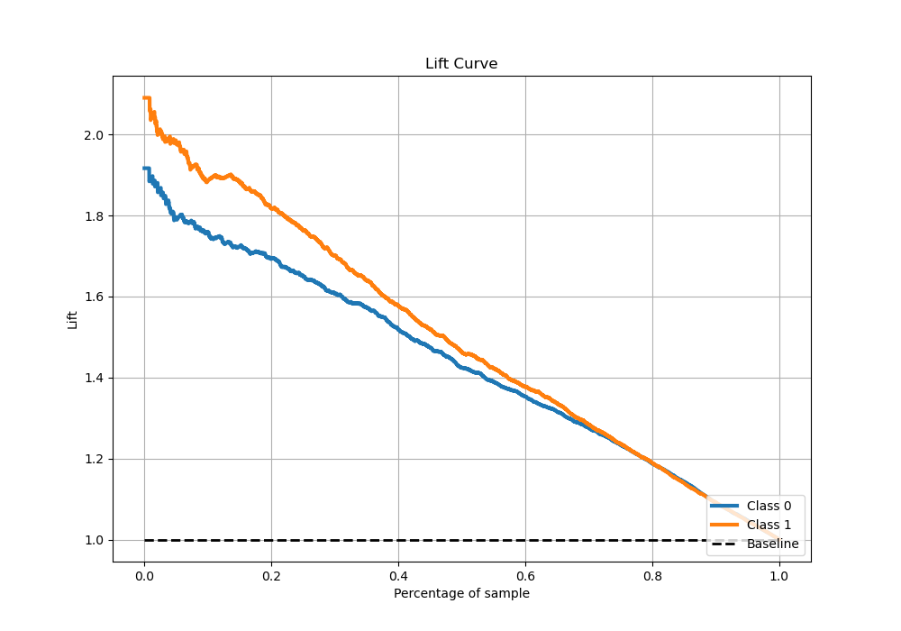

# Summary of 5_Xgboost

[<< Go back](../README.md)

## Extreme Gradient Boosting (Xgboost)
- **n_jobs**: -1
- **objective**: binary:logistic
- **eta**: 0.15
- **max_depth**: 8
- **min_child_weight**: 50
- **subsample**: 0.6
- **colsample_bytree**: 0.6
- **eval_metric**: auc
- **explain_level**: 1

## Validation
 - **validation_type**: kfold
 - **k_folds**: 5
 - **shuffle**: True
 - **stratify**: True

## Optimized metric
auc

## Training time

66.2 seconds

## Metric details
|           |    score |   threshold |
|:----------|---------:|------------:|
| logloss   | 0.53507  | nan         |
| auc       | 0.808238 | nan         |
| f1        | 0.737369 |   0.329268  |
| accuracy  | 0.727428 |   0.483953  |
| precision | 0.981132 |   0.974604  |
| recall    | 1        |   0.0013209 |
| mcc       | 0.45472  |   0.552977  |

## Metric details with threshold from accuracy metric
|           |    score |   threshold |
|:----------|---------:|------------:|
| logloss   | 0.53507  |  nan        |
| auc       | 0.808238 |  nan        |
| f1        | 0.713183 |    0.483953 |
| accuracy  | 0.727428 |    0.483953 |
| precision | 0.717934 |    0.483953 |
| recall    | 0.708493 |    0.483953 |
| mcc       | 0.453565 |    0.483953 |

## Confusion matrix (at threshold=0.483953)
|              |   Predicted as 0 |   Predicted as 1 |
|:-------------|-----------------:|-----------------:|
| Labeled as 0 |             2965 |             1016 |
| Labeled as 1 |             1064 |             2586 |

## Learning curves

## Permutation-based Importance

## Confusion Matrix

## Normalized Confusion Matrix

## ROC Curve

## Kolmogorov-Smirnov Statistic

## Precision-Recall Curve

## Calibration Curve

## Cumulative Gains Curve

## Lift Curve

[<< Go back](../README.md)
