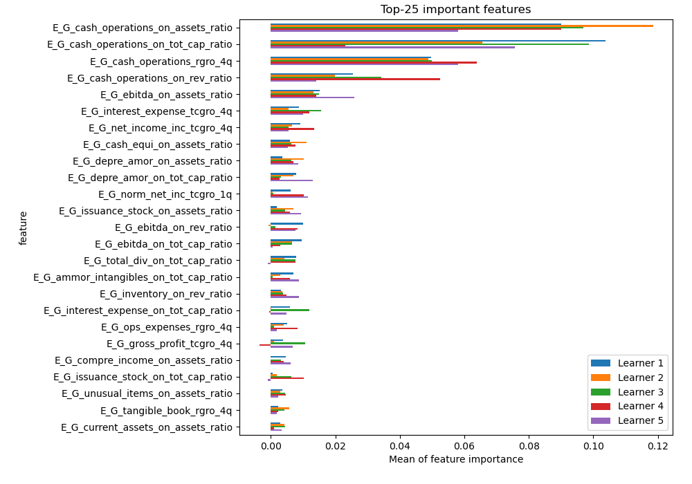
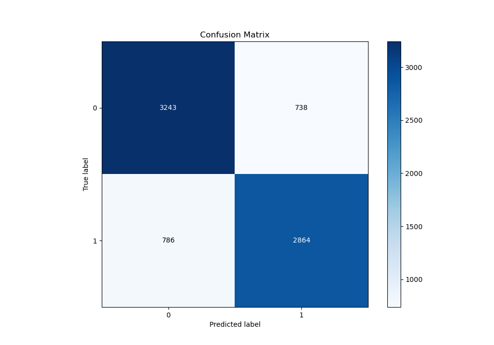
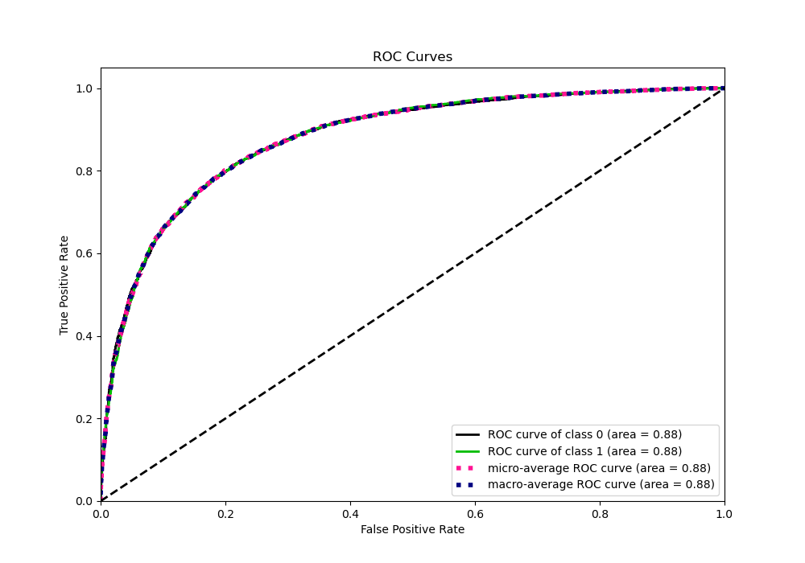
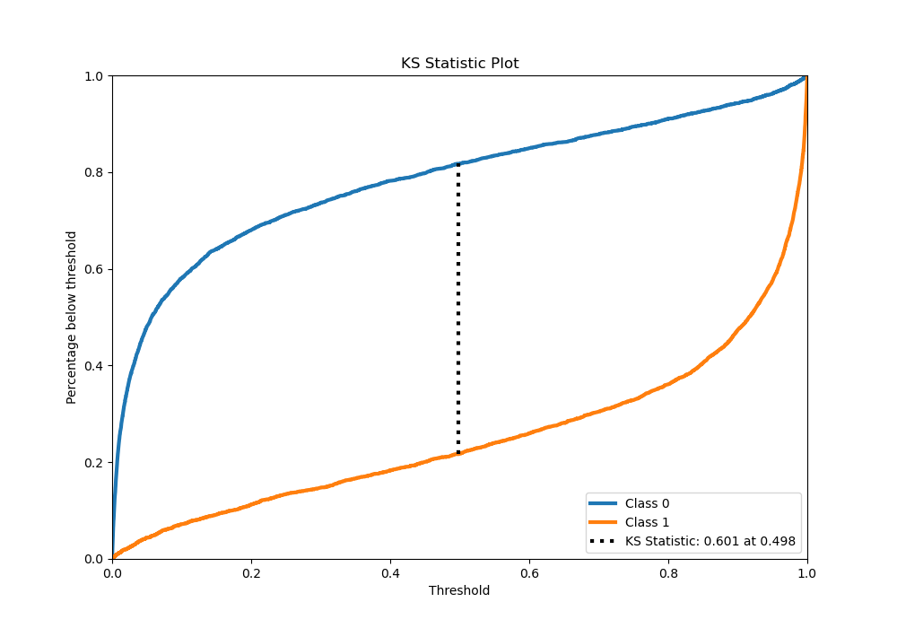
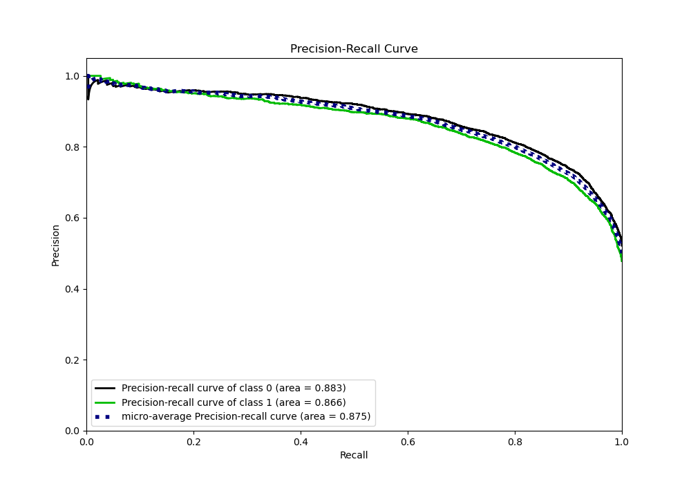
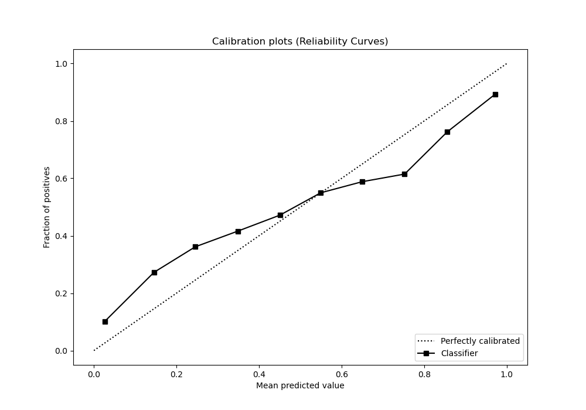
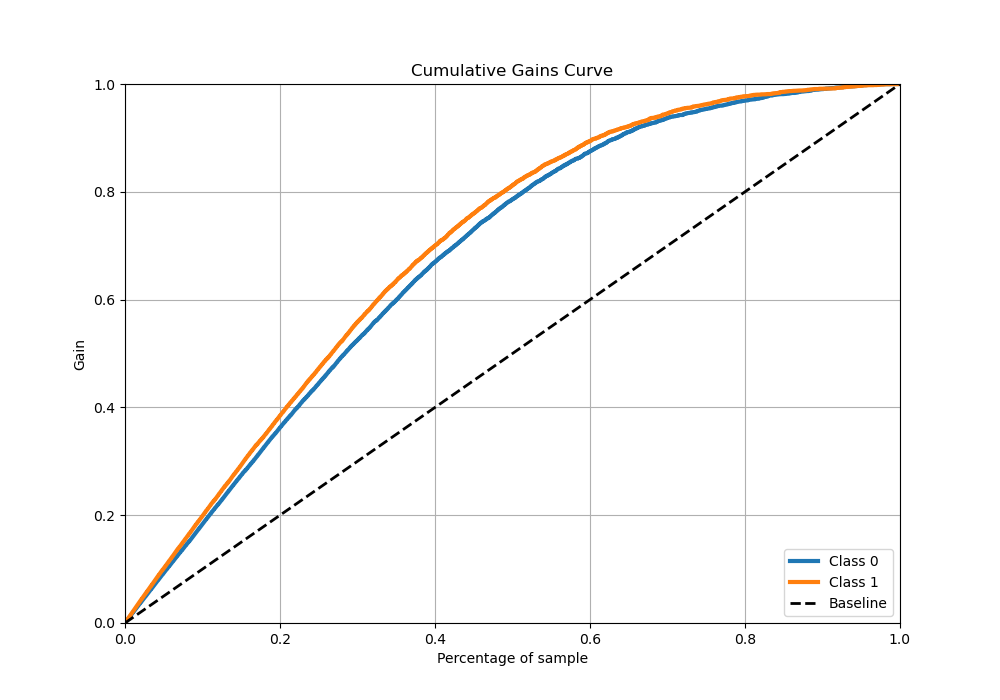
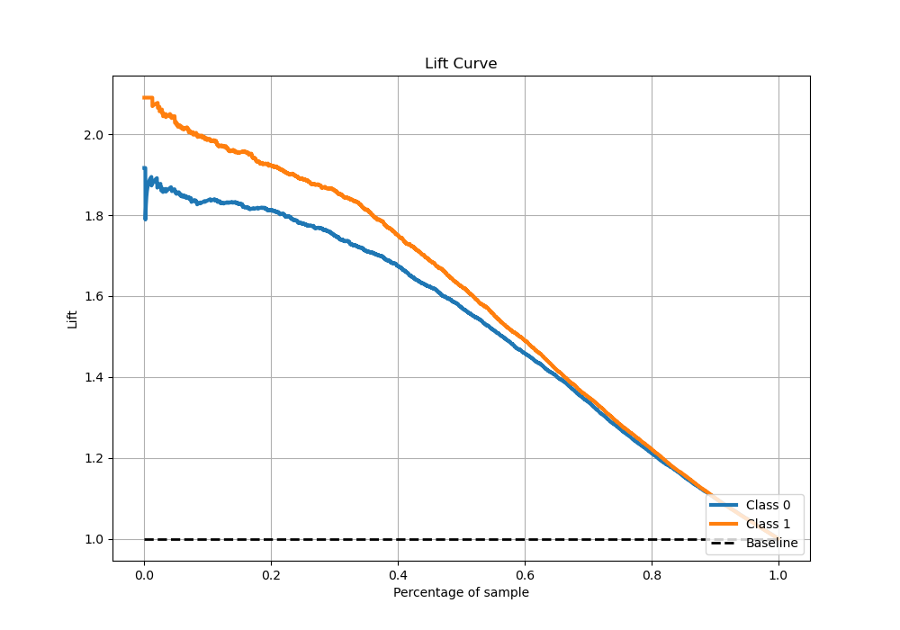

# Summary of 7_Xgboost_SelectedFeatures

[<< Go back](../README.md)

## Extreme Gradient Boosting (Xgboost)
- **n_jobs**: -1
- **objective**: binary:logistic
- **eta**: 0.15
- **max_depth**: 8
- **min_child_weight**: 1
- **subsample**: 1.0
- **colsample_bytree**: 1.0
- **eval_metric**: auc
- **explain_level**: 1

## Validation
 - **validation_type**: kfold
 - **k_folds**: 5
 - **shuffle**: True
 - **stratify**: True

## Optimized metric
auc

## Training time

28.1 seconds

## Metric details
|           |    score |     threshold |
|:----------|---------:|--------------:|
| logloss   | 0.498055 | nan           |
| auc       | 0.87892  | nan           |
| f1        | 0.797533 |   0.309588    |
| accuracy  | 0.800288 |   0.490433    |
| precision | 0.990566 |   0.999336    |
| recall    | 1        |   6.52997e-06 |
| mcc       | 0.599652 |   0.490433    |

## Metric details with threshold from accuracy metric
|           |    score |   threshold |
|:----------|---------:|------------:|
| logloss   | 0.498055 |  nan        |
| auc       | 0.87892  |  nan        |
| f1        | 0.789851 |    0.490433 |
| accuracy  | 0.800288 |    0.490433 |
| precision | 0.795114 |    0.490433 |
| recall    | 0.784658 |    0.490433 |
| mcc       | 0.599652 |    0.490433 |

## Confusion matrix (at threshold=0.490433)
|              |   Predicted as 0 |   Predicted as 1 |
|:-------------|-----------------:|-----------------:|
| Labeled as 0 |             3243 |              738 |
| Labeled as 1 |              786 |             2864 |

## Learning curves

## Permutation-based Importance

## Confusion Matrix

## Normalized Confusion Matrix

## ROC Curve

## Kolmogorov-Smirnov Statistic

## Precision-Recall Curve

## Calibration Curve

## Cumulative Gains Curve

## Lift Curve

[<< Go back](../README.md)
