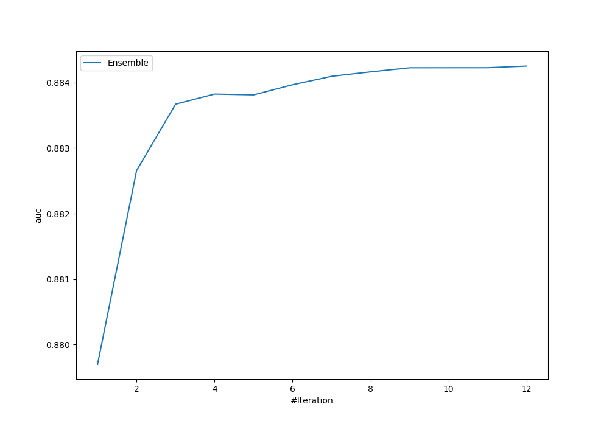
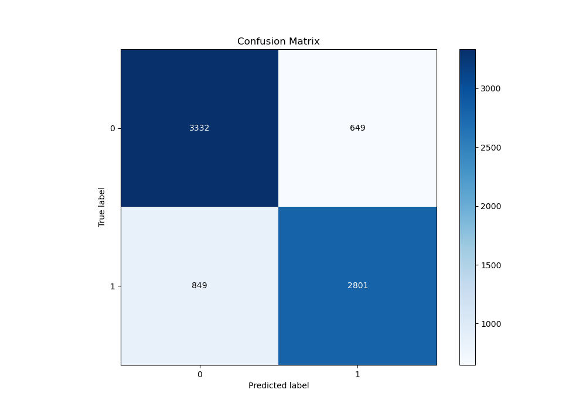
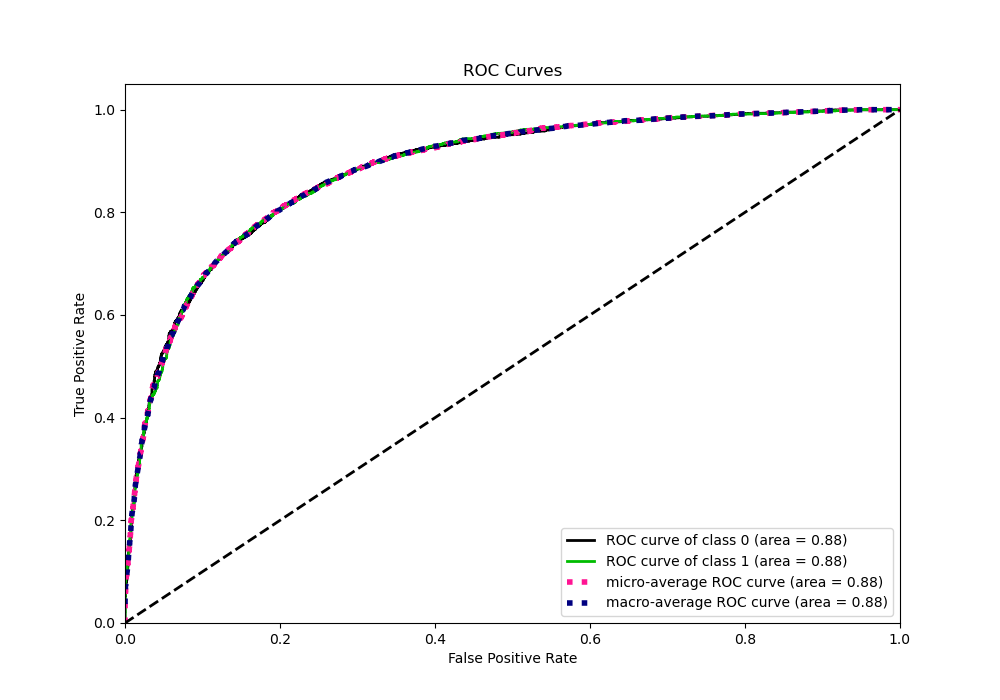
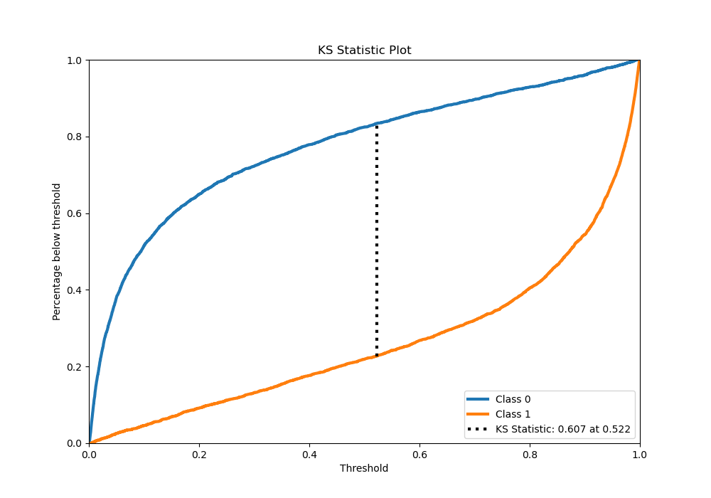
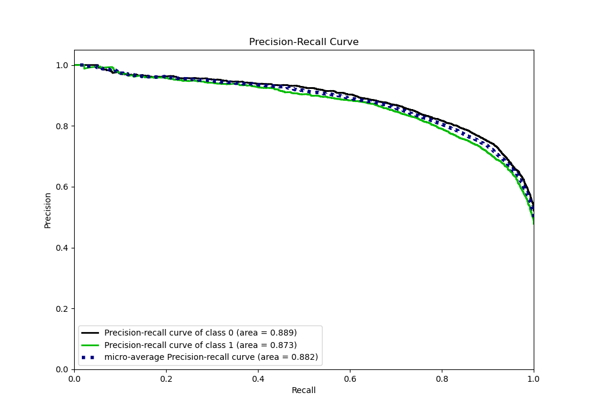
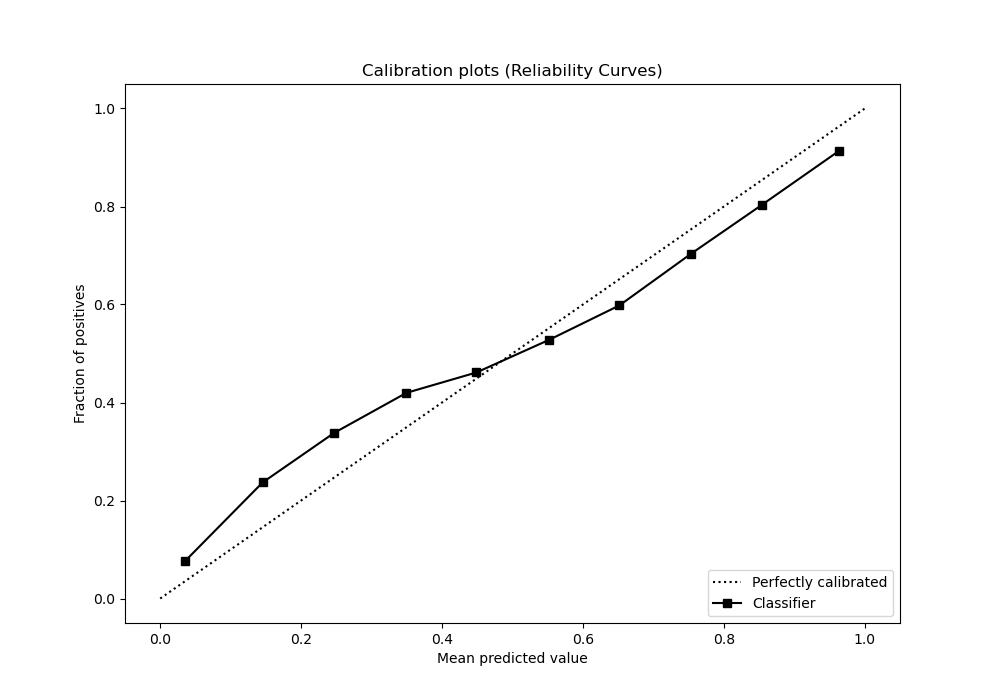
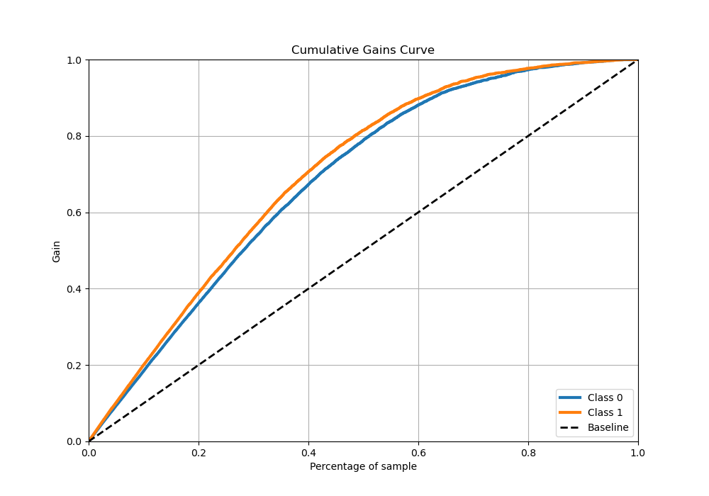
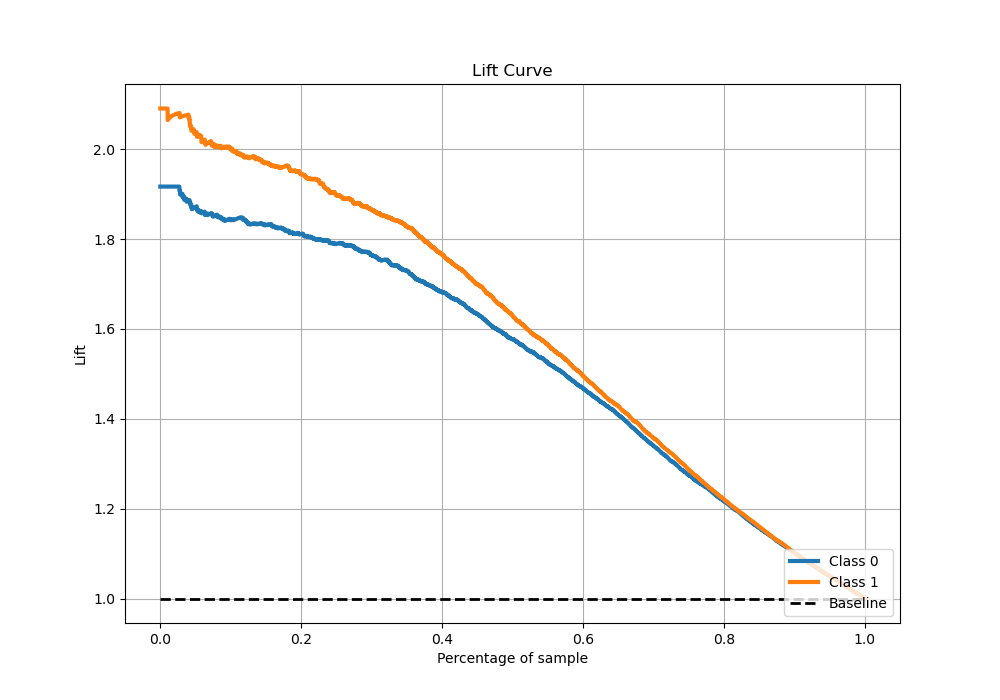

# Summary of Ensemble

[<< Go back](../README.md)

## Ensemble structure
| Model                       |   Weight |
|:----------------------------|---------:|
| 10_Xgboost_SelectedFeatures |        2 |
| 11_Xgboost_SelectedFeatures |        1 |
| 2_Xgboost_GoldenFeatures    |        1 |
| 3_Xgboost                   |        1 |
| 3_Xgboost_SelectedFeatures  |        3 |
| 6_Xgboost_SelectedFeatures  |        1 |
| 7_Xgboost_SelectedFeatures  |        3 |

## Metric details
|           |    score |     threshold |
|:----------|---------:|--------------:|
| logloss   | 0.446743 | nan           |
| auc       | 0.884251 | nan           |
| f1        | 0.800549 |   0.277792    |
| accuracy  | 0.803695 |   0.533455    |
| precision | 0.994505 |   0.994877    |
| recall    | 1        |   0.000338355 |
| mcc       | 0.606631 |   0.580039    |

## Metric details with threshold from accuracy metric
|           |    score |   threshold |
|:----------|---------:|------------:|
| logloss   | 0.446743 |  nan        |
| auc       | 0.884251 |  nan        |
| f1        | 0.789014 |    0.533455 |
| accuracy  | 0.803695 |    0.533455 |
| precision | 0.811884 |    0.533455 |
| recall    | 0.767397 |    0.533455 |
| mcc       | 0.606594 |    0.533455 |

## Confusion matrix (at threshold=0.533455)
|              |   Predicted as 0 |   Predicted as 1 |
|:-------------|-----------------:|-----------------:|
| Labeled as 0 |             3332 |              649 |
| Labeled as 1 |              849 |             2801 |

## Learning curves

## Confusion Matrix

## Normalized Confusion Matrix

## ROC Curve

## Kolmogorov-Smirnov Statistic

## Precision-Recall Curve

## Calibration Curve

## Cumulative Gains Curve

## Lift Curve

[<< Go back](../README.md)
