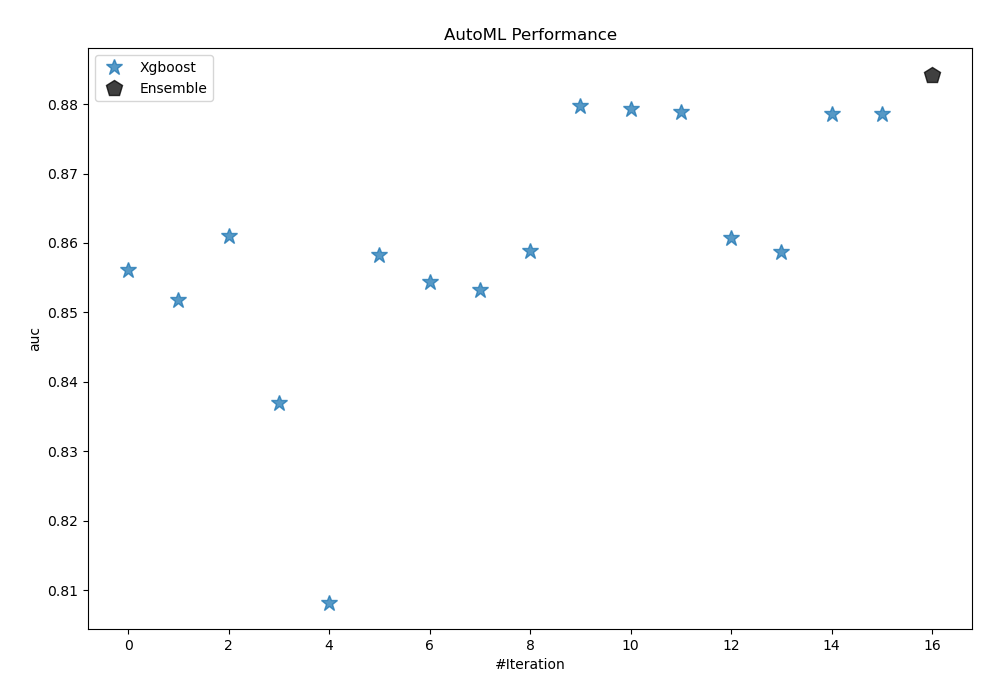
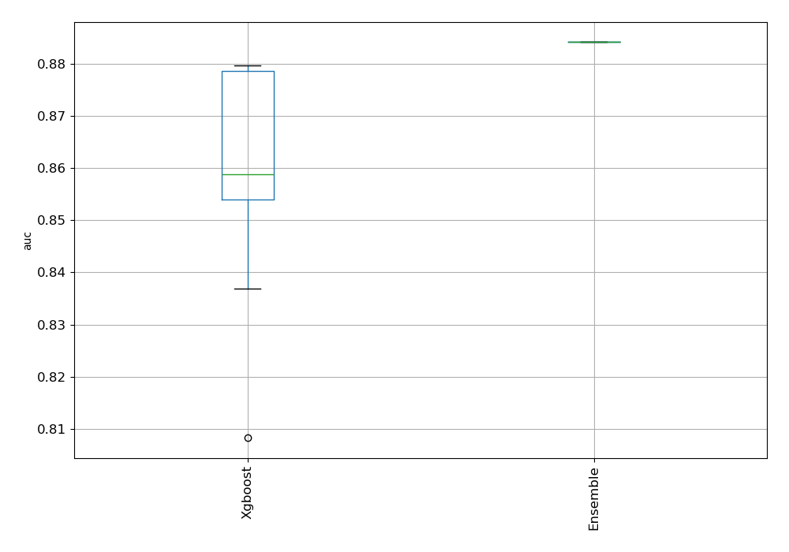
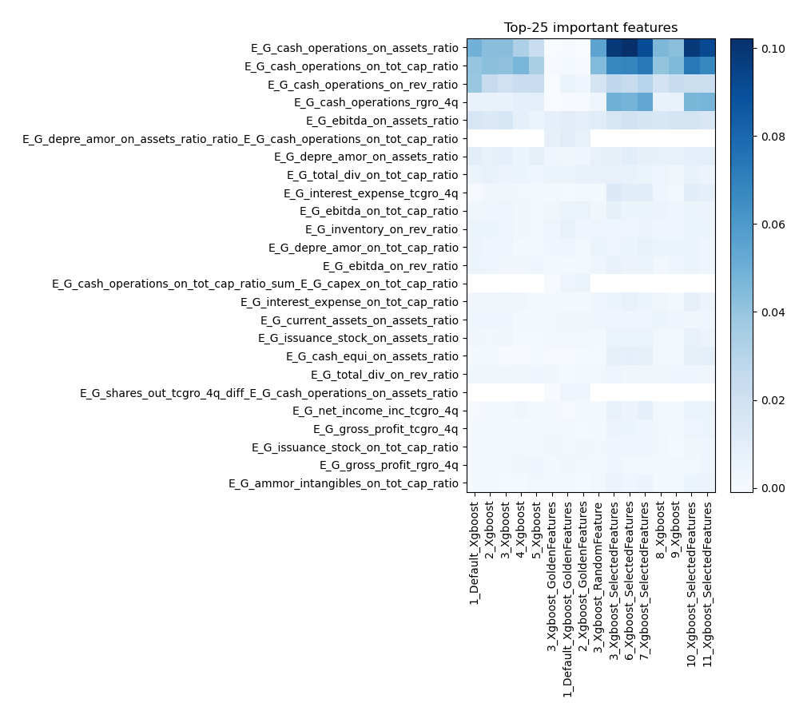
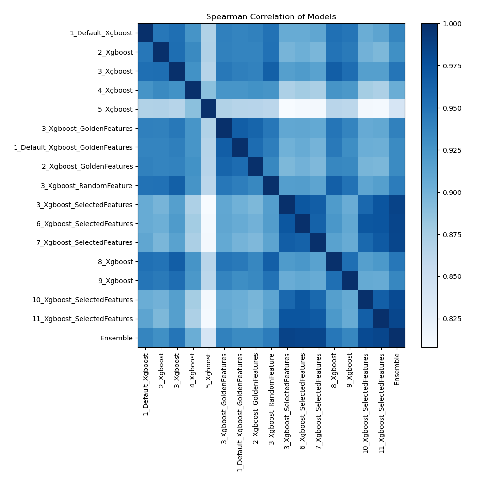

# AutoML Leaderboard

| Best model   | name                                                                           | model_type   | metric_type   |   metric_value |   train_time |   single_prediction_time |
|:-------------|:-------------------------------------------------------------------------------|:-------------|:--------------|---------------:|-------------:|-------------------------:|
|              | [1_Default_Xgboost](1_Default_Xgboost/README.md)                               | Xgboost      | auc           |       0.856157 |       112.08 |                   0.1539 |
|              | [2_Xgboost](2_Xgboost/README.md)                                               | Xgboost      | auc           |       0.85177  |        93.61 |                   0.1658 |
|              | [3_Xgboost](3_Xgboost/README.md)                                               | Xgboost      | auc           |       0.860956 |        94.75 |                   0.1862 |
|              | [4_Xgboost](4_Xgboost/README.md)                                               | Xgboost      | auc           |       0.836948 |        76.18 |                   0.1749 |
|              | [5_Xgboost](5_Xgboost/README.md)                                               | Xgboost      | auc           |       0.808238 |        66.81 |                   0.0937 |
|              | [3_Xgboost_GoldenFeatures](3_Xgboost_GoldenFeatures/README.md)                 | Xgboost      | auc           |       0.858232 |       356.92 |                   0.1547 |
|              | [1_Default_Xgboost_GoldenFeatures](1_Default_Xgboost_GoldenFeatures/README.md) | Xgboost      | auc           |       0.85435  |      1036.52 |                   0.1755 |
|              | [2_Xgboost_GoldenFeatures](2_Xgboost_GoldenFeatures/README.md)                 | Xgboost      | auc           |       0.853194 |       131.21 |                   0.1628 |
|              | [3_Xgboost_RandomFeature](3_Xgboost_RandomFeature/README.md)                   | Xgboost      | auc           |       0.858779 |       102.21 |                   0.0952 |
| **the best** | [3_Xgboost_SelectedFeatures](3_Xgboost_SelectedFeatures/README.md)             | Xgboost      | auc           |       0.879703 |        31.03 |                   0.0281 |
|              | [6_Xgboost_SelectedFeatures](6_Xgboost_SelectedFeatures/README.md)             | Xgboost      | auc           |       0.879335 |        35.78 |                   0.0303 |
|              | [7_Xgboost_SelectedFeatures](7_Xgboost_SelectedFeatures/README.md)             | Xgboost      | auc           |       0.87892  |        28.64 |                   0.0304 |
|              | [8_Xgboost](8_Xgboost/README.md)                                               | Xgboost      | auc           |       0.860663 |       116.62 |                   0.1008 |
|              | [9_Xgboost](9_Xgboost/README.md)                                               | Xgboost      | auc           |       0.858765 |       404.67 |                   0.0888 |
|              | [10_Xgboost_SelectedFeatures](10_Xgboost_SelectedFeatures/README.md)           | Xgboost      | auc           |       0.878597 |        31.56 |                   0.0275 |
|              | [11_Xgboost_SelectedFeatures](11_Xgboost_SelectedFeatures/README.md)           | Xgboost      | auc           |       0.878625 |        36.6  |                   0.028  |
|              | [Ensemble](Ensemble/README.md)                                                 | Ensemble     | auc           |       0.884251 |         1.43 |                   0.5667 |

### AutoML Performance

### AutoML Performance Boxplot

### Features Importance

### Spearman Correlation of Models

