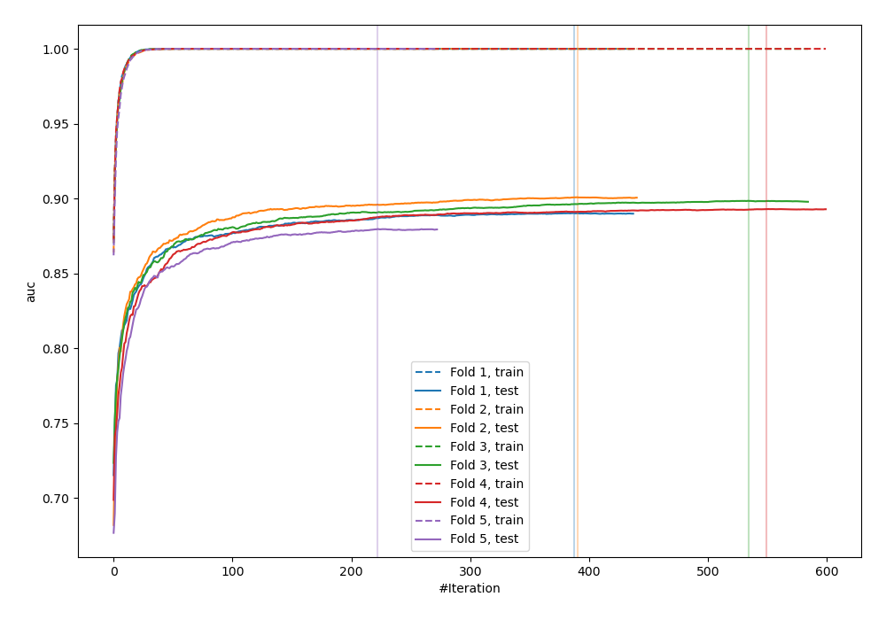
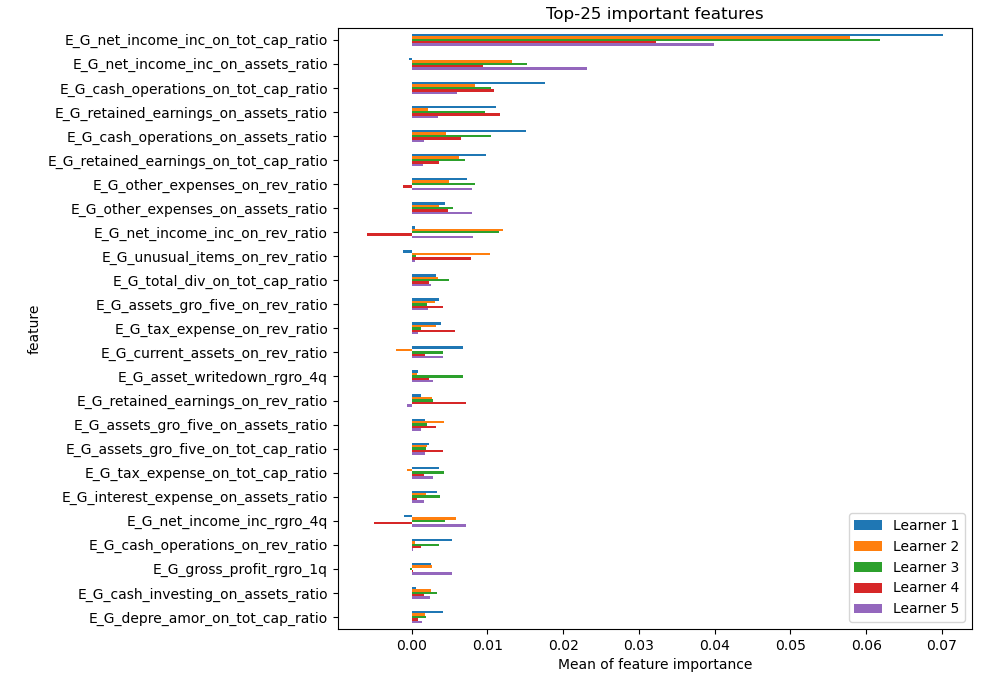
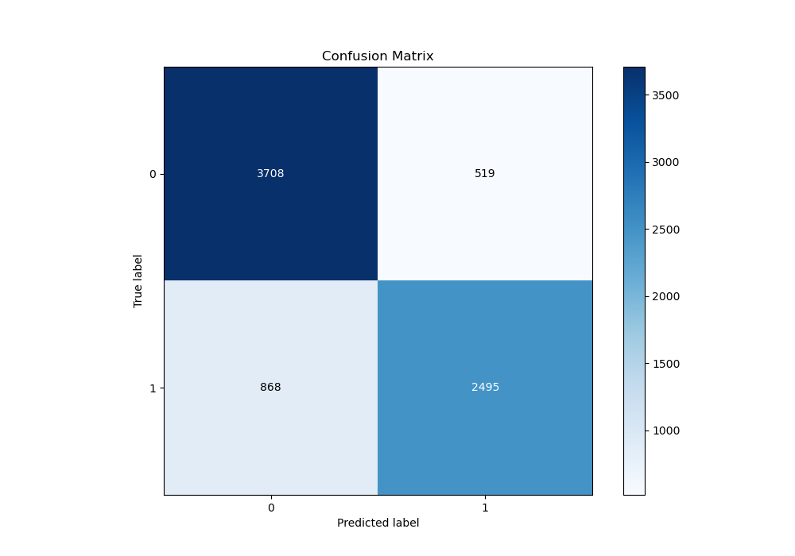
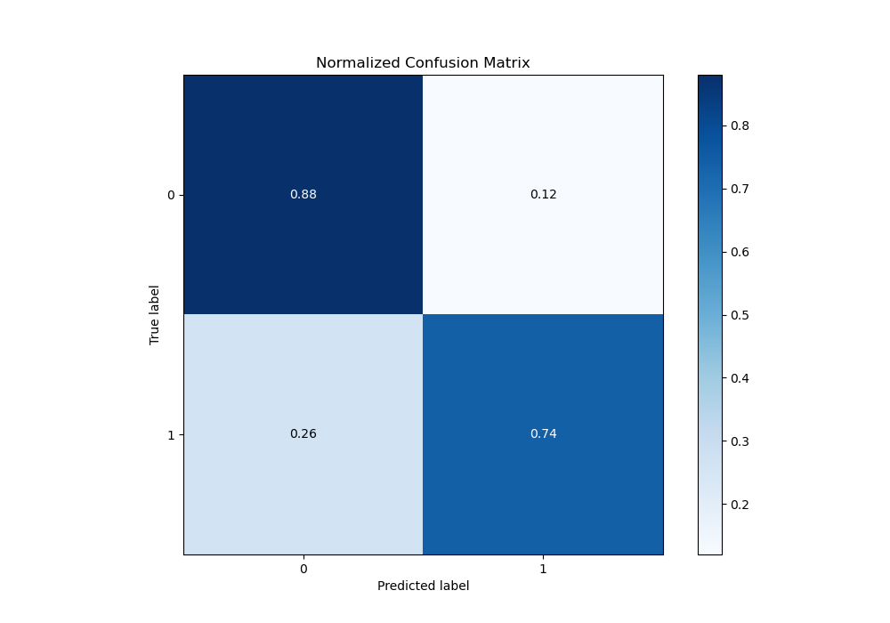
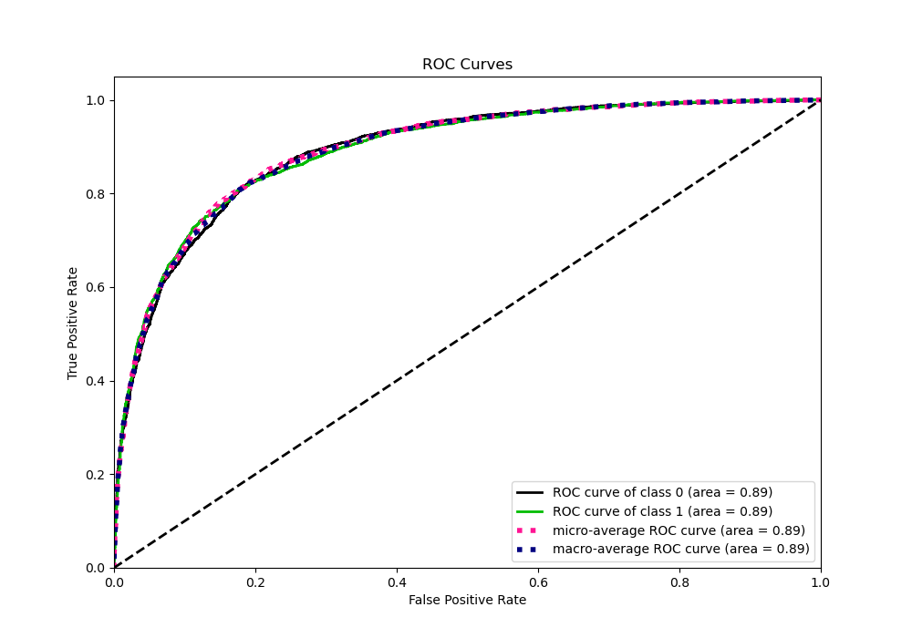
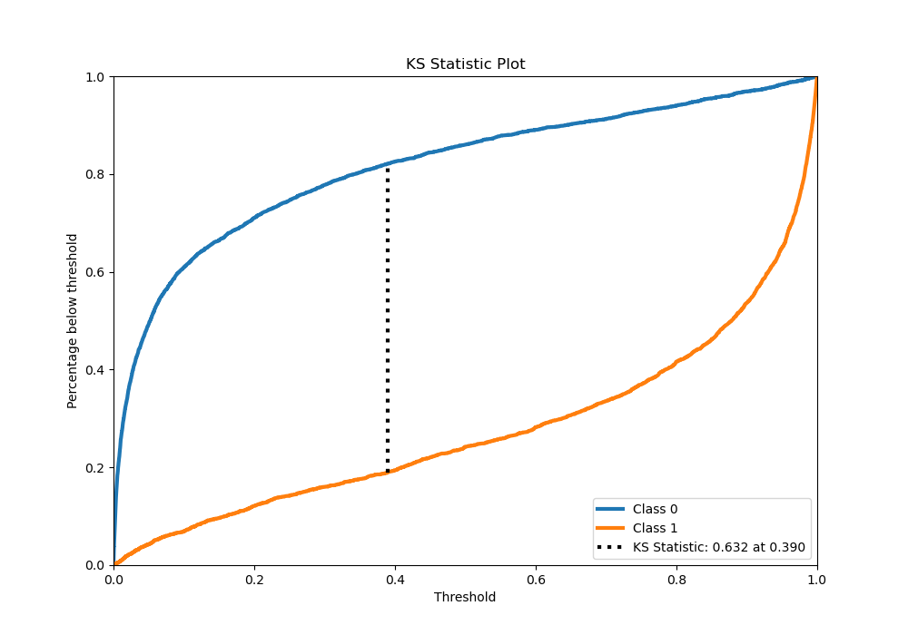
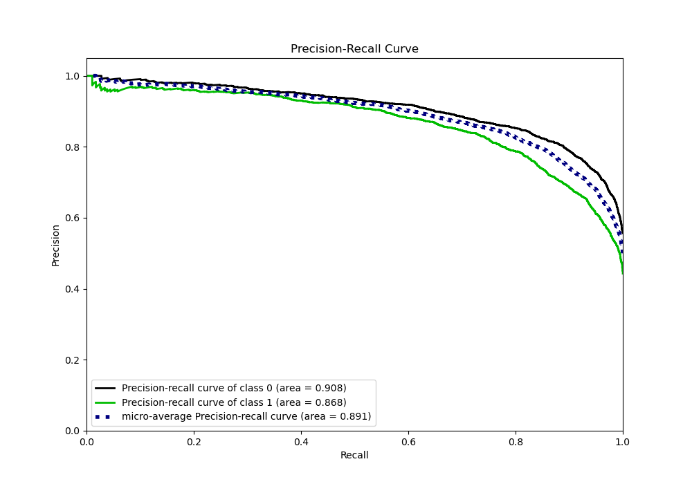
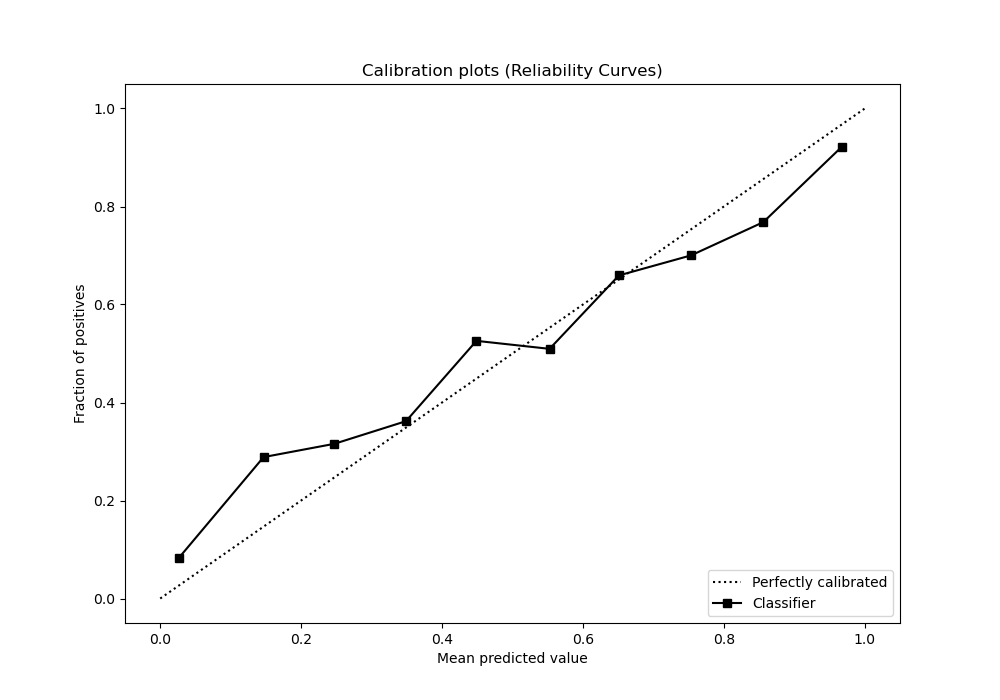
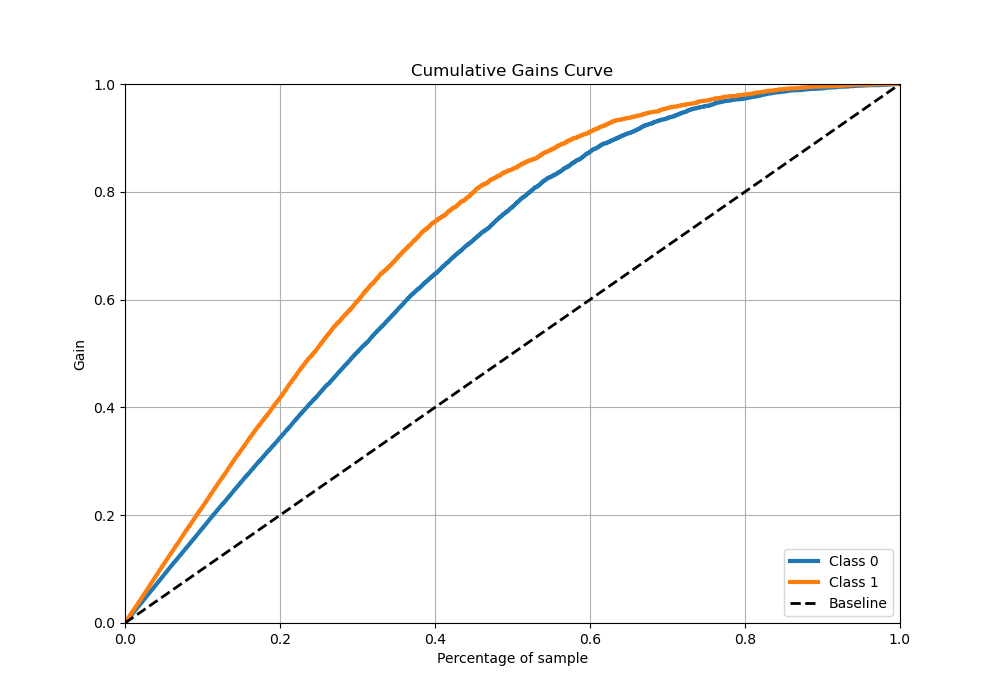
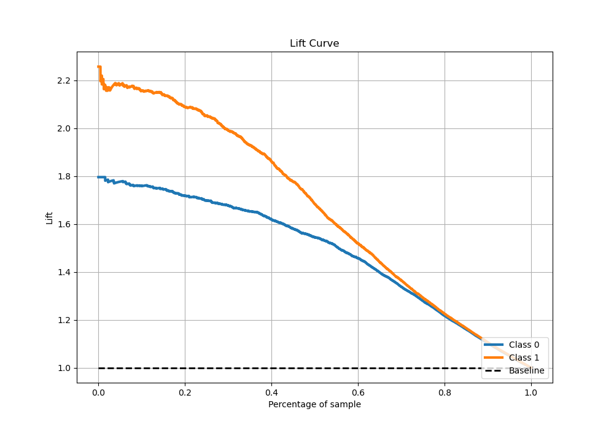

# Summary of 3_Xgboost

[<< Go back](../README.md)

## Extreme Gradient Boosting (Xgboost)
- **n_jobs**: -1
- **objective**: binary:logistic
- **eta**: 0.1
- **max_depth**: 8
- **min_child_weight**: 1
- **subsample**: 1.0
- **colsample_bytree**: 1.0
- **eval_metric**: auc
- **explain_level**: 1

## Validation
 - **validation_type**: kfold
 - **k_folds**: 5
 - **shuffle**: True
 - **stratify**: True

## Optimized metric
auc

## Training time

98.8 seconds

## Metric details
|           |    score |    threshold |
|:----------|---------:|-------------:|
| logloss   | 0.444026 | nan          |
| auc       | 0.891942 | nan          |
| f1        | 0.79625  |   0.395069   |
| accuracy  | 0.81726  |   0.548828   |
| precision | 0.968153 |   0.993847   |
| recall    | 1        |   1.6293e-05 |
| mcc       | 0.630017 |   0.395069   |

## Metric details with threshold from accuracy metric
|           |    score |   threshold |
|:----------|---------:|------------:|
| logloss   | 0.444026 |  nan        |
| auc       | 0.891942 |  nan        |
| f1        | 0.7825   |    0.548828 |
| accuracy  | 0.81726  |    0.548828 |
| precision | 0.827804 |    0.548828 |
| recall    | 0.741897 |    0.548828 |
| mcc       | 0.628545 |    0.548828 |

## Confusion matrix (at threshold=0.548828)
|              |   Predicted as 0 |   Predicted as 1 |
|:-------------|-----------------:|-----------------:|
| Labeled as 0 |             3708 |              519 |
| Labeled as 1 |              868 |             2495 |

## Learning curves

## Permutation-based Importance

## Confusion Matrix

## Normalized Confusion Matrix

## ROC Curve

## Kolmogorov-Smirnov Statistic

## Precision-Recall Curve

## Calibration Curve

## Cumulative Gains Curve

## Lift Curve

[<< Go back](../README.md)
