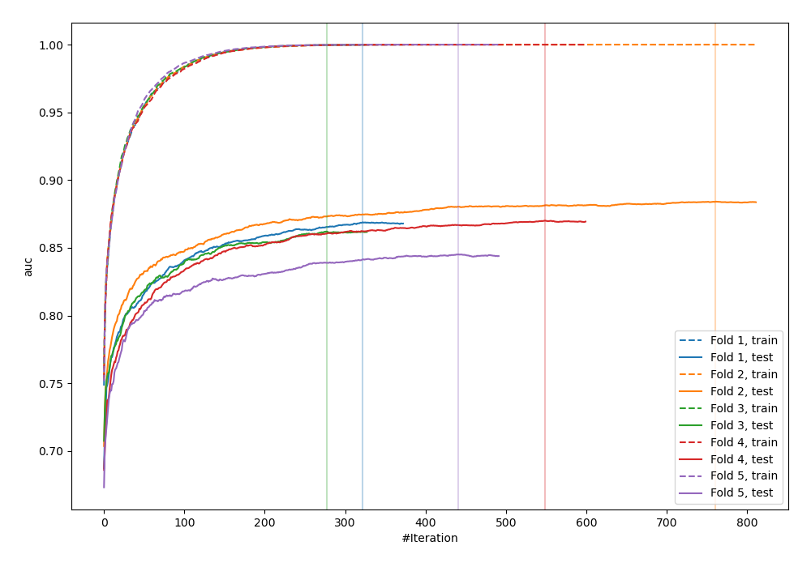
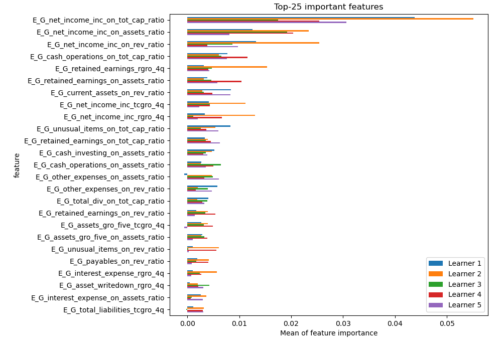
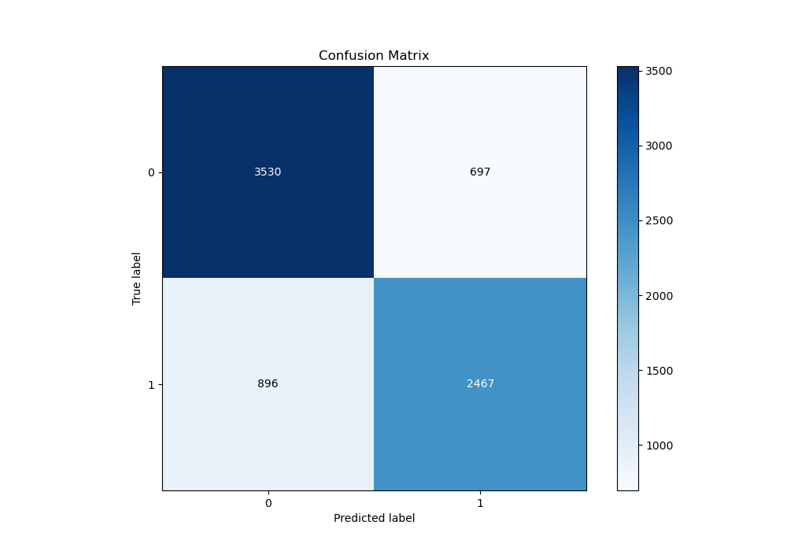
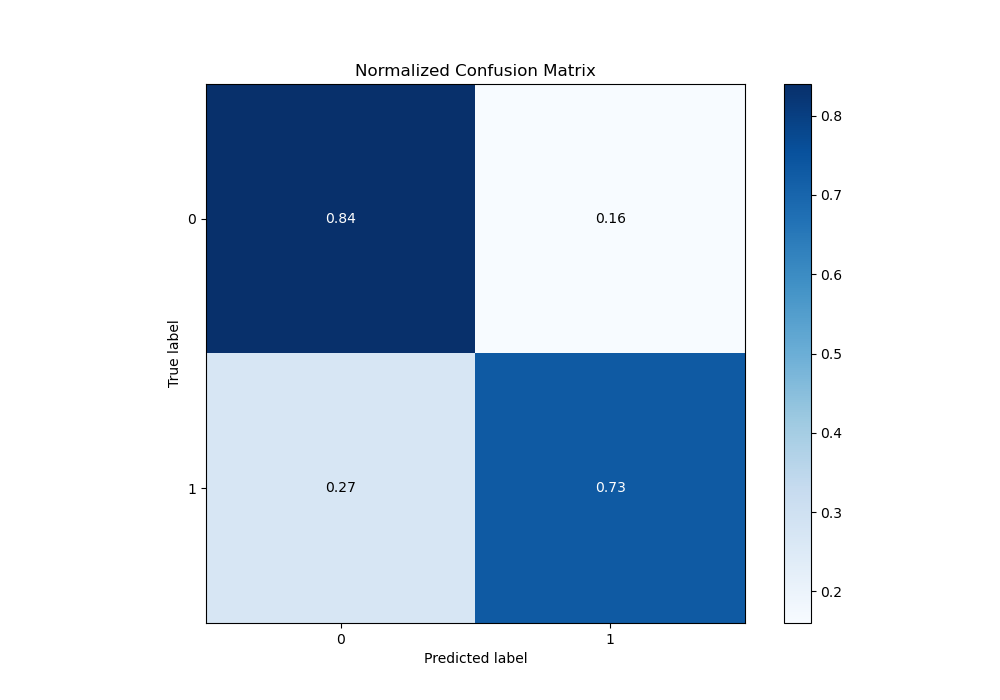
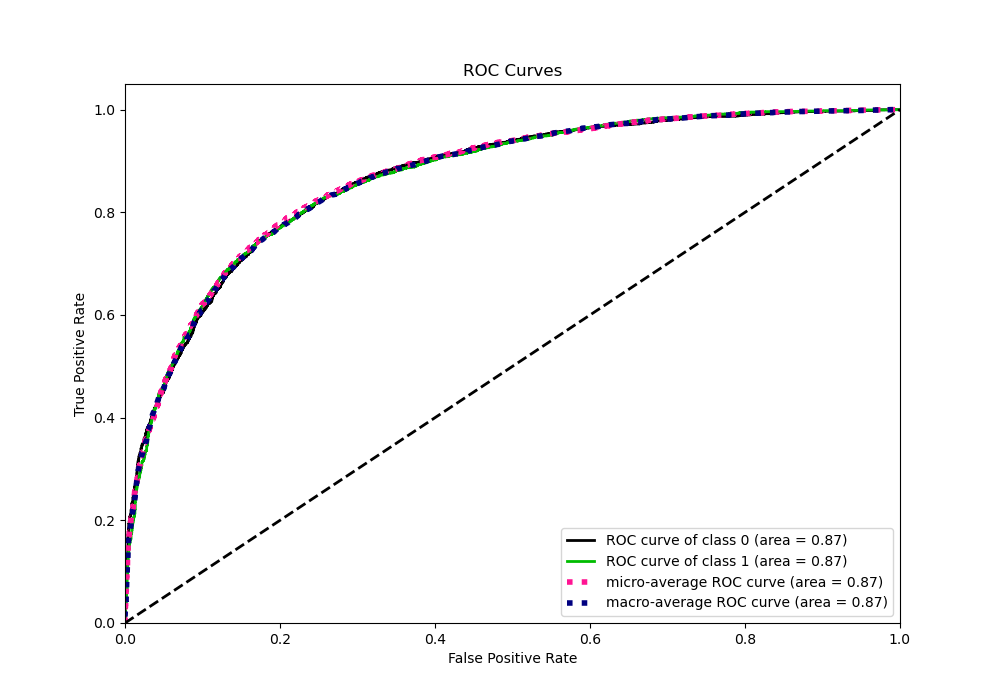
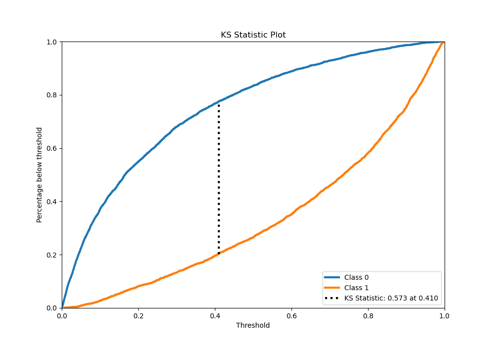
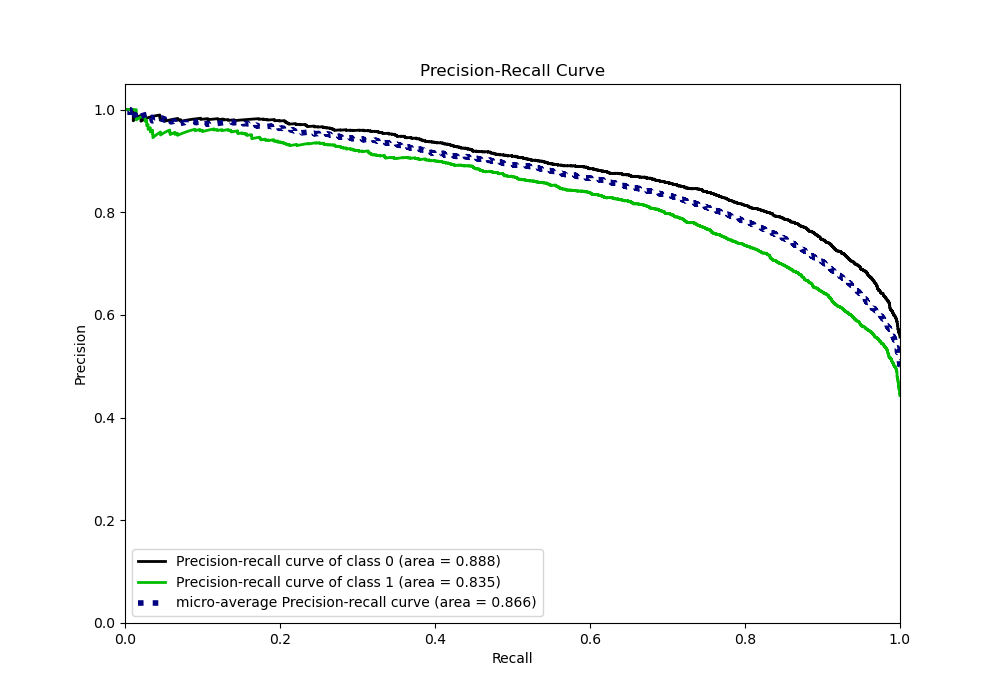
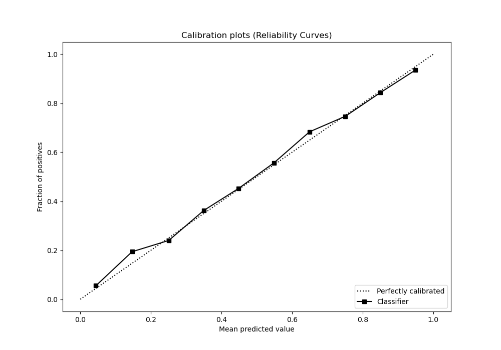
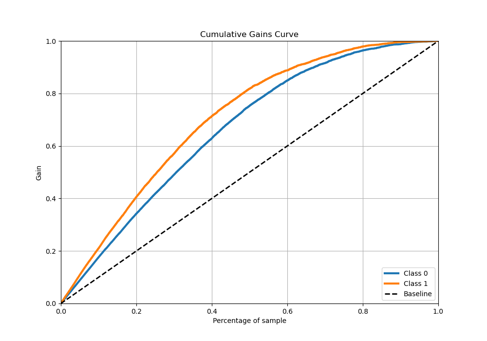
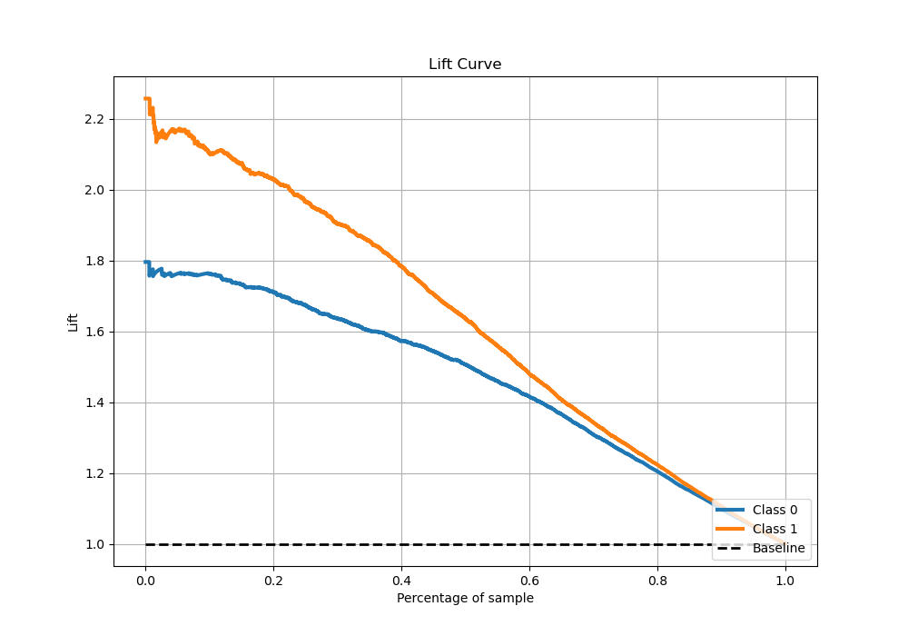

# Summary of 4_Xgboost

[<< Go back](../README.md)

## Extreme Gradient Boosting (Xgboost)
- **n_jobs**: -1
- **objective**: binary:logistic
- **eta**: 0.1
- **max_depth**: 7
- **min_child_weight**: 25
- **subsample**: 0.9
- **colsample_bytree**: 0.6
- **eval_metric**: auc
- **explain_level**: 1

## Validation
 - **validation_type**: kfold
 - **k_folds**: 5
 - **shuffle**: True
 - **stratify**: True

## Optimized metric
auc

## Training time

80.5 seconds

## Metric details
|           |    score |    threshold |
|:----------|---------:|-------------:|
| logloss   | 0.45466  | nan          |
| auc       | 0.866224 | nan          |
| f1        | 0.768998 |   0.360258   |
| accuracy  | 0.790119 |   0.50165    |
| precision | 0.961783 |   0.96266    |
| recall    | 1        |   0.00013108 |
| mcc       | 0.572958 |   0.50165    |

## Metric details with threshold from accuracy metric
|           |    score |   threshold |
|:----------|---------:|------------:|
| logloss   | 0.45466  |   nan       |
| auc       | 0.866224 |   nan       |
| f1        | 0.755937 |     0.50165 |
| accuracy  | 0.790119 |     0.50165 |
| precision | 0.779709 |     0.50165 |
| recall    | 0.733571 |     0.50165 |
| mcc       | 0.572958 |     0.50165 |

## Confusion matrix (at threshold=0.50165)
|              |   Predicted as 0 |   Predicted as 1 |
|:-------------|-----------------:|-----------------:|
| Labeled as 0 |             3530 |              697 |
| Labeled as 1 |              896 |             2467 |

## Learning curves

## Permutation-based Importance

## Confusion Matrix

## Normalized Confusion Matrix

## ROC Curve

## Kolmogorov-Smirnov Statistic

## Precision-Recall Curve

## Calibration Curve

## Cumulative Gains Curve

## Lift Curve

[<< Go back](../README.md)
