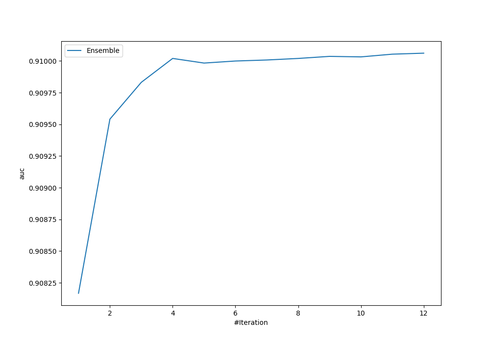
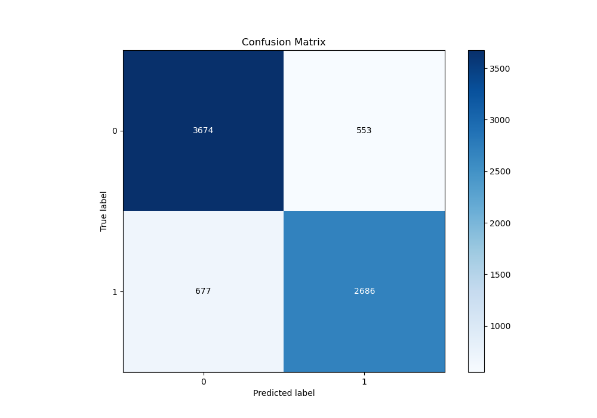
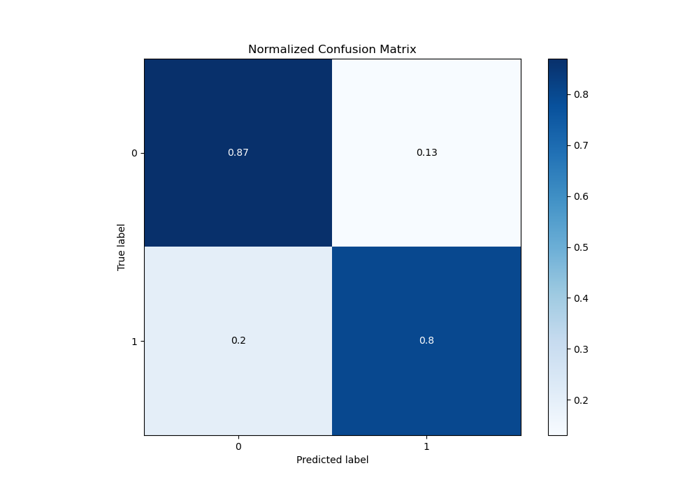
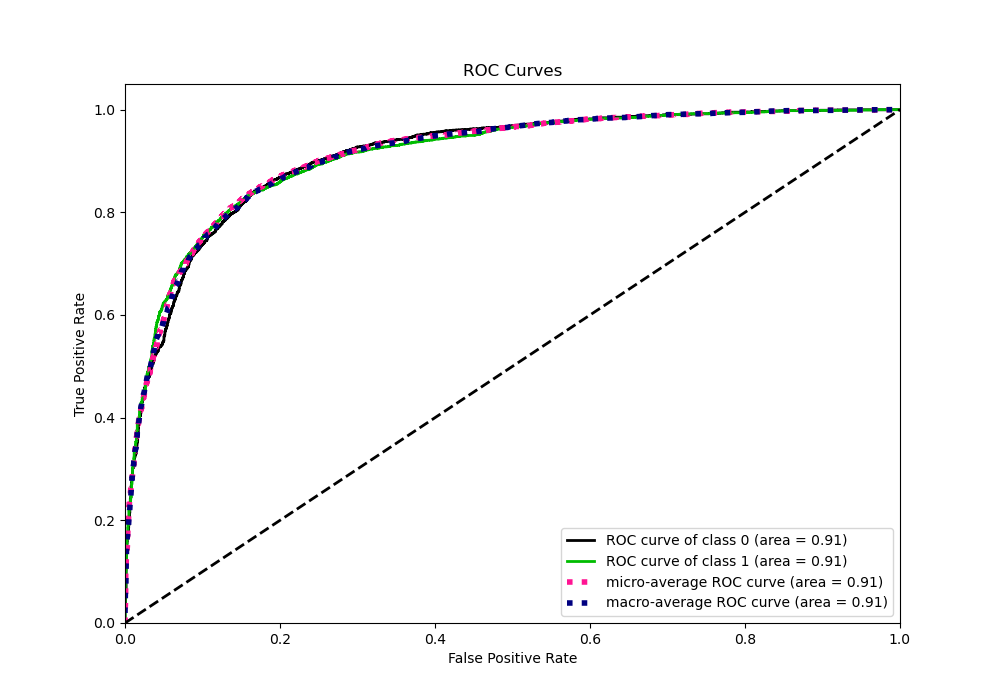
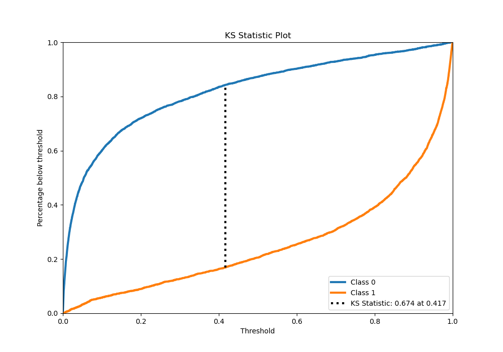
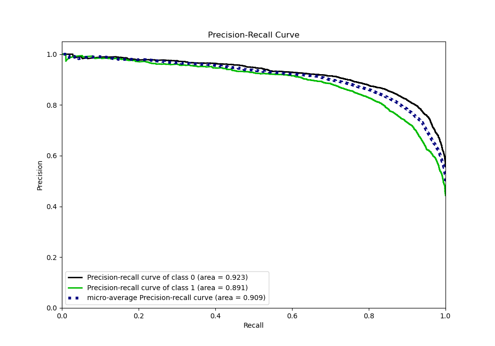
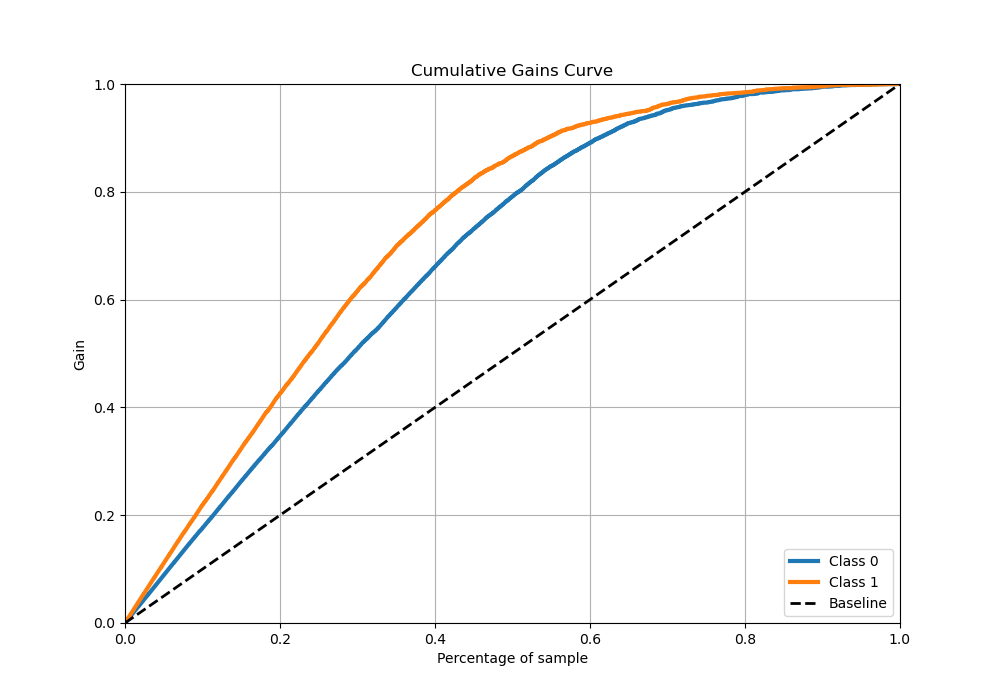
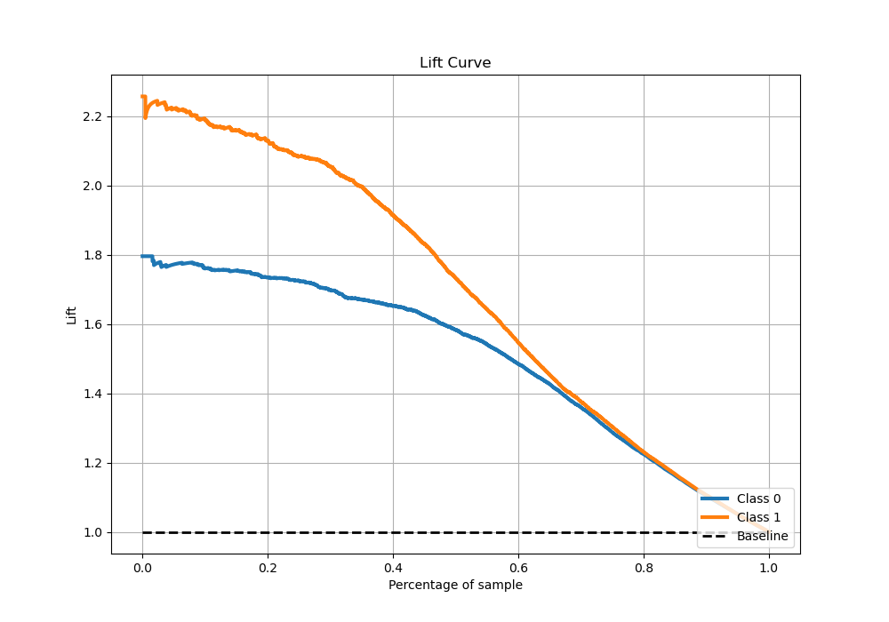

# Summary of Ensemble

[<< Go back](../README.md)

## Ensemble structure
| Model                                             |   Weight |
|:--------------------------------------------------|---------:|
| 10_Xgboost_GoldenFeatures_SelectedFeatures        |        1 |
| 11_Xgboost_GoldenFeatures_SelectedFeatures        |        5 |
| 1_Default_Xgboost_GoldenFeatures_SelectedFeatures |        2 |
| 3_Xgboost                                         |        1 |
| 7_Xgboost_GoldenFeatures_SelectedFeatures         |        3 |

## Metric details
|           |    score |     threshold |
|:----------|---------:|--------------:|
| logloss   | 0.390514 | nan           |
| auc       | 0.910061 | nan           |
| f1        | 0.818808 |   0.415856    |
| accuracy  | 0.837945 |   0.489871    |
| precision | 0.993902 |   0.995613    |
| recall    | 1        |   5.20535e-06 |
| mcc       | 0.671019 |   0.415856    |

## Metric details with threshold from accuracy metric
|           |    score |   threshold |
|:----------|---------:|------------:|
| logloss   | 0.390514 |  nan        |
| auc       | 0.910061 |  nan        |
| f1        | 0.813693 |    0.489871 |
| accuracy  | 0.837945 |    0.489871 |
| precision | 0.829268 |    0.489871 |
| recall    | 0.798692 |    0.489871 |
| mcc       | 0.670763 |    0.489871 |

## Confusion matrix (at threshold=0.489871)
|              |   Predicted as 0 |   Predicted as 1 |
|:-------------|-----------------:|-----------------:|
| Labeled as 0 |             3674 |              553 |
| Labeled as 1 |              677 |             2686 |

## Learning curves

## Confusion Matrix

## Normalized Confusion Matrix

## ROC Curve

## Kolmogorov-Smirnov Statistic

## Precision-Recall Curve

## Calibration Curve

## Cumulative Gains Curve

## Lift Curve

[<< Go back](../README.md)
