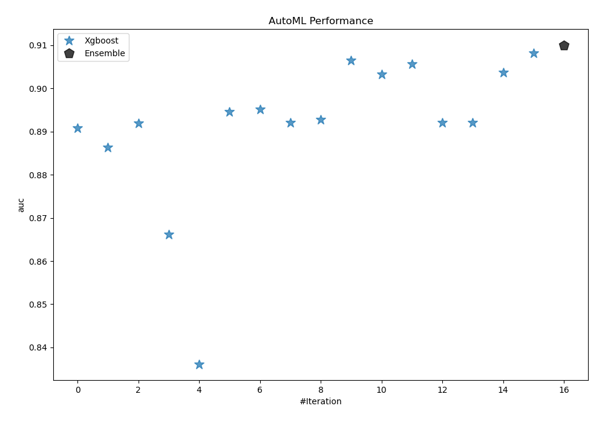
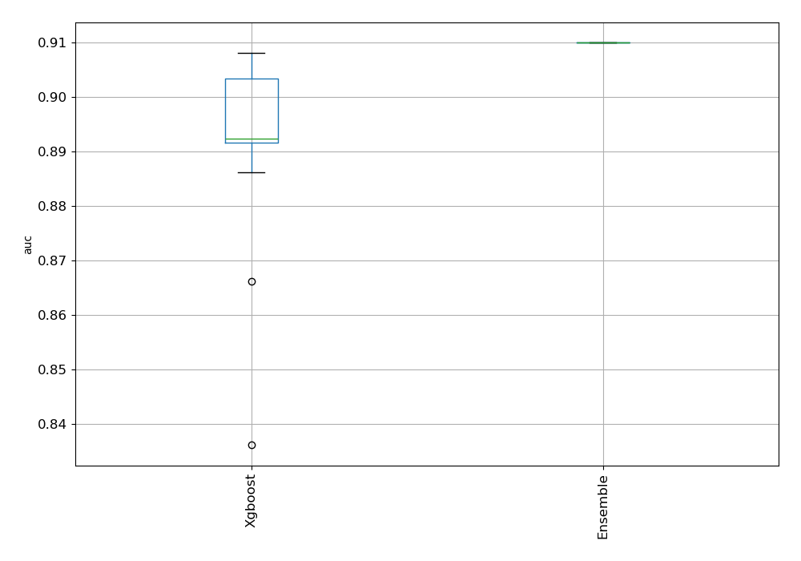
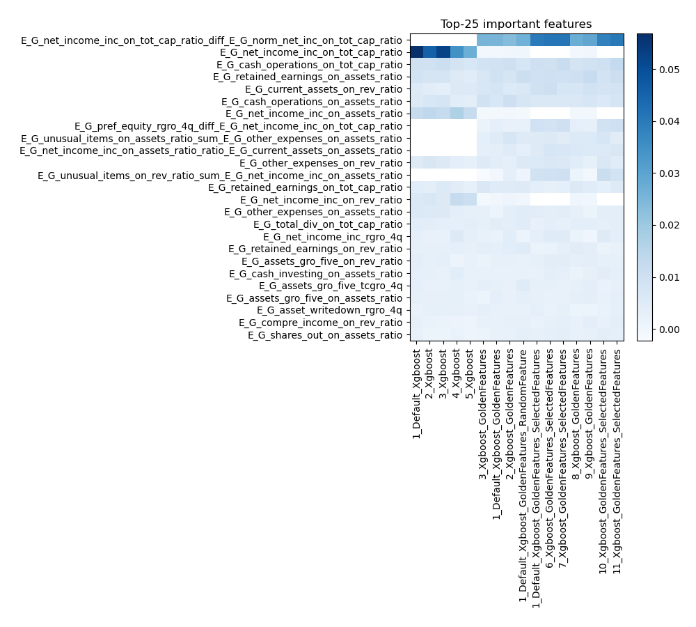
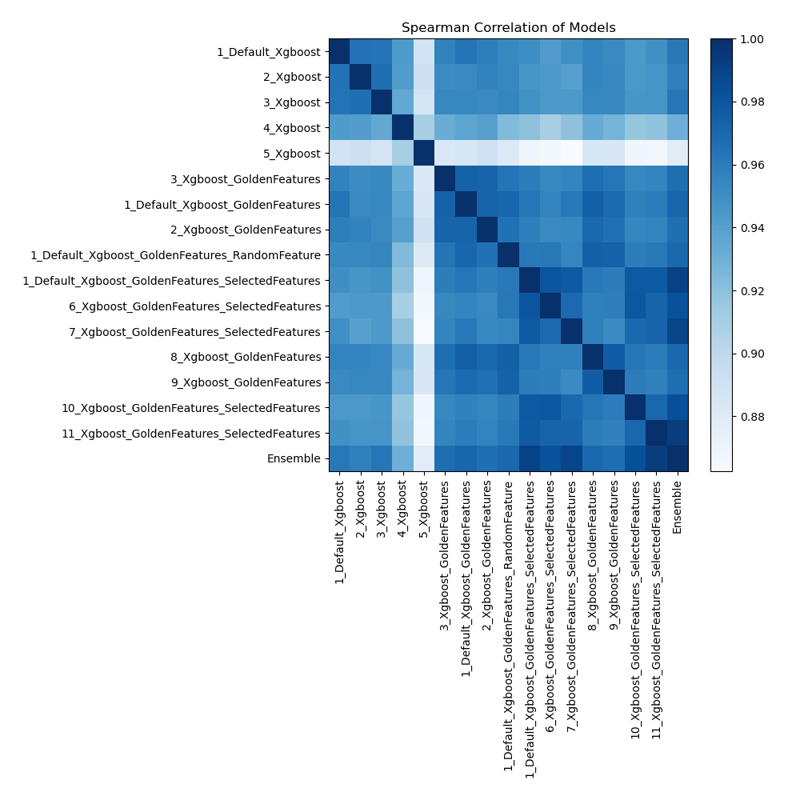

# AutoML Leaderboard

| Best model   | name                                                                                                             | model_type   | metric_type   |   metric_value |   train_time |   single_prediction_time |
|:-------------|:-----------------------------------------------------------------------------------------------------------------|:-------------|:--------------|---------------:|-------------:|-------------------------:|
|              | [1_Default_Xgboost](1_Default_Xgboost/README.md)                                                                 | Xgboost      | auc           |       0.890744 |       100.24 |                   0.1818 |
|              | [2_Xgboost](2_Xgboost/README.md)                                                                                 | Xgboost      | auc           |       0.886286 |        92.35 |                   0.1022 |
|              | [3_Xgboost](3_Xgboost/README.md)                                                                                 | Xgboost      | auc           |       0.891942 |        99.45 |                   0.1025 |
|              | [4_Xgboost](4_Xgboost/README.md)                                                                                 | Xgboost      | auc           |       0.866224 |        81.15 |                   0.1057 |
|              | [5_Xgboost](5_Xgboost/README.md)                                                                                 | Xgboost      | auc           |       0.836126 |        67.68 |                   0.0949 |
|              | [3_Xgboost_GoldenFeatures](3_Xgboost_GoldenFeatures/README.md)                                                   | Xgboost      | auc           |       0.894635 |       330.53 |                   0.1743 |
|              | [1_Default_Xgboost_GoldenFeatures](1_Default_Xgboost_GoldenFeatures/README.md)                                   | Xgboost      | auc           |       0.895156 |       130.92 |                   0.1787 |
|              | [2_Xgboost_GoldenFeatures](2_Xgboost_GoldenFeatures/README.md)                                                   | Xgboost      | auc           |       0.892094 |       116.76 |                   0.1678 |
|              | [1_Default_Xgboost_GoldenFeatures_RandomFeature](1_Default_Xgboost_GoldenFeatures_RandomFeature/README.md)       | Xgboost      | auc           |       0.892793 |       104.46 |                   0.1853 |
|              | [1_Default_Xgboost_GoldenFeatures_SelectedFeatures](1_Default_Xgboost_GoldenFeatures_SelectedFeatures/README.md) | Xgboost      | auc           |       0.906444 |        50    |                   0.0822 |
|              | [6_Xgboost_GoldenFeatures_SelectedFeatures](6_Xgboost_GoldenFeatures_SelectedFeatures/README.md)                 | Xgboost      | auc           |       0.903277 |        60.73 |                   0.0899 |
|              | [7_Xgboost_GoldenFeatures_SelectedFeatures](7_Xgboost_GoldenFeatures_SelectedFeatures/README.md)                 | Xgboost      | auc           |       0.905659 |        37.12 |                   0.0882 |
|              | [8_Xgboost_GoldenFeatures](8_Xgboost_GoldenFeatures/README.md)                                                   | Xgboost      | auc           |       0.892017 |       138.17 |                   0.1791 |
|              | [9_Xgboost_GoldenFeatures](9_Xgboost_GoldenFeatures/README.md)                                                   | Xgboost      | auc           |       0.892088 |        97.09 |                   0.1553 |
|              | [10_Xgboost_GoldenFeatures_SelectedFeatures](10_Xgboost_GoldenFeatures_SelectedFeatures/README.md)               | Xgboost      | auc           |       0.903725 |        40.79 |                   0.0785 |
| **the best** | [11_Xgboost_GoldenFeatures_SelectedFeatures](11_Xgboost_GoldenFeatures_SelectedFeatures/README.md)               | Xgboost      | auc           |       0.908167 |        43.31 |                   0.0819 |
|              | [Ensemble](Ensemble/README.md)                                                                                   | Ensemble     | auc           |       0.910061 |         1.4  |                   0.6097 |

### AutoML Performance

### AutoML Performance Boxplot

### Features Importance

### Spearman Correlation of Models

