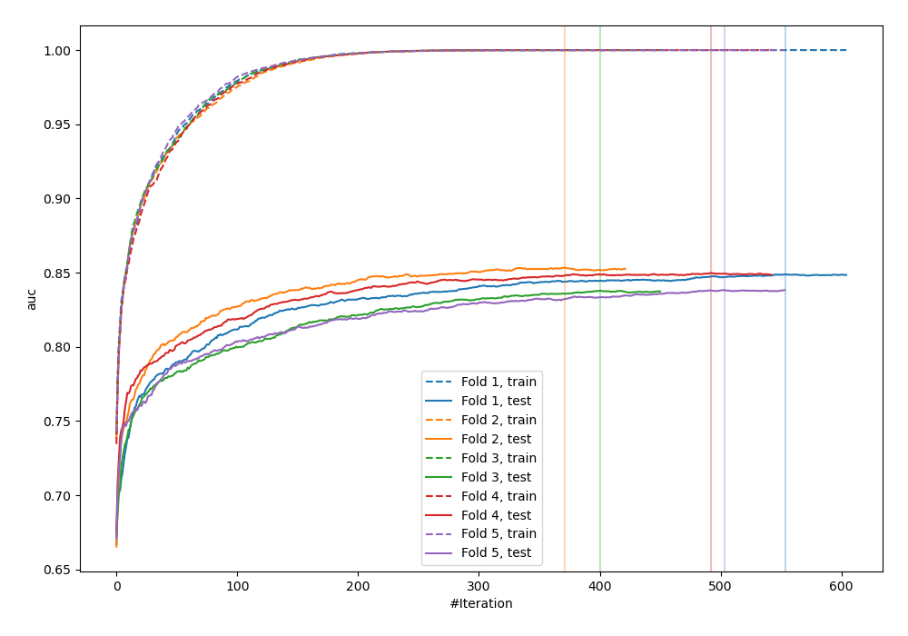
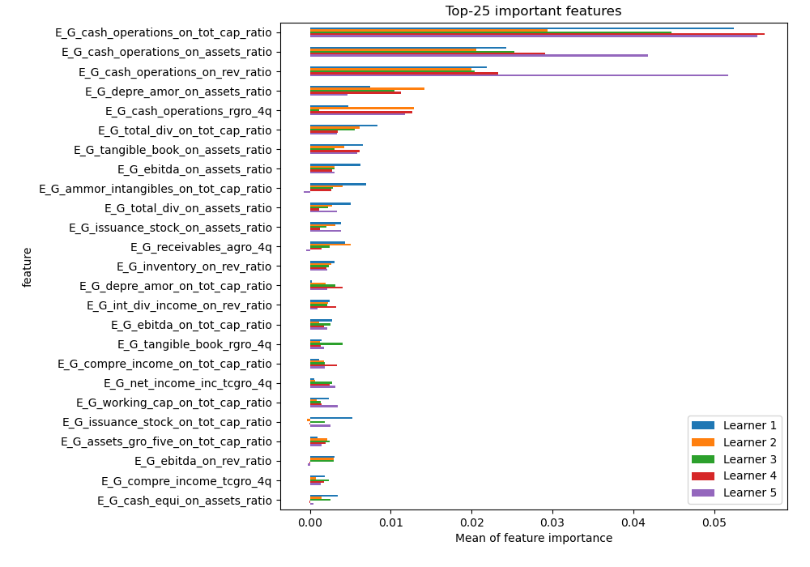
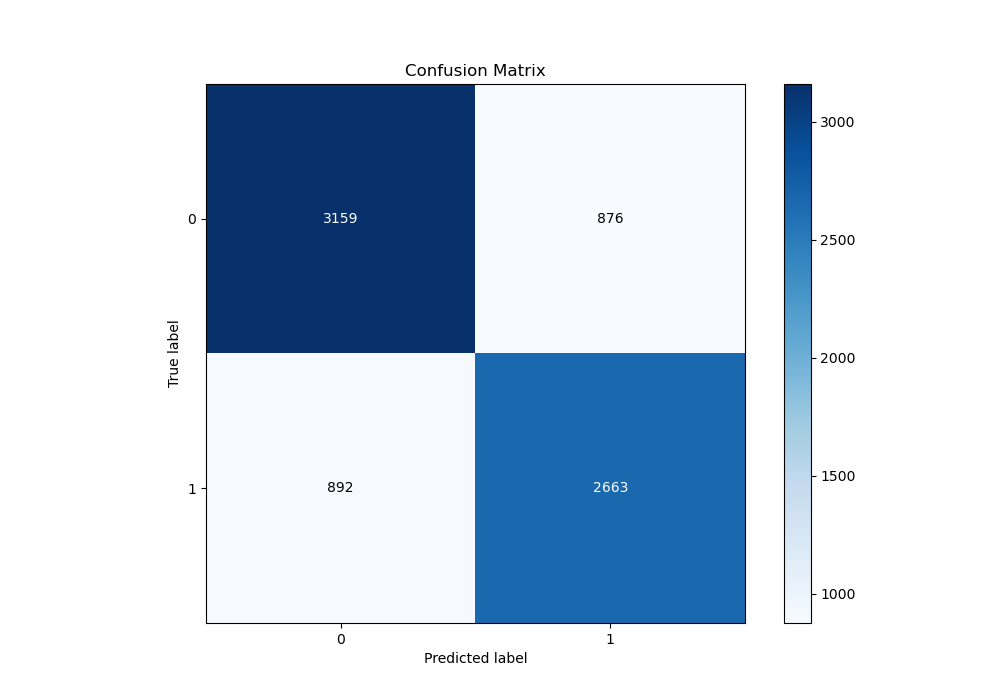
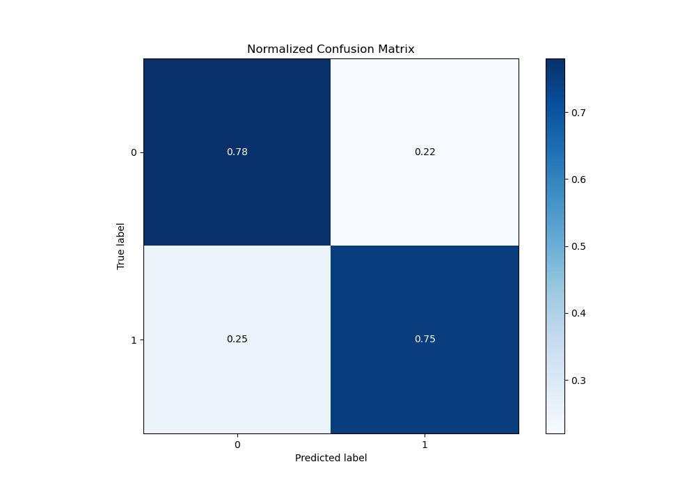
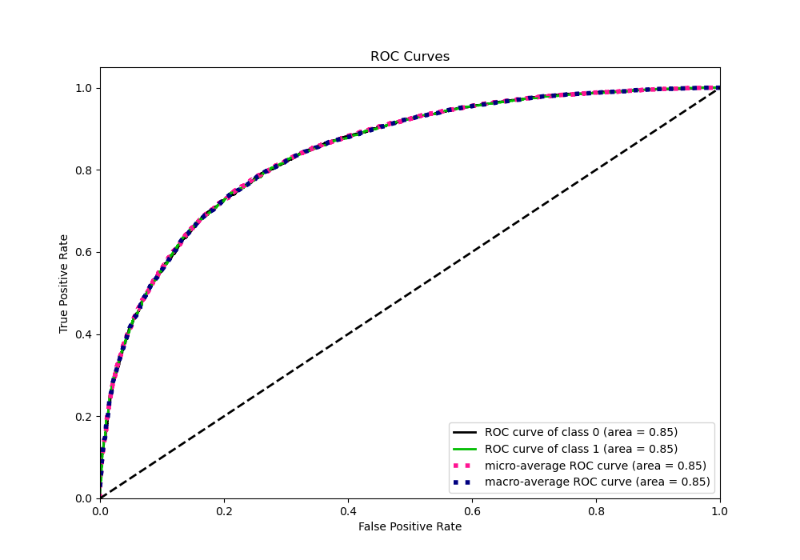
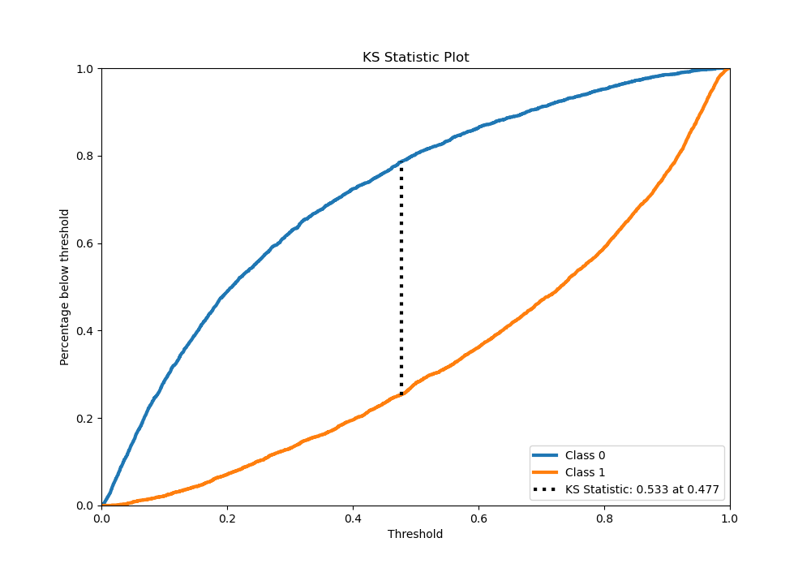
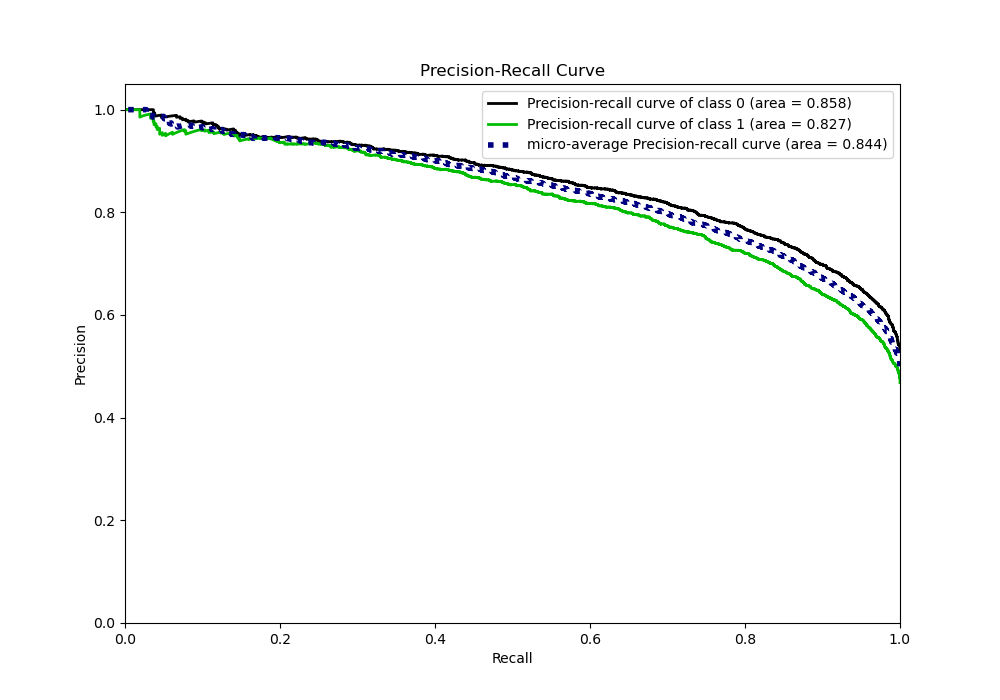
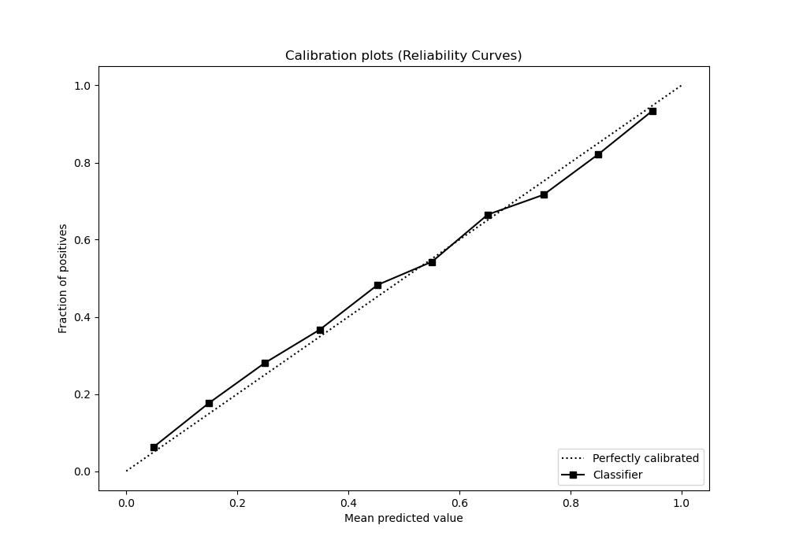
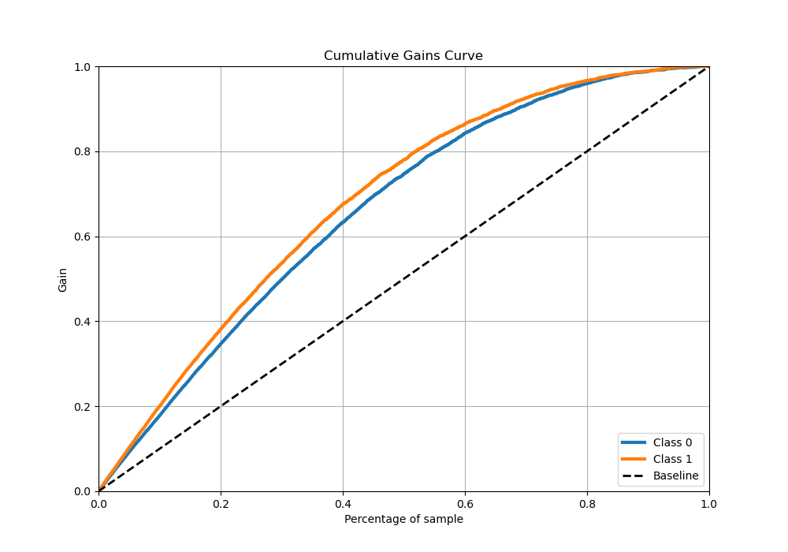
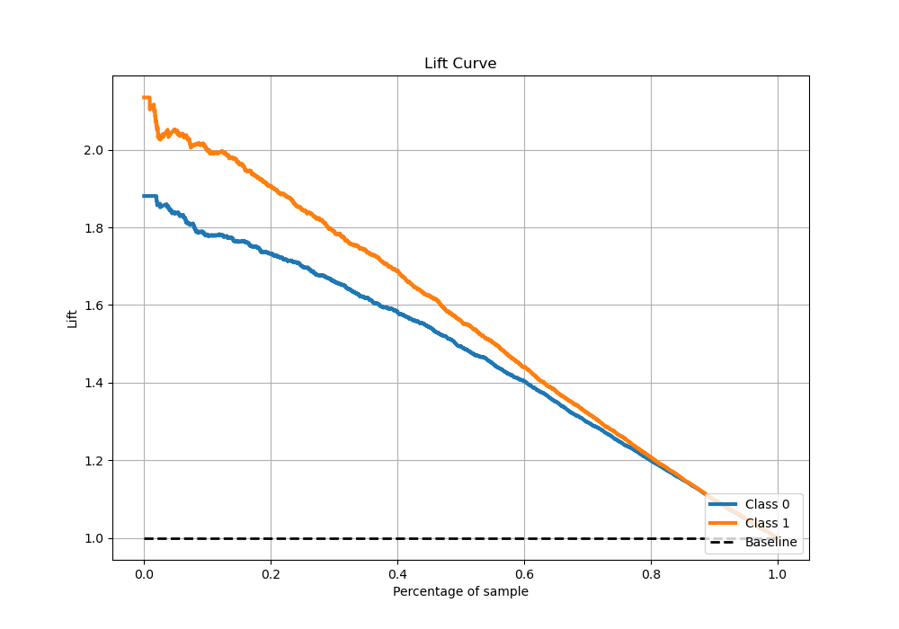

# Summary of 4_Xgboost

[<< Go back](../README.md)

## Extreme Gradient Boosting (Xgboost)
- **n_jobs**: -1
- **objective**: binary:logistic
- **eta**: 0.1
- **max_depth**: 7
- **min_child_weight**: 25
- **subsample**: 0.9
- **colsample_bytree**: 0.6
- **eval_metric**: auc
- **explain_level**: 1

## Validation
 - **validation_type**: kfold
 - **k_folds**: 5
 - **shuffle**: True
 - **stratify**: True

## Optimized metric
auc

## Training time

80.3 seconds

## Metric details
|           |    score |    threshold |
|:----------|---------:|-------------:|
| logloss   | 0.486951 | nan          |
| auc       | 0.845368 | nan          |
| f1        | 0.761231 |   0.360931   |
| accuracy  | 0.767062 |   0.472717   |
| precision | 0.963415 |   0.974112   |
| recall    | 1        |   0.00119421 |
| mcc       | 0.532133 |   0.472717   |

## Metric details with threshold from accuracy metric
|           |    score |   threshold |
|:----------|---------:|------------:|
| logloss   | 0.486951 |  nan        |
| auc       | 0.845368 |  nan        |
| f1        | 0.750775 |    0.472717 |
| accuracy  | 0.767062 |    0.472717 |
| precision | 0.752472 |    0.472717 |
| recall    | 0.749086 |    0.472717 |
| mcc       | 0.532133 |    0.472717 |

## Confusion matrix (at threshold=0.472717)
|              |   Predicted as 0 |   Predicted as 1 |
|:-------------|-----------------:|-----------------:|
| Labeled as 0 |             3159 |              876 |
| Labeled as 1 |              892 |             2663 |

## Learning curves

## Permutation-based Importance

## Confusion Matrix

## Normalized Confusion Matrix

## ROC Curve

## Kolmogorov-Smirnov Statistic

## Precision-Recall Curve

## Calibration Curve

## Cumulative Gains Curve

## Lift Curve

[<< Go back](../README.md)
