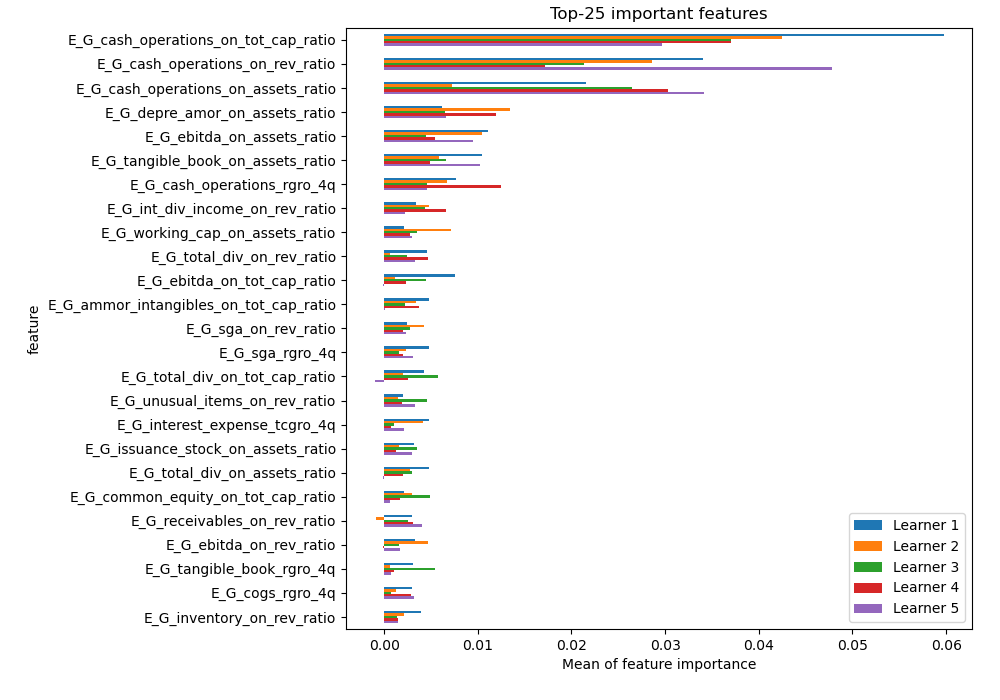
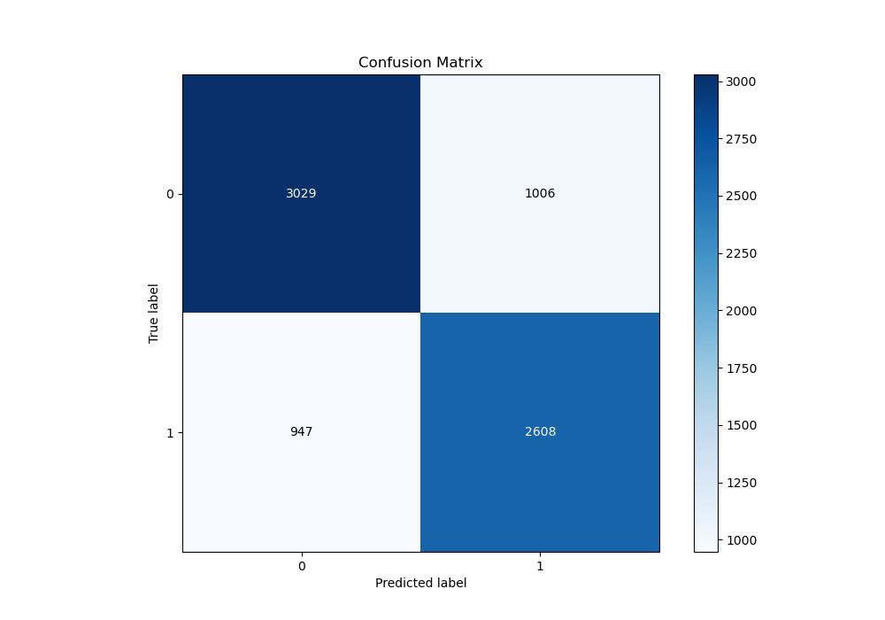
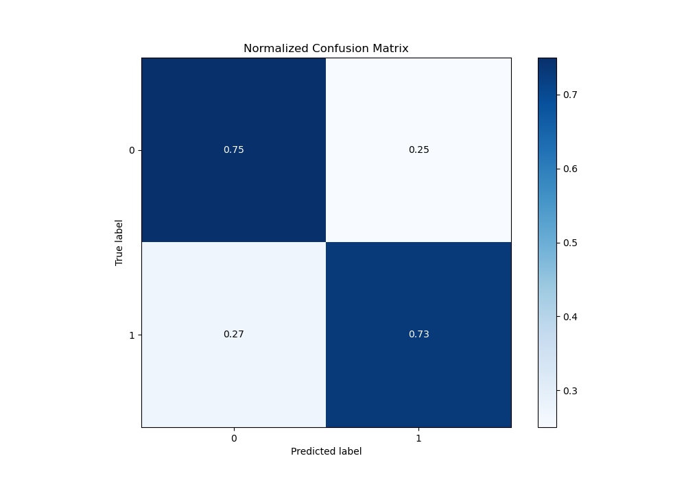
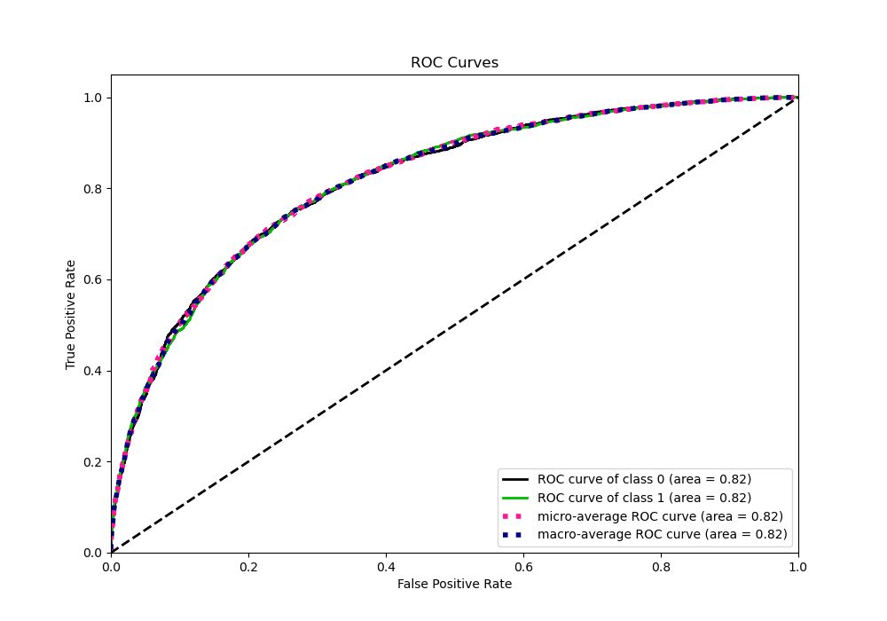
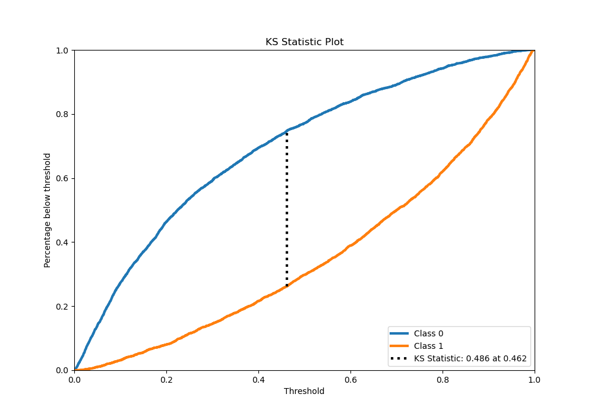
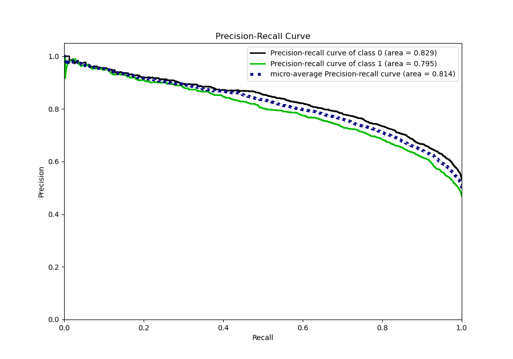
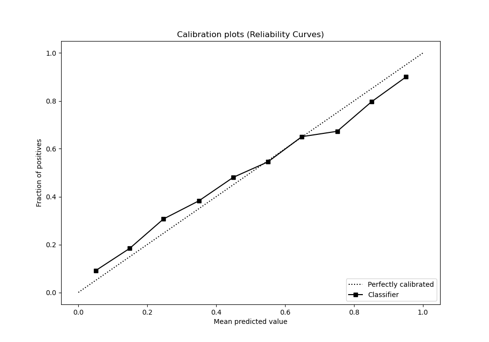
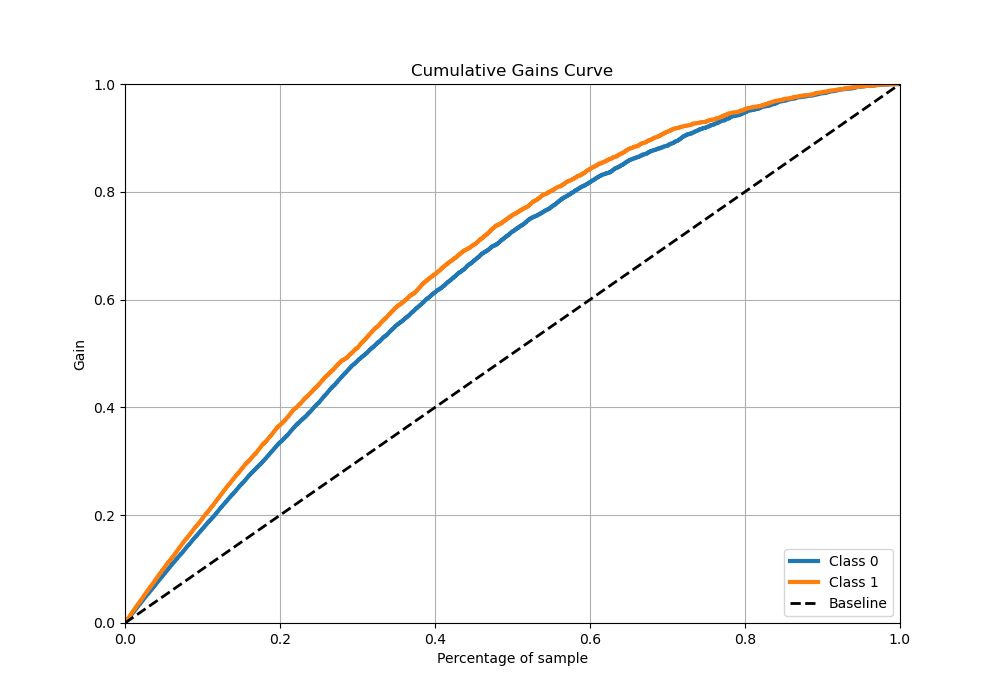
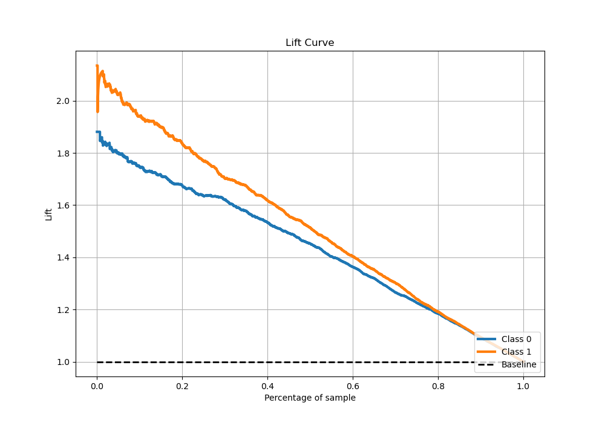

# Summary of 5_Xgboost

[<< Go back](../README.md)

## Extreme Gradient Boosting (Xgboost)
- **n_jobs**: -1
- **objective**: binary:logistic
- **eta**: 0.15
- **max_depth**: 8
- **min_child_weight**: 50
- **subsample**: 0.6
- **colsample_bytree**: 0.6
- **eval_metric**: auc
- **explain_level**: 1

## Validation
 - **validation_type**: kfold
 - **k_folds**: 5
 - **shuffle**: True
 - **stratify**: True

## Optimized metric
auc

## Training time

89.4 seconds

## Metric details
|           |    score |     threshold |
|:----------|---------:|--------------:|
| logloss   | 0.529779 | nan           |
| auc       | 0.817034 | nan           |
| f1        | 0.738703 |   0.314525    |
| accuracy  | 0.742688 |   0.466013    |
| precision | 0.963415 |   0.979676    |
| recall    | 1        |   0.000372176 |
| mcc       | 0.483877 |   0.466013    |

## Metric details with threshold from accuracy metric
|           |    score |   threshold |
|:----------|---------:|------------:|
| logloss   | 0.529779 |  nan        |
| auc       | 0.817034 |  nan        |
| f1        | 0.727577 |    0.466013 |
| accuracy  | 0.742688 |    0.466013 |
| precision | 0.721638 |    0.466013 |
| recall    | 0.733615 |    0.466013 |
| mcc       | 0.483877 |    0.466013 |

## Confusion matrix (at threshold=0.466013)
|              |   Predicted as 0 |   Predicted as 1 |
|:-------------|-----------------:|-----------------:|
| Labeled as 0 |             3029 |             1006 |
| Labeled as 1 |              947 |             2608 |

## Learning curves

## Permutation-based Importance

## Confusion Matrix

## Normalized Confusion Matrix

## ROC Curve

## Kolmogorov-Smirnov Statistic

## Precision-Recall Curve

## Calibration Curve

## Cumulative Gains Curve

## Lift Curve

[<< Go back](../README.md)
