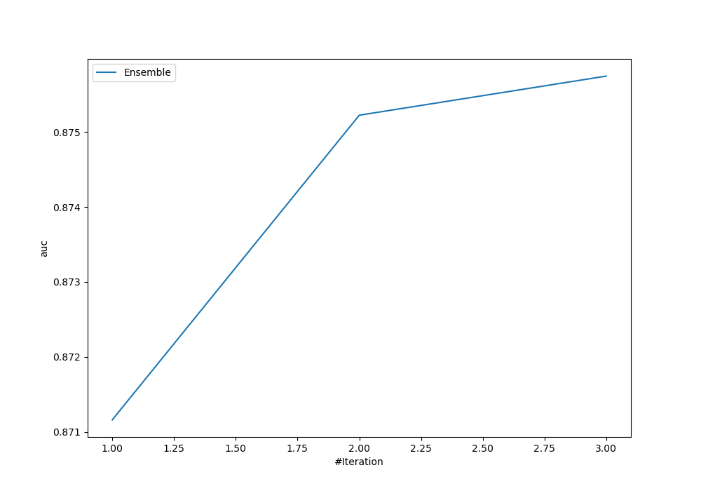
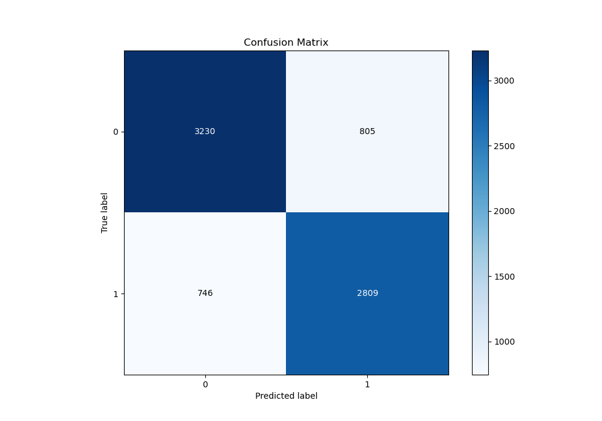
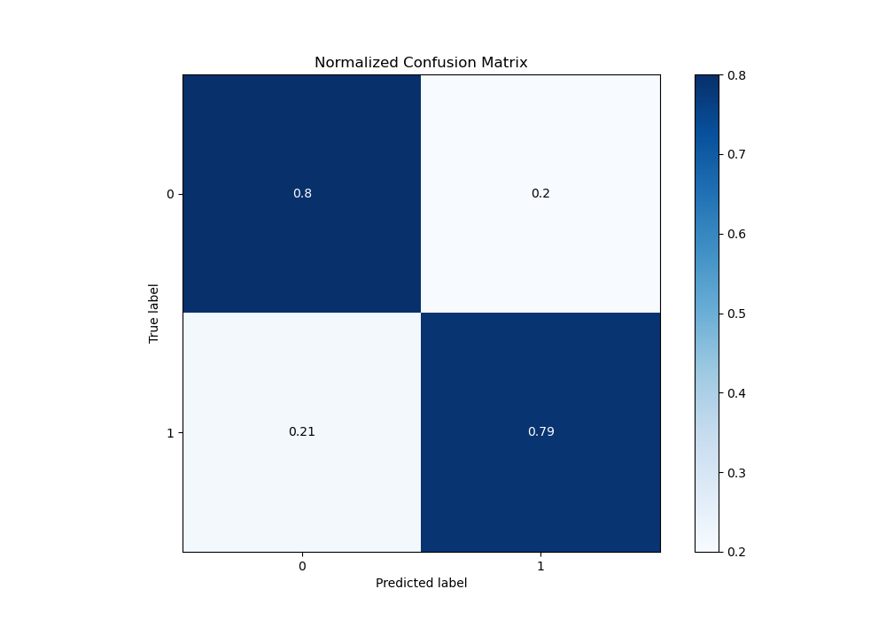
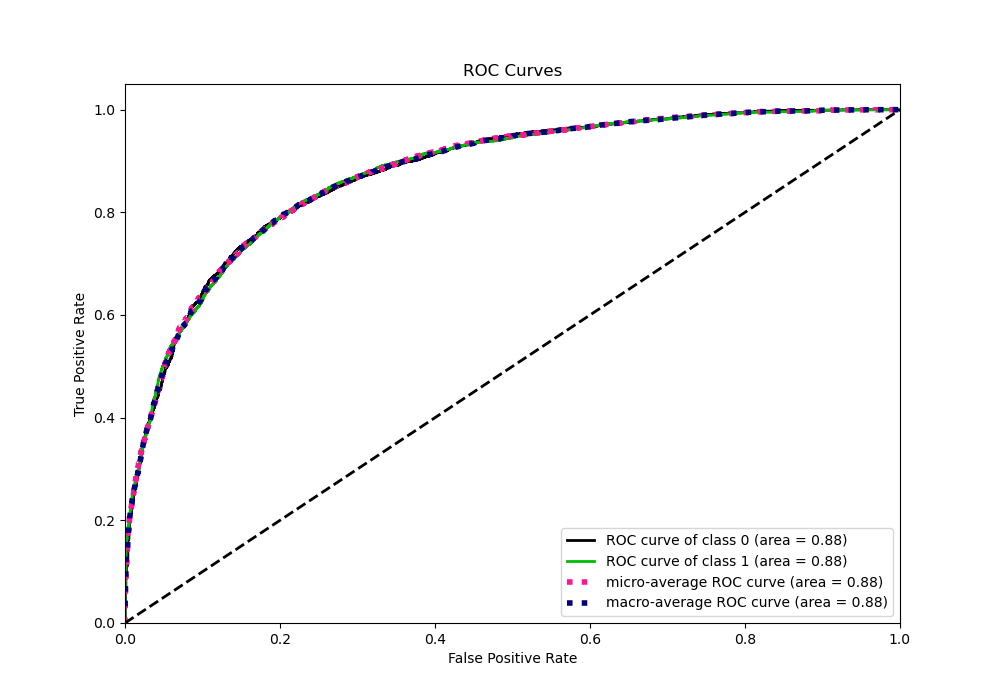
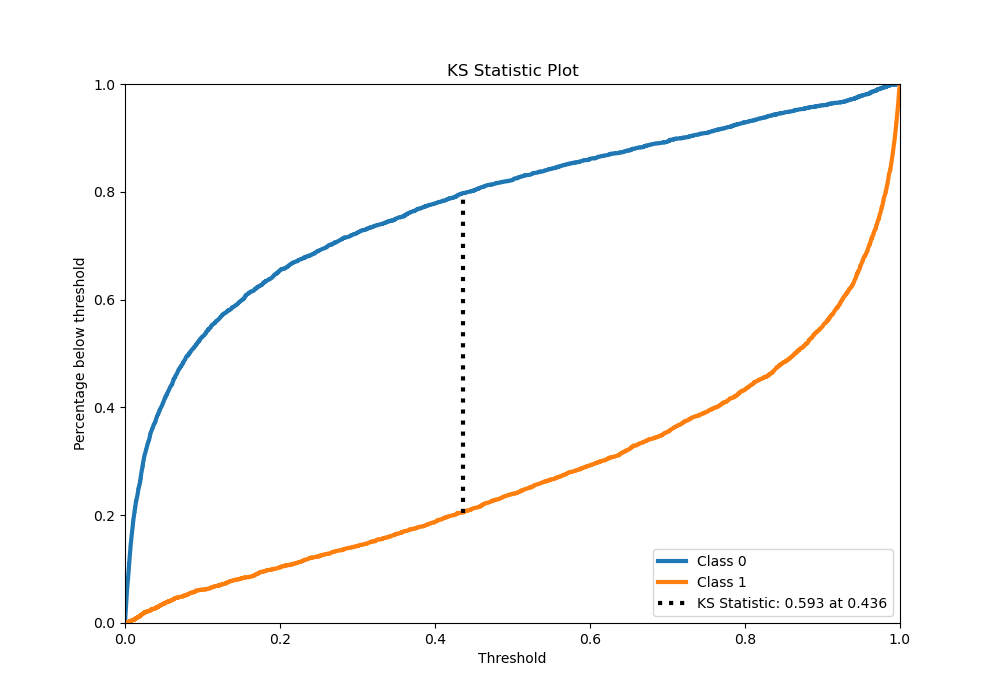
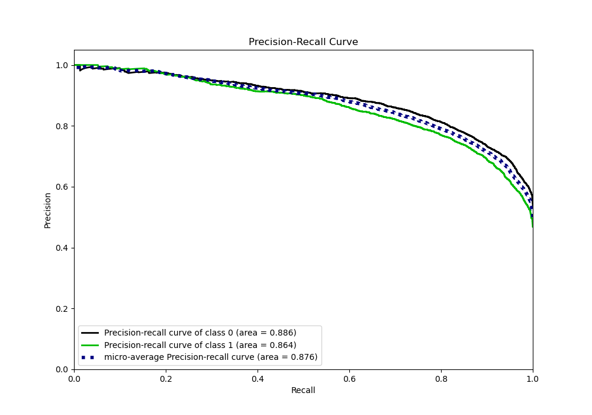
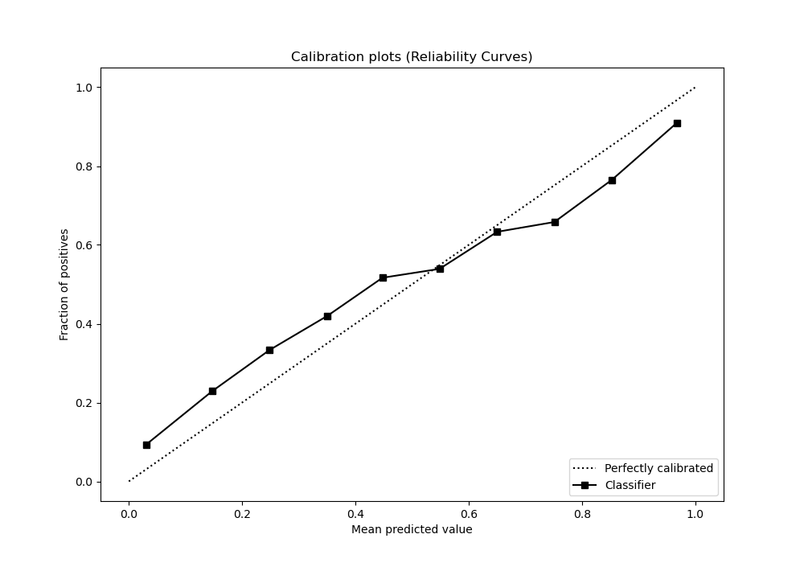
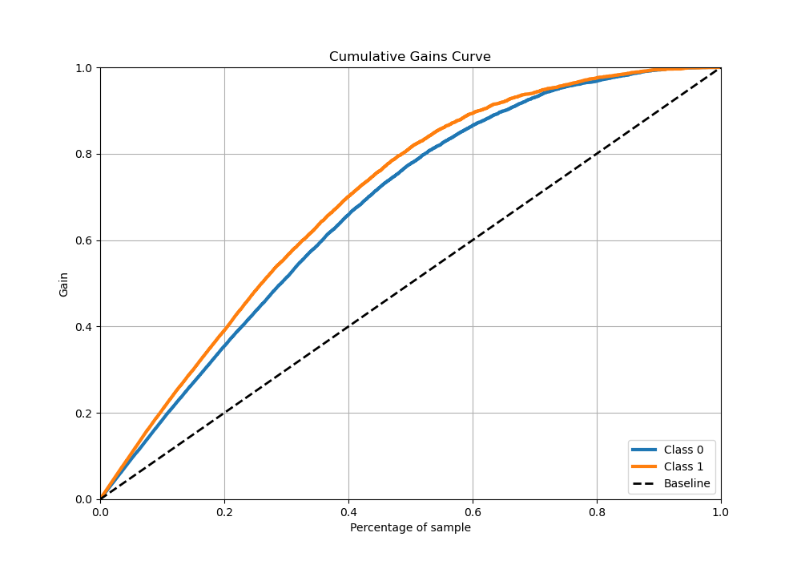
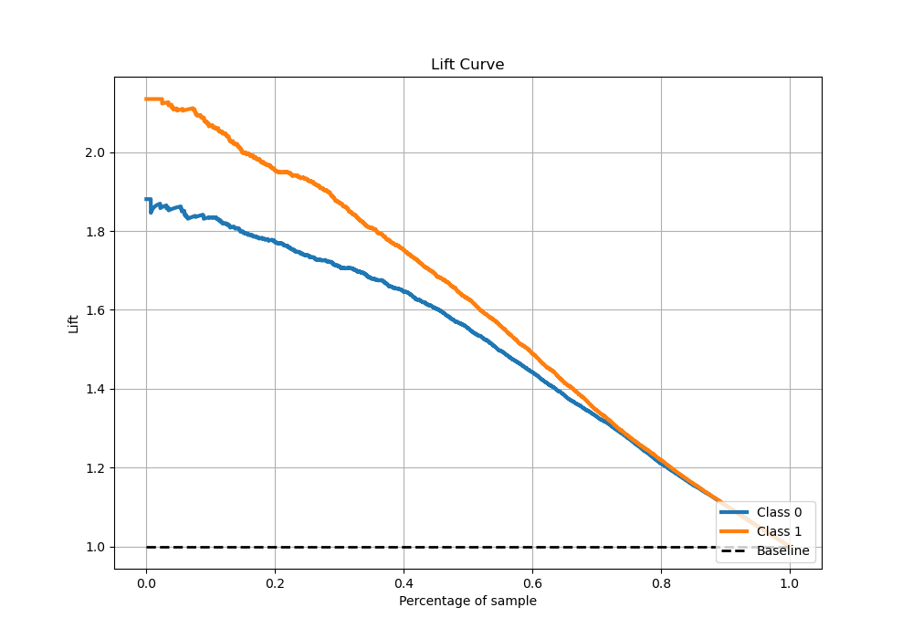

# Summary of Ensemble

[<< Go back](../README.md)

## Ensemble structure
| Model                    |   Weight |
|:-------------------------|---------:|
| 3_Xgboost                |        1 |
| 3_Xgboost_GoldenFeatures |        1 |
| 7_Xgboost_GoldenFeatures |        1 |

## Metric details
|           |    score |     threshold |
|:----------|---------:|--------------:|
| logloss   | 0.471353 | nan           |
| auc       | 0.875746 | nan           |
| f1        | 0.790226 |   0.304942    |
| accuracy  | 0.795652 |   0.445516    |
| precision | 1        |   0.997039    |
| recall    | 1        |   3.90631e-05 |
| mcc       | 0.591417 |   0.384911    |

## Metric details with threshold from accuracy metric
|           |    score |   threshold |
|:----------|---------:|------------:|
| logloss   | 0.471353 |  nan        |
| auc       | 0.875746 |  nan        |
| f1        | 0.783652 |    0.445516 |
| accuracy  | 0.795652 |    0.445516 |
| precision | 0.777255 |    0.445516 |
| recall    | 0.790155 |    0.445516 |
| mcc       | 0.59014  |    0.445516 |

## Confusion matrix (at threshold=0.445516)
|              |   Predicted as 0 |   Predicted as 1 |
|:-------------|-----------------:|-----------------:|
| Labeled as 0 |             3230 |              805 |
| Labeled as 1 |              746 |             2809 |

## Learning curves

## Confusion Matrix

## Normalized Confusion Matrix

## ROC Curve

## Kolmogorov-Smirnov Statistic

## Precision-Recall Curve

## Calibration Curve

## Cumulative Gains Curve

## Lift Curve

[<< Go back](../README.md)
