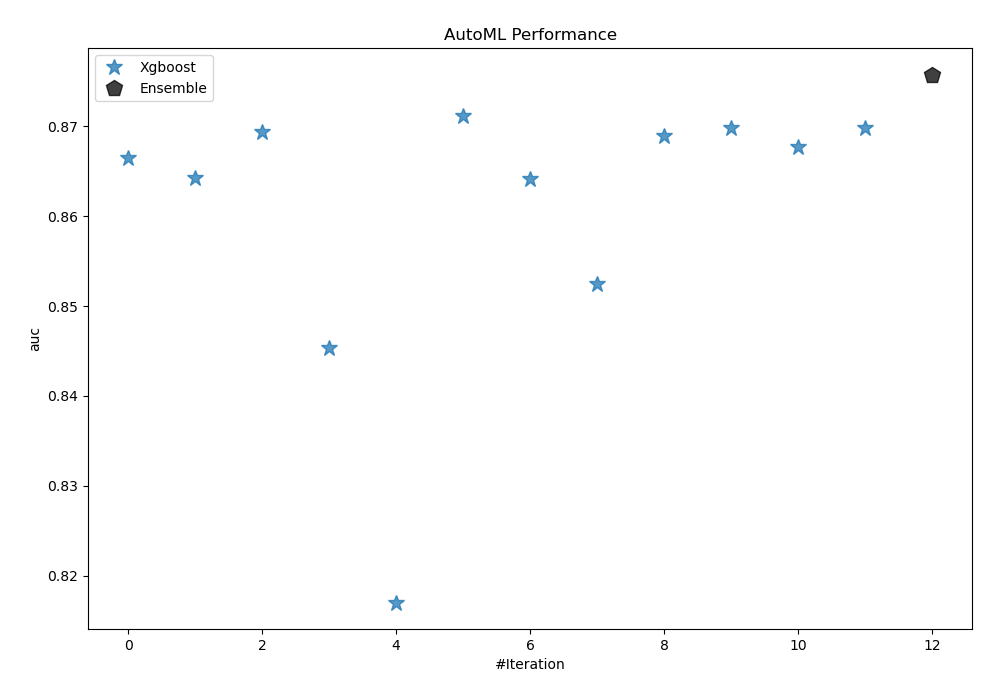
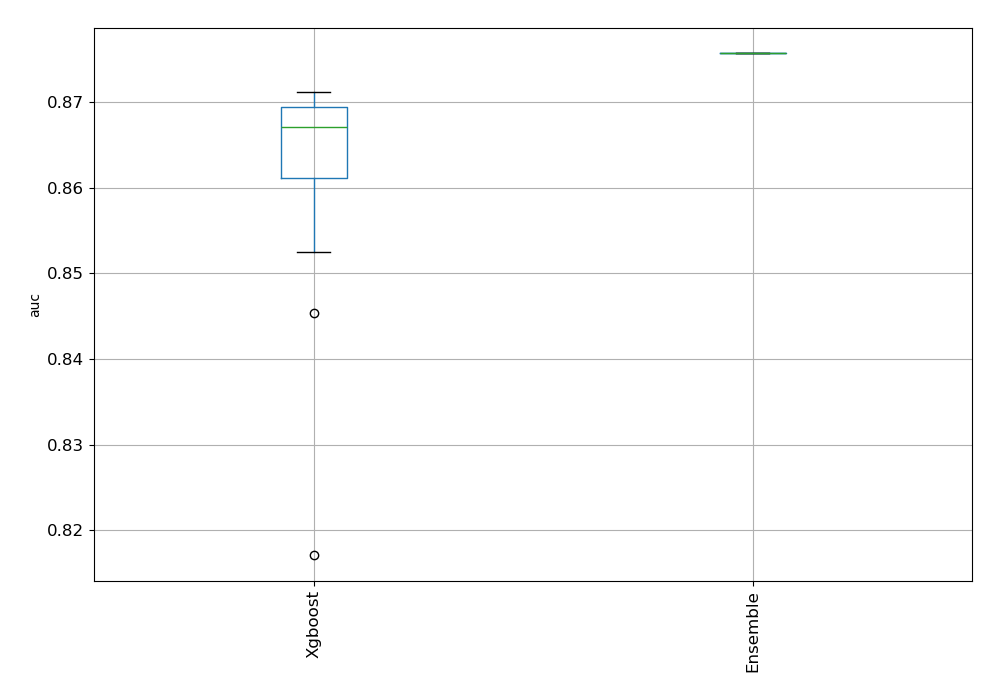
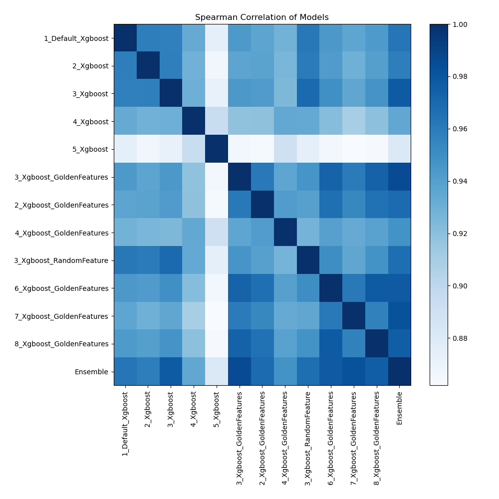

# AutoML Leaderboard

| Best model   | name                                                           | model_type   | metric_type   |   metric_value |   train_time |   single_prediction_time |
|:-------------|:---------------------------------------------------------------|:-------------|:--------------|---------------:|-------------:|-------------------------:|
|              | [1_Default_Xgboost](1_Default_Xgboost/README.md)               | Xgboost      | auc           |       0.866435 |       387.53 |                   0.1597 |
|              | [2_Xgboost](2_Xgboost/README.md)                               | Xgboost      | auc           |       0.864197 |        90.83 |                   0.1763 |
|              | [3_Xgboost](3_Xgboost/README.md)                               | Xgboost      | auc           |       0.869314 |       128.86 |                   0.1851 |
|              | [4_Xgboost](4_Xgboost/README.md)                               | Xgboost      | auc           |       0.845368 |        80.88 |                   0.1798 |
|              | [5_Xgboost](5_Xgboost/README.md)                               | Xgboost      | auc           |       0.817034 |        90    |                   0.0963 |
| **the best** | [3_Xgboost_GoldenFeatures](3_Xgboost_GoldenFeatures/README.md) | Xgboost      | auc           |       0.87116  |      1339.37 |                   0.1558 |
|              | [2_Xgboost_GoldenFeatures](2_Xgboost_GoldenFeatures/README.md) | Xgboost      | auc           |       0.864073 |       123.87 |                   0.1586 |
|              | [4_Xgboost_GoldenFeatures](4_Xgboost_GoldenFeatures/README.md) | Xgboost      | auc           |       0.852487 |       115.89 |                   0.1535 |
|              | [3_Xgboost_RandomFeature](3_Xgboost_RandomFeature/README.md)   | Xgboost      | auc           |       0.868933 |       597.92 |                   0.0939 |
|              | [6_Xgboost_GoldenFeatures](6_Xgboost_GoldenFeatures/README.md) | Xgboost      | auc           |       0.86975  |       166.08 |                   0.1573 |
|              | [7_Xgboost_GoldenFeatures](7_Xgboost_GoldenFeatures/README.md) | Xgboost      | auc           |       0.867736 |       114.81 |                   0.1542 |
|              | [8_Xgboost_GoldenFeatures](8_Xgboost_GoldenFeatures/README.md) | Xgboost      | auc           |       0.869744 |       312.71 |                   0.3243 |
|              | [Ensemble](Ensemble/README.md)                                 | Ensemble     | auc           |       0.875746 |         2.32 |                   1.0377 |

### AutoML Performance

### AutoML Performance Boxplot

### Features Importance

### Spearman Correlation of Models

