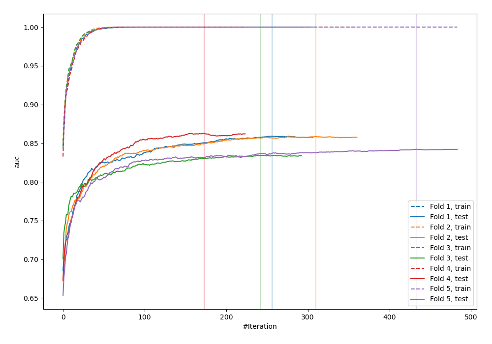
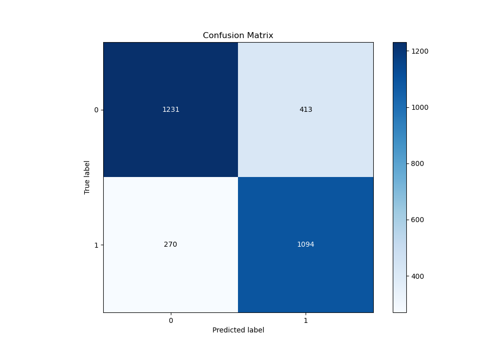
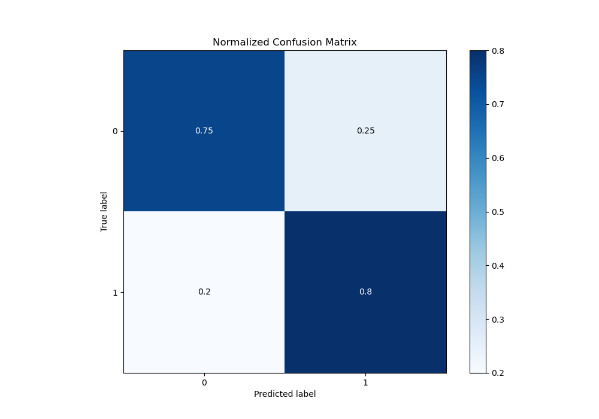
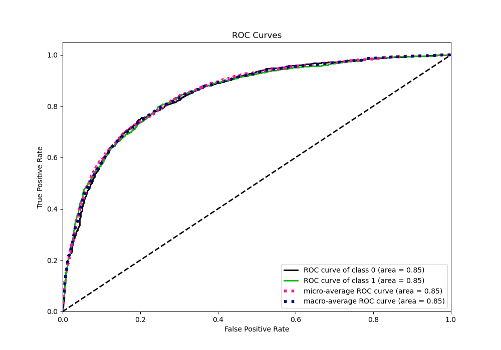
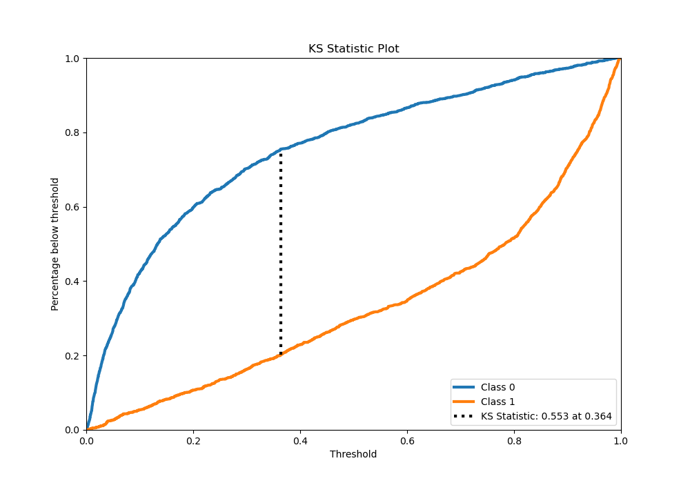
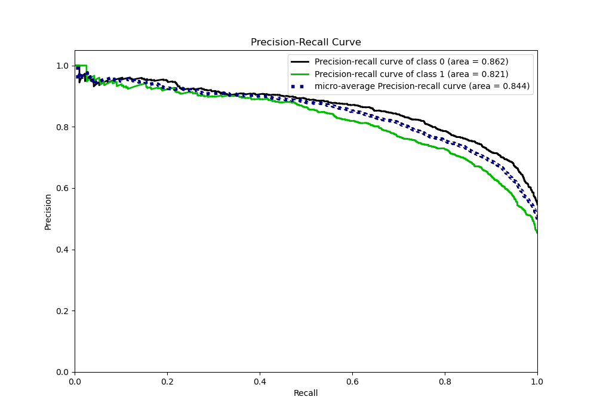
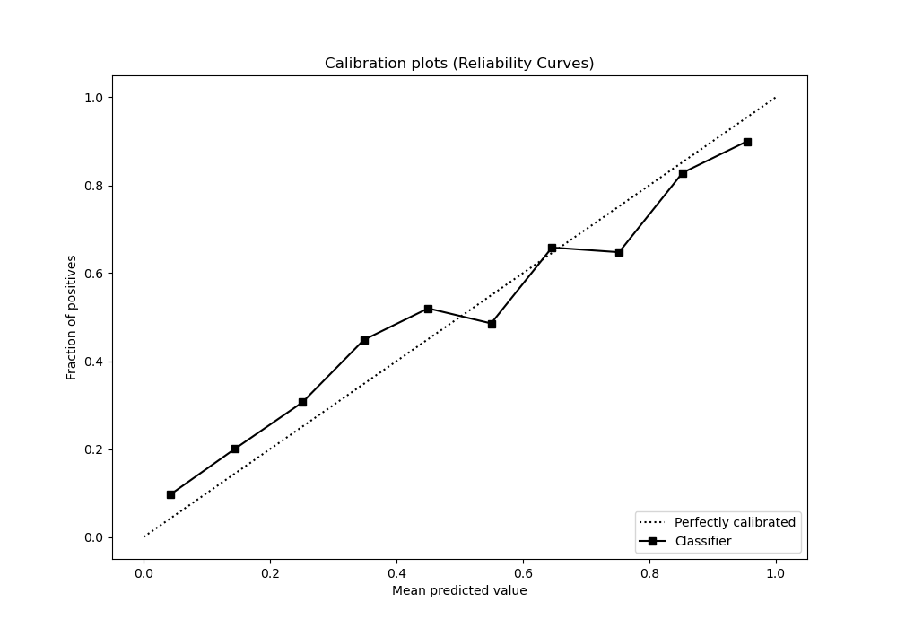
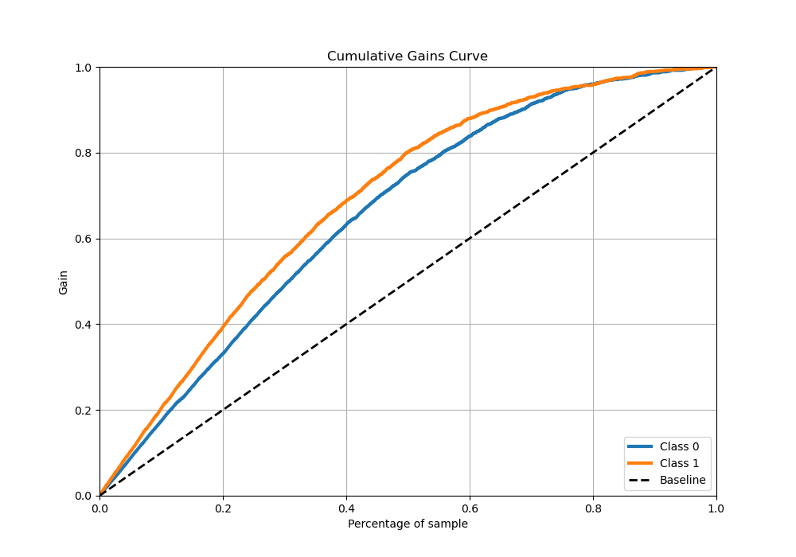
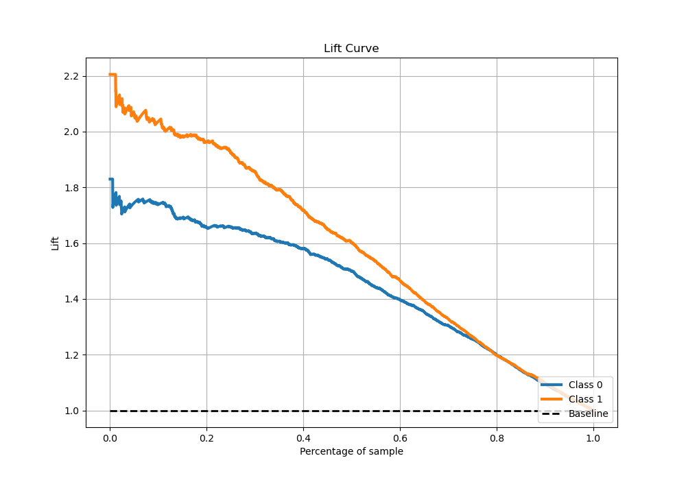

# Summary of 1_Default_Xgboost

[<< Go back](../README.md)

## Extreme Gradient Boosting (Xgboost)
- **n_jobs**: -1
- **objective**: binary:logistic
- **eta**: 0.075
- **max_depth**: 6
- **min_child_weight**: 1
- **subsample**: 1.0
- **colsample_bytree**: 1.0
- **eval_metric**: auc
- **explain_level**: 1

## Validation
 - **validation_type**: kfold
 - **k_folds**: 5
 - **shuffle**: True
 - **stratify**: True

## Optimized metric
auc

## Training time

49.8 seconds

## Metric details
|           |    score |     threshold |
|:----------|---------:|--------------:|
| logloss   | 0.496918 | nan           |
| auc       | 0.849589 | nan           |
| f1        | 0.763323 |   0.290081    |
| accuracy  | 0.772939 |   0.35752     |
| precision | 0.972973 |   0.990242    |
| recall    | 1        |   0.000658794 |
| mcc       | 0.548446 |   0.35752     |

## Metric details with threshold from accuracy metric
|           |    score |   threshold |
|:----------|---------:|------------:|
| logloss   | 0.496918 |   nan       |
| auc       | 0.849589 |   nan       |
| f1        | 0.762104 |     0.35752 |
| accuracy  | 0.772939 |     0.35752 |
| precision | 0.725946 |     0.35752 |
| recall    | 0.802053 |     0.35752 |
| mcc       | 0.548446 |     0.35752 |

## Confusion matrix (at threshold=0.35752)
|              |   Predicted as 0 |   Predicted as 1 |
|:-------------|-----------------:|-----------------:|
| Labeled as 0 |             1231 |              413 |
| Labeled as 1 |              270 |             1094 |

## Learning curves

## Permutation-based Importance

## Confusion Matrix

## Normalized Confusion Matrix

## ROC Curve

## Kolmogorov-Smirnov Statistic

## Precision-Recall Curve

## Calibration Curve

## Cumulative Gains Curve

## Lift Curve

[<< Go back](../README.md)
