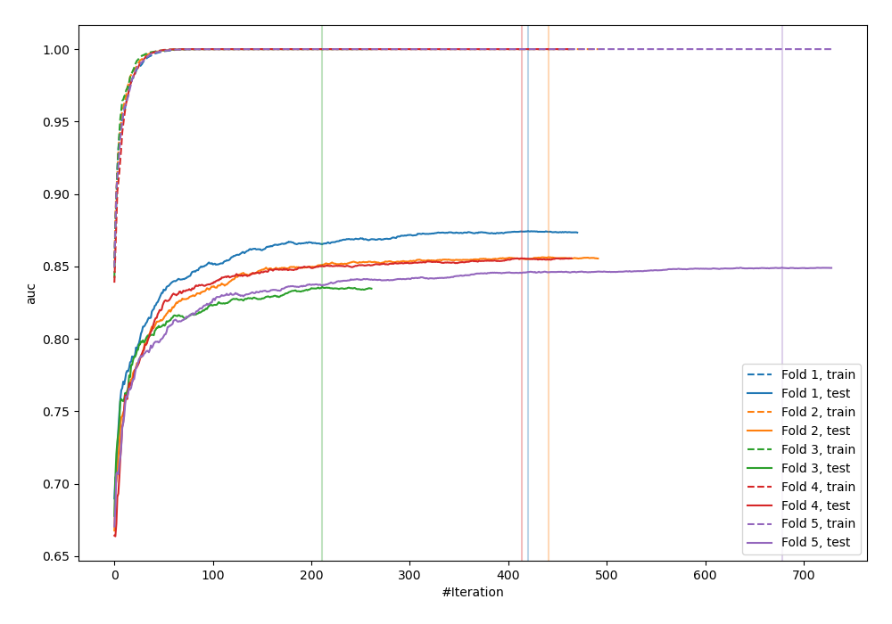
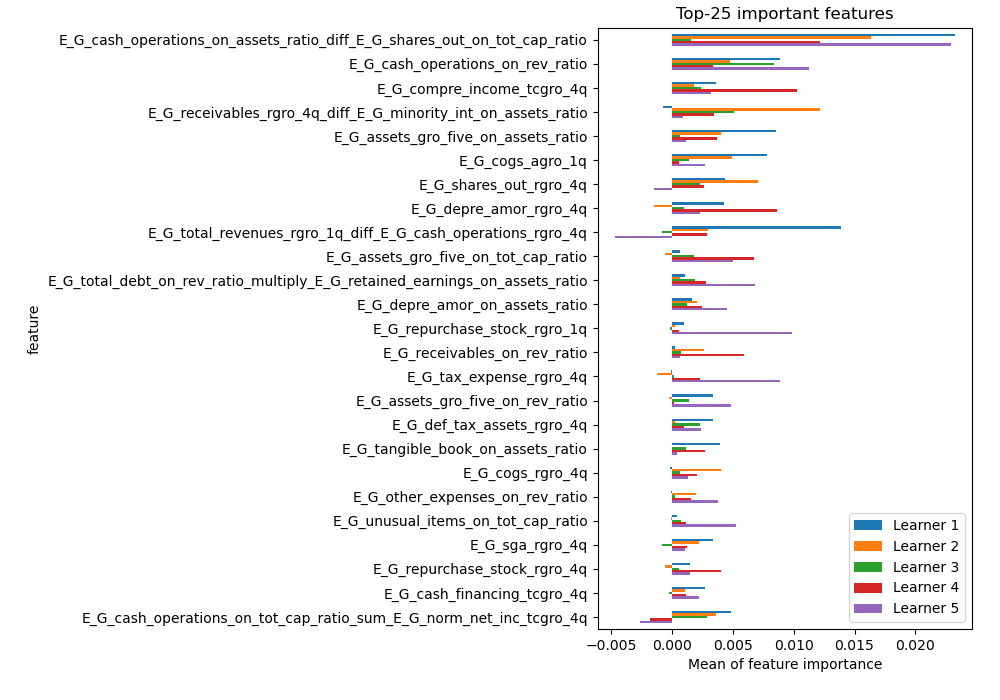
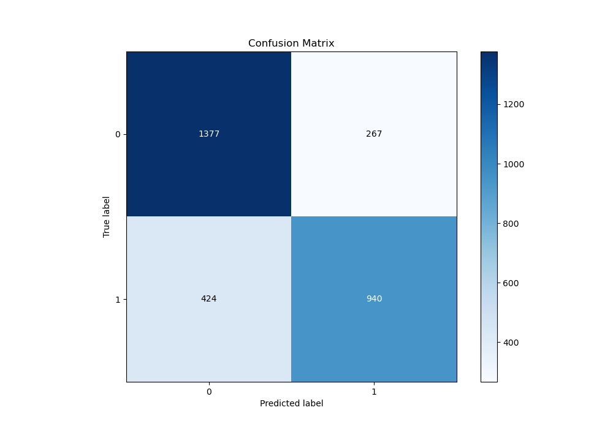
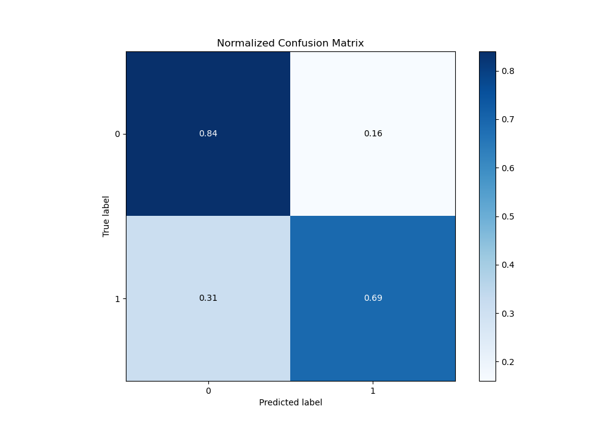
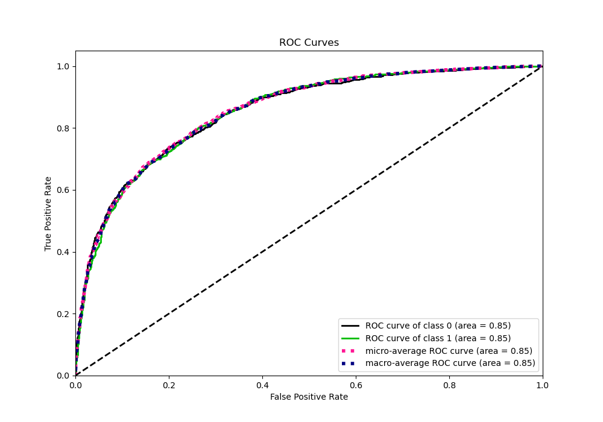
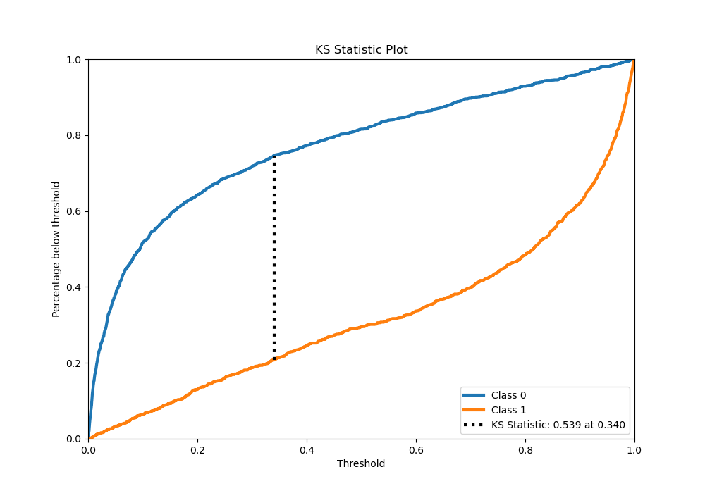
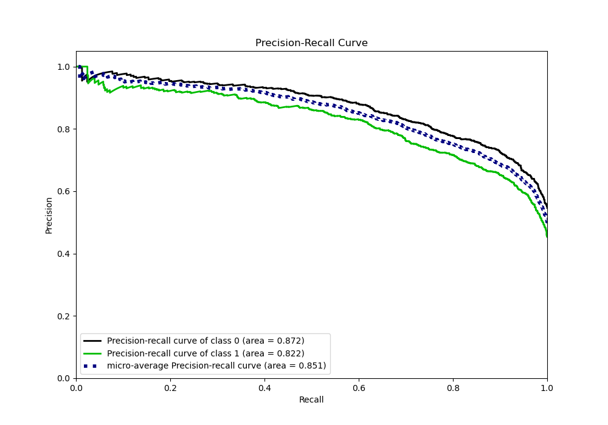
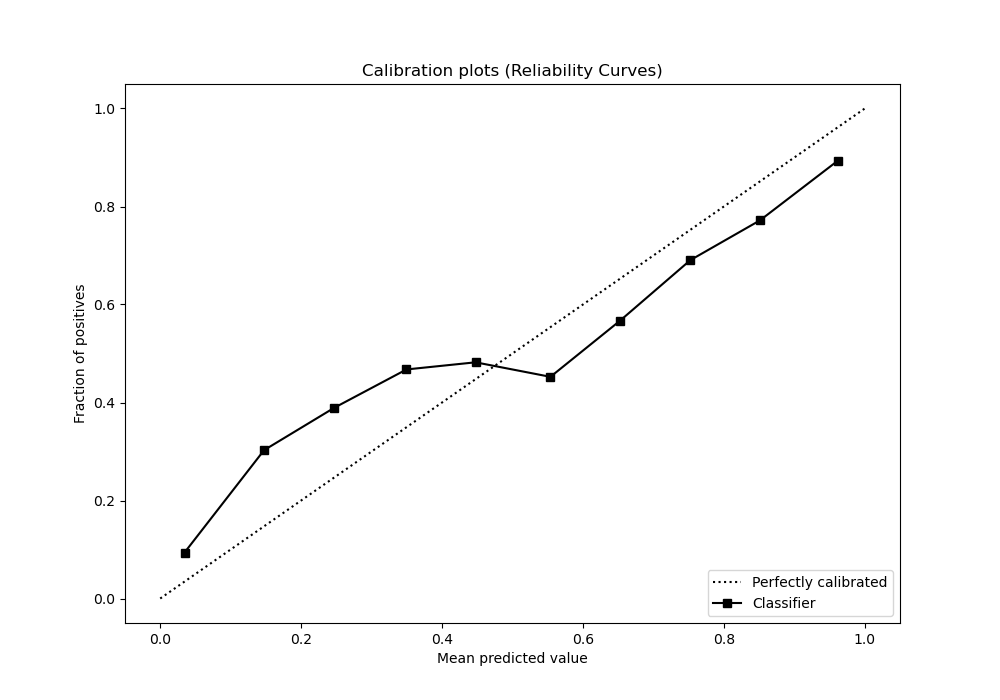
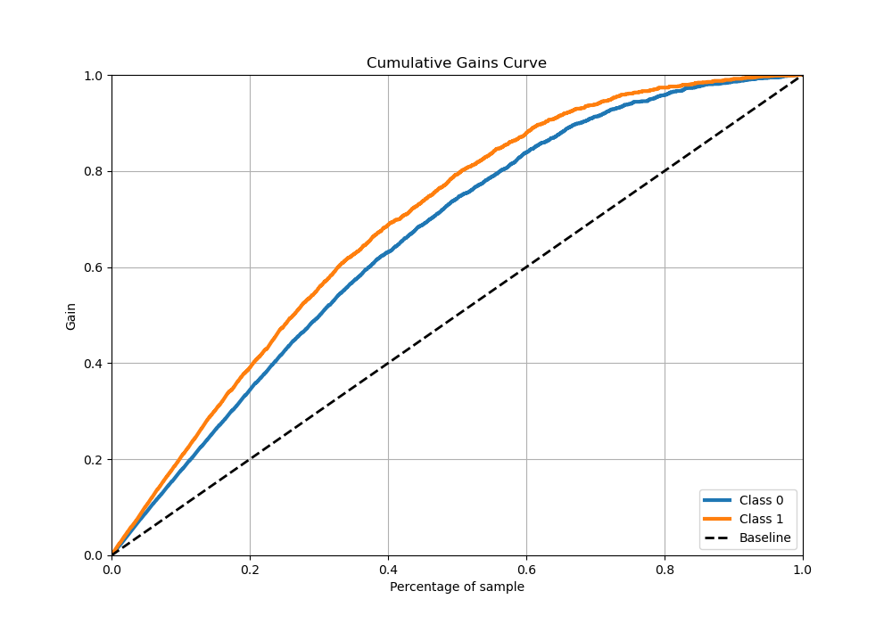
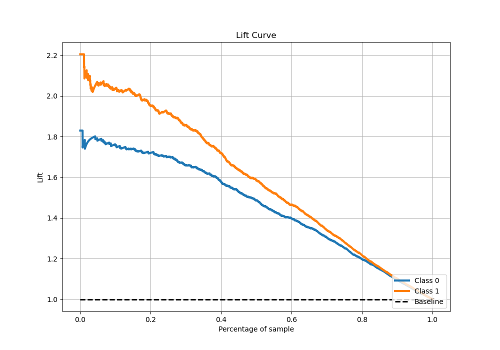

# Summary of 1_Default_Xgboost_GoldenFeatures

[<< Go back](../README.md)

## Extreme Gradient Boosting (Xgboost)
- **n_jobs**: -1
- **objective**: binary:logistic
- **eta**: 0.075
- **max_depth**: 6
- **min_child_weight**: 1
- **subsample**: 1.0
- **colsample_bytree**: 1.0
- **eval_metric**: auc
- **explain_level**: 1

## Validation
 - **validation_type**: kfold
 - **k_folds**: 5
 - **shuffle**: True
 - **stratify**: True

## Optimized metric
auc

## Training time

406.4 seconds

## Metric details
|           |    score |     threshold |
|:----------|---------:|--------------:|
| logloss   | 0.512445 | nan           |
| auc       | 0.853333 | nan           |
| f1        | 0.758513 |   0.175902    |
| accuracy  | 0.770279 |   0.547385    |
| precision | 0.955224 |   0.993389    |
| recall    | 1        |   0.000110234 |
| mcc       | 0.534989 |   0.547385    |

## Metric details with threshold from accuracy metric
|           |    score |   threshold |
|:----------|---------:|------------:|
| logloss   | 0.512445 |  nan        |
| auc       | 0.853333 |  nan        |
| f1        | 0.731233 |    0.547385 |
| accuracy  | 0.770279 |    0.547385 |
| precision | 0.77879  |    0.547385 |
| recall    | 0.68915  |    0.547385 |
| mcc       | 0.534989 |    0.547385 |

## Confusion matrix (at threshold=0.547385)
|              |   Predicted as 0 |   Predicted as 1 |
|:-------------|-----------------:|-----------------:|
| Labeled as 0 |             1377 |              267 |
| Labeled as 1 |              424 |              940 |

## Learning curves

## Permutation-based Importance

## Confusion Matrix

## Normalized Confusion Matrix

## ROC Curve

## Kolmogorov-Smirnov Statistic

## Precision-Recall Curve

## Calibration Curve

## Cumulative Gains Curve

## Lift Curve

[<< Go back](../README.md)
