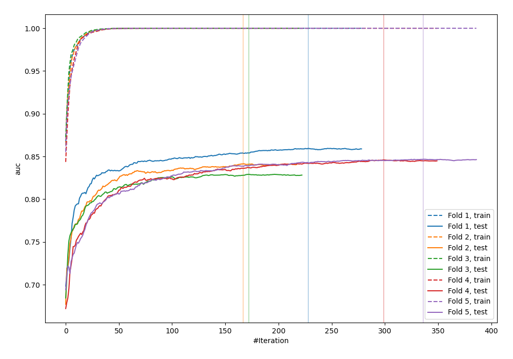
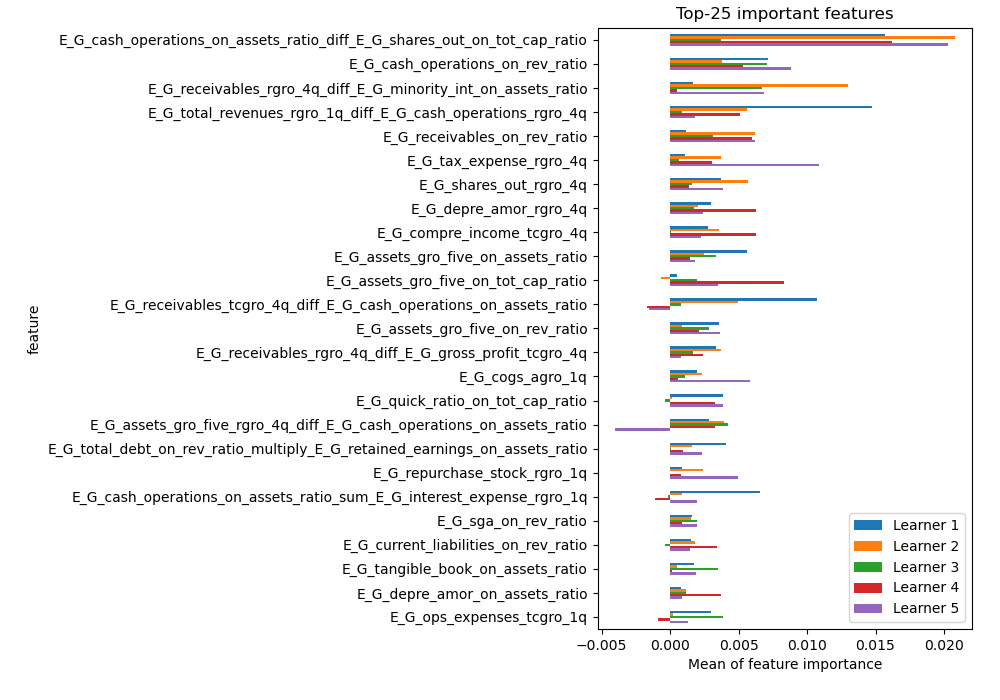
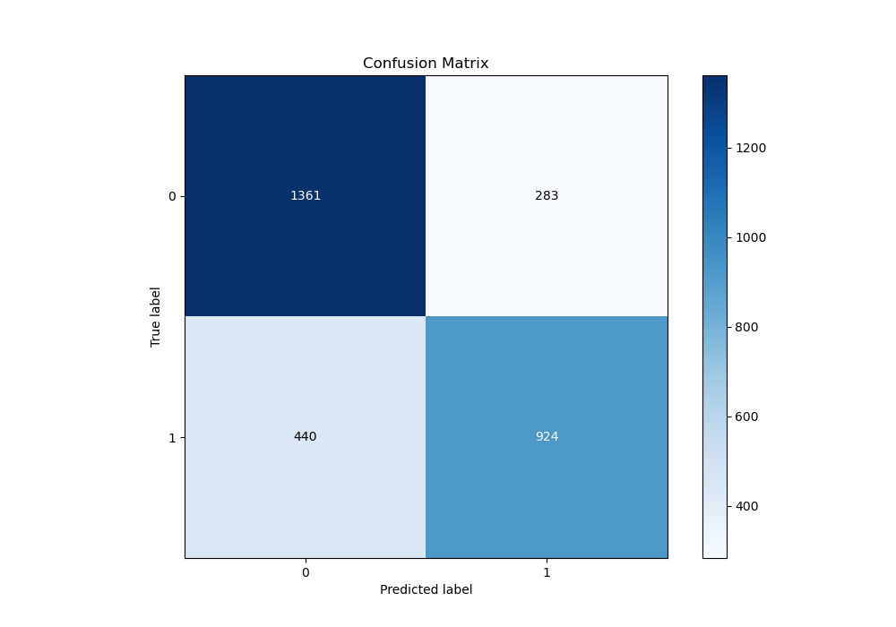
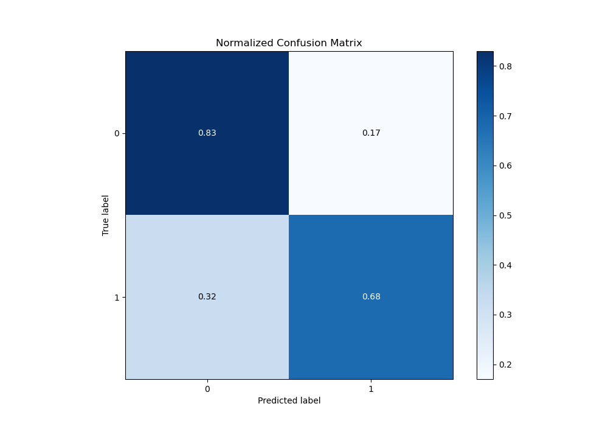
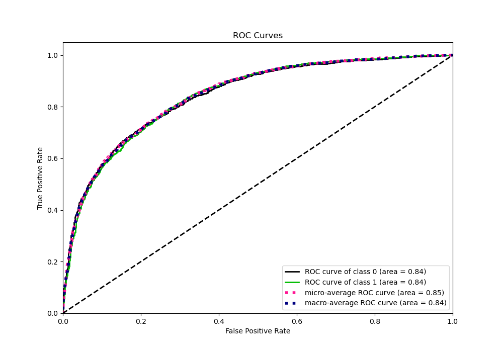
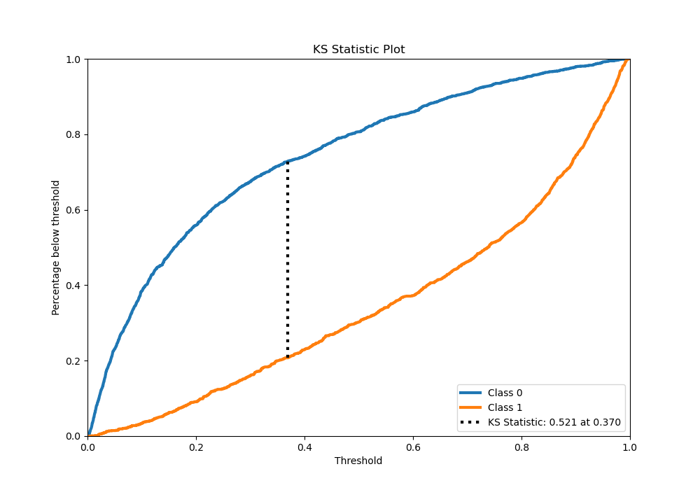
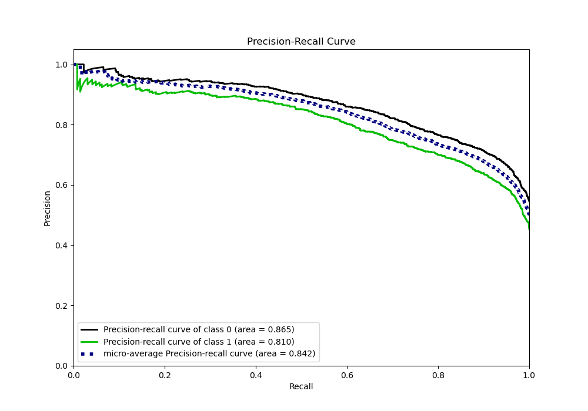
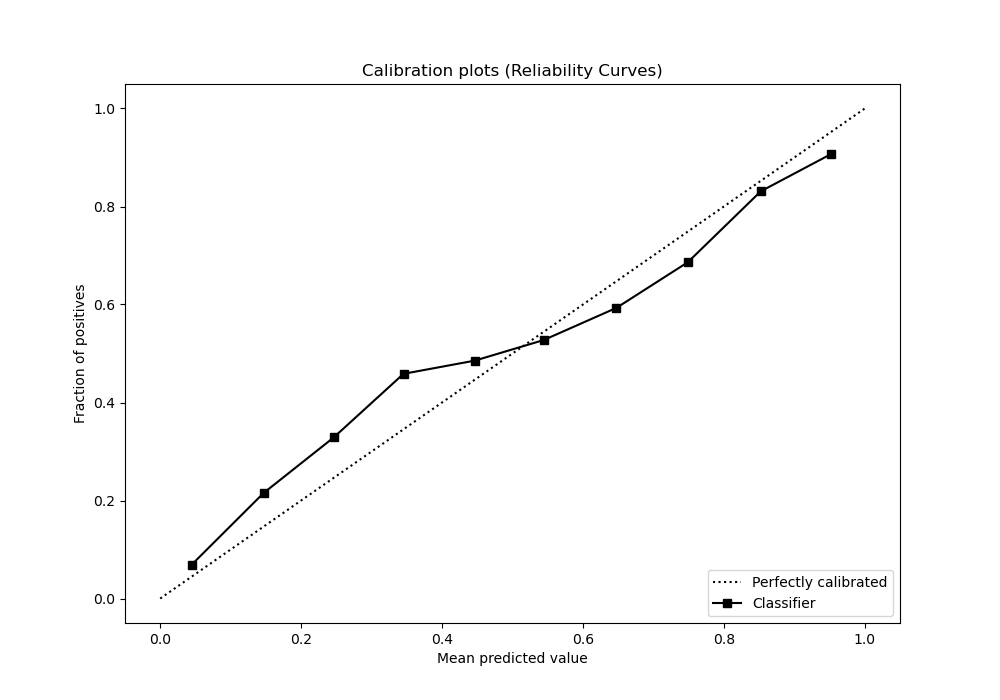
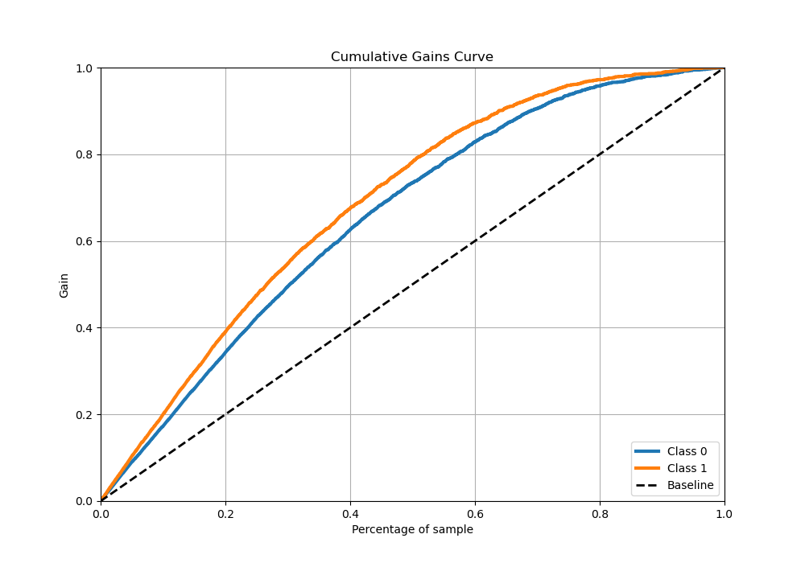
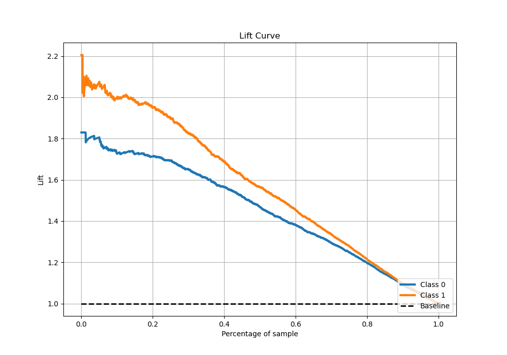

# Summary of 2_Xgboost_GoldenFeatures

[<< Go back](../README.md)

## Extreme Gradient Boosting (Xgboost)
- **n_jobs**: -1
- **objective**: binary:logistic
- **eta**: 0.075
- **max_depth**: 8
- **min_child_weight**: 5
- **subsample**: 1.0
- **colsample_bytree**: 1.0
- **eval_metric**: auc
- **explain_level**: 1

## Validation
 - **validation_type**: kfold
 - **k_folds**: 5
 - **shuffle**: True
 - **stratify**: True

## Optimized metric
auc

## Training time

53.1 seconds

## Metric details
|           |    score |    threshold |
|:----------|---------:|-------------:|
| logloss   | 0.495917 | nan          |
| auc       | 0.844325 | nan          |
| f1        | 0.753651 |   0.284543   |
| accuracy  | 0.759641 |   0.529739   |
| precision | 0.945946 |   0.985857   |
| recall    | 1        |   0.00132133 |
| mcc       | 0.517633 |   0.336335   |

## Metric details with threshold from accuracy metric
|           |    score |   threshold |
|:----------|---------:|------------:|
| logloss   | 0.495917 |  nan        |
| auc       | 0.844325 |  nan        |
| f1        | 0.718786 |    0.529739 |
| accuracy  | 0.759641 |    0.529739 |
| precision | 0.765534 |    0.529739 |
| recall    | 0.677419 |    0.529739 |
| mcc       | 0.51319  |    0.529739 |

## Confusion matrix (at threshold=0.529739)
|              |   Predicted as 0 |   Predicted as 1 |
|:-------------|-----------------:|-----------------:|
| Labeled as 0 |             1361 |              283 |
| Labeled as 1 |              440 |              924 |

## Learning curves

## Permutation-based Importance

## Confusion Matrix

## Normalized Confusion Matrix

## ROC Curve

## Kolmogorov-Smirnov Statistic

## Precision-Recall Curve

## Calibration Curve

## Cumulative Gains Curve

## Lift Curve

[<< Go back](../README.md)
