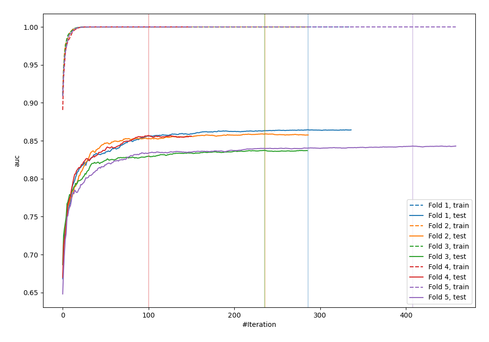
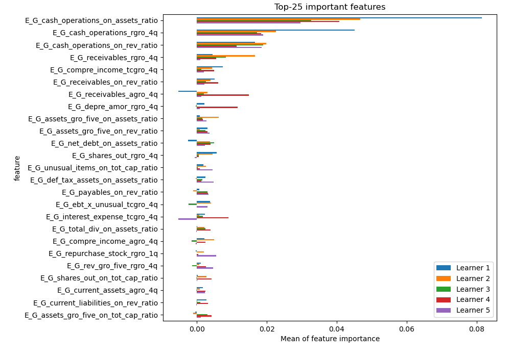
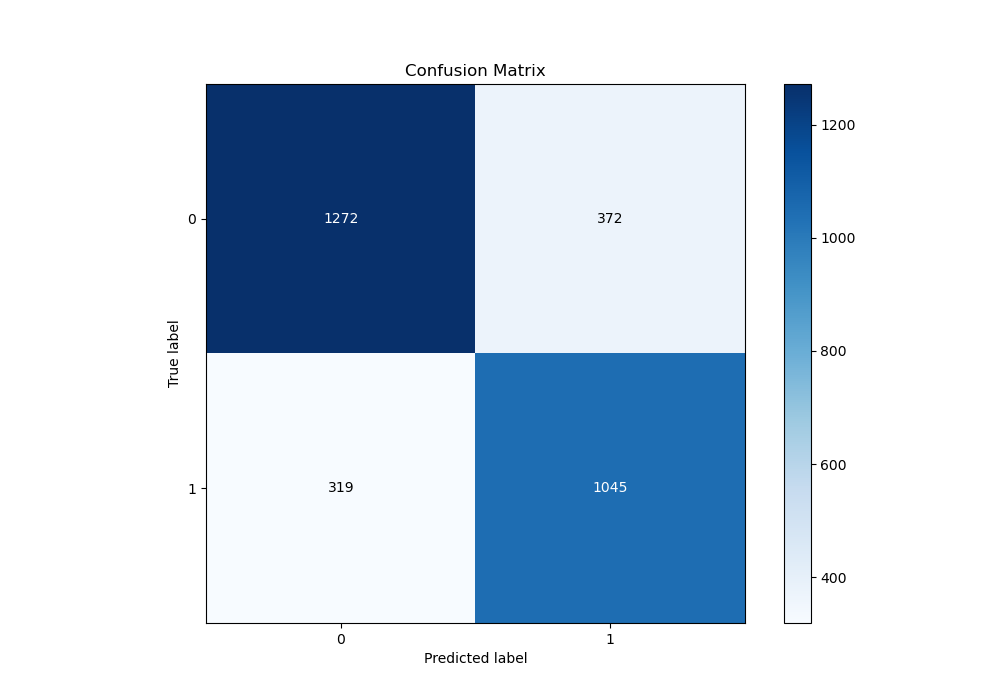
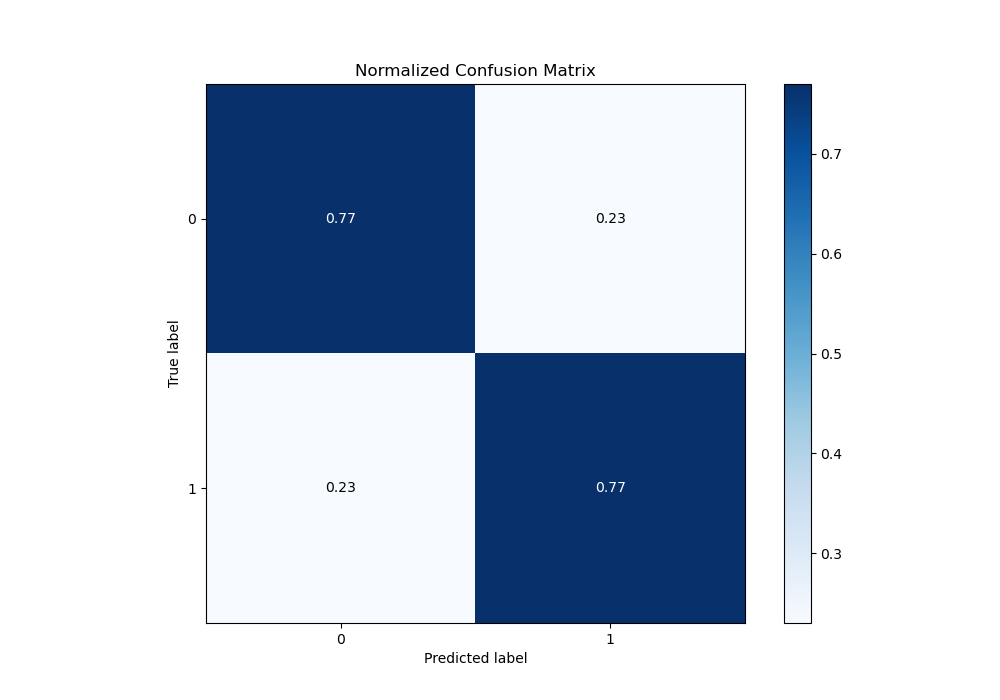
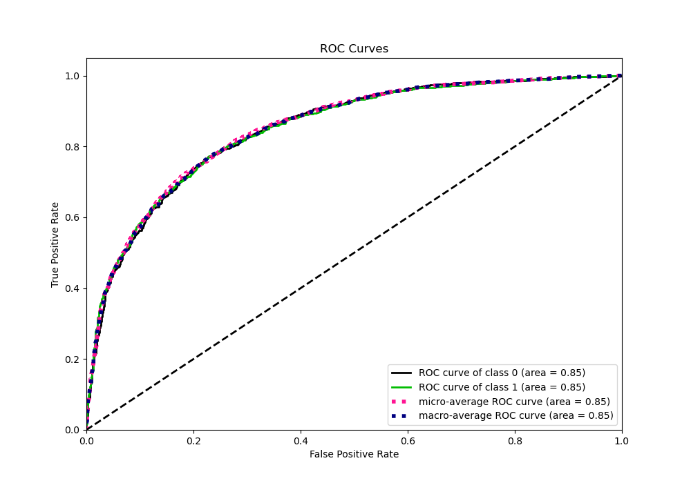
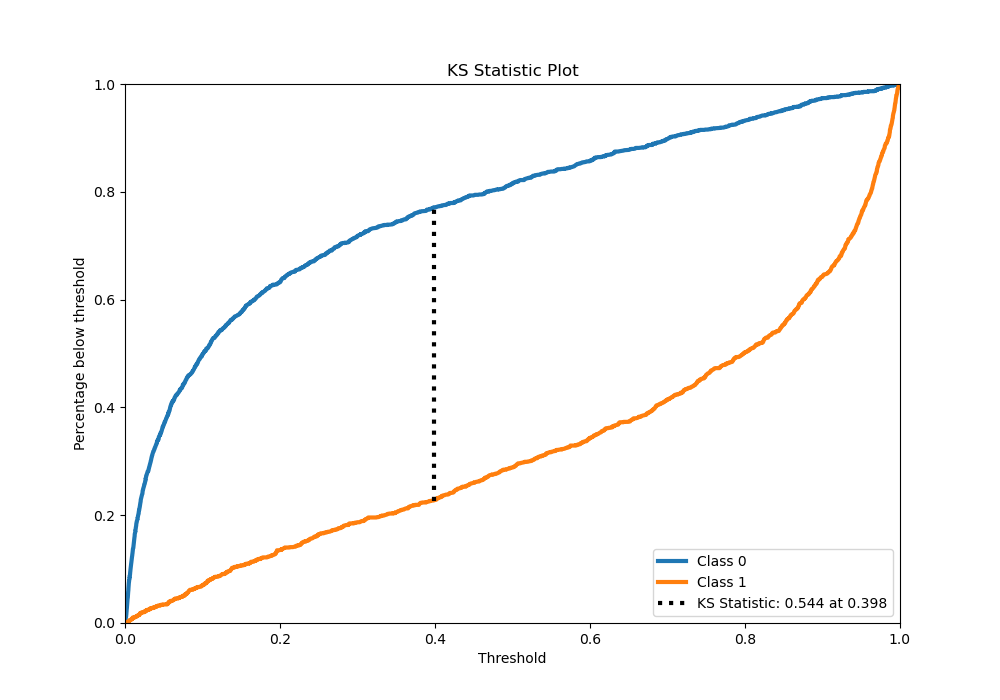
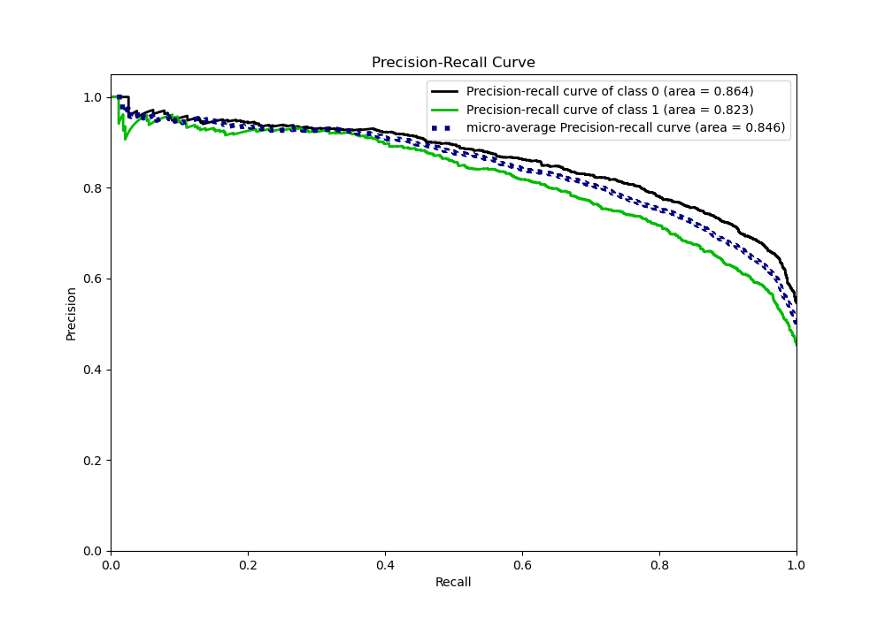
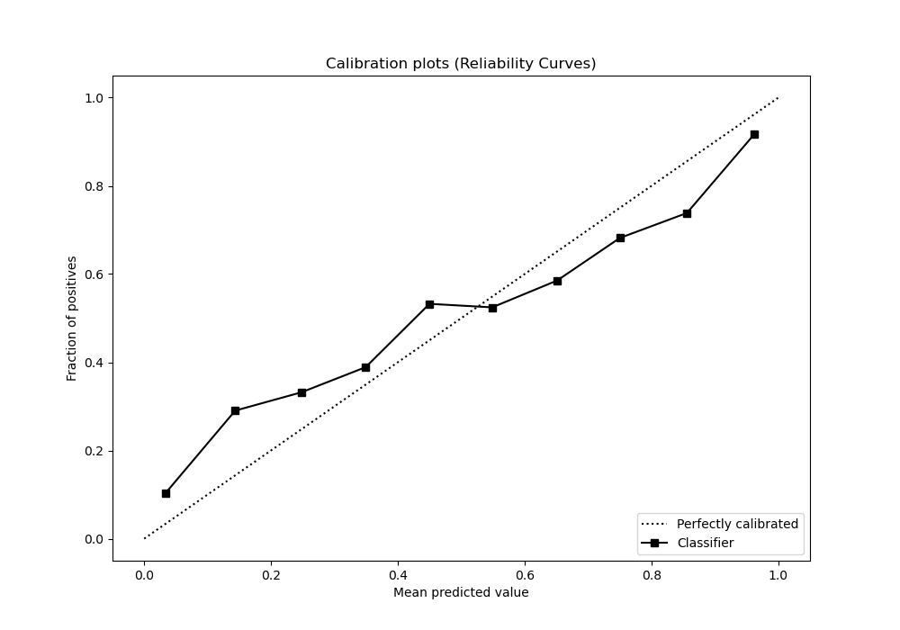
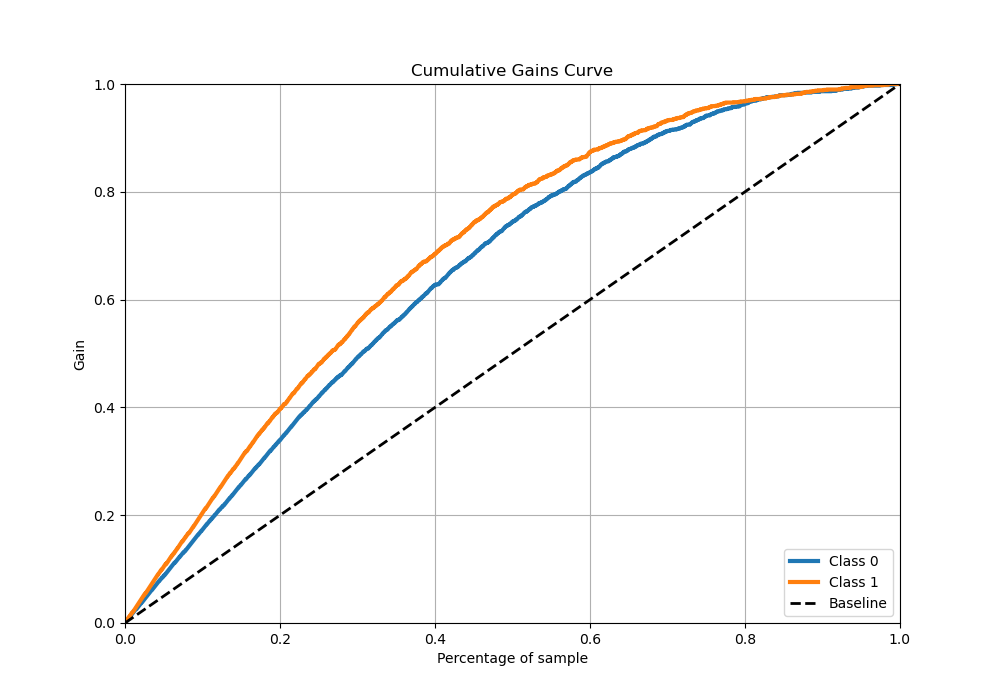
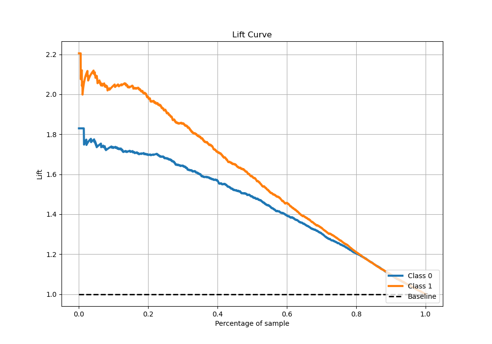

# Summary of 3_Xgboost

[<< Go back](../README.md)

## Extreme Gradient Boosting (Xgboost)
- **n_jobs**: -1
- **objective**: binary:logistic
- **eta**: 0.1
- **max_depth**: 8
- **min_child_weight**: 1
- **subsample**: 1.0
- **colsample_bytree**: 1.0
- **eval_metric**: auc
- **explain_level**: 1

## Validation
 - **validation_type**: kfold
 - **k_folds**: 5
 - **shuffle**: True
 - **stratify**: True

## Optimized metric
auc

## Training time

50.2 seconds

## Metric details
|           |    score |     threshold |
|:----------|---------:|--------------:|
| logloss   | 0.515676 | nan           |
| auc       | 0.849764 | nan           |
| f1        | 0.756291 |   0.321874    |
| accuracy  | 0.770279 |   0.408441    |
| precision | 0.96063  |   0.986867    |
| recall    | 1        |   0.000226125 |
| mcc       | 0.538424 |   0.385943    |

## Metric details with threshold from accuracy metric
|           |    score |   threshold |
|:----------|---------:|------------:|
| logloss   | 0.515676 |  nan        |
| auc       | 0.849764 |  nan        |
| f1        | 0.751528 |    0.408441 |
| accuracy  | 0.770279 |    0.408441 |
| precision | 0.737474 |    0.408441 |
| recall    | 0.766129 |    0.408441 |
| mcc       | 0.538409 |    0.408441 |

## Confusion matrix (at threshold=0.408441)
|              |   Predicted as 0 |   Predicted as 1 |
|:-------------|-----------------:|-----------------:|
| Labeled as 0 |             1272 |              372 |
| Labeled as 1 |              319 |             1045 |

## Learning curves

## Permutation-based Importance

## Confusion Matrix

## Normalized Confusion Matrix

## ROC Curve

## Kolmogorov-Smirnov Statistic

## Precision-Recall Curve

## Calibration Curve

## Cumulative Gains Curve

## Lift Curve

[<< Go back](../README.md)
