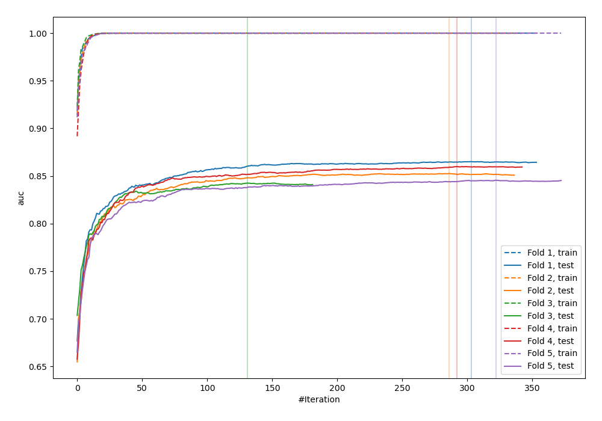
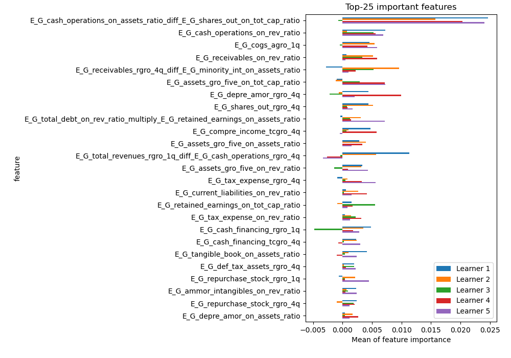
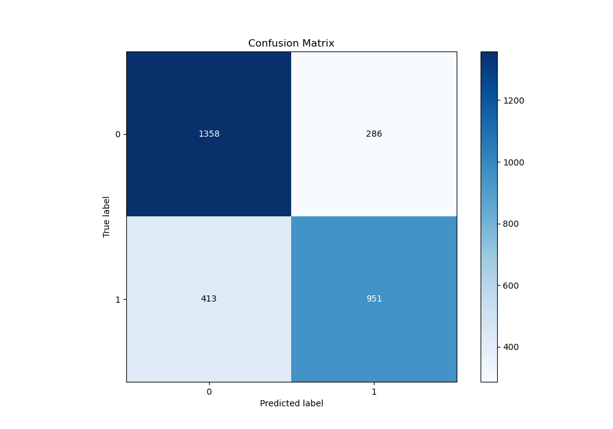
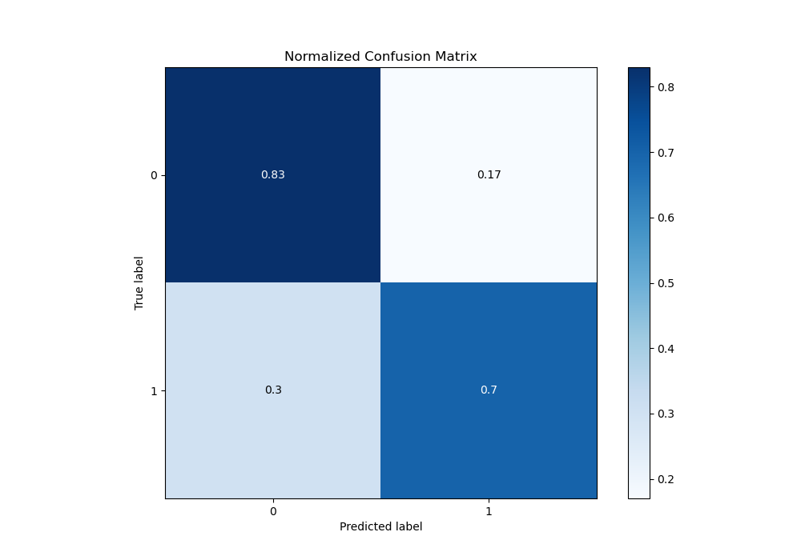
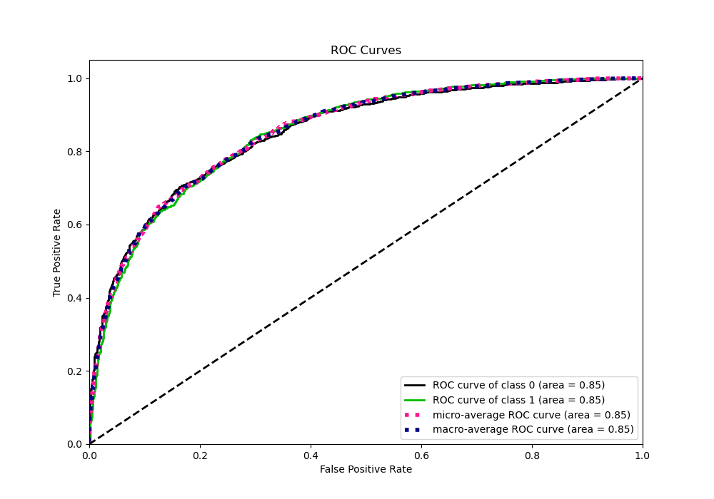
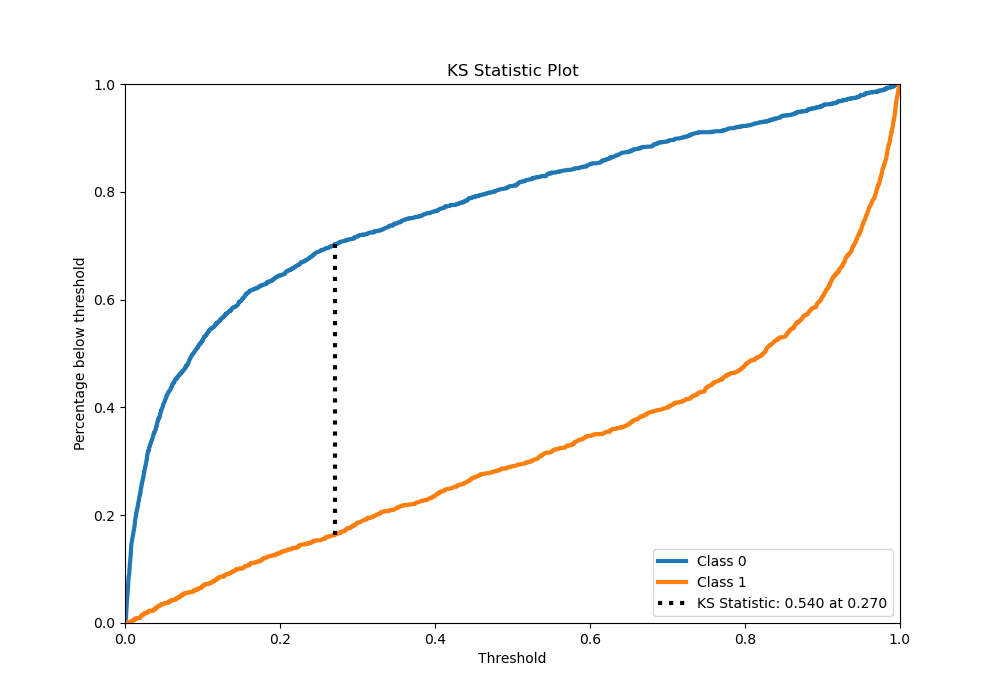
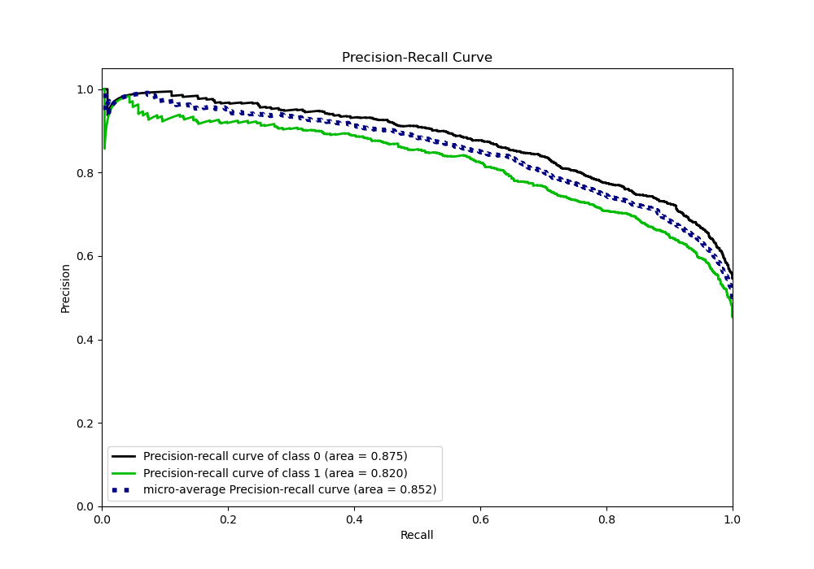
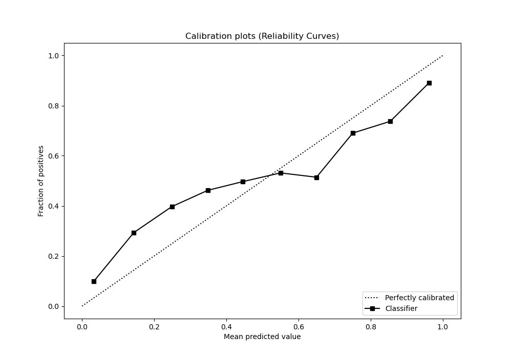
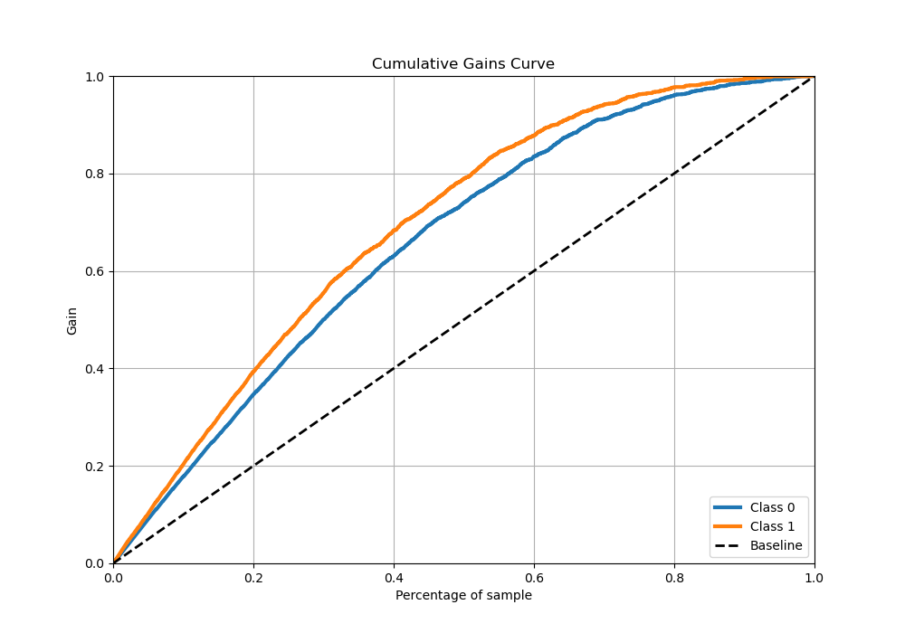
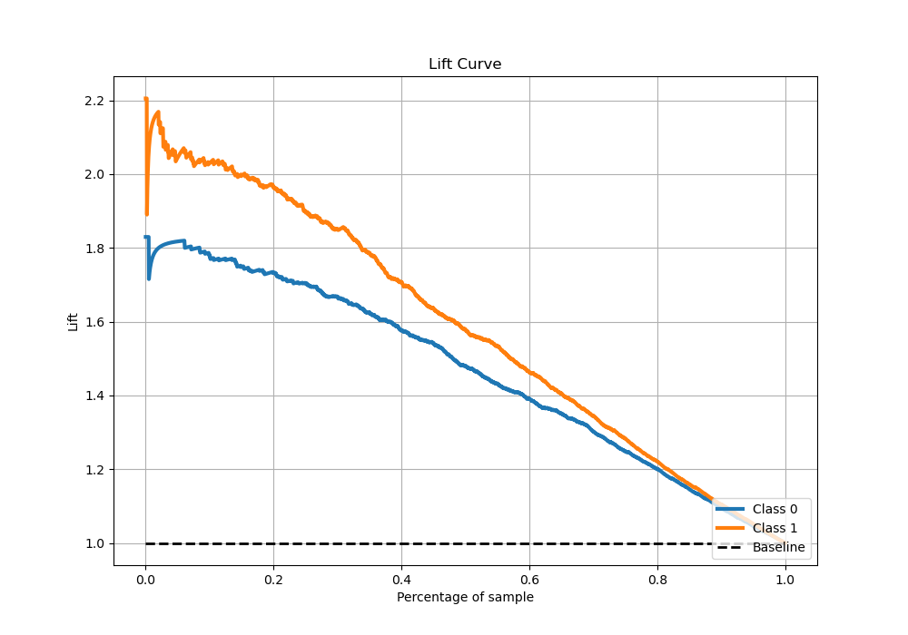

# Summary of 3_Xgboost_GoldenFeatures_RandomFeature

[<< Go back](../README.md)

## Extreme Gradient Boosting (Xgboost)
- **n_jobs**: -1
- **objective**: binary:logistic
- **eta**: 0.1
- **max_depth**: 8
- **min_child_weight**: 1
- **subsample**: 1.0
- **colsample_bytree**: 1.0
- **eval_metric**: auc
- **explain_level**: 1

## Validation
 - **validation_type**: kfold
 - **k_folds**: 5
 - **shuffle**: True
 - **stratify**: True

## Optimized metric
auc

## Training time

58.9 seconds

## Metric details
|           |    score |     threshold |
|:----------|---------:|--------------:|
| logloss   | 0.517258 | nan           |
| auc       | 0.85293  | nan           |
| f1        | 0.761999 |   0.256084    |
| accuracy  | 0.76762  |   0.527965    |
| precision | 0.972973 |   0.996009    |
| recall    | 1        |   0.000147984 |
| mcc       | 0.536512 |   0.256084    |

## Metric details with threshold from accuracy metric
|           |    score |   threshold |
|:----------|---------:|------------:|
| logloss   | 0.517258 |  nan        |
| auc       | 0.85293  |  nan        |
| f1        | 0.731257 |    0.527965 |
| accuracy  | 0.76762  |    0.527965 |
| precision | 0.768795 |    0.527965 |
| recall    | 0.697214 |    0.527965 |
| mcc       | 0.529385 |    0.527965 |

## Confusion matrix (at threshold=0.527965)
|              |   Predicted as 0 |   Predicted as 1 |
|:-------------|-----------------:|-----------------:|
| Labeled as 0 |             1358 |              286 |
| Labeled as 1 |              413 |              951 |

## Learning curves

## Permutation-based Importance

## Confusion Matrix

## Normalized Confusion Matrix

## ROC Curve

## Kolmogorov-Smirnov Statistic

## Precision-Recall Curve

## Calibration Curve

## Cumulative Gains Curve

## Lift Curve

[<< Go back](../README.md)
